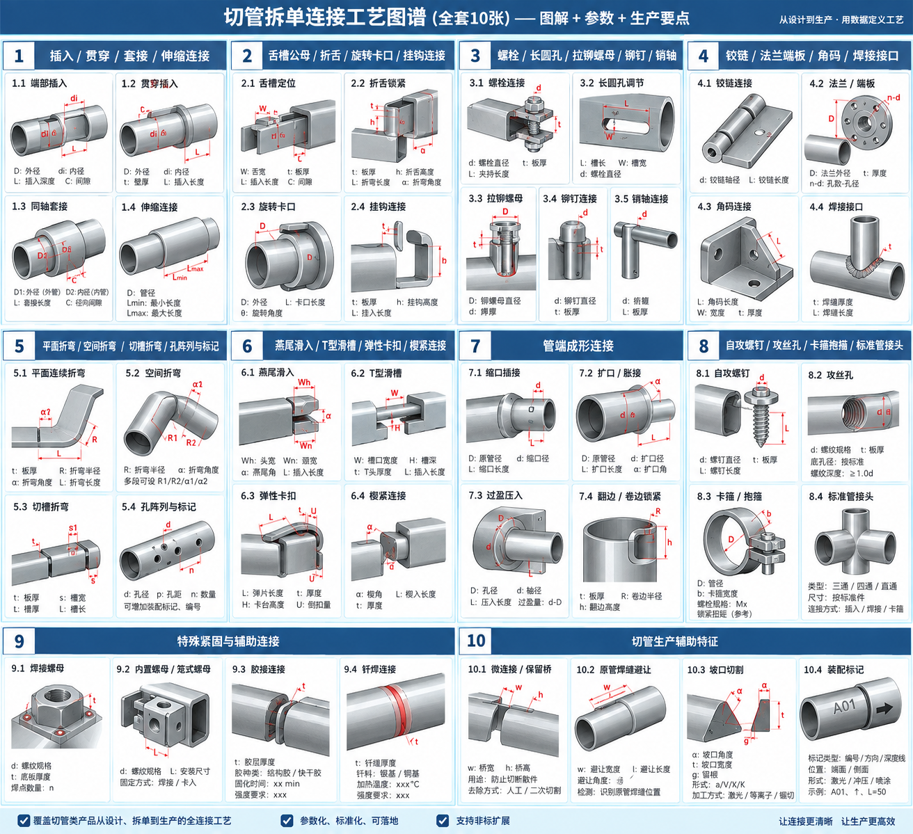

# 切管拆单连接工艺参数化数据字典

> 版本：V2.0（图文对应版）  
> 目标：将管材产品中的连接关系转换为可参数驱动的生产定义。  
> 适用范围：切管拆单、管材结构模板、管件装配设计、切割特征生成、二次工艺规划、BOM与装配指令生成。  
> 本文重点描述“生产数据应该表达什么”，不限定具体程序实现方式。
>
> **图谱对应原则：** 文档中的连接工艺与《切管拆单连接工艺图谱》图 1～图 10 一一对应；具体子项采用“图 X.Y”编号标识。

---


# 图谱总览与编号索引



> 图中的尺寸字母用于表达参数关系，正式生产数据以本文数据字典中的参数定义为准。  
> 同一特征可能同时出现在“连接本体”和“生产辅助特征”中，例如装配标记：图 5.4 侧重孔阵列配套定位，图 10.4 侧重生产与装配识别。

| 图号 | 图组 | 子图与本文对应 |
|---|---|---|
| 图1 | 插入 / 贯穿 / 套接 / 伸缩 | 1.1端部插入；1.2贯穿插入；1.3同轴套接；1.4伸缩连接 |
| 图2 | 舌槽公母 / 折舌 / 旋转卡口 / 挂钩 | 2.1舌槽定位；2.2折舌锁紧；2.3旋转卡口；2.4挂钩连接 |
| 图3 | 螺栓 / 长圆孔 / 拉铆螺母 / 铆钉 / 销轴 | 3.1螺栓；3.2长圆孔调节；3.3拉铆螺母；3.4铆接；3.5销轴 |
| 图4 | 铰链 / 法兰端板 / 角码 / 焊接接口 | 4.1铰链；4.2法兰/端板；4.3角码；4.4焊接接口 |
| 图5 | 平面折弯 / 空间折弯 / 切槽折弯 / 孔阵列与标记 | 5.1平面连续折弯；5.2空间折弯；5.3切槽折弯；5.4孔阵列与定位标记 |
| 图6 | 燕尾 / T型滑槽 / 弹性卡扣 / 楔紧 | 6.1燕尾滑入；6.2 T型滑槽；6.3弹性卡扣；6.4楔紧连接 |
| 图7 | 管端成形连接 | 7.1缩口插接；7.2扩口/胀接；7.3过盈压入；7.4翻边/卷边锁紧 |
| 图8 | 自攻螺钉 / 攻丝孔 / 卡箍 / 标准管接头 | 8.1自攻螺钉；8.2攻丝孔；8.3卡箍/抱箍；8.4标准管接头 |
| 图9 | 特殊紧固与辅助连接 | 9.1焊接螺母；9.2内置螺母/笼式螺母；9.3胶接；9.4钎焊 |
| 图10 | 切管生产辅助特征 | 10.1微连接/保留桥；10.2原管焊缝避让；10.3坡口切割；10.4装配标记 |

---

# 1. 总体原则

连接不能只用一个 `ConnectionType` 枚举表达。

同一个实际连接通常同时包含：

- **连接拓扑**：两个零件在结构上如何相交；
- **接口几何**：对接、插入、套接、舌槽、挂钩等；
- **锁止方式**：焊接、螺栓、铆钉、销轴、折舌、卡扣等；
- **运动关系**：固定、转动、滑动、伸缩、可调；
- **制造策略**：分件、连续管、切槽折弯、生成连接板、使用标准连接件；
- **装配路径**：零件实际如何插入、滑入、旋转、下落、压入；
- **生产输出**：切割轮廓、孔槽、下料长度、二次工艺、BOM、装配指令。

因此，一项连接应被理解为：

```text
连接 = 拓扑 + 接口几何 + 锁止方式 + 运动关系 + 制造策略 + 参数 + 装配路径
```

---

# 2. 统一数据概念

## 2.1 连接拓扑 Topology

| 类型 | 含义 |
|---|---|
| EndToEnd | 端—端 |
| EndToSide | 端—侧 |
| SideToSide | 侧—侧 |
| Cross | 十字交叉 |
| Coaxial | 同轴 |
| TubeToPlate | 管—板 |
| MultiMember | 多件汇交 |

---

## 2.2 接口几何 Interface

建议至少包含：

```text
Butt
Saddle
Insert
ThroughInsert
Sleeve
Telescopic
TabSlot
FoldTab
Dovetail
TSlot
Bayonet
Hook
SnapFit
Wedge
Flange
Bracket
Clamp
PressFit
ReducedEnd
ExpandedEnd
HemLock
StandardConnector
```

---

## 2.3 锁止方式 Lock

```text
None
Weld
Bolt
Screw
SelfTappingScrew
TappedScrew
Rivet
RivetNut
Pin
Snap
FoldTab
Wedge
PressFit
Clamp
Adhesive
Brazing
StandardFastener
```

---

## 2.4 运动关系 Motion

```text
Fixed
Removable
Revolute
Sliding
Telescopic
AdjustableTranslation
AdjustableRotation
OneWayLock
```

---

## 2.5 制造策略 ManufacturingStrategy

```text
SeparateParts
ContinuousMember
CutBend
GeneratedPlate
GeneratedBracket
GeneratedSleeve
StandardConnector
SecondaryForming
```

---

# 3. JointFrame：连接局部坐标系

每一个连接都应定义独立局部坐标系：

```text
Origin O
Axis X
Axis Y
Axis Z
AssemblyDirection
```

建议约定：

- `Z`：默认装配方向；
- `X`：接头局部主方向；
- `Y = Z × X`；
- 所有孔、槽、偏移、舌头方向、折弯方向优先以 JointFrame 表达。

这样模型整体旋转以后，连接参数仍然保持稳定。

---

# 4. 间隙定义

禁止只使用一个含糊的 `Gap`。

建议：

```text
Clearance.Left
Clearance.Right
Clearance.Top
Clearance.Bottom
Clearance.Front
Clearance.Back
```

例如：

```text
左间隙 = 0.10
右间隙 = 0.10
上间隙 = 0.05
下间隙 = 0.20
```

则：

```text
SlotWidth = MaleWidth + Left + Right
SlotHeight = MaleHeight + Top + Bottom
```

## 4.1 装配间隙与激光补偿必须分离

```text
NominalGeometry
FitAllowance
ProcessAllowance
MachineCompensation
```

例如：

```text
公头宽度 = 20
左间隙 = 0.1
右间隙 = 0.1

母槽目标宽度 = 20.2
```

20.2 属于产品几何。

激光割缝补偿属于 CAM，不写入产品模板。

---

# 5. AssemblyPath：装配路径

统一描述：

```text
LinearMove(Direction, Distance)
Rotate(Axis, Angle)
```

允许连续组合：

```text
插入 -> 下落
插入 -> 旋转
滑入 -> 楔紧
压入
```

复杂公母结构的母槽，可以基于：

```text
MaleGeometry + Clearance + AssemblyPath
```

生成装配扫掠包络。

---

# 6. 尺寸基准模式

连接改变后，必须明确哪个尺寸保持不变。

```text
KeepSkeleton
KeepOuterEnvelope
KeepPartLength
```

### KeepSkeleton
逻辑骨架长度不变，由连接自动改变实际下料长度。

### KeepOuterEnvelope
产品最终外形尺寸不变，自动重新计算各零件长度。

### KeepPartLength
零件下料长度不变，允许装配外形发生变化。

---

# 7. 统一生产输出

每项连接最终至少输出以下数据。

## 7.1 PartGeometry

```text
CutLength
EndTrim
Hole
Slot
Notch
Tab
Mark
Bevel
FormingRegion
```

## 7.2 SecondaryProcess

```text
Bend
Tap
RivetNutInstall
Rivet
Weld
PressFit
Expand
Reduce
Flange
Hem
Deburr
```

## 7.3 BOM

```text
Bolt
Nut
Washer
Screw
Rivet
RivetNut
Pin
Clip
Hinge
Clamp
Connector
Sleeve
Plate
Bracket
```

## 7.4 AssemblyInstruction

```text
AssemblyDirection
InsertionDepth
AssemblySequence
RotationAngle
DropDistance
FoldAngle
LockPosition
WeldLocation
FastenerSpec
```

---

# 8. 参数来源

每个参数建议标记来源：

```text
User
Template
Profile
Material
TechnologyDB
MachineDB
StandardPart
Calculated
Calibration
```

---

# 9. 连接工艺数据字典

---

# 9.1 端部插入 Insert Joint

> **图谱对应：图 1.1 — 端部插入**

## 定义

一个零件端部插入另一个零件的孔或腔体中。

典型：

- 横梁插立柱；
- 小管插入大管侧壁；
- 插入后焊接；
- 插入后销轴锁紧；
- 插入后螺栓固定。

## 适用拓扑

```text
EndToSide
EndToEnd
```

## 参数

| 参数 | 变量 | 单位 | 必填 | 来源 | 说明 |
|---|---|---:|---|---|---|
| 插入深度 | InsertDepth | mm | 是 | User/Template | 公件进入母件距离 |
| 插入方向 | InsertDirection | - | 是 | Calculated/User | JointFrame 中方向 |
| 左间隙 | ClearanceLeft | mm | 是 | Template | 单边间隙 |
| 右间隙 | ClearanceRight | mm | 是 | Template | 单边间隙 |
| 上间隙 | ClearanceTop | mm | 是 | Template | 单边间隙 |
| 下间隙 | ClearanceBottom | mm | 是 | Template | 单边间隙 |
| 入口倒角 | EntryChamfer | mm/° | 否 | Template | 改善装配 |
| 止挡方式 | StopMode | - | 是 | Template | 深度/肩部/内壁/自定义 |
| 伸出量 | Protrusion | mm | 否 | User | 插入后另一侧伸出 |
| 防转结构 | RotationKey | bool | 否 | Template | 是否限制旋转 |
| 插入后焊接 | WeldAfterInsert | bool | 否 | User | 后续锁止 |

## 几何生成规则

1. 获取公件插入段真实实体。
2. 对公件插入段按装配间隙做外扩。
3. 沿插入方向建立装配扫掠包络。
4. 母件与扫掠包络做布尔差。
5. 根据 StopMode 确定最终装配位置。
6. 必要时生成入口倒角或导入槽。

## 尺寸联动

若 `KeepSkeleton`：

```text
CutLength =
SkeletonLength
+ LeftInsertExtension
+ RightInsertExtension
```

若修改 InsertDepth：

- 公件下料长度重新计算；
- 母件孔位置或孔深重新计算；
- 装配指令更新；
- 焊缝位置重新计算；
- 干涉重新检查。

## 装配路径

```text
LinearMove(InsertDirection, InsertDepth)
```

## 生产输出

- 公件下料长度；
- 母件插入口；
- 导入倒角；
- 插入深度；
- 装配方向；
- 焊接/销轴/螺栓等后续工艺。

## 校验

- 插入深度是否超过可用空间；
- 插入路径是否发生干涉；
- 母件剩余壁厚是否足够；
- 切除废料是否能脱落；
- 是否碰到另一侧管壁；
- 是否存在装配死锁。

---

# 9.2 贯穿插入 Through Insert

> **图谱对应：图 1.2 — 贯穿插入**

## 定义

公件完全穿过母件，并可能从另一侧继续伸出。

## 参数

| 参数 | 变量 | 单位 | 必填 | 说明 |
|---|---|---:|---|---|
| 贯穿方向 | ThroughDirection | - | 是 | 公件轴向 |
| 贯穿长度 | PenetrationLength | mm | 是 | 穿过母件长度 |
| 进入侧间隙 | EntryClearance | mm | 是 | 进入孔间隙 |
| 退出侧间隙 | ExitClearance | mm | 是 | 退出孔间隙 |
| 伸出量 | Protrusion | mm | 否 | 穿出后外露长度 |
| 贯穿数量 | ThroughCount | 个 | 否 | 连续穿多个零件 |
| 装配标记 | AssemblyMark | bool | 否 | 是否标记定位线 |

## 几何规则

- 用公件实体沿装配轴线生成真实穿透包络；
- 母件所有被相交壁面均生成孔；
- 不能简单复制二维孔形；
- 对圆管/异形管应保留真实曲面交线。

## 联动

修改公件截面：

- 所有被贯穿零件孔形同步更新。

修改贯穿位置：

- 全部进入孔和退出孔同步移动。

## 校验

- 是否真的能沿路径穿过；
- 各壁孔是否形成完整通道；
- 是否存在内部阻挡件；
- 多件贯穿时装配顺序是否成立。

---

# 9.3 同轴套接 Sleeve Joint

> **图谱对应：图 1.3 — 同轴套接**

## 定义

两个管件轴线基本一致，一个套入另一个。

## 参数

| 参数 | 变量 | 单位 | 必填 |
|---|---|---:|---|
| 搭接长度 | OverlapLength | mm | 是 |
| X向间隙 | ClearanceX | mm | 是 |
| Y向间隙 | ClearanceY | mm | 是 |
| 轴向止挡 | AxialStop | - | 否 |
| 防转键 | AntiRotationKey | bool | 否 |
| 锁止方式 | LockType | - | 是 |
| 焊接长度 | WeldLength | mm | 否 |

## 锁止方式

```text
None
Weld
Bolt
Pin
SpringButton
Clamp
```

## 几何规则

- 两件轴线对齐；
- 计算实际截面包络关系；
- 外管内腔必须容纳内管 + 配合间隙；
- 防转键启用时生成键槽或异形导向结构。

## 校验

- 套入截面是否成立；
- 搭接长度是否满足结构要求；
- 止挡是否冲突；
- 后续螺栓/销轴是否有安装空间。

---

# 9.4 伸缩连接 Telescopic Joint

> **图谱对应：图 1.4 — 伸缩连接**

## 定义

允许两个套接管件沿轴向相对移动。

## 参数

| 参数 | 变量 | 单位 | 必填 |
|---|---|---:|---|
| 最小搭接 | MinOverlap | mm | 是 |
| 最大搭接 | MaxOverlap | mm | 是 |
| 最小伸出 | MinExtension | mm | 是 |
| 最大伸出 | MaxExtension | mm | 是 |
| 调节方式 | PositionMode | - | 是 |
| 档位数量 | PositionCount | 个 | 条件 |
| 档位间距 | PositionPitch | mm | 条件 |
| 起始孔位置 | FirstHoleOffset | mm | 条件 |
| 锁止孔径 | LockHoleDiameter | mm | 条件 |
| 锁止方式 | LockType | - | 是 |

## PositionMode

```text
Continuous
Discrete
```

## 离散档位生成

```text
Position[i] =
FirstHoleOffset + i * PositionPitch
```

## 输出

- 内外管长度；
- 孔阵列；
- 弹簧按钮/销轴BOM；
- 调节范围；
- 最小安全搭接标记。

## 校验

- 最大伸出时搭接是否小于最小安全搭接；
- 孔是否过于靠近管端；
- 相邻孔之间剩余材料是否足够；
- 内外管是否旋转错位。

---

# 9.5 舌槽定位 Tab-Slot Joint

> **图谱对应：图 2.1 — 舌槽定位**

## 定义

公件生成舌头，母件生成对应槽口，用于快速定位和防错装配。

## 参数

| 参数 | 变量 | 单位 | 必填 |
|---|---|---:|---|
| 舌头数量 | TabCount | 个 | 是 |
| 舌宽 | TabWidth | mm | 是 |
| 舌长 | TabLength | mm | 是 |
| 舌厚 | TabThickness | mm | 是 |
| 舌间距 | TabPitch | mm | 否 |
| 左间隙 | ClearanceLeft | mm | 是 |
| 右间隙 | ClearanceRight | mm | 是 |
| 前间隙 | ClearanceFront | mm | 是 |
| 后间隙 | ClearanceBack | mm | 是 |
| 舌形状 | TabShape | - | 是 |
| 根部避让 | RootRelief | - | 否 |
| 防呆方式 | CodingMode | - | 否 |

## TabShape

```text
Rectangle
Trapezoid
RoundEnd
Arrow
TShape
Custom
```

## 母槽尺寸

```text
SlotWidth =
TabWidth + ClearanceLeft + ClearanceRight
```

## 防呆 CodingMode

```text
None
WidthCoding
PositionCoding
ShapeCoding
AsymmetricCoding
```

## 联动

修改舌头：

- 母槽自动重算；
- 中心距重算；
- 防呆编码重新生成；
- 装配路径重新检查。

---

# 9.6 折舌锁紧 Fold-Tab Joint

> **图谱对应：图 2.2 — 折舌锁紧**

## 定义

公头穿过母槽后发生塑性折弯，从而形成锁止。

## 参数

| 参数 | 变量 | 单位 |
|---|---|---:|
| 舌宽 | TabWidth | mm |
| 穿出长度 | ExposedLength | mm |
| 折弯长度 | FoldLength | mm |
| 折弯角 | FoldAngle | ° |
| 折弯方向 | FoldDirection | - |
| 槽间隙 | SlotClearance | mm |
| 根部圆角 | RootRadius | mm |
| 根部避让 | RootRelief | mm |
| 锁止侧 | LockSide | - |

## 几何规则

```text
插入
→ 舌头穿出
→ 以根部折弯轴旋转 FoldAngle
→ 形成机械防脱
```

## 校验

- 穿出长度是否足够折弯；
- 折弯后是否与母件干涉；
- 根部剩余宽度是否足够；
- 是否存在无法折弯的空间限制。

---

# 9.7 旋转卡口 Bayonet Joint

> **图谱对应：图 2.3 — 旋转卡口**

## 定义

先轴向插入，再旋转进入锁止槽。

## 参数

| 参数 | 变量 | 单位 |
|---|---|---:|
| 插入深度 | InsertDepth | mm |
| 旋转角 | RotationAngle | ° |
| 入口槽宽 | EntrySlotWidth | mm |
| 锁止槽长 | LockSlotLength | mm |
| 锁止方向 | LockDirection | - |
| 终点止挡 | EndStop | mm |
| 配合间隙 | Clearance | mm |
| 锁止斜坡 | LockRamp | mm/° |
| 释放方向 | ReleaseDirection | - |

## 装配路径

```text
LinearMove(Z, InsertDepth)
Rotate(Z, RotationAngle)
```

## 几何规则

母槽通过公件沿装配路径的扫掠包络生成。

## 校验

- 旋转时是否干涉；
- 锁止终点是否有止挡；
- 是否存在反向误脱；
- 圆管曲面槽是否真实展开/映射。

---

# 9.8 挂钩连接 Hook Joint

> **图谱对应：图 2.4 — 挂钩连接**

## 定义

先插入，再利用重力或人为下移，使挂钩进入承载位置。

## 参数

| 参数 | 变量 | 单位 |
|---|---|---:|
| 挂钩宽 | HookWidth | mm |
| 钩深 | HookDepth | mm |
| 颈宽 | NeckWidth | mm |
| 插入深度 | InsertDepth | mm |
| 下落深度 | DropDepth | mm |
| 防脱距离 | AntiLiftDistance | mm |
| 重力方向 | GravityDirection | - |
| 间隙 | Clearance | mm |

## 装配路径

```text
LinearMove(InsertDirection, InsertDepth)
LinearMove(GravityDirection, DropDepth)
```

## 校验

- 下落后是否真正挂住；
- 防脱量是否足够；
- 抬起多少距离会脱开；
- 安装过程中是否有足够空间。

---

# 9.9 螺栓连接 Bolt Joint

> **图谱对应：图 3.1 — 螺栓连接**

## 定义

通过螺栓、螺母、垫圈实现可拆连接。

## 参数

| 参数 | 变量 | 单位 |
|---|---|---:|
| 螺栓规格 | BoltSpec | - |
| 螺栓直径 | BoltDiameter | mm |
| 孔径 | HoleDiameter | mm |
| 孔轴 | HoleAxis | - |
| 穿壁模式 | WallSelection | - |
| 边距 | EdgeDistance | mm |
| 孔距 | Pitch | mm |
| 螺栓长度 | BoltLength | mm |
| 垫圈 | Washer | bool |
| 螺母类型 | NutType | - |
| 螺母空间 | NutClearance | mm |
| 扳手空间 | ToolClearance | mm |

## WallSelection

```text
NearWall
FarWall
NearAndFar
AllIntersectedWalls
```

## 几何规则

孔应按真实圆柱轴线生成：

```text
Cylinder(axis = HoleAxis, d = HoleDiameter)
```

与管实体求差。

不要简单在曲面上画二维圆。

## 输出

- 同轴孔；
- 螺栓、螺母、垫圈 BOM；
- 装配方向；
- 工具空间要求。

---

# 9.10 长圆孔调节 Slot Hole

> **图谱对应：图 3.2 — 长圆孔调节**

## 参数

| 参数 | 变量 | 单位 |
|---|---|---:|
| 槽宽 | SlotWidth | mm |
| 槽长 | SlotLength | mm |
| 调节量 | AdjustmentRange | mm |
| 槽方向 | SlotDirection | - |
| 端部形状 | EndShape | - |
| 端圆角 | EndRadius | mm |
| 基准位置 | BasePosition | mm |

常见关系：

```text
SlotLength =
HoleDiameter + AdjustmentRange
```

## 校验

- 调节末端仍有足够边距；
- 槽与其他孔不相交；
- 调节过程中螺栓不发生结构干涉。

---

# 9.11 拉铆螺母 Rivet Nut

> **图谱对应：图 3.3 — 拉铆螺母**

## 参数

| 参数 | 变量 | 单位 |
|---|---|---:|
| 螺纹规格 | ThreadSpec | - |
| 安装孔尺寸 | MountHoleSize | mm |
| 安装孔形状 | HoleShape | - |
| 夹持厚度 | GripThickness | mm |
| 安装侧 | InstallSide | - |
| 防转方式 | AntiRotation | - |
| 零件号 | PartNo | - |

## HoleShape

```text
Round
Hex
HalfHex
Custom
```

## 输出

```text
LaserCutHole
RivetNut BOM
InstallRivetNut
```

---

# 9.12 铆接 Rivet Joint

> **图谱对应：图 3.4 — 铆接**

## 参数

| 参数 | 变量 | 单位 |
|---|---|---:|
| 铆钉规格 | RivetSpec | - |
| 铆钉直径 | RivetDiameter | mm |
| 孔径 | HoleDiameter | mm |
| 夹持范围 | GripRange | mm |
| 数量 | Count | 个 |
| 孔阵列 | Pattern | - |
| 安装方向 | InstallDirection | - |

## 校验

- 总夹持厚度必须落在铆钉夹持范围内；
- 两孔必须同轴；
- 铆枪是否可进入。

---

# 9.13 销轴 Pin Joint

> **图谱对应：图 3.5 — 销轴**

## 参数

| 参数 | 变量 | 单位 |
|---|---|---:|
| 销轴直径 | PinDiameter | mm |
| 孔径 | HoleDiameter | mm |
| 销轴长度 | PinLength | mm |
| 轴向间隙 | AxialClearance | mm |
| 轴向限位方式 | RetentionMode | - |
| 是否允许转动 | RotationAllowed | bool |

## RetentionMode

```text
CotterPin
Circlip
SpringClip
ThreadNut
Head
PressFit
```

若 `RotationAllowed = true`，应建立转动副语义。

---

# 9.14 铰链连接 Hinge / Revolute Joint

> **图谱对应：图 4.1 — 铰链连接**

## 参数

| 参数 | 变量 | 单位 |
|---|---|---:|
| 转轴 | Axis | - |
| 初始角 | InitialAngle | ° |
| 最小角 | MinAngle | ° |
| 最大角 | MaxAngle | ° |
| 铰链偏置 | HingeOffset | mm |
| 安装孔距 | HolePitch | mm |
| 铰链类型 | HingeType | - |
| 铰链零件号 | PartNo | - |

## HingeType

```text
PurchasedHinge
PinHinge
IntegratedHinge
```

## 校验

- 全行程运动碰撞；
- 铰链轴是否共线；
- 叶片安装面是否可接触；
- 紧固件安装空间。

---

# 9.15 法兰 / 端板连接 Flange Plate Joint

> **图谱对应：图 4.2 — 法兰 / 端板连接**

## 参数

| 参数 | 变量 | 单位 |
|---|---|---:|
| 板宽 | PlateWidth | mm |
| 板高 | PlateHeight | mm |
| 板厚 | PlateThickness | mm |
| 孔列数 | CountX | 个 |
| 孔行数 | CountY | 个 |
| X孔距 | PitchX | mm |
| Y孔距 | PitchY | mm |
| 边距 | EdgeDistance | mm |
| 管侧连接 | TubeSideMode | - |
| 另一侧连接 | OtherSideMode | - |

## TubeSideMode

```text
Weld
TabSlot
Insert
```

## OtherSideMode

```text
Bolt
Weld
Clamp
```

## 输出

- 新生成端板零件；
- 板件孔阵列；
- 管端切割轮廓；
- 焊接工艺；
- 螺栓BOM。

---

# 9.16 角码连接 Bracket Joint

> **图谱对应：图 4.3 — 角码连接**

## 参数

| 参数 | 变量 | 单位 |
|---|---|---:|
| 边长A | LegA | mm |
| 边长B | LegB | mm |
| 板厚 | Thickness | mm |
| 夹角 | Angle | ° |
| 孔径 | HoleDiameter | mm |
| 孔距 | HolePitch | mm |
| 长圆孔长度 | SlotLength | mm |
| 安装方向 | InstallDirection | - |

## 输出

- 角码BOM或生成板件；
- 管件安装孔；
- 螺栓/铆钉；
- 装配方向。

---

# 9.17 焊接接口 Weld Interface

> **图谱对应：图 4.4 — 焊接接口**

焊接接口应拆分为：

```text
接口几何
+
焊缝定义
```

## 通用焊缝参数

| 参数 | 变量 | 单位 |
|---|---|---:|
| 焊缝类型 | WeldType | - |
| 焊接侧 | WeldSide | - |
| 焊缝长度 | WeldLength | mm |
| 焊脚 | FilletSize | mm |
| 根部间隙 | RootGap | mm |
| 根部钝边 | RootFace | mm |
| 坡口角 | BevelAngle | ° |
| 连续/断续 | WeldContinuity | - |

---

## 9.17.1 对接 Butt Weld

### 几何规则

- 端面对端面；
- 可直接平口；
- 可增加根部间隙；
- 可增加 V/X/K 等坡口。

### 输出

```text
EndTrim
RootGap
Bevel
WeldSeam
```

---

## 9.17.2 相贯 / 鱼嘴 Saddle / Fish-mouth

### 几何规则

用目标件外表面修剪被连接件端部：

```text
TrimSurface =
Offset(TargetOuterSurface, WeldGap)
```

不建议对圆管、方管、异形管分别维护公式。

### 输出

- 真实空间相贯线；
- 焊接侧；
- 焊缝长度；
- 可选坡口。

---

## 9.17.3 搭接 Lap Weld

### 参数

```text
OverlapLength
WeldLength
FilletSize
WeldSide
```

### 校验

- 搭接量；
- 焊枪空间；
- 夹具空间。

---

## 9.17.4 塞焊 / 槽焊 Plug / Slot Weld

### 参数

| 参数 | 变量 |
|---|---|
| 孔径/槽宽 | WeldOpeningWidth |
| 槽长 | WeldSlotLength |
| 数量 | Count |
| 孔距 | Pitch |
| 焊脚/填充 | WeldFill |

### 输出

母件切孔/槽 + 焊接位置。

---

# 9.18 平面连续折弯 Planar Bend Chain

> **图谱对应：图 5.1 — 平面连续折弯**

## 定义

多个逻辑杆件合并成一个实际零件，连续折弯且所有弯曲平面共面。

## 参数

| 参数 | 变量 | 单位 |
|---|---|---:|
| 各段长度 | SegmentLength[i] | mm |
| 各折弯角 | BendAngle[i] | ° |
| 折弯半径 | BendRadius[i] | mm |
| 折弯轴 | BendAxis[i] | - |
| 折弯顺序 | BendSequence | - |
| 补偿模型 | BendCompensation | - |

## 判定

若所有弯曲平面法向：

```text
nᵢ = normalize(dᵢ × dᵢ₊₁)
```

在公差范围内平行，则属于平面折弯链。

## 输出

- 一个实际生产零件；
- 下料展开长度；
- 折弯位置；
- 折弯角；
- 折弯顺序。

---

# 9.19 空间折弯 Spatial Bend Chain

> **图谱对应：图 5.2 — 空间折弯**

## 参数

除平面折弯参数外增加：

| 参数 | 变量 | 单位 |
|---|---|---:|
| 转管角 | TwistAngle[i] | ° |
| 折弯平面 | BendPlane[i] | - |

## 生产表达

例如：

```text
送料 300
折弯 45°

送料 200
转管 30°
折弯 60°
```

## 校验

- 前一道折弯后是否影响后一道夹持；
- 管件是否撞机床；
- 是否超出转管轴角度能力；
- 折弯顺序是否合法。

---

# 9.20 切槽折弯 Cut-Bend / V Notch

> **图谱对应：图 5.3 — 切槽折弯**

## 参数

| 参数 | 变量 | 单位 |
|---|---|---:|
| 折弯角 | BendAngle | ° |
| 开槽宽度 | NotchWidth | mm |
| 开槽深度 | NotchDepth | mm |
| 保留壁 | HingeWall | - |
| 桥接宽度 | BridgeWidth | mm |
| 根部避让 | RootRelief | mm |
| 槽类型 | NotchType | - |
| 焊后封槽 | WeldAfterBend | bool |
| 折弯补偿 | BendCompensation | ° |

## NotchType

```text
V
StraightGap
MultiV
ReliefSlot
Custom
```

## 规则

切除区域至少应保证：

```text
从 0° 折到目标角过程中
两侧实体不发生不允许的碰撞
```

可采用：

- 模板公式模式；
- 运动扫掠碰撞模式。

## 校验

- 保留壁是否连续；
- 开槽是否切断；
- 桥接宽度是否过小；
- 折弯后是否需要焊接封口。

---

# 9.21 孔阵列 Hole Pattern

> **图谱对应：图 5.4 — 孔阵列**

## 参数

| 参数 | 变量 |
|---|---|
| 阵列类型 | PatternType |
| X数量 | CountX |
| Y数量 | CountY |
| X孔距 | PitchX |
| Y孔距 | PitchY |
| X偏移 | OffsetX |
| Y偏移 | OffsetY |
| 整体旋转 | Rotation |
| 基准边 | ReferenceEdge |

## PatternType

```text
Single
Linear
Rectangular
Circular
Custom
```

## 输出

所有具体孔位都必须解析为最终生产坐标。

---

# 9.22 定位标记 Assembly Mark

> **图谱对应：图 5.4 / 图 10.4 — 定位与装配标记**

> 图 5.4 强调孔阵列中的定位关系；图 10.4 强调编号、方向、深度线、装配线等生产辅助标记。

## 参数

| 参数 | 变量 |
|---|---|
| 标记类型 | MarkType |
| 标记位置 | MarkPosition |
| 标记方向 | MarkDirection |
| 标记长度 | MarkLength |
| 标记深度/功率等级 | MarkLevel |
| 文本内容 | MarkText |

## 用途

- 插入深度线；
- 左右件编码；
- 焊接定位线；
- 铰链安装基准；
- 零件编号；
- 装配方向箭头。

---

# 9.23 燕尾滑入 Dovetail Joint

> **图谱对应：图 6.1 — 燕尾滑入**

## 定义

公头截面呈燕尾形，从侧向滑入母槽，安装后限制法向脱出。

## 参数

| 参数 | 变量 | 单位 |
|---|---|---:|
| 颈宽 | NeckWidth | mm |
| 头宽 | HeadWidth | mm |
| 燕尾角 | DovetailAngle | ° |
| 公头长度 | MaleLength | mm |
| 滑入长度 | SlideLength | mm |
| 侧间隙 | SideClearance | mm |
| 端部间隙 | EndClearance | mm |
| 端止挡 | EndStop | mm |
| 滑入方向 | SlideDirection | - |

## 装配路径

```text
LinearMove(SlideDirection, SlideLength)
```

## 校验

- 不能从法向直接插入；
- 滑入路径必须畅通；
- 滑入端必须有开放入口；
- 燕尾头不能大于母槽腔体能力。

---

# 9.24 T型滑槽 T-Slot Joint

> **图谱对应：图 6.2 — T型滑槽**

## 参数

| 参数 | 变量 | 单位 |
|---|---|---:|
| 头宽 | HeadWidth | mm |
| 颈宽 | NeckWidth | mm |
| 槽口宽 | SlotOpening | mm |
| 槽腔宽 | SlotCavity | mm |
| 滑入长度 | SlideLength | mm |
| 间隙 | Clearance | mm |
| 端止挡 | EndStop | mm |

## 关键关系

```text
HeadWidth > SlotOpening
HeadWidth < SlotCavity - Clearance
```

## 校验

- 公头能否从开放端进入；
- 装配完成后法向是否受限；
- 端止挡是否有效。

---

# 9.25 弹性卡扣 Snap-fit Joint

> **图谱对应：图 6.3 — 弹性卡扣**

## 定义

利用弹片弹性变形越过卡台，回弹后形成自动锁止。

## 参数

| 参数 | 变量 | 单位 |
|---|---|---:|
| 弹片长度 | SpringLength | mm |
| 弹片宽度 | SpringWidth | mm |
| 弹片厚度 | SpringThickness | mm |
| 卡台高度 | LockHeight | mm |
| 倒扣量 | Undercut | mm |
| 导入角 | LeadAngle | ° |
| 释放行程 | ReleaseTravel | mm |
| 装配方向 | InsertDirection | - |
| 释放方向 | ReleaseDirection | - |
| 材料 | Material | - |

## 规则

连接参数必须与材料弹性相关。

几何上至少校验：

```text
装配最大挠度
释放挠度
最终倒扣量
```

## 校验

- 弹片是否需要超过材料允许应变；
- 弹片根部是否过薄；
- 是否可以解锁；
- 解锁工具是否可进入。

---

# 9.26 楔紧连接 Wedge Lock Joint

> **图谱对应：图 6.4 — 楔紧连接**

## 参数

| 参数 | 变量 | 单位 |
|---|---|---:|
| 楔角 | WedgeAngle | ° |
| 楔长 | WedgeLength | mm |
| 楔厚 | WedgeThickness | mm |
| 锁紧行程 | LockStroke | mm |
| 初始间隙 | InitialClearance | mm |
| 预紧量 | PreloadTravel | mm |
| 插入方向 | InsertDirection | - |
| 拔出方向 | ReleaseDirection | - |

## 规则

锁紧过程：

```text
轴向位移
→ 通过斜面转换为横向夹紧位移
```

近似：

```text
ClampTravel =
LockStroke × tan(WedgeAngle)
```

## 校验

- 楔块是否自锁；
- 是否需要防退结构；
- 是否有拔出空间。

---

# 9.27 缩口插接 Reduced-End Joint

> **图谱对应：图 7.1 — 缩口插接**

## 定义

管端通过缩径/缩形，形成可插入另一管件的公端。

## 参数

| 参数 | 变量 | 单位 |
|---|---|---:|
| 原始截面 | OriginalSection | - |
| 缩口后截面 | ReducedSection | - |
| 缩口长度 | ReducedLength | mm |
| 过渡长度 | TransitionLength | mm |
| 插入深度 | InsertDepth | mm |
| 配合间隙 | Clearance | mm |
| 止挡位置 | StopPosition | mm |
| 成形方式 | FormingMethod | - |

## 输出

- 切管原始长度；
- 缩口二次工艺；
- 插入深度；
- 套接关系；
- 后续焊接/销轴/螺栓。

---

# 9.28 扩口 / 胀接 Expanded-End Joint

> **图谱对应：图 7.2 — 扩口 / 胀接**

## 参数

| 参数 | 变量 | 单位 |
|---|---|---:|
| 原始截面 | OriginalSection | - |
| 扩口后截面 | ExpandedSection | - |
| 扩口长度 | ExpandedLength | mm |
| 锥角 | TaperAngle | ° |
| 搭接长度 | OverlapLength | mm |
| 配合间隙 | Clearance | mm |
| 成形方向 | FormDirection | - |

## 校验

- 材料是否允许目标扩径率；
- 成形后壁厚变化是否允许；
- 插入件是否能完整进入。

---

# 9.29 过盈压入 Press-fit Joint

> **图谱对应：图 7.3 — 过盈压入**

## 参数

| 参数 | 变量 | 单位 |
|---|---|---:|
| 公件尺寸 | PressDiameter | mm |
| 母孔尺寸 | HoleDiameter | mm |
| 过盈量 | Interference | mm |
| 压入长度 | PressLength | mm |
| 导入倒角 | LeadChamfer | mm/° |
| 压装方向 | PressDirection | - |
| 是否允许旋转 | RotationAllowed | bool |

## 关系

圆形近似：

```text
Interference =
PressDiameter - HoleDiameter
```

## 校验

- 过盈量是否合法；
- 压入过程中是否会胀裂薄壁管；
- 是否需要内衬或支撑工装；
- 压装方向是否有空间。

---

# 9.30 翻边 / 卷边锁紧 Flange / Hem Lock

> **图谱对应：图 7.4 — 翻边 / 卷边锁紧**

## 参数

| 参数 | 变量 | 单位 |
|---|---|---:|
| 翻边宽度 | FlangeWidth | mm |
| 翻边高度 | FlangeHeight | mm |
| 卷边半径 | HemRadius | mm |
| 锁边长度 | LockLength | mm |
| 包边间隙 | WrapClearance | mm |
| 成形方向 | FormDirection | - |
| 成形次数 | FormPassCount | 次 |

## 输出

- 成形前几何；
- 成形区域；
- 二次卷边/翻边工艺；
- 最终锁边状态。

---

# 9.31 自攻螺钉 Self-tapping Screw

> **图谱对应：图 8.1 — 自攻螺钉**

## 参数

| 参数 | 变量 | 单位 |
|---|---|---:|
| 螺钉规格 | ScrewSpec | - |
| 螺钉直径 | ScrewDiameter | mm |
| 被连接件通孔 | ClearanceHole | mm |
| 自攻底孔 | PilotHole | mm |
| 螺钉长度 | ScrewLength | mm |
| 边距 | EdgeDistance | mm |
| 螺钉间距 | Pitch | mm |
| 安装方向 | InstallDirection | - |

## 几何规则

通常：

```text
零件A：通孔
零件B：自攻底孔
```

具体底孔尺寸由标准件/工艺库决定。

## 输出

- 两类孔；
- 自攻螺钉BOM；
- 安装方向。

---

# 9.32 攻丝孔连接 Tapped Hole Joint

> **图谱对应：图 8.2 — 攻丝孔连接**

## 参数

| 参数 | 变量 | 单位 |
|---|---|---:|
| 螺纹规格 | ThreadSpec | - |
| 连接件通孔 | ClearanceHole | mm |
| 攻丝底孔 | TapDrillHole | mm |
| 攻丝深度 | TapDepth | mm |
| 有效螺纹长度 | EffectiveThread | mm |
| 螺钉长度 | ScrewLength | mm |
| 边距 | EdgeDistance | mm |

## 生产语义

切管机只生成底孔：

```text
Laser:
    PilotHole

Secondary:
    Tap Mx
```

不能把激光底孔直接当成螺纹孔成品。

---

# 9.33 卡箍 / 抱箍 Clamp Joint

> **图谱对应：图 8.3 — 卡箍 / 抱箍**

## 参数

| 参数 | 变量 | 单位 |
|---|---|---:|
| 卡箍规格 | ClampSpec | - |
| 抱紧尺寸 | ClampDiameter/Size | mm |
| 卡箍宽度 | ClampWidth | mm |
| 螺栓间距 | BoltPitch | mm |
| 安装板厚 | PlateThickness | mm |
| 夹紧间隙 | ClampClearance | mm |
| 安装方向 | InstallDirection | - |

## 输出

- 外购卡箍BOM；
- 安装孔；
- 安装板；
- 螺母/垫圈；
- 装配方向。

---

# 9.34 标准管接头 Standard Connector

> **图谱对应：图 8.4 — 标准管接头**

## 定义

使用外购三通、四通、弯头、内塞、外接头、球形接头等连接件。

## 参数

| 参数 | 变量 | 单位 |
|---|---|---:|
| 接头型号 | ConnectorPartNo | - |
| 接头规格 | ConnectorSize | - |
| 插入深度 | InsertDepth | mm |
| 连接角 | ConnectionAngle | ° |
| 锁紧孔距 | LockHolePitch | mm |
| 紧固件规格 | FastenerSpec | - |
| 接口数量 | PortCount | 个 |
| 端口方向 | PortDirection[i] | - |

## 规则

接头本体通常不由切管系统生成实体生产件，而进入：

```text
PurchasedPart BOM
```

管件负责：

- 下料长度；
- 插入端；
- 锁紧孔；
- 装配标记。

---

# 10. 可预留但不一定一期完整实现的连接

以下方式建议数据结构预留。

---

# 10.1 胶接 Adhesive Joint

> **图谱对应：图 9.3 — 胶接连接**

参数建议：

```text
BondLength
BondArea
AdhesiveGap
AdhesiveType
CureTime
SurfaceTreatment
```

生产输出：

- 涂胶区域；
- 搭接区域；
- 装配指令；
- 胶粘剂BOM。

---

# 10.2 钎焊 Brazing Joint

> **图谱对应：图 9.4 — 钎焊连接**

参数：

```text
OverlapLength
BrazingGap
FillerMaterial
HeatingZone
BrazingSide
```

---

# 10.3 焊接螺母 Weld Nut

> **图谱对应：图 9.1 — 焊接螺母**

## 定义

通过点焊、凸焊或局部焊接将螺母固定在管件或连接板上，为薄壁管件提供稳定的螺纹接口。

## 参数

| 参数 | 变量 | 单位 | 必填 | 说明 |
|---|---|---:|---|---|
| 螺纹规格 | ThreadSpec | - | 是 | 如 M6、M8 |
| 螺母零件号 | PartNo | - | 是 | 标准件或企业件号 |
| 安装孔径 | MountHoleDiameter | mm | 条件 | 需要定位孔时使用 |
| 底脚尺寸 | BaseSize | mm | 是 | 焊接螺母底部外形 |
| 定位方式 | LocationMode | - | 是 | 孔定位/边定位/标记定位 |
| 焊点数量 | WeldPointCount | 个 | 否 | 点焊/凸焊 |
| 焊缝长度 | WeldLength | mm | 否 | 连续或局部焊接 |
| 安装方向 | InstallDirection | - | 是 | 螺纹轴线方向 |

## 几何与生产规则

- 管件可生成定位孔、定位槽或装配标记；
- 焊接螺母作为标准件进入 BOM；
- 后续工艺生成 `InstallWeldNut + Weld`；
- 若螺母需要嵌入孔定位，安装孔由螺母定位台尺寸加装配间隙派生。

## 校验

- 螺母焊接面必须与安装面可靠接触；
- 焊枪/电极必须可进入；
- 薄壁管局部热输入与变形风险需由工艺规则检查；
- 螺纹轴线不得被焊接变形严重偏移。

---

# 10.4 内置螺母 / 笼式螺母 Captive / Cage Nut

> **图谱对应：图 9.2 — 内置螺母 / 笼式螺母**

## 定义

将方螺母、滑动螺母、笼式螺母或带保持结构的螺纹件装入管件内部，通过卡入、滑入、限位或保持架防止其旋转和脱落。

## 参数

| 参数 | 变量 | 单位 | 必填 | 说明 |
|---|---|---:|---|---|
| 螺纹规格 | ThreadSpec | - | 是 | 如 M6、M8 |
| 螺母外形 | NutEnvelope | mm | 是 | L×W×H 或标准件模型 |
| 安装开口 | InstallOpening | mm | 条件 | 塞入螺母所需开口 |
| 工作孔径 | AccessHoleDiameter | mm | 是 | 螺钉通过孔 |
| 保持方式 | RetentionMethod | - | 是 | Cage/SlideIn/Clip/Stop |
| 防转间隙 | AntiRotationClearance | mm | 是 | 防止螺母旋转 |
| 滑动范围 | SlideRange | mm | 否 | 浮动螺母使用 |
| 装入方向 | InsertDirection | - | 是 | 实际装配路径 |

## 几何与生产规则

- 根据外购件包络生成安装口和工作孔；
- 笼式螺母安装口与最终螺钉孔可以是不同特征；
- 滑动螺母应记录可调范围；
- 作为标准件进入 BOM，并生成安装工序。

## 校验

- 螺母必须能沿装配路径进入；
- 安装后不能从工作孔脱出；
- 防转面与间隙必须有效；
- 后续螺钉轴线能够正确进入螺纹。

---

# 11. 微连接 / 保留桥 Micro Joint

> **图谱对应：图 10.1 — 微连接 / 保留桥**

这不是最终结构连接，但属于重要生产特征。

## 用途

- 防止切断后零件掉入管内；
- 保持切口位置；
- 便于搬运；
- 折弯前保持零件整体性。

## 参数

| 参数 | 变量 | 单位 |
|---|---|---:|
| 桥宽 | BridgeWidth | mm |
| 桥数量 | BridgeCount | 个 |
| 桥位置 | BridgePosition | - |
| 剩余厚度 | ResidualThickness | mm |
| 去除方式 | RemovalMethod | - |

## 输出

- 局部未切断段；
- 后续折断/打磨工艺。

---

# 12. 原管焊缝约束

> **图谱对应：图 10.2 — 原管焊缝避让**

焊管型材建议维护：

```text
WeldSeamAngle
WeldSeamWidth
```

连接特征可增加：

```text
AvoidTubeSeam
SeamAvoidanceDistance
```

以下特征通常可启用焊缝避让：

- 螺栓孔；
- 拉铆螺母孔；
- 卡扣；
- 舌槽；
- 高精度插接孔；
- 关键折弯槽。

---

# 13. 坡口数据

> **图谱对应：图 10.3 — 坡口切割**

如果设备支持三维坡口切割，生产特征不能只保存二维轮廓。

建议：

```text
Curve3D
CutOrientation
BevelAngle
RootFace
BevelSide
```

参数：

| 参数 | 变量 | 单位 |
|---|---|---:|
| 坡口角 | BevelAngle | ° |
| 留根 | RootFace | mm |
| 坡口侧 | BevelSide | - |
| 起始位置 | StartPosition | - |
| 终止位置 | EndPosition | - |

---

# 14. 通用校验规则

所有连接建议至少经过以下校验。

## 14.1 几何可制造性

- 孔是否过小；
- 槽是否过窄；
- 局部剩余材料是否过薄；
- 两个切割特征是否相交；
- 切口是否跨越无法稳定加工的尖角区域；
- 废料是否无法排出。

## 14.2 装配可行性

- 公件是否真的能沿装配路径到位；
- 装配路径是否碰撞；
- 是否形成装配死锁；
- 是否需要先装A再装B；
- 后续连接件是否还有安装空间。

## 14.3 标准件空间

- 螺栓能否插入；
- 螺母是否有旋紧空间；
- 扳手/套筒是否能进入；
- 铆枪是否可接近；
- 拉铆螺母枪是否有空间；
- 卡簧是否能安装。

## 14.4 运动检查

对于：

```text
Hinge
Sliding
Telescopic
Bayonet
Hook
SnapFit
```

应检查完整运动过程，而不是只检查最终位置。

## 14.5 折弯检查

- 前一道折弯是否影响下一道加工；
- 管件是否与设备干涉；
- 折弯半径是否可达；
- 折弯槽是否造成断裂；
- 空间折弯是否需要转管。

## 14.6 设备约束

由 MachineDB / TechnologyDB 提供：

- 最小孔；
- 最小槽；
- 最大坡口角；
- 可加工壁厚；
- 卡盘死区；
- 尾料区；
- 头部姿态限制；
- 支撑干涉区。

---

# 15. 参数修改联动原则

任何一个连接参数发生变化，都不能只修改单一几何特征。

建议按照以下顺序重新求解：

```text
1. 更新设计参数
2. 更新连接局部坐标系
3. 更新接口几何
4. 更新装配路径
5. 更新各零件生产几何
6. 更新下料长度
7. 更新孔/槽/舌/切口
8. 更新二次工艺
9. 更新BOM
10. 更新装配指令
11. 重新执行干涉和制造校验
```

例如：

```text
InsertDepth: 20 → 30
```

可能引发：

```text
公件长度 +10
母件孔位重新计算
插入标记位置变化
焊缝位置变化
总外形重新求解
碰撞重新检查
```

---

# 16. 推荐的模板级参数分层

建议每个行业模板只暴露真正需要用户调整的产品参数。

例如伸缩腿：

```text
用户参数：
总高度
最大调节量
档位数量
```

系统内部派生：

```text
内管长度
外管长度
最小搭接
孔距
起始孔位置
孔数量
锁止孔直径
```

因此应区分：

```text
ProductParameter
ConnectionParameter
DerivedGeometryParameter
ProcessParameter
MachineCompensation
```

用户不需要直接看到所有底层参数。

---

# 17. 推荐的连接层级总表

| 大类 | 连接方式 |
|---|---|
| 插入类 | 端部插入、贯穿插入 |
| 套接类 | 同轴套接、伸缩、缩口插接、扩口套接 |
| 公母定位 | 舌槽、燕尾、T型滑槽 |
| 自锁类 | 折舌、弹性卡扣、旋转卡口、挂钩、楔紧 |
| 紧固件 | 螺栓、自攻螺钉、攻丝螺钉、铆钉、拉铆螺母、销轴 |
| 运动类 | 铰链、滑动、伸缩、调节长圆孔 |
| 中间连接件 | 法兰、端板、角码、卡箍、标准管接头 |
| 焊接类 | 对接、相贯、搭接、塞焊、槽焊 |
| 成形类 | 平面折弯、空间折弯、切槽折弯、翻边、卷边、压入 |
| 辅助特征 | 孔阵列、装配标记、微连接 |
| 预留类 | 胶接、钎焊、内置螺母 |

---

# 18. 推荐优先级

如果按切管拆单产品开发优先级，建议：

## 第一优先级

```text
端部插入
贯穿插入
同轴套接
伸缩
舌槽
折舌
螺栓
长圆孔
拉铆螺母
销轴
焊接接口
平面折弯
空间折弯
切槽折弯
孔阵列
装配标记
```

## 第二优先级

```text
旋转卡口
挂钩
燕尾
T型滑槽
弹性卡扣
楔紧
法兰
角码
铰链
卡箍
标准管接头
自攻螺钉
攻丝孔
```

## 第三优先级

```text
缩口
扩口
过盈压入
翻边
卷边
胶接
钎焊
特殊内置螺母
```

---


# 19. 图文覆盖完整性检查

当前图谱与数据字典覆盖关系如下：

| 图组 | 子项数 | 文档状态 | 生产数据状态 |
|---|---:|---|---|
| 图1 | 4 | 已对应 | 已定义参数、几何、联动和校验 |
| 图2 | 4 | 已对应 | 已定义装配路径与锁止关系 |
| 图3 | 5 | 已对应 | 已定义孔系、标准件和装配工艺 |
| 图4 | 4 | 已对应 | 已定义中间件、焊接接口与运动关系 |
| 图5 | 4 | 已对应 | 已定义折弯链、切槽、孔阵列和标记 |
| 图6 | 4 | 已对应 | 已定义特殊公母、自锁与滑入规则 |
| 图7 | 4 | 已对应 | 已定义管端二次成形参数 |
| 图8 | 4 | 已对应 | 已定义螺纹紧固、卡箍与标准接头 |
| 图9 | 4 | 已对应 | 已补齐焊接螺母、内置/笼式螺母、胶接、钎焊 |
| 图10 | 4 | 已对应 | 已定义微连接、焊缝避让、坡口与装配标记 |

**结论：当前定义范围内，图 1～图 10 与 Markdown 数据字典已经形成完整对应。**

---

# 20. 最终目标

连接工艺库不应该只是：

```text
选择“焊接”
选择“螺栓”
选择“插入”
```

而应该能够做到：

```text
产品结构
↓
识别参与零件
↓
选择连接模板
↓
输入少量产品参数
↓
自动派生连接参数
↓
生成真实零件几何
↓
生成下料长度
↓
生成切割孔槽
↓
生成二次工艺
↓
生成标准件BOM
↓
生成装配顺序与装配指令
↓
自动制造与装配校验
```

最终形成：

> **产品参数 → 连接参数 → 零件生产数据 → 装配数据**

这才是适合切管拆单系统长期扩展的连接工艺模型。