# 防盗窗产品参数化模板设计说明

> 目标：只负责**几何、结构关系、参数驱动、拆单与 CAM 数据生成**。  
> 材料选择、结构强度、防盗等级、法规、风荷载等由用户自行决定。

---

## 1. 模板体系

建议把防盗窗拆成三个维度：

```text
空间结构形态
+
内部填充方式
+
开启方式
```

本文件将常见市场款式落成 16 个可直接使用的参数化预设：

1. 平面竖杆式
2. 平面横竖格栅
3. 穿梭管
4. 斜格 / 菱形
5. 装饰花格
6. 外凸笼式
7. 平开式 / 带逃生门
8. 推拉式
9. 折叠拉闸式
10. 隐形钢丝绳
11. 金刚网平开式
12. 金刚网推拉式
13. 卷帘式防盗窗 / 防盗卷闸
14. 可拆卸格栅防盗窗
15. 重型焊接钢网 / 扩张网防盗窗
16. 无下轨 / 可翻底轨折叠拉闸

其中很多款式底层可复用同一个格栅、面板和阵列内核。

---


## 01 平面竖杆式防盗窗

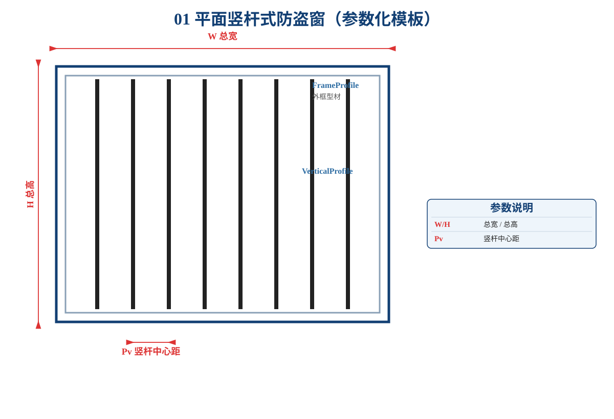

### 结构
外框 + 一组等距竖杆。

### 主要参数
- `W / H`：总宽、总高
- `FrameProfile`：外框型材
- `VerticalProfile`：竖杆型材
- `Pv`：竖杆中心距
- `Nv`：竖杆数量
- `OffsetLeft / OffsetRight`：左右起止边距

### 生成逻辑
```text
生成外框
→ 求内部净宽 Wc
→ 根据 Pv/Nv 求竖杆位置
→ 逐根生成竖杆
→ 根据 EndJoint 生成端部连接
→ 输出 BOM
```
给定 `Pv` 时：
\[
N_v=\left\lfloor\frac{W_c-S_L-S_R}{P_v}\right\rfloor+1
\]


---

## 02 平面横竖格栅防盗窗

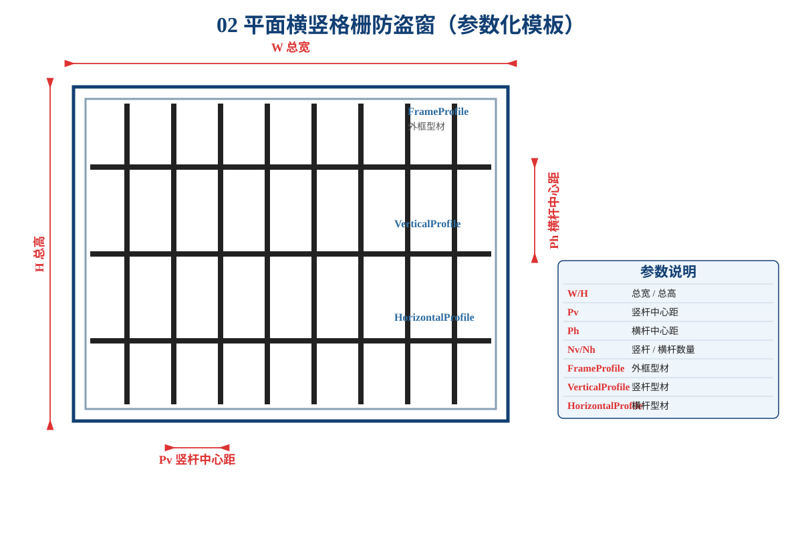

### 结构
外框 + 竖杆阵列 + 横杆阵列。

### 主要参数
- `W / H`
- `Pv / Ph`
- `Nv / Nh`
- `VerticalProfile / HorizontalProfile`
- `CrossJoint`
- `EndJoint`

### 生成逻辑
```text
生成外框
→ 生成竖杆阵列
→ 生成横杆阵列
→ 对每个横竖交点建立 CrossJoint
→ 对杆件与外框建立 EndJoint
→ 输出型材、孔槽、BOM
```


---

## 03 穿梭管防盗窗

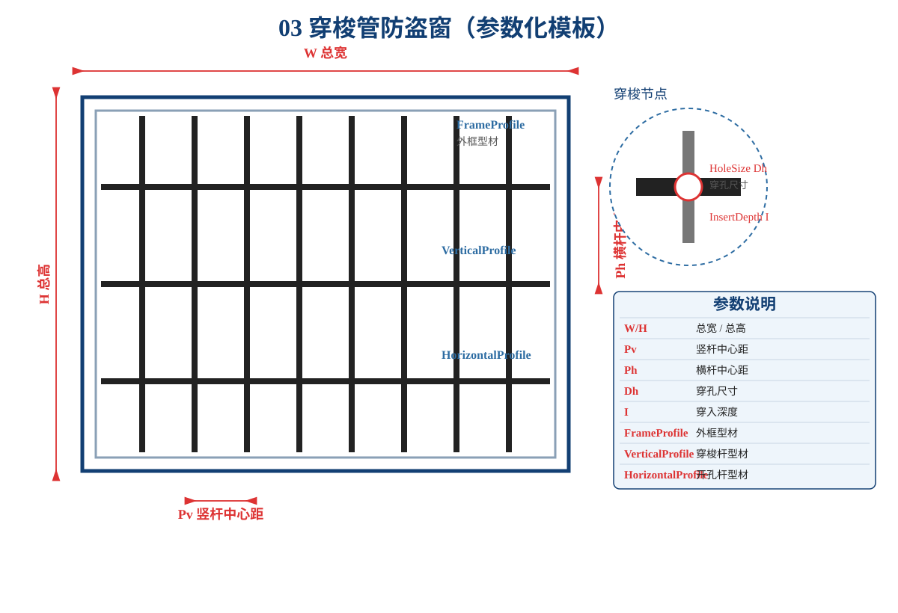

### 结构
一组杆件作为**开孔母件**，另一组杆件作为**穿入件**。

### 主要参数
- `Pv / Ph`
- `Dh`：穿孔尺寸
- `I`：穿入深度
- `VerticalProfile`：穿梭杆
- `HorizontalProfile`：开孔杆
- `HoleClearance`：孔与穿入杆之间的装配间隙

### 生成逻辑
```text
生成横竖杆阵列
→ 求所有交点
→ 在母件上按交点建立 HoleProfile
→ 在穿入件上计算贯穿位置
→ 自动得到孔位列表
→ 输出 CAM
```

孔型原则：
```text
圆杆 → 圆孔 / 包围孔
方杆 → 方孔 / 圆角矩形孔
异型杆 → 按截面投影 + Clearance
```


---

## 04 斜格 / 菱形防盗窗

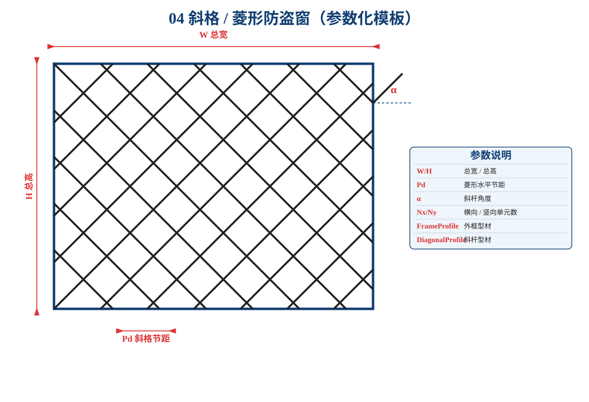

### 结构
两组相反方向斜杆交叉形成菱形网格。

### 主要参数
- `W / H`
- `Pd`：菱形水平节距
- `α`：斜杆角度
- `Nx / Ny`：横向、竖向模块数
- `DiagonalProfile`
- `CrossJoint`

### 生成逻辑
```text
定义第一组斜线族
→ 按 Pd 阵列
→ 镜像得到第二组斜线族
→ 裁剪到外框内部
→ 对交点生成焊接 / 穿孔 / 铆接节点
→ 输出杆件长度与端切角
```


---

## 05 装饰花格防盗窗

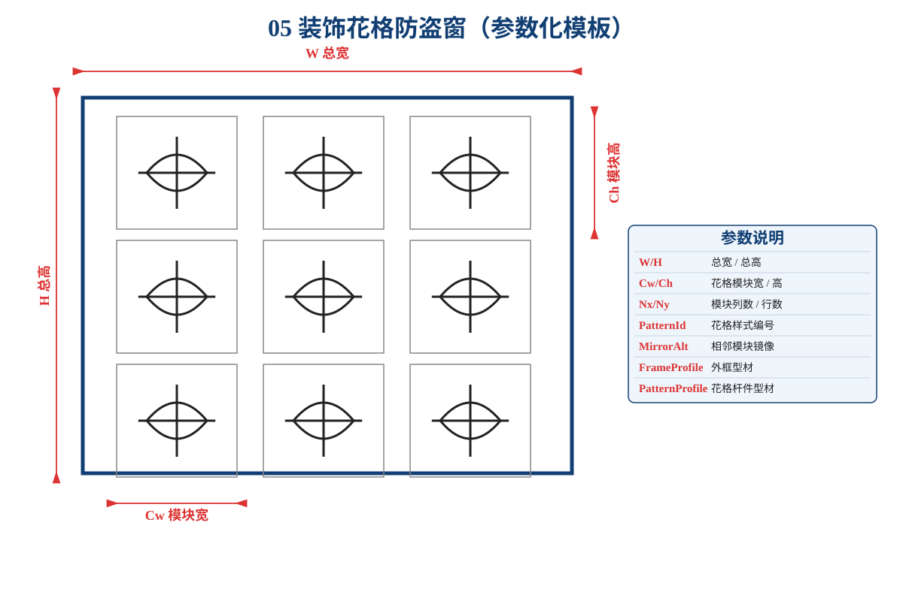

### 结构
外框 + 一个可重复的 `PatternCell` 模块。

### 主要参数
- `Cw / Ch`：花格单元宽、高
- `Nx / Ny`：列数、行数
- `PatternId`：花格图案
- `MirrorAlternate`：相邻单元是否镜像
- `PatternProfile`：花格杆件型材

### 生成逻辑
```text
生成外框
→ 生成 PatternCell
→ 按 Nx × Ny 复制
→ 可按奇偶列/行镜像
→ 裁剪边界
→ 合并共享杆件（可选）
→ 输出 BOM
```


---

## 06 外凸笼式防盗窗

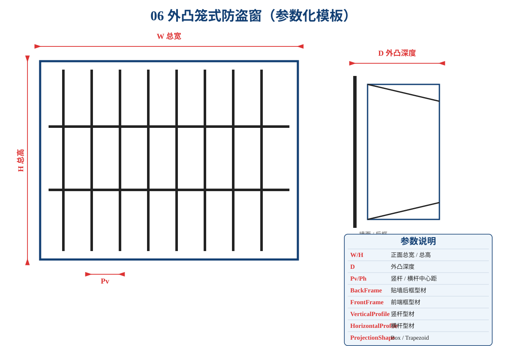

### 结构
后框 + 前框 + 连接杆 + 前/侧/顶/底多个格栅面。

### 主要参数
- `W / H / D`
- `BackFrame / FrontFrame`
- `Pv / Ph`
- `ProjectionShape = Box | Trapezoid`
- `SideConnectorProfile`

### 生成逻辑
```text
生成贴墙后框
→ 沿 Z 方向外移 D 生成前框
→ 连接前后框
→ 对 Front/Left/Right/Top/Bottom 分别生成格栅
→ 统一拆单
```

第一版建议 `ProjectionShape=Box`；梯形只需增加前框尺寸与偏移量。


---

## 07 平开式 / 带逃生门防盗窗

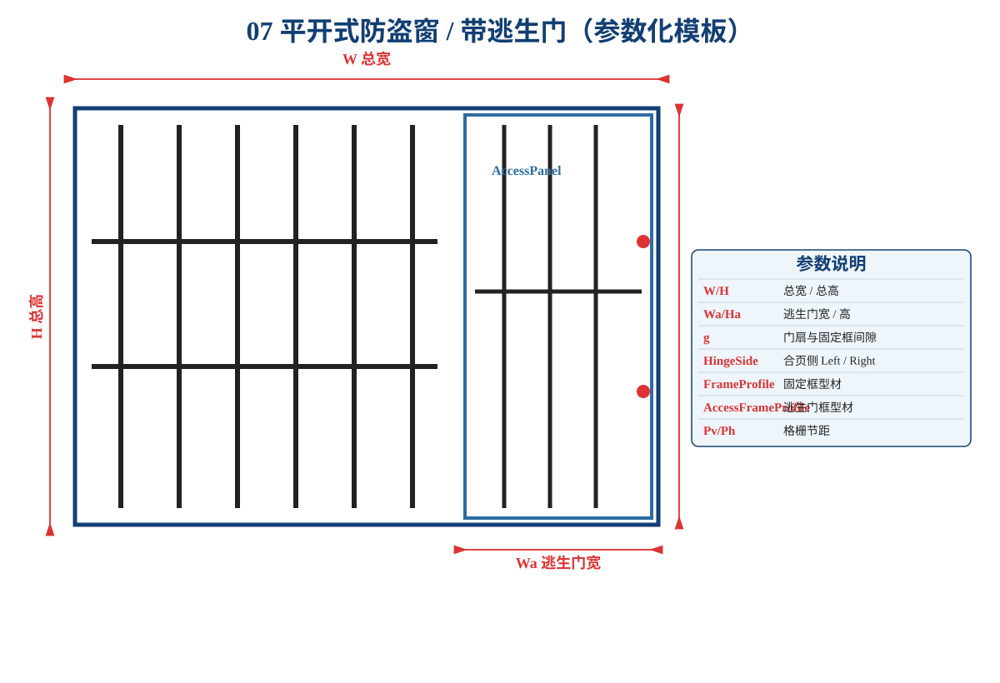

### 结构
固定格栅区域 + 一个或多个可开启 `AccessPanel`。

### 主要参数
- `Wa / Ha`：开启扇宽、高
- `g`：门缝
- `HingeSide`
- `AccessFrameProfile`
- `LockPoint`
- `Pv / Ph`

### 生成逻辑
```text
先生成完整固定格栅
→ 定义 AccessRect
→ 删除 AccessRect 内冲突杆件
→ 生成开口边框
→ 在开口内再次调用格栅面板生成器
→ 添加合页基准和锁点
→ 输出固定件与活动扇
```


---

## 08 推拉式防盗窗

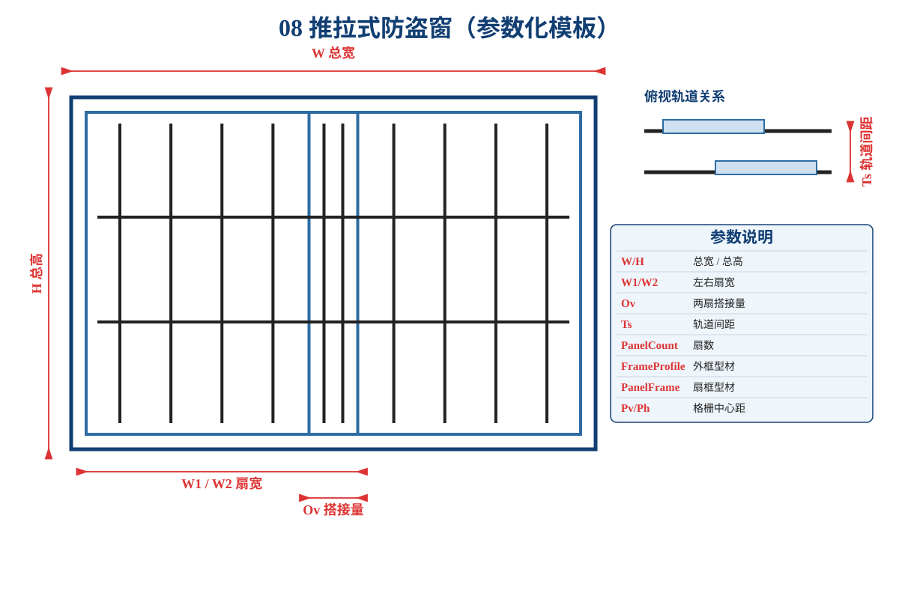

### 结构
外框 + 多扇格栅面板 + 多轨道。

### 主要参数
- `PanelCount`
- `W1 / W2 / ...`
- `Ov`：搭接量
- `Ts`：轨道间距
- `PanelFrame`
- `Pv / Ph`

### 生成逻辑
```text
生成外框与轨道
→ 根据 PanelCount 分扇
→ 每扇调用 BarGrillePanel
→ 相邻扇按 Ov 形成搭接
→ 给每扇分配轨道索引
→ 输出扇框、格栅和轨道件
```


---

## 09 折叠拉闸式防盗窗

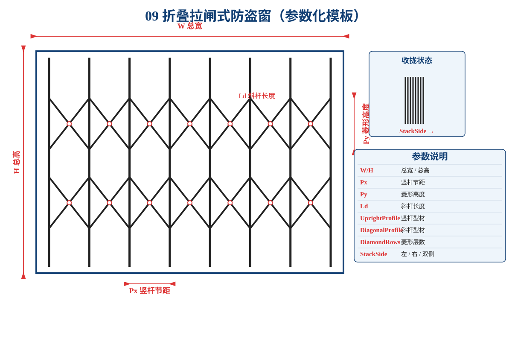

### 结构
上/下轨 + 竖杆阵列 + X 型斜杆连杆 + 铰接孔。

### 主要参数
- `Px`：竖杆节距
- `Py`：菱形高度
- `Ld`：斜杆长度
- `DiamondRows`
- `StackSide`
- `UprightProfile`
- `DiagonalProfile`

### 几何关系
对单个 X 单元：
\[
L_d=\sqrt{P_x^2+P_y^2}
\]

若中心设铰接孔，则中孔位于：
\[
s=L_d/2
\]

### 生成逻辑
```text
生成上下轨
→ 阵列竖杆
→ 相邻竖杆间生成 X 连杆
→ 按 DiamondRows 沿高度复制
→ 所有铰点生成 PivotHole
→ 根据 StackSide 定义收拢方向
→ 输出轨道、竖杆、斜杆和孔位
```


---

## 10 隐形钢丝绳防盗网

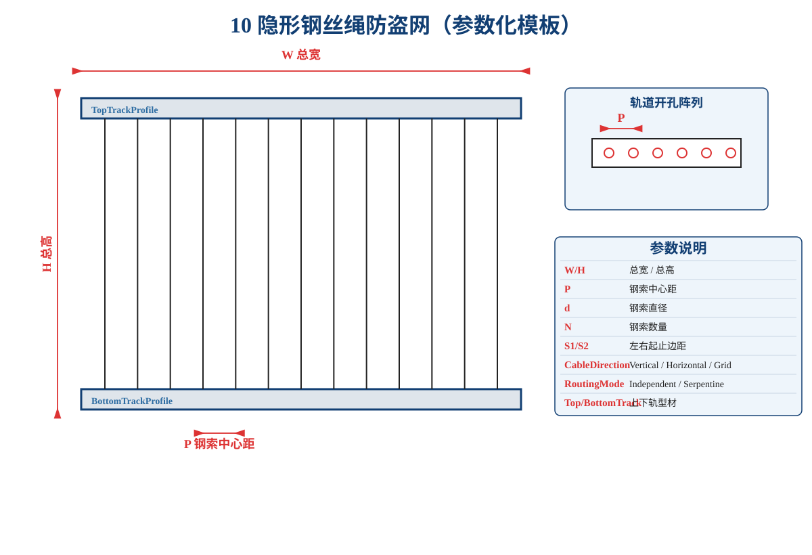

### 结构
上轨 + 下轨 + 钢丝绳阵列。

### 主要参数
- `P`：钢索中心距
- `d`：钢索直径
- `N`：数量
- `S1 / S2`：起止边距
- `CableDirection`
- `RoutingMode`
- `TopTrackProfile / BottomTrackProfile`

### 生成逻辑
```text
生成上下轨
→ 根据 P/N 求钢索位置
→ 在轨道上生成 HolePattern
→ Independent：每根钢丝独立
→ Serpentine：生成连续绕线路径
→ 输出轨道孔位和钢索长度
```


---

## 11 金刚网防盗窗（平开式）

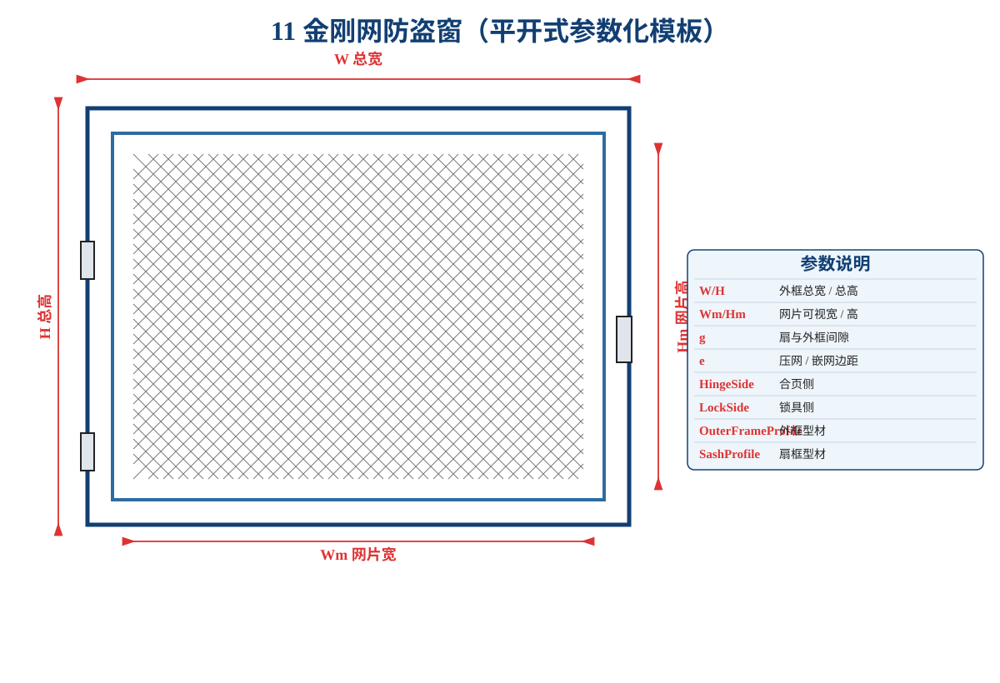

### 结构
外框 + 平开扇框 + 金刚网片 + 压网/嵌网结构 + 合页/锁点。

### 主要参数
- `Wm / Hm`：网片宽、高
- `g`：扇缝
- `e`：压网/嵌网边距
- `HingeSide / LockSide`
- `OuterFrameProfile / SashProfile`

### 生成逻辑
```text
生成外框
→ 计算扇外尺寸
→ 生成扇框
→ 求扇框净空
→ 由 e 计算网片裁切尺寸
→ 添加合页孔 / 锁孔
→ 输出框料、扇料、网片
```


---

## 12 金刚网防盗窗（推拉式）

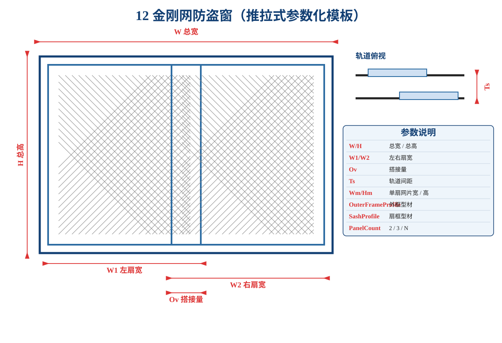

### 结构
外框 + 多轨道 + 多扇金刚网面板。

### 主要参数
- `W1 / W2`
- `Ov`：搭接量
- `Ts`：轨道间距
- `PanelCount`
- `Wm / Hm`
- `OuterFrameProfile / SashProfile`

### 生成逻辑
```text
生成外框与轨道
→ 根据 PanelCount 生成扇框
→ 每扇生成 MeshPanel
→ 相邻扇按 Ov 搭接
→ 每扇绑定轨道索引
→ 输出扇框、网片、锁具与轨道件
```


---

# 14. 公共参数求解模式

格栅阵列统一支持：

```text
模式A：给间距 P，求数量 N
模式B：给数量 N，求间距 P
模式C：给数量 N + 间距 P，求两端边距
```

通用公式：

\[
N=
\left\lfloor
rac{L-S_1-S_2}{P}

ight
floor+1
\]

\[
P=
rac{L-S_1-S_2}{N-1}
\]

---

# 15. 推荐公共数据结构

```cpp
struct SecurityWindow
{
    EnvelopeSpec envelope;

    StructureForm form;
    InfillSpec infill;
    PanelMotion motion;

    FrameSpec frame;

    std::vector<AccessPanel> accessPanels;
};
```

格栅填充：

```cpp
struct BarGrid
{
    ProfileId verticalProfile;
    ProfileId horizontalProfile;

    SolveMode verticalSolve;
    SolveMode horizontalSolve;

    double pv;
    double ph;

    int nv;
    int nh;

    CrossJoint crossJoint;
    EndJoint endJoint;
};
```

---

# 16. 从产品模板到 CAM

```text
产品参数
   ↓
结构生成
   ↓
杆件 / 面板 / 网片拆分
   ↓
型材归类
   ↓
端部处理
   ↓
孔 / 槽 / 连接特征
   ↓
CAM
```

重点是：

> **防盗窗模板输出的是制造数据，不只是外观模型。**

其中穿梭管、折叠拉闸、逃生门和金刚网框体最适合直接生成孔槽、端切与连接特征。


---

## 13 卷帘式防盗窗 / 防盗卷闸

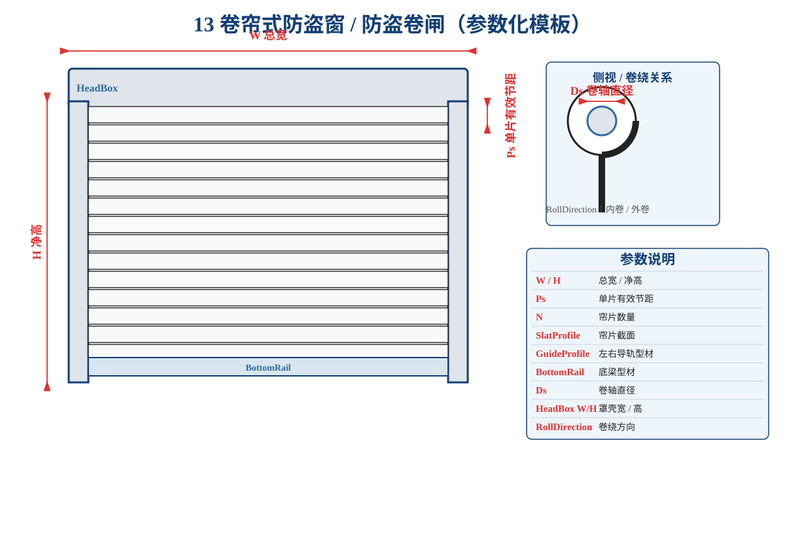

### 结构
顶部罩壳 + 卷轴 + 左右导轨 + 互锁帘片阵列 + 底梁。

### 主要参数
- `W / H`：总宽、净高
- `Ps`：单片帘片互锁后的有效覆盖节距
- `N`：帘片数量
- `SlatProfile`：帘片截面
- `GuideProfile`：左右导轨型材
- `BottomRailProfile`：底梁型材
- `Ds`：卷轴直径
- `HeadBoxW / HeadBoxH`：罩壳尺寸
- `RollDirection`：内卷 / 外卷

### 几何关系
给定净高和帘片有效节距：

\[
\boxed{
N=
\left\lceil
\frac{H}{P_s}
\right\rceil
}
\]

展开总帘片长度近似：

\[
L_s=N\cdot P_s
\]

实际卷绕模型可进一步按 `SlatProfile` 的中性层长度累计。

### 脚本逻辑
```text
生成左右导轨
→ 根据 H/Ps 计算 N
→ 阵列生成 N 片互锁帘片
→ 生成底梁
→ 顶部生成卷轴
→ 根据 RollDirection 建立卷绕方向
→ 生成 HeadBox
→ 输出帘片数量、导轨长度、底梁、卷轴和罩壳
```

---

## 14 可拆卸格栅防盗窗

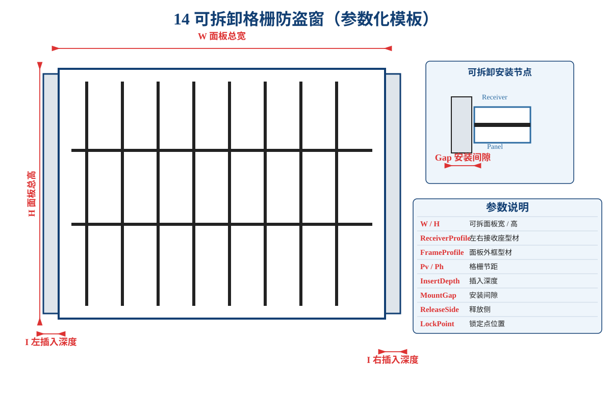

### 结构
墙体/固定座 + 可整体取下的格栅面板。

### 主要参数
- `W / H`：可拆面板宽、高
- `ReceiverProfile`：左右或上下固定接收座
- `FrameProfile`：可拆面板外框
- `Pv / Ph`：内部格栅中心距
- `InsertDepth`：面板插入接收座的深度
- `MountGap`：面板与固定座之间的装配间隙
- `ReleaseSide`：允许释放/抽出的方向
- `LockPoint[]`：锁销或锁定点

### 脚本逻辑
```text
生成固定 Receiver
→ 调用 BarGrillePanel 生成面板
→ 按 InsertDepth 延伸或插入
→ 按 MountGap 调整面板尺寸
→ 在 ReleaseSide 生成释放结构
→ 在 LockPoint 生成锁定孔/锁销位置
→ 输出固定座和可拆面板
```

这个款式本质上是：

\[
\boxed{
BarGrillePanel + MountMode=Removable
}
\]

因此不需要新的格栅几何内核。

---

## 15 重型焊接钢网 / 扩张网防盗窗

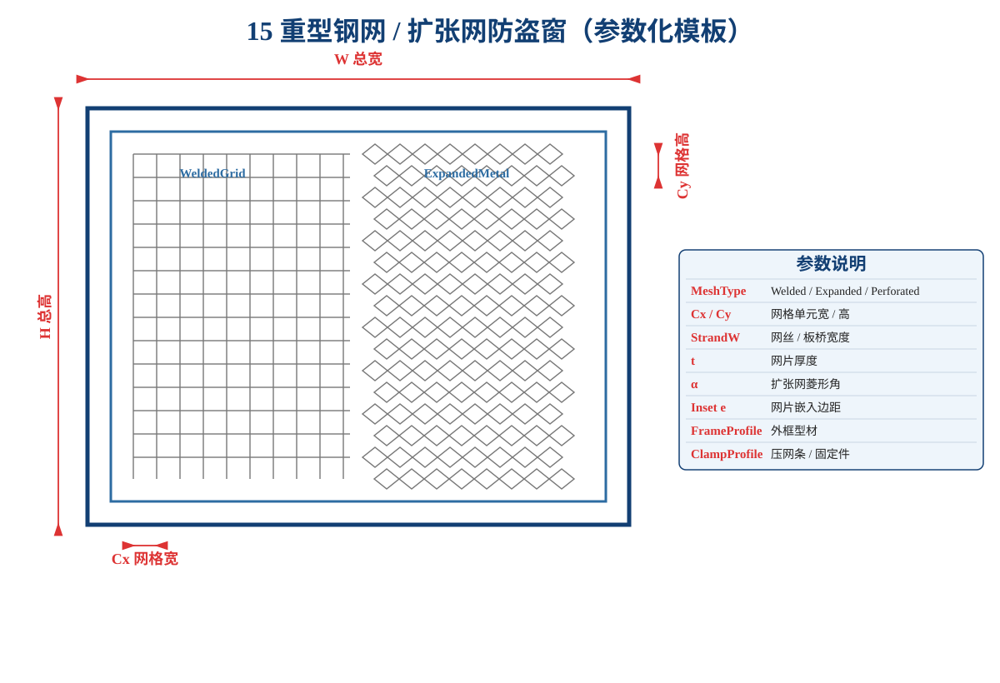

### 结构
外框 + 网片/扩张网板 + 压网条或固定件。

### 主要参数
- `MeshType`
  - `WeldedGrid`
  - `ExpandedMetal`
  - `PerforatedSheet`
- `Cx / Cy`：网格单元宽、高
- `StrandW`：网丝或扩张网板桥宽度
- `t`：网片厚度
- `α`：扩张网菱形角
- `Inset e`：网片相对框体的嵌入量
- `FrameProfile`
- `ClampProfile`

### 焊接钢网
规则格点：

\[
x_i=x_0+iC_x
\]

\[
y_j=y_0+jC_y
\]

### 扩张网
可将单个菱形定义为参数单元：

```text
CellWidth  = Cx
CellHeight = Cy
BridgeWidth = StrandW
Angle = α
```

然后二维阵列并裁剪到框内。

### 脚本逻辑
```text
生成外框
→ 求网片净区域
→ 根据 MeshType 生成网片几何
→ 按 Inset e 扩大/缩小裁切尺寸
→ 生成 ClampProfile 或固定点
→ 输出框料 + 网片裁切尺寸 + 固定件
```

---

## 16 无下轨 / 可翻底轨折叠拉闸

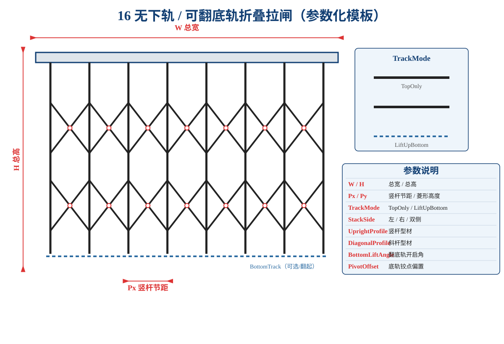

### 结构
与普通折叠拉闸相同的竖杆 + X 连杆体系，但底部导向方式不同。

### 参数
- `TrackMode`
  - `TopOnly`
  - `LiftUpBottom`
  - `TopBottom`
- `Px / Py`
- `StackSide`
- `BottomLiftAngle`
- `PivotOffset`
- `UprightProfile`
- `DiagonalProfile`

### TopOnly
只生成上轨：

```text
TopTrack
↓
竖杆 / X连杆悬挂
↓
底部自由或滑块导向
```

### LiftUpBottom
底部仍有导轨，但可绕铰点翻起：

```text
使用状态：BottomTrack = 水平
开启状态：BottomTrack = Rotate(β)
```

其中：

\[
\beta=BottomLiftAngle
\]

### 脚本逻辑
```text
调用 RetractableScissorGrille 生成主体
→ TrackMode=TopOnly：删除 BottomTrack
→ TrackMode=LiftUpBottom：BottomTrack 建立 Pivot
→ 根据 BottomLiftAngle 生成翻起状态
→ 保留所有竖杆、斜杆和铰孔规则
→ 输出 BOM
```

---

# 17. 更新后的市场款式映射

| 市场款式 | 参数化实现 |
|---|---|
| 平面竖杆式 | `BarGrillePanel + VerticalOnly` |
| 横竖格栅 | `BarGrillePanel + RectGrid` |
| 穿梭管 | `BarGrillePanel + ThroughHole` |
| 菱形格 | `BarGrillePanel + DiagonalGrid` |
| 装饰花格 | `BarGrillePanel + PatternCell` |
| 外凸笼式 | `ProjectingSecurityCage` |
| 带逃生门 | `BarGrillePanel + AccessPanel` |
| 平开式 | `BarGrillePanel + Hinged` |
| 推拉式 | `SlidingSecurityPanel` |
| 折叠拉闸 | `RetractableScissorGrille` |
| 无下轨折叠 | `RetractableScissorGrille + TrackMode=TopOnly` |
| 可翻底轨折叠 | `RetractableScissorGrille + TrackMode=LiftUpBottom` |
| 隐形钢丝绳 | `CableSecurityGrille` |
| 金刚网平开 | `FramedMeshPanel + Hinged` |
| 金刚网推拉 | `FramedMeshPanel + Sliding` |
| 可拆卸格栅 | `BarGrillePanel + Removable` |
| 焊接钢网 | `FramedMeshPanel + WeldedGrid` |
| 扩张网 | `FramedMeshPanel + ExpandedMetal` |
| 卷帘 / 卷闸 | `SecurityRollerShutter` |

这样从市场款式看已经比较完整，同时底层并没有为每个名称重新造一套几何内核。
