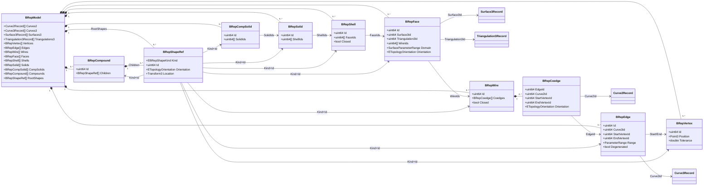

# GeometryData 方案文档

## 1. 总体方案

`GeometryData` 采用“数据契约优先”的设计。

核心原则：

- 数据和行为彻底分离。
- 几何和拓扑分离。
- 精确几何和三角网格并存。
- 中立结构不绑定 OCC、CGAL 或任何单一外部内核。

整体结构如下：

```text
GeometryData
    |
    +-- 基础数学数据
    |   +-- Point / Vector / Direction
    |   +-- Matrix / Transform / Quaternion
    |   +-- Axis / Placement / Plane / Box
    |
    +-- 精确几何
    |   +-- Curve2 / Curve3
    |   +-- Surface3
    |
    +-- 离散几何
    |   +-- Triangulation3
    |
    +-- BRep
        +-- Geometry Table
        +-- Topology Table
        +-- ShapeRef Root/Compound
```

## 2. 为什么不直接引入 OCC Topo

OCC 的 `TopoDS_Shape` 很强，但它不是中立数据契约。

如果在 Foundation 层直接引入 `TopoDS_Shape`，会带来几个问题：

- 上层数据结构被 OCC 绑定。
- CGAL、自研内核、前端渲染、文件模块都要间接感知 OCC。
- 项目持久化无法稳定依赖第三方运行时对象。
- 后续切换或并行使用几何内核会困难。

因此 `GeometryData` 只定义中立 BRep。OCC 只能通过 `GeometryAdapter` 做转换。

## 3. 与 OCC 的对照

### 3.1 几何层

| OCC | GeometryData | 支持情况 |
| --- | --- | --- |
| `gp_Pnt` | `Point3` | 支持 |
| `gp_Vec` | `Vector3` | 支持 |
| `gp_Dir` | `Direction3` | 支持 |
| `gp_Ax1` | `Axis3` | 支持 |
| `gp_Ax2` / `gp_Ax3` | `Placement3` | 支持 |
| `gp_Trsf` | `Transform3` | 支持 |
| `Geom_Line` | `Line3` | 支持 |
| `Geom_Circle` | `Circle3` | 支持 |
| `Geom_Ellipse` | `Ellipse3` | 支持 |
| `Geom_BSplineCurve` | `BSpline3` / `NURBS3` | 支持 |
| `Geom_Plane` | `PlaneSurface3` | 支持 |
| `Geom_CylindricalSurface` | `CylindricalSurface3` | 支持 |
| `Geom_ConicalSurface` | `ConicalSurface3` | 支持 |
| `Geom_SphericalSurface` | `SphericalSurface3` | 支持 |
| `Geom_ToroidalSurface` | `ToroidalSurface3` | 支持 |
| `Geom_BSplineSurface` | `BSplineSurface3` | 支持 |

### 3.2 拓扑层

| OCC | GeometryData | 支持情况 |
| --- | --- | --- |
| `TopoDS_Vertex` | `BRepVertex` | 支持 |
| `TopoDS_Edge` | `BRepEdge` | 支持 |
| edge 3D curve | `BRepEdge::Curve3Id` | 支持 |
| edge p-curve | `BRepCoedge::Curve2Id` | 支持 |
| degenerated edge | `BRepEdge::Degenerated` | 支持 |
| same parameter | `BRepEdge::SameParameter` | 支持 |
| same range | `BRepEdge::SameRange` | 支持 |
| `TopoDS_Wire` | `BRepWire` | 支持 |
| `TopoDS_Face` | `BRepFace` | 支持 |
| `TopoDS_Shell` | `BRepShell` | 支持 |
| `TopoDS_Solid` | `BRepSolid` | 支持 |
| `TopoDS_CompSolid` | `BRepCompSolid` | 支持 |
| `TopoDS_Compound` | `BRepCompound` | 支持 |
| `TopLoc_Location` | `BRepShapeRef::Location` | 支持 |
| `TopAbs_Orientation` | `ETopologyOrientation` | 支持 |
| `Poly_Triangulation` | `Triangulation3Record` | 支持 |

### 3.3 OCC 尚需 Adapter 处理的内容

以下内容不直接放进 `GeometryData`：

- OCC handle 生命周期。
- OCC 内部 shape sharing。
- 参数域严密合法性。
- seam edge 识别与修复。
- face/wire 闭合性修复。
- Boolean、offset、fillet、sweep 等内核算法。

这些属于 `GeometryAdapter` 或具体 OCC adapter 的职责。

## 4. 与 CGAL 的对照

CGAL 常见使用集中在 polygon mesh、surface mesh、AABB tree、三角剖分和几何算法。

| CGAL | GeometryData | 支持情况 |
| --- | --- | --- |
| `Point_3` | `Point3` | 支持 |
| `Vector_3` | `Vector3` | 支持 |
| `Surface_mesh` vertices | `Triangulation3::Vertices` | 支持 |
| `Surface_mesh` faces | `Triangulation3::Triangles` | 支持三角面 |
| face normal / vertex normal | `Triangulation3::Normals` | 支持 |
| face property | `TriangleFaceIds` / `EntityMetadata` | 支持基础映射 |
| polygon soup | `Triangulation3` | 支持 |
| AABB tree input | `Triangulation3` | 可支持 |

CGAL 对精确曲面 BRep 的表达不是它最常用的模型。对 CGAL 来说，`Triangulation3` 是主要桥接结构；对 OCC 来说，`BRepModel` 是主要桥接结构。

## 5. BRep 设计细节

### 5.1 几何表

几何表使用 Id 引用：

- 曲线表保存 2D/3D 曲线。
- 曲面表保存 3D 曲面。
- 三角剖分表保存 mesh。

拓扑对象只引用几何 Id，不直接嵌套几何对象。

这样可以支持：

- 多个 edge 共用同一条 curve。
- 多个 face 引用同一曲面。
- face 既有精确 surface，又有可选 triangulation。

### 5.2 拓扑表

拓扑表保存显式层级：

```text
Vertex
Edge
Coedge
Wire
Face
Shell
Solid
CompSolid
Compound
```

`Coedge` 是必要的。它解决的问题是：同一条 edge 在不同 face/wire 中可能方向不同，并且在每个 face 的参数域中有自己的 p-curve。

拓扑结构类图如下：



设计上需要注意：

- `BRepModel` 是 topo 数据的承载整体，不是 `BRepFace` 或 `BRepSolid` 单独就能表达完整 CAD 模型。
- `BRepEdge` 不是曲线本身，而是对 `Curve3Record` 的拓扑使用。
- `BRepFace` 不是曲面本身，而是对 `Surface3Record` 的拓扑使用，并通过 `BRepWire` 裁剪出有限区域。
- `BRepCoedge` 是 edge 在 wire 中的有向实例，承载 p-curve、方向和局部起止点信息。
- 类图中的箭头大部分是 Id 引用关系，不代表 C++ 指针拥有关系。

### 5.3 RootShapes

`RootShapes` 是新的统一入口。

旧的 `RootFaceIds`、`RootShellIds`、`RootSolidIds` 保留为便利用法，但推荐后续使用 `RootShapes`，因为它可以表达：

- 单个 face。
- 单个 shell。
- 单个 solid。
- 多 solid 装配。
- compound 层级。
- 带 location 的实例引用。

## 6. 能否支撑产品需求

当前结构可以支撑以下产品场景：

- STEP/IGES 导入后的精确 BRep 保存。
- STL 或渲染网格保存。
- 从 BRep face/edge/loop 中进行特征识别。
- 手动拾取 edge、loop、face。
- 为 CAM 生成刀路曲线。
- 根据 face triangulation 做渲染、碰撞、拾取。
- 后续通过 OCC adapter 完成精确几何计算。
- 后续通过 CGAL adapter 完成 mesh 相关计算。

## 7. 当前边界

`GeometryData` 只是表达数据，不能单独保证：

- face 的 wire 是否真正闭合。
- p-curve 是否与 3D curve 一致。
- edge 是否严格在 face surface 上。
- shell 是否水密。
- solid 是否拓扑有效。
- mesh 是否无自交。

这些需要 `GeometryAlgo` 的轻量校验或 `GeometryAdapter` 调外部内核做强校验。
