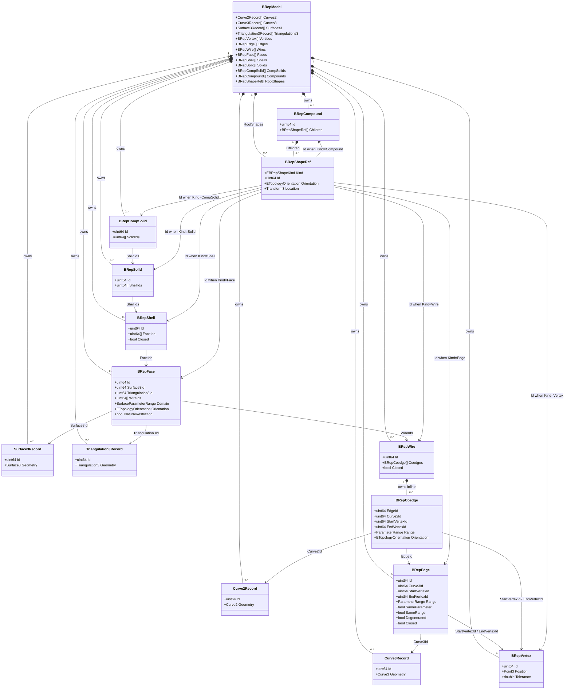

# GeometryData 规格文档

## 1. 定位

`GeometryData` 是 iCAX Engine Foundation 层的几何数据契约库。

它只定义数据结构，不提供几何计算、校验、求值、离散、相交、布尔、投影、拓扑修复或内核调用能力。

上层业务、Component、Resource、文件导入导出、渲染数据生成、碰撞数据生成都可以直接依赖 `GeometryData` 表达几何数据。

## 2. 设计目标

- 提供与几何内核无关的中立数据结构。
- 支持二维/三维点、向量、方向、坐标系、矩阵、变换、四元数。
- 支持常见解析曲线和自由曲线。
- 支持常见解析曲面和自由曲面。
- 支持中立 BRep 表达，能承接 STEP/IGES 导入后的精确几何与拓扑结构。
- 支持三角网格表达，能承接 STL、CGAL polygon mesh、OCC triangulation 或前端渲染网格。
- 不依赖 OCC、CGAL 或其他外部几何内核。
- 数据结构不包含方法，所有行为放到 `GeometryAlgo` 或 `GeometryAdapter`。

## 3. 非目标

- 不提供 `TopoDS_Shape`、`TopoDS_Face` 等 OCC 类型。
- 不提供 CGAL mesh 类型。
- 不提供几何对象继承体系。
- 不提供虚函数、多态行为、Clone、Evaluate、Reverse、Length 等方法。
- 不保证数据本身一定几何合法；合法性检查由 `GeometryAlgo` 或外部内核完成。
- 不直接处理文件格式、持久化、schema migration 或资源池。

## 4. 基础数据

### 4.1 标量容器

- `Point2` / `Point3`：二维/三维点。
- `Vector2` / `Vector3`：二维/三维向量。
- `Direction2` / `Direction3`：二维/三维方向，调用者负责保证单位化。
- `TextureCoordinate2`：二维纹理坐标。
- `Matrix3x3` / `Matrix4x4`：行主序矩阵。
- `Transform2` / `Transform3`：二维/三维齐次变换。
- `Quaternion`：四元数数据。

### 4.2 坐标与空间表达

- `Axis2` / `Axis3`：位置 + 方向。
- `Placement2` / `Placement3`：局部坐标系。
- `Plane3`：平面位置、法向、参考 X 方向。
- `BoundingBox2` / `BoundingBox3`：轴对齐包围盒。
- `OrientedBox2` / `OrientedBox3`：有向包围盒。

`Transform2` 使用 3x3 行主序矩阵，`Transform3` 使用 4x4 行主序矩阵。点按列向量应用，平移分量位于最后一列。

## 5. 曲线数据

支持的二维/三维曲线包括：

- `Line2` / `Line3`
- `Ray2` / `Ray3`
- `Segment2` / `Segment3`
- `Circle2` / `Circle3`
- `Arc2` / `Arc3`
- `Ellipse2` / `Ellipse3`
- `EllipseArc2` / `EllipseArc3`
- `Polyline2` / `Polyline3`
- `Bezier2` / `Bezier3`
- `BSpline2` / `BSpline3`
- `NURBS2` / `NURBS3`
- `Clothoid2` / `Clothoid3`

`Curve2` 与 `Curve3` 使用 `std::variant` 聚合具体曲线类型。

`BSpline` 与 `NURBS` 采用接近 OCC 的 pole、knot、multiplicity、weight 表达方式。

## 6. 曲面数据

支持的三维曲面包括：

- `PlaneSurface3`
- `CylindricalSurface3`
- `ConicalSurface3`
- `SphericalSurface3`
- `ToroidalSurface3`
- `BSplineSurface3`

`Surface3` 使用 `std::variant` 聚合具体曲面类型。

`BSplineSurface3` 保存 U/V 两个方向的 degree、pole grid、weight、knot、multiplicity 和 periodic 标记。

## 7. BRep 数据

`BRepModel` 使用几何表和拓扑表分离的方式表达边界表示模型。

BRep 不是像 `Curve3`、`Surface3` 那样由一个结构体完整表达一个对象。

`Curve3` 表达的是单个数学曲线，`Surface3` 表达的是单个数学曲面；而 BRep 表达的是一套复杂拓扑结构：它以曲线、曲面、三角剖分等几何数据为基础，再通过 vertex、edge、wire、face、shell、solid 等拓扑对象组织成完整 CAD 模型。

因此 `BRepModel` 必须看成一个整体数据包，而不是某一个独立对象。

### 7.1 BRepModel 整体结构

几何表：

- `Curve2Record`
- `Curve3Record`
- `Surface3Record`
- `Triangulation3Record`

拓扑表：

- `BRepVertex`
- `BRepEdge`
- `BRepCoedge`
- `BRepWire`
- `BRepFace`
- `BRepShell`
- `BRepSolid`
- `BRepCompSolid`
- `BRepCompound`

结构关系：

```text
BRepModel
    |
    +-- Geometry Tables
    |   +-- Curve2Record          面参数域曲线，也称 p-curve
    |   +-- Curve3Record          三维空间曲线
    |   +-- Surface3Record        三维精确曲面
    |   +-- Triangulation3Record  可选三角剖分
    |
    +-- Topology Tables
        +-- BRepVertex            拓扑点
        +-- BRepEdge              拓扑边，引用三维曲线
        +-- BRepCoedge            edge 在某个 wire/face 中的一次有向使用
        +-- BRepWire              一组有序 coedge，表达一条闭合或开放边界
        +-- BRepFace              曲面 + wire 裁剪出的面
        +-- BRepShell             一组 face 组成的壳
        +-- BRepSolid             一组 shell 组成的实体
        +-- BRepCompSolid         一组 solid 组成的复合实体
        +-- BRepCompound          任意 shape 的组合或装配层级
```

拓扑数据类图：



类图说明：

- `BRepModel` 拥有所有几何表和拓扑表。
- `BRepWire` 内联拥有 `BRepCoedge`，因为 coedge 表示 edge 在该 wire 中的一次有向使用。
- `BRepCompound` 内联拥有 `BRepShapeRef`，用于表达组合或装配子节点。
- 除内联关系外，拓扑对象之间主要通过 Id 引用，不直接持有对方对象。
- `BRepShapeRef::Kind + Id` 共同确定它引用的是哪一种拓扑对象。

### 7.2 几何表与拓扑表的关系

拓扑对象不直接内嵌几何对象，而是通过 Id 引用几何表。

原因：

- 同一条 `Curve3` 可能被多个 `BRepEdge` 使用。
- 同一个 `Surface3` 可能被多个 `BRepFace` 使用。
- 一个 `BRepFace` 可以同时引用精确 `Surface3` 和可选 `Triangulation3`。
- 一个 `BRepEdge` 在不同 `BRepFace` 中可能具有不同方向和不同参数域曲线。

这与 OCC 的思想类似：

```text
Geom_Curve      -> Curve3Record
Geom_Surface    -> Surface3Record
TopoDS_Edge     -> BRepEdge
TopoDS_Wire     -> BRepWire
TopoDS_Face     -> BRepFace
TopoDS_Shell    -> BRepShell
TopoDS_Solid    -> BRepSolid
TopoDS_Compound -> BRepCompound
```

但 `GeometryData` 不暴露 OCC 类型，所有 OCC 互转由 `GeometryAdapter` 完成。

### 7.3 拓扑结构职责

| 结构 | 职责 | 是否直接表示几何 |
| --- | --- | --- |
| `BRepVertex` | 拓扑点，保存位置、容差和元数据 | 否，只保存点位置 |
| `BRepEdge` | 拓扑边，引用三维曲线和起止顶点 | 否，引用 `Curve3Record` |
| `BRepCoedge` | edge 在某个 wire 中的一次有向使用 | 否，引用 edge 和 p-curve |
| `BRepWire` | 一组有序 coedge，形成边界 | 否 |
| `BRepFace` | 使用曲面并通过 wire 裁剪出有限面 | 否，引用 `Surface3Record` |
| `BRepShell` | 多个 face 组成的壳 | 否 |
| `BRepSolid` | 一个或多个 shell 组成的实体 | 否 |
| `BRepCompSolid` | 多个 solid 组成的复合实体 | 否 |
| `BRepCompound` | 任意 shape 的组合或装配层级 | 否 |

### 7.4 BRepEdge

`BRepEdge` 表示拓扑边，不等同于 `Curve3`。

`BRepEdge` 由以下信息组成：

- `Curve3Id`：三维空间曲线引用。
- `StartVertexId` / `EndVertexId`：拓扑边的起止顶点。
- `Range`：边在三维曲线上的参数范围。
- `Tolerance`：容差。
- `SameParameter`：三维曲线参数和 p-curve 参数是否一致。
- `SameRange`：三维曲线范围和 p-curve 范围是否一致。
- `Degenerated`：是否退化边。
- `Closed`：边自身是否闭合。

退化边可以没有三维曲线，但对应 `BRepCoedge` 必须提供 p-curve。

### 7.5 BRepCoedge

`BRepCoedge` 表示 wire 内的一条有向边，包含：

- `EdgeId`：三维边引用。
- `Curve2Id`：面参数域 p-curve 引用，可选。
- `StartVertexId` / `EndVertexId`：coedge 方向下的起止顶点，可选。
- `Range`：参数范围。
- `Orientation`：拓扑方向。

`BRepCoedge` 是 BRep 中非常关键的结构。它解决两个问题：

- 同一条 `BRepEdge` 在不同 `BRepWire` 中可以方向相反。
- 同一条 `BRepEdge` 落在不同 `BRepFace` 上时，可以拥有不同的 `Curve2Id`。

### 7.6 BRepWire

`BRepWire` 表示一组有序 coedge。

它可以表达：

- face 的外边界。
- face 的内孔边界。
- 开放轮廓。
- seam 边相关的特殊边界。

`Closed` 只表示调用者声明的闭合状态，不代表系统已经完成拓扑合法性验证。

### 7.7 BRepFace

`BRepFace` 由以下信息组成：

- `Surface3Id`：精确曲面引用。
- `WireIds`：边界 wire 引用。
- `Domain`：曲面参数域范围。
- `Orientation`：拓扑方向。
- `Triangulation3Id`：可选三角剖分引用。
- `Tolerance`：容差。
- `NaturalRestriction`：是否自然边界限制。

`BRepFace` 不等同于 `Surface3`。

`Surface3` 是无限或自然范围内的数学曲面。`BRepFace` 是在该曲面上使用若干 `BRepWire` 裁剪出来的有限拓扑面。

一个典型 face 的含义是：

```text
Face = Surface3 + OuterWire + InnerWire...
```

例如“带孔平面”不是一个 `PlaneSurface3` 就能表达，它必须是：

```text
PlaneSurface3
    + outer BRepWire
    + hole BRepWire
    -> BRepFace
```

### 7.8 BRepShell / BRepSolid / BRepCompound

`BRepShell` 表示一组 face 拼成的壳。

`BRepSolid` 表示一个或多个 shell 组成的实体。常见情况下，一个实体包含一个外壳，也可以包含内壳表达空腔。

`BRepCompound` 表示任意 shape 的组合，可用于表达装配、导入文件中的组合对象或多个独立实体。

### 7.9 BRepShapeRef

`BRepShapeRef` 表达形体引用：

- `Kind`：Vertex、Edge、Wire、Face、Shell、Solid、CompSolid、Compound。
- `Id`：目标形体 Id。
- `Orientation`：引用方向。
- `Location`：形体级变换。

该结构用于对应 OCC `TopoDS_Shape` 的 orientation/location，也用于表达 STEP 装配实例或 compound 层级。

## 8. 三角网格数据

`Triangulation3` 支持：

- `Vertices`
- `Normals`
- `TextureCoordinates`
- `Triangles`
- `TriangleFaceIds`

它既可表达渲染网格，也可表达 CGAL polygon mesh 或 OCC face triangulation 的轻量结果。

## 9. 元数据

`EntityMetadata` 用于保存：

- `Name`
- `SourceId`
- `Tags`

它用于承接 STEP/IGES 文件中的名称、原始标识、分类标签等非几何信息。

## 10. 使用样例

### 10.1 定义三维线段

```cpp
iCAX::GeometryData::Segment3 segment;
segment.Start = { 0.0, 0.0, 0.0 };
segment.End = { 10.0, 0.0, 0.0 };
```

### 10.2 定义三阶 B 样条

```cpp
iCAX::GeometryData::BSpline3 curve;
curve.Degree = 3;
curve.Poles = {
    { 0.0, 0.0, 0.0 },
    { 10.0, 0.0, 0.0 },
    { 20.0, 10.0, 0.0 },
    { 30.0, 10.0, 0.0 }
};
curve.Knots = { 0.0, 1.0 };
curve.Multiplicities = { 4, 4 };
curve.Periodic = false;
```

### 10.3 定义一个平面 Face

```cpp
iCAX::GeometryData::BRepModel model;

model.Surfaces3.push_back({
    1,
    iCAX::GeometryData::PlaneSurface3 {},
    { "top face", "step-face-42", {} }
});

model.Faces.push_back({
    .Id = 10,
    .Surface3Id = 1,
    .WireIds = {},
    .Orientation = iCAX::GeometryData::ETopologyOrientation::Forward
});

model.RootShapes.push_back({
    iCAX::GeometryData::EBRepShapeKind::Face,
    10,
    iCAX::GeometryData::ETopologyOrientation::Forward,
    {}
});
```

## 11. 与其他模块关系

- `GeometryAlgo`：使用本项目数据进行计算、校验、求值。
- `GeometryAdapter`：将本项目数据转换到 OCC、CGAL 等外部内核，并转换回本项目数据。
- 产品插件：直接依赖本项目表达曲线、曲面、BRep、mesh。
