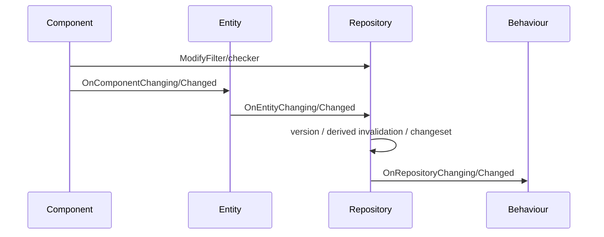

# Database 方案文档

## 1. 设计目标

`Database` 以 `Repository` 作为唯一上层数据入口。上层不再在 Database 内拆分多个数据空间来表达 CAD、CAM、临时编辑或预览数据；这些场景通过轻量项目会话、Repository 快照、导入事务或业务对象组合来表达。

核心目标：

- Repository 直接承载 EC 数据。
- Entity 只表达身份。
- Component 只表达数据、状态或能力。
- Behaviour、Project、ApplicationRuntime 不依赖内部数据空间实现。
- 日志、事务、撤销还原和快速保存统一基于有序 OperationBatch；ChangeSet 只作为提交后的净变更摘要。
- 项目文件 schema/version/migration 属于 File 模块；Database 不维护文件版本升级链，快速保存日志只回放当前程序写出的操作批次。

## 2. 当前代码结构

```text
Database/
  IRepository.h / Repository.h / Repository.cpp
    -> Repository 对外接口和默认实现

  IEntity.h / Entity.h / Entity.cpp
    -> Entity 接口和实现

  ComponentBase.*
  ComponentHelper.h
    -> Component 基类、字段声明宏和属性事件

  MetaRegistry.*
    -> Component 类型和字段 meta 注册表

  ModifyFilter.*
    -> 正式写入前的统一准入过滤，调用 checker 但不依赖事件

  ChangeSet.*
    -> 变更集合和合并摘要，用于批量事件、版本和派生字段失效

  RepositoryHistory.*
    -> 撤销还原历史，外挂维护

  OperationLog.*
    -> 有序操作批次、字段过滤、反向批次生成和快速保存日志读写

  DerivedProperty.*
    -> 派生字段缓存、依赖和失效

  VersionTable.*
    -> 组件版本和 changed 标记；版本类型为 uint64_t，可直接作为 PDO dataVersion
```

实现内部由 Repository 直接持有 Entity 表、EntityView、事件汇总、版本表和派生字段管理器。外部代码只通过 `Repository` 访问 EC 数据。

组件版本只表达 Repository 内该组件内容的运行期变更序号，不表达项目文件 schema、日志格式版本或字段布局版本。高频同步时，Behaviour 可以读取 `component->Version()` 或 `repository->GetComponentVersion(...)`，将其作为 PDO `dataVersion`；如果 Slot 最新版本已经不小于该值，就可以跳过本帧序列化。

## 3. Repository 门面

Repository 新增了直接的 EC 容器接口：

```cpp
std::shared_ptr<IEntity> CreateEntity(const uuid& id);
bool CreateEntity(const uuid& id, std::shared_ptr<IEntity>& entity, std::string& error);
bool HasEntity(const uuid& id) const;
std::shared_ptr<IEntity> GetEntity(const uuid& id) const;
void DeleteEntity(const uuid& id);
bool DeleteEntity(const uuid& id, std::string& error);
std::vector<uuid> GetEntityIDs() const;
IEntitiesView& GetView() const;
```

Behaviour 调度器使用 `Repository::GetView()` 枚举组件；插件行为使用 `Repository::GetEntity()` 和 `Repository::DeleteEntity()` 处理实体关系。

## 4. ModifyFilter 写入管线

正式修改不通过事件触发 checker，而是在写入管线前置调用 `CModifyFilter`：

```text
Component/Entity API
  -> ModifyFilter
  -> checker
  -> Changing event
  -> apply memory change
  -> Changed event
  -> Repository operation log/history/version/derived effects
```

`SetProperty` 是单字段操作，`SetProperties` 是多字段原子操作。后者只调用一次 `AllowModify`，checker 需要根据当前字段值和本次 `PropertySet` 覆盖后的预期状态判断是否合法。

`AddComponent` / `RemoveComponent` 也先进入 `ModifyFilter`。过滤失败时返回 `false` 并填写错误信息，内存不变，不发布事件，不写操作日志，也不会进入撤销历史。

字段宏生成的类型化 `SetXxx` 会转入 `SetProperty`，注册表中的 setter 只做无事件的底层赋值，避免绕过统一过滤。

## 5. 事件链路



Repository 是对外事件发布者。Scene 订阅 Repository 事件，再携带 ApplicationContext、ProductContext、ProjectContext 和 SceneContext 转发给 Universe。

## 6. OperationBatch 与 ChangeSet

Database 内部同时维护两种变更视图：

- `OperationBatch`：按实际发生顺序追加每一条操作，不合并字段。它是事务回滚、撤销还原、重做和快速保存回放的事实来源。
- `ChangeSet`：由 OperationBatch 派生出来的净变更摘要，会合并同一字段的多次修改，主要用于判断是否发布 `kBatchChanged`、版本更新和派生字段失效。

OperationBatch 记录：

- 创建实体。
- 删除实体。
- 添加组件。
- 删除组件。
- 修改字段。
- 启用组件。
- 禁用组件。

OperationBatch 支持：

- 按原始顺序回放。
- 按反向顺序生成回滚批次。
- 按字段 meta 过滤事务型字段和持久化字段。
- 序列化为追加式快速保存日志。

ChangeSet 支持：

- 合并多次字段修改为净结果。
- 合并多次组件启用状态修改为净结果。
- 抵消批量内的临时创建、删除和字段恢复。
- 批量事件携带。

组件启用状态不放入 `PropertySet`。`CRepositoryOperation` 通过 `PreviousEnabled` / `NewEnabled` 保存状态快照：添加组件时可携带 `NewEnabled`，移除组件时可携带 `PreviousEnabled`，启用/禁用操作则同时携带前后状态。反向批次会交换这两个状态，因此撤销删除禁用组件、重做添加禁用组件时都能恢复准确状态。

## 7. 批量变更

批量变更由 `BeginBatch()` / `EndBatch()` 创建。

变更期间，普通细粒度事件会被记录到 builder；提交时统一：

1. 冻结有序 OperationBatch。
2. 从 OperationBatch 派生 ChangeSet 净摘要。
3. 如果 ChangeSet 非空，应用版本和派生字段失效。
4. 发布 `kBatchChanged`，作为批量刷新边界。
5. OperationBatch 进入撤销记录器。
6. OperationBatch 追加快速保存日志。

`LoadBaseline` 是静默加载基线模式。它用于首次打开项目文件，提交后清空版本脏标记、派生缓存和历史，不发布普通用户修改语义。

## 8. 事务

事务由 Repository 的 `BeginTransaction()`、`CommitTransaction(transaction)`、`CancelTransaction(transaction)` 三个接口管理。

事务对象只收集操作意图，不暴露提交或取消接口。提交时 Repository 把意图按记录顺序严格执行，并生成 Transaction 类型的 OperationBatch；若提交阶段失败，则基于已经记录的 OperationBatch 倒序静默回滚。取消时仅丢弃意图，不修改内存、不发事件、不写日志。

事务支持 `CreateEntity`、`DisposeEntity`、`AttachComponent`、`DetachComponent`、`ModifyComponent`、`EnableComponent` 和 `DisableComponent`。启用状态和字段修改一样按操作顺序进入提交路径，但它不走字段 meta 裁剪。

事务和撤销还原不绑定。只有事务提交发生在 `BeginUndoCommand(name)` / `End()` 之间时，才会被当前 undo step 捕获。

## 9. 撤销还原

撤销还原由 `CRepositoryUndoRedoHistory` 外挂维护。

Repository 公开上层友好的单数据容器接口：

```cpp
auto cmd = repo->BeginUndoCommand("Rename");
cmd->End();

repo->Undo();
repo->Redo();
```

内部规则：

- Begin/End 只定义监听边界。
- End 时把期间捕获的 OperationBatch 汇总为一个 step，保留真实操作顺序。
- Undo 使用反向 OperationBatch 回放，内部按原操作的反向顺序恢复。
- Redo 使用原 OperationBatch 回放，保持用户原始修改顺序。
- 事务、批量变更和普通修改是独立概念，只是在日志底座上被 undo recorder 监听。

## 10. 快速保存

快速保存由 `COperationBatchJournal` 实现。

打开日志时调用方传入 `magic/version`，Journal 会把它写入第一条非空头部记录；追加打开和回放时必须传入同一组 `magic/version`，不匹配直接拒绝。这里的 version 只用于当前日志格式硬校验，不建立升级链。

每次提交后，Repository 会把可持久化 OperationBatch 追加到日志。正常保存完整项目文件后，上层可以截断或重建日志；截断后会重新写入日志头。

快速保存会保留结构性操作、组件启用状态和 `Persistent + Transactional` 字段。字段会按 meta 裁剪；组件启用状态属于组件基础状态，不按字段 meta 裁剪。

崩溃恢复时：

```text
Repository idle
  -> ReplayOperationLog(path, magic, version)
     -> validate repository state
     -> read log header and batches
     -> clear undo/redo history
     -> replay batches in order
```

`ReplayOperationLog` 是 Database 的底层恢复入口，不是任意时刻可调用的普通业务操作。调用前 Repository 必须没有 active batch、active transaction、undo command recording、history replay，且当前没有打开 operation log 追加写入；否则立即拒绝。

1. 加载完整项目文件。
2. 创建 Repository。
3. 如项目文件需要版本识别或迁移，由 File 模块在写入 Repository 基线前完成。
4. 使用调用方传入的日志 `magic/version` 回放当前格式的操作日志。
5. 恢复到最后一次写入日志的状态。

项目文件版本迁移发生在 File 模块加载基线数据之前或期间。File 模块可以通过 `BeginLoadBaseline` / `EndLoadBaseline` 写入迁移后的干净基线，再由 Project 回放快速保存日志。快速保存日志只针对该干净基线追加当前程序生成的操作，不设计新旧日志格式升级链。

## 11. 派生字段

派生字段由 `CDerivedPropertyManager` 管理。

核心数据结构：

```text
target property -> cached value/state
source property -> dependent properties
derived property -> source properties
```

读取派生字段时：

1. 如果缓存 clean，直接返回。
2. 如果 dirty，调用 evaluator。
3. evaluator 通过 `CDerivedPropertyContext` 读取依赖字段。
4. context 记录依赖关系。
5. 计算完成后写入缓存。

字段修改时，Repository 根据 meta 决定是否失效派生字段：

- `Transactional` 和 `Observable` 值字段会触发失效。
- `Silent` 字段不触发默认失效。
- `Derived` 字段自身不写入日志。

## 12. 与其他 Framework 项目的关系

Behaviour 通过 `Repository::GetView()` 枚举组件并执行行为。

Scene 负责资源库和 Repository 生命周期；Project 负责项目身份、ProjectSetting 和 Scene 集合。Database 不关心项目或 Scene 的打开方式。

Scene 级 Facades 通过 `SceneContext::Database()` 获取 `IRepository`，执行命令时显式创建撤销记录边界。ProjectContext 只提供项目身份、路径和 ProjectSetting。
