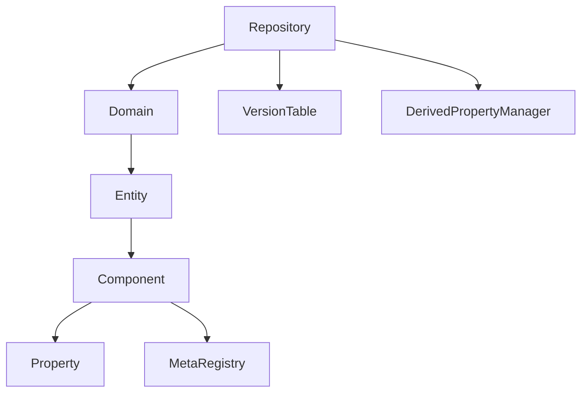
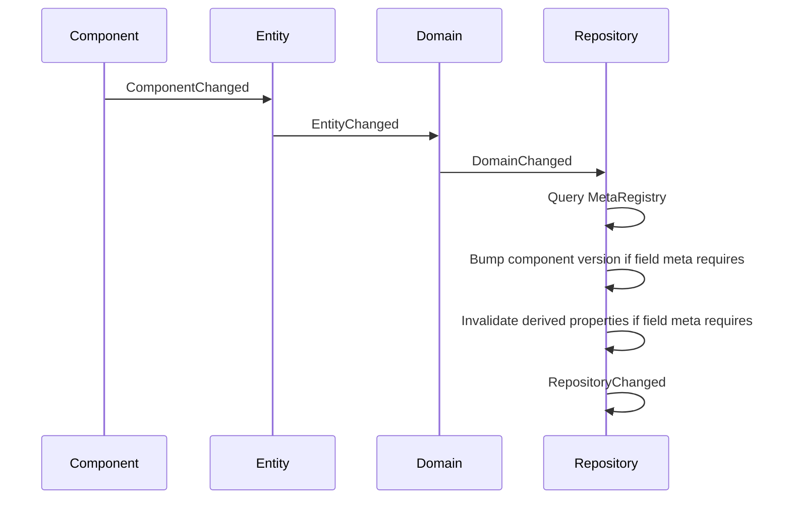

# Database 方案文档

## 1. 目标问题

`Database` 要解决的问题是：在一个应用进程内，用统一的 EC 数据模型承载不同业务空间的数据，并让上层可以通过稳定接口完成实体、组件、字段、变更事件和派生字段管理。

核心目标：

- 用 `Domain` 隔离不同业务 EC 数据空间。
- 用 `Entity` 表达身份。
- 用 `Component` 表达实体的身份、能力和状态。
- 用 `Property` 统一访问组件字段。
- 用字段元信息表达字段类型、持久化语义和修改传播策略。
- 用事件链路把字段变化上抛给仓储。
- 用版本表追踪组件变化。
- 用派生字段机制表达只读计算字段，并统一处理缓存过期。

## 2. 工程位置

```text
src/icax/framework/Database/
```

工程文件：

```text
Database.vcxproj
Database.vcxproj.filters
```

测试工程：

```text
src/tests/icax/framework/Database/DatabaseTest/
```

## 3. 模块结构

```text
Database.h
  -> 导出宏、IN/OUT 兼容宏、字段元信息枚举

IRepository.h / Repository.h / Repository.cpp
  -> 仓储接口和默认实现

IDomain.h / Domain.h / Domain.cpp
  -> Domain 接口和默认实现

IEntity.h / Entity.h / Entity.cpp
  -> Entity 接口和默认实现

ComponentBase.h / ComponentBase.cpp
  -> 组件基类、统一字段访问、组件事件发布

ComponentHelper.h
  -> 组件声明、普通字段、可观察字段、静默字段、派生字段、运行时裸字段声明宏

IMetaRegistry.h / MetaRegistry.h / MetaRegistry.cpp
  -> 类型、字段、构造器、特性、约束器元数据注册

DerivedProperty.h / DerivedProperty.cpp
  -> 派生字段 key、计算上下文、缓存和依赖图

VersionTable.h / VersionTable.cpp
  -> 组件版本与 dirty 标记

ChangeSet.h / ChangeSet.cpp
  -> 批量变更模型、变更合并和事务回滚基础数据结构

ChangeLog.h / ChangeLog.cpp
  -> ChangeSet 过滤、反向变更生成、序列化和追加式操作日志

RepositoryHistory.h / RepositoryHistory.cpp
  -> 外挂式撤销还原记录器和历史栈

EntitiesView.h / EntitiesView.cpp
  -> Domain 内 Entity 视图

ComponentMask.h / MaskRegistry.h
  -> 组件类型掩码和类型索引

GenericComponent.h / GenericComponent.cpp
  -> 未知组件类型的通用承载
```

## 4. 核心对象关系



所有权关系：

```text
Repository owns Domain
Domain owns Entity
Entity owns Component
Component weakly references Entity
```

事件监听关系：

```text
Entity listens Component
Domain listens Entity
Repository listens Domain
```

监听者使用 `weak_ptr` 保存，避免事件监听链路形成强引用环。

## 5. Repository 设计

`CRepository` 内部主要状态：

```cpp
uuid m_UID;
std::unordered_map<uuid, std::shared_ptr<CDomain>> m_mapDomains;
std::shared_ptr<VersionTable> m_pVerisonTable;
std::shared_ptr<CDerivedPropertyManager> m_pDerivedPropertyManager;
```

职责：

- 创建和删除 `Domain`。
- 初始化仓储本体 `Domain`。
- 提供 `MetaEntity`。
- 接收 `Domain` 事件。
- 更新组件版本。
- 触发派生字段失效。
- 向外发布 `Repository` 事件。

创建流程：

```text
GenerateRepository(id)
  -> new CRepository(id)
  -> Initialzie()
  -> 创建仓储本体 Domain
```

## 6. Domain 设计

`CDomain` 内部主要状态：

```cpp
uuid m_UID;
std::map<uuid, std::shared_ptr<CEntity>> m_mapEntities;
std::weak_ptr<IRepository> m_pRepository;
std::shared_ptr<CEntitiesView> m_pEntitesView;
bool m_bPersistent;
```

职责：

- 管理实体集合。
- 维护 Domain 视图。
- 提供 Domain 自身的 `MetaEntity`。
- 接收 Entity 事件并上抛。

`m_bPersistent` 是当前接口保留的保存入口标记。它不参与 EC 结构本身的组织。

## 7. Entity 设计

`CEntity` 内部主要状态：

```cpp
uuid m_UID;
std::map<std::string, std::shared_ptr<CComponentBase>> m_mapComponents;
std::vector<std::string> m_ComponentClasses;
std::weak_ptr<IDomain> m_pDomain;
```

职责：

- 维护组件集合。
- 保证同一实体上同名组件只有一个。
- 接收组件事件。
- 上抛实体事件。

组件添加流程：

```text
AddComponent(className)
  -> 检查是否已有该组件
  -> MetaRegistry.CreateByName
  -> TriggerEntityChanging(kAddComponent)
  -> 写入 m_mapComponents
  -> TriggerEntityChanged(kAddComponent)
  -> Entity 监听组件事件
```

## 8. Component 设计

`CComponentBase` 提供：

- 所属实体弱引用。
- 字段统一访问接口。
- 组件启用、禁用、删除标记。
- 组件版本查询。
- 组件事件发布。

普通字段设置流程：

```text
SetProperty(name, value)
  -> 检查 name 是否派生字段
  -> 读取旧值
  -> 新旧值相同则返回
  -> TriggerComponentChanging
  -> OnSetProperty
  -> TriggerComponentChanged
```

`DECLARED_ICAX_FIELD` 生成的 setter 会通过 `ComponentChangeNotifier` 发布事务型修改事件。

字段声明宏和默认语义：

```text
DECLARED_ICAX_FIELD
  -> Value + Persistent + Transactional

DECLARED_ICAX_OBSERVABLE_FIELD
  -> Value + NonPersistent + Observable

DECLARED_ICAX_SILENT_FIELD
  -> Value + NonPersistent + Silent

DECLARED_ICAX_DERIVED_FIELD
  -> Derived + NonPersistent + Silent
```

`SetProperties` 会按一次普通修改事件发布，事件中包含本次实际变化的字段集合。字段语义只保存在 `MetaRegistry`，不进入事件参数。

`DECLARED_ICAX_RUNTIME_FIELD` 不属于 Property 声明宏。它只生成 C++ 成员和 getter/setter，不注册 `MetaRegistry`，不生成 `PropertyName_xxx`，也不进入事件、版本、持久化、撤销还原和派生字段失效链路。

## 9. MetaRegistry 设计

`CMetaRegistry` 是进程内全局元数据注册表。

内部核心结构：

```cpp
struct PropertyMeta
{
    std::string Name;
    EPropertyKind Kind;
    EPropertyPersistence Persistence;
    EPropertyChangePolicy ChangePolicy;
    Getter;
    Setter;
    DerivedPropertyEvaluator Evaluator;
};

struct ComponentMeta
{
    std::string strComponentClass;
    Creator;
    Attributes;
    Checkers;
    Properties;
};
```

字段类型：

```cpp
enum class EPropertyKind
{
    Value,
    Derived
};

enum class EPropertyPersistence
{
    Persistent,
    NonPersistent
};

enum class EPropertyChangePolicy
{
    Transactional,
    Observable,
    Silent
};
```

普通字段：

```text
RegistPropertyByName
  -> 保存 Getter / Setter
  -> 保存 Persistence / ChangePolicy
```

派生字段：

```text
RegistDerivedPropertyByName
  -> 保存 Evaluator
  -> Kind = Derived
  -> Persistence = NonPersistent
  -> ChangePolicy = Silent
```

读取字段：

```text
InvokeGetter
  -> Value: 调 Getter
  -> Derived: 走 Repository.EvaluateDerivedProperty
```

写字段：

```text
InvokeSetter
  -> Value: 调 Setter
  -> Derived: 抛异常
```

## 10. 事件与版本链路

字段修改后事件链路：



事件参数不携带 `EPropertyChangePolicy`。订阅者通过事件中的 `strClassName` 与变更字段名查询 `MetaRegistry`，再判断该事件是否应该参与撤销、持久化、版本或缓存刷新。

当前策略语义：

```text
Transactional
  -> 事件正常触发
  -> Repository 默认更新组件版本并失效派生字段
  -> undo recorder 打开时可进入当前 undo step

Observable
  -> 事件正常触发
  -> Repository 默认更新组件版本并失效派生字段
  -> undo recorder 默认不记录撤销还原

Silent
  -> 事件正常触发
  -> Repository 默认不更新组件版本，不触发派生失效
  -> undo recorder 默认不记录撤销还原
```

`VersionTable` 的 key：

```cpp
struct VersionKey
{
    uuid nDomain;
    uuid nEntity;
    std::string strComponent;
};
```

当前版本粒度是组件级，不是字段级。

### 10.1 ChangeSet 与批量提交

高频导入、插入项目文件、一次批量修改等场景不应该把中间事件逐条暴露给仓储订阅者。`Repository` 通过 `CChangeSetBuilder` 把作用域内事件合并成一个 `CChangeSet`：

```text
BeginChangeScope(UserCommand)
  -> Domain/Entity/Component 正常修改内存
  -> Repository 拦截并记录事件，不立即发布 RepositoryChanged
  -> Commit
     -> 合并变更
     -> 更新版本和派生字段失效
     -> 发布一次 kBatchChanged
     -> 写入快速保存日志
     -> 如果当前存在 undo recorder，则被 undo recorder 监听
```

合并规则：

```text
同一字段多次修改
  -> 保留最早 PreviousValue 和最终 NewValue

新增组件后修改字段
  -> 合并到 AddedComponents.NewProperties

新增组件后又删除
  -> 抵消，不产生最终变更

删除组件前曾修改字段
  -> RemovedComponents.PreviousProperties 使用修改前快照

删除后用同一 EntityID 或同一 ComponentClass 重建
  -> 视为替换，保留旧内容移除和新内容添加，不制造额外 CreatedEntity

删除实体或删除 Domain
  -> 保留 Cleanup 过程中产生的 RemovedComponents，便于撤销时恢复组件
```

`LoadBaseline` 作用域用于打开项目文件。它不对外提交 ChangeSet，不发布事件，不进入撤销/重做栈，不写操作日志；提交后清空版本表、派生缓存和撤销/重做历史。

### 10.2 事务

`BeginTransaction()` 是独立的事务作用域，不等同于撤销还原记录：

```text
BeginTransaction
  -> 修改立即作用于内存
  -> Commit: 生成 ChangeSet 并提交，写入快速保存日志，不创建 undo step
  -> Cancel: 根据 ChangeSet 反向应用，静默回滚内存
  -> 析构未提交: 默认 Cancel
```

回滚时 `Repository` 会临时抑制仓储事件和版本/派生字段处理。因为事务内的中间修改本来没有发布给仓储订阅者，所以回滚也不发布补偿事件。

事务提交如果发生在 undo recorder 打开的窗口内，会被 recorder 监听并纳入当前 undo step；否则只作为事务提交和快速保存日志存在。

如果事务或批量修改没有被 undo recorder 捕获，`Repository` 会先按撤销语义过滤出事务型变更；过滤后仍有内容时，才清理受影响 Domain 的旧撤销/重做历史。这样可以避免旧 undo step 在新的非撤销事务型修改之后继续回放，造成内存状态和操作日志语义不一致。只包含 `Observable`、`Silent` 或运行期裸字段的提交不清理撤销历史。

### 10.3 撤销还原

撤销还原和批量修改、事务彼此独立。撤销还原的记录边界来自 `BeginUndoCommand(domainId, name)` / `End()`：

撤销还原状态由 `CRepositoryHistory` 作为外挂模块维护。`Domain`、`Entity`、`Component` 不保存 undo step、撤销栈、重做栈、recorder 或历史指针；EC 结构只负责数据容器和事件上抛，`Repository` 在提交边界把 `ChangeSet` 委托给历史模块。

```text
BeginUndoCommand(domainId, name)
  -> RepositoryHistory 创建独立 undo recorder，并记录发起 Domain
  -> 监听后续已提交 ChangeSet

End
  -> 结束监听
  -> 合并 recorder 中的 ChangeSet
  -> 生成 undo step
  -> 挂到所有受影响 Domain 的撤销栈
```

撤销还原记录没有取消语义。需要回滚数据时应使用事务自己的 `Cancel()`；没有发生有效变更时，`End()` 不会产生 undo step。

撤销还原 recorder 监听普通修改、批量修改提交和事务提交：

```text
Repository committed ChangeSet
  -> if undo recorder active:
       RepositoryHistory.RecordCommittedChangeSet
       CChangeSetBuilder merge
  -> else:
       FilterTransactionalChangeSet
       collect affected Domain IDs
       remove related steps from undo/redo stacks

UndoCommand End
  -> FilterTransactionalChangeSet
  -> collect affected Domain IDs
  -> push shared step to each affected Domain 撤销栈
  -> clear redo stack for each affected Domain
  -> 超过历史深度上限时，从所有相关 Domain 栈中移除同一个 shared step

Undo(domainId)
  -> require shared step is at every affected Domain stack top
  -> MakeInverseChangeSet
  -> Replay scope 正向应用反向 ChangeSet
  -> shared step 从所有相关 Domain 撤销栈移入重做栈

Redo(domainId)
  -> require shared step is at every affected Domain stack top
  -> Replay scope 正向应用原 ChangeSet
  -> shared step 从所有相关 Domain 重做栈移回撤销栈
```

撤销还原只处理 `EPropertyChangePolicy::Transactional` 字段。结构性修改包括 Domain、Entity、Component 的创建和删除。

跨 Domain step 不是拆成多个独立 step，而是同一个 step 指针挂到多个 Domain 栈里。撤销或重做前必须校验该 step 在所有相关 Domain 的对应栈顶一致；如果某个 Domain 后续产生了独立 step，则先撤销/重做该独立 step，避免共享 step 被部分移动。

### 10.4 快速保存操作日志

快速保存日志是追加式 ChangeSet 日志：

```text
OpenOperationLog(path)
  -> 后续每次普通修改 / Transaction Commit / Batch Commit / Undo / Redo
     -> FilterPersistentChangeSet
     -> SerializeChangeSet
     -> append one line
     -> flush
```

日志只保留持久化 Domain 内的结构性修改，以及 `Persistent + Transactional` 字段。非持久化 Domain、`Observable`、`Silent`、`Derived`、`Runtime` 字段不写入日志。

崩溃恢复流程由上层组织：

```text
1. 读取原项目文件，建立基线 Repository
2. ReplayOperationLog(path)
3. 得到最近一次完整日志记录对应的现场
```

回放开始前清空撤销/重做历史。回放使用 `Replay` 作用域，不进入撤销栈，也不会再次追加日志。

## 11. 派生字段方案

### 11.1 设计目标

派生字段用于表达只读计算结果。

它只处理：

```text
怎么算
依赖谁
谁变了以后怎么过期
```

它不处理持久化策略，不表达临时字段，也不改变 Component 的问题域抽象。

### 11.2 字段唯一标识

派生依赖图使用 `CPropertyKey` 标识字段节点：

```cpp
struct CPropertyKey
{
    uuid DomainID;
    uuid EntityID;
    std::string ComponentClass;
    std::string PropertyName;
};
```

这允许派生字段依赖：

- 同一组件字段。
- 同一 Entity 的其他组件字段。
- 同一 Domain 内其他 Entity 的组件字段。
- 其他 Domain 的 Entity 字段。

当前不禁止跨 Domain 依赖，但上层应谨慎使用。跨业务空间依赖会增加生命周期和清理复杂度。

### 11.3 缓存状态

派生字段缓存状态：

```cpp
enum class EDerivedPropertyState
{
    Dirty,
    Clean,
    Computing,
    Error
};
```

状态含义：

- `Dirty`：缓存不存在或已经过期。
- `Clean`：缓存有效。
- `Computing`：正在计算，用于检测循环依赖。
- `Error`：上次计算失败。

### 11.4 依赖图

`CDerivedPropertyManager` 维护两张表：

```cpp
SourceProperty -> DerivedProperty[]
DerivedProperty -> SourceProperty[]
```

反向表用于支持动态依赖替换。

例如：

```text
Child.Total depends on Parent1.Total
```

当 `Child.ParentID` 改成 `Parent2` 后，下次计算会：

```text
清除 Child.Total 的旧依赖
重新建立 Child.Total -> Parent2.Total
```

之后 `Parent1.Total` 变化不再让 `Child.Total` 过期。

### 11.5 计算流程

读取派生字段：

```text
Component.GetProperty(derivedName)
  -> MetaRegistry.InvokeGetter
  -> Repository.EvaluateDerivedProperty
  -> DerivedPropertyManager.Evaluate
```

`Evaluate` 流程：

```text
如果 Clean:
  返回缓存

如果 Computing:
  标记 Error
  抛出循环依赖异常

如果 Dirty 或 Error:
  清理旧依赖
  标记 Computing
  创建 CDerivedPropertyContext
  调用 Evaluator
  保存结果
  标记 Clean
```

Evaluator 读取字段时必须使用 `CDerivedPropertyContext`：

```cpp
ctx.GetProperty(sourceKey);
```

`GetProperty` 会先记录：

```text
currentDerived depends on sourceKey
```

然后再读取实际字段值。

### 11.6 失效流程

普通字段修改后，`Repository::OnDomainChanged` 会收到：

```cpp
Args_.DomainID
Args_.EntityID
Args_.strClassName
Args_.NewProperties
```

对每一个变更字段生成 source key：

```text
DomainID + EntityID + ComponentClass + PropertyName
```

然后调用：

```cpp
DerivedPropertyManager.Invalidate(sourceKey);
```

失效传播规则：

```text
source changed
  -> direct derived Dirty
  -> derived 作为 source 继续向下传播
```

失效时只标记 Dirty，不立即重新计算。

`Repository` 作为 `Domain` 事件订阅者，会逐字段查询 meta。只有 `Transactional` 和 `Observable` 修改会进入失效流程。`Silent` 字段用于纯缓存或内部临时状态，事件仍然发布，但默认不会触发派生字段失效。

### 11.7 删除和清理

组件删除时：

```text
Repository::OnDomainChanged(kRemoveComponent)
  -> 对旧字段触发 Invalidate
  -> DerivedPropertyManager.RemoveComponent
  -> VersionTable.Remove
```

Domain 删除或 Repository 清理时，当前实现直接清空派生字段管理器。

这样做简单可靠，代价是其他 Domain 的派生缓存也会被清空。后续如需要更细粒度，可以按 DomainID 清理。

## 12. 典型派生字段场景

### 12.1 局部派生

```text
Area = Width * Height
```

依赖：

```text
self.Width
self.Height
```

任何一个源字段变化，`Area` 过期。

### 12.2 层级派生

```text
WorldMatrix = Parent.WorldMatrix * LocalMatrix
```

依赖：

```text
self.ParentID
self.LocalMatrix
parent.WorldMatrix
```

`ParentID` 变化后，旧 parent 依赖会在下次计算时被替换。

### 12.3 循环依赖

```text
A depends on B
B depends on A
```

读取 `A` 时：

```text
A Computing
  -> read B
     B Computing
       -> read A
          A already Computing -> throw
```

当前行为是抛出 `std::runtime_error`。

## 13. 测试方案

测试工程：

```text
src/tests/icax/framework/Database/DatabaseTest/DatabaseTest.vcxproj
```

测试文件：

```text
src/tests/icax/framework/Database/DatabaseTest/DatabaseTests.cpp
```

派生字段测试组件：

- `CSumComponent`：测试本组件内派生字段。
- `CChainComponent`：测试跨 Entity 动态依赖。
- `CCycleComponent`：测试循环依赖。
- `CPolicyComponent`：测试字段元信息、可观察字段和静默字段。

覆盖用例：

```text
DerivedPropertyIsLazyAndCached
SourceFieldChangeInvalidatesDerivedProperty
DerivedPropertyCannotBeSet
SetPropertyBumpsComponentVersionOnlyOnce
DynamicCrossEntityDependenciesAreReplaced
CircularDerivedDependencyThrows
FieldDeclarationsRegisterPersistenceAndChangePolicy
ObservableFieldRaisesEventAndBumpsVersionWithoutTransactionalPolicy
SilentFieldRaisesNormalEventButDoesNotBumpVersion
UserCommandScopeEmitsOneMergedChangeSet
TransactionCancelRollsBackSilently
TransactionCancelReplacementRestoresOriginalState
TransactionCommitWritesOperationLogButDoesNotCreateUndoStep
TransactionInsideUndoCommandCreatesUndoStep
BatchInsideUndoCommandCreatesUndoStep
UndoRedoUsesCommittedChangeSet
CrossDomainUndoRequiresSharedStepAtEveryDomainTop
UndoCommandRecordsOnlyTransactionalFields
UndoCommandWithOnlyRuntimeFieldsCreatesNoStep
LoadBaselineClearsUndoRedoHistory
UndoHistoryLimitRemovesSharedStepFromEveryDomainStack
NonUndoableTransactionClearsAffectedDomainHistory
NonUndoableChangeClearsSharedStepFromEveryDomainStack
ObservableChangeDoesNotClearUndoHistory
UndoRestoresDeletedEntityComponents
UndoReplaceComponentRestoresOriginalComponent
UndoRecreateSameEntityIDRestoresOriginalEntityContents
OperationLogReplaysPersistentChanges
ReplayOperationLogClearsUndoRedoHistory
OperationLogSkipsNonPersistentObservableFields
OperationLogSkipsNonPersistentDomains
```

测试入口已加入：

```text
src/tools/build/run_tests_debug_x64.ps1
```

验证命令：

```powershell
pwsh -ExecutionPolicy Bypass -File src\tools\build\run_tests_debug_x64.ps1
```

## 14. 当前约束

- 当前 `Database` 没有完整并发读写保护，应按单线程数据仓储使用。
- 全局 `MetaRegistry` 不提供注销，组件类型和字段注册后一直保留。
- 派生字段缓存按 `Repository` 管理，不跨 Repository 共享。
- 派生字段失效依赖事务型和可观察字段事件，绕过字段 setter 直接修改成员变量会破坏失效机制。
- 静默字段事件仍会正常发布，但默认不会触发派生失效；如果某个派生字段依赖静默字段，需要上层显式设计失效机制。
- 当前版本表是组件级，不是字段级。
- 当前清理 Domain 时派生字段管理器采用整体清空策略。
- 当前快速保存日志以完整行作为提交单位；如果崩溃造成最后一行不完整，回放会停在最后一个可解析的完整记录。
- 当前日志追加使用 C++ 文件流 flush，尚未引入平台级 fsync 和校验和。

## 15. 后续演进方向

可以独立推进的后续事项：

- 字段级版本号。
- 按 DomainID 清理派生缓存。
- 派生字段错误状态查询接口。
- 派生字段失效通知事件。
- 更严格的跨 Domain 依赖策略。
- 序列化模块接入字段元信息时，按 `EPropertyPersistence` 过滤字段。
