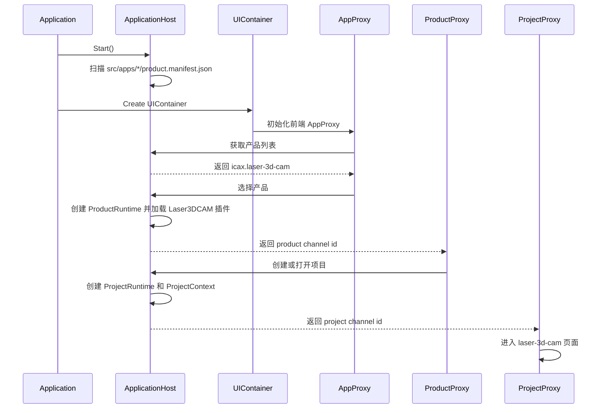
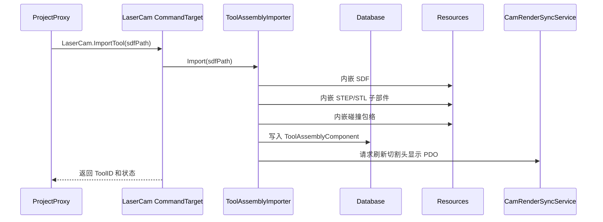
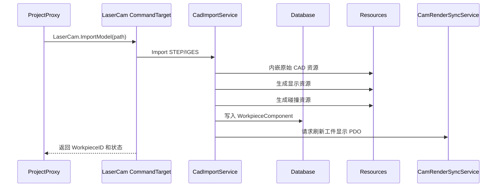
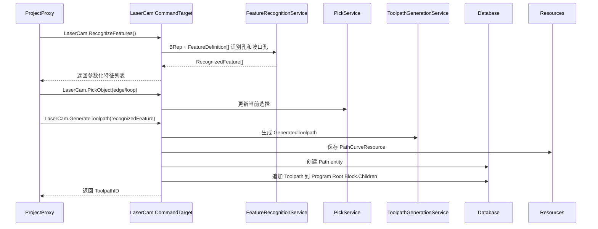
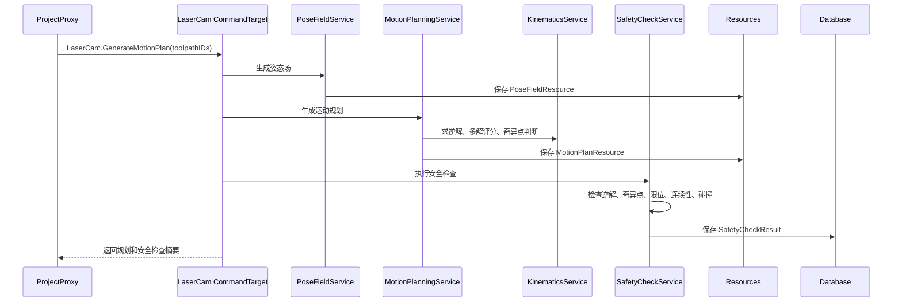
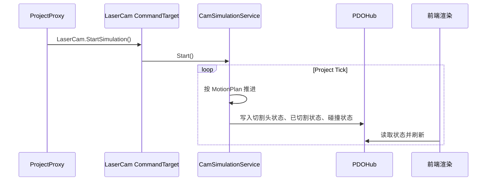

# 三维线条切割 CAM 产品方案文档

## 1. 文档定位

本文描述 `icax.laser-3d-cam` 产品在当前 iCAX 框架下的落地方案。

规格文档回答“产品要做什么”，本文回答“在现有 Application、Product、Project、Database、Resources、Mail、PDO、Service、Behaviour、UI SDK 体系中如何落地”。

本文只描述三维线条切割 CAM 产品方案。通用框架能力仍由 `iCAX-Engine`、`iCAX-UI` 和通用插件目录维护，产品专属逻辑不得写入 framework。

## 2. 设计原则

- Project 是数据边界，项目数据进入 Project.Database。
- 大资源和二进制资源进入 Project.Resources，并随项目文件内嵌保存。
- 产品逻辑进入 `src/iCAX-Plugins` 下的 CAM 插件，不进入 framework。
- 前端页面进入 `src/apps/laser-3d-cam/webpage`，只通过 AppProxy、ProductProxy、ProjectProxy 与后端交互。
- Mailbox 只传命令、状态和小型 JSON payload，不传大模型、大 mesh、大采样点。
- PDO 用于渲染、高频输入、仿真状态等高频或大块数据。
- H5 是当前前端形态，但产品页面不得绑定 H5 独有能力；未来 WPF/QT 前端只要实现同一 UI 契约即可替换。
- 工艺参数如功率、速度、气体、焦点、穿孔策略暂不进入 MVP，后续由切割系统侧或工艺模块处理。

## 3. 目标源码结构

产品定义和前端入口：

```text
src/apps/laser-3d-cam/
  product.manifest.json
  webpage/
    entry.mjs
    README.md
```

产品后端插件目标结构：

```text
src/iCAX-Plugins/cam/Laser3DCAM/
  Laser3DCAM.vcxproj
  Laser3DCAM.h
  Laser3DCAM.cpp
  Data/
    ToolpathComponents.h
    ToolpathResources.h
    LaserCamCommands.h
  Tool/
    ToolAssemblyImporter.h
    ToolAssemblyService.h
  Geometry/
    CadImportService.h
    FeatureRecognitionService.h
    PickService.h
  Toolpath/
    ToolpathGenerationService.h
    ToolpathQualityService.h
    ToolpathOrderService.h
  Motion/
    PoseFieldService.h
    KinematicsService.h
    MotionPlanningService.h
  Safety/
    SafetyCheckService.h
    CollisionSceneBuilder.h
  Simulation/
    CamSimulationService.h
  Render/
    CamRenderSyncService.h
```

产品后端目标应使用 `Laser3DCAM` 语义组织，避免以临时拓扑列表或演示仿真命名产品能力。

通用插件依赖：

```text
src/iCAX-Plugins/render/RenderData/
src/iCAX-Plugins/render/RenderPDO/
src/iCAX-Plugins/render/PDORenderService/
src/iCAX-Plugins/physics/ColliderData/
src/iCAX-Plugins/physics/ColliderService/
src/iCAX-Plugins/physics/JoltColliderService/
src/iCAX-Plugins/input/InputPDO/
```

## 4. 总体架构

```text
Application.exe
  -> CApplication
    -> CApplicationHost
      -> ProductRuntime(icax.laser-3d-cam)
        -> ProductContext
        -> ProductData
        -> Product Mail channel
        -> ProjectCatalog
          -> ProjectRuntime(main project)
            -> ProjectContext
              - Repository(Database)
              - ResourcePool
              - PDOHub
              - Mail channel
              - ServiceProvider
              - Universe
              - ProjectRuntimeScheduler
      -> FrontendBridge
        -> UIContainer(H5/CEF, future WPF/QT)
          -> AppProxy
            -> ProductProxy
              -> ProjectProxy
                -> laser-3d-cam webpage
```

后端职责：

- ApplicationHost 负责产品发现、产品选择、项目打开和项目创建。
- ProductRuntime 负责加载产品插件、产品级命令和产品级数据。
- ProjectRuntime 负责一个项目的数据库、资源、PDO、mail、service、universe 和 tick。
- Laser3DCAM 插件负责注册组件、资源、命令目标、服务和 behaviour。

前端职责：

- AppProxy 连接 ApplicationHost。
- ProductProxy 连接选中的产品。
- ProjectProxy 连接当前项目。
- 产品页面通过 ProjectProxy 发送项目命令，通过 PDO 读取渲染和高频状态。

## 5. 产品启动流程



## 6. Product Manifest

`product.manifest.json` 是产品入口。它定义产品 ID、产品名、项目文件 magic、后端插件和前端入口。

目标定义：

```json
{
  "schema": "icax.product.manifest",
  "schemaVersion": 1,
  "productId": "icax.laser-3d-cam",
  "productName": "三维线条切割 CAM",
  "productVersion": "0.1.0",
  "projectFile": {
    "magic": "ICAX_LASER_3D_CAM",
    "formatVersion": "0.1",
    "quickSaveLogMagic": "ICAX_LASER_3D_CAM_QSAVE",
    "quickSaveLogVersion": 1,
    "fileExtensions": [".i3cam"],
    "magicOffset": 0,
    "probeBytes": 256
  },
  "backend": {
    "modules": {
      "components": ["../../iCAX-Plugins/cam/Laser3DCAM/${Platform}/${Configuration}/Laser3DCAM.dll"],
      "commands": ["../../iCAX-Plugins/cam/Laser3DCAM/${Platform}/${Configuration}/Laser3DCAM.dll"],
      "services": ["../../iCAX-Plugins/cam/Laser3DCAM/${Platform}/${Configuration}/Laser3DCAM.dll"],
      "behaviours": ["../../iCAX-Plugins/cam/Laser3DCAM/${Platform}/${Configuration}/Laser3DCAM.dll"]
    }
  },
  "webpage": {
    "entry": "apps/laser-3d-cam/webpage/entry.mjs"
  }
}
```

`magic` 是 ApplicationHost 判断项目文件所属产品的唯一必须字段。扩展名只用于用户体验，不能作为产品识别依据。

## 7. 数据分层

### 7.1 Database

Database 保存项目主数据、可撤销还原数据和可快速保存的数据。

进入 Database 的数据：

- 项目坐标、单位和默认误差。
- 当前目标工件引用。
- 当前切割头引用。
- 图层。
- 已确认刀路。
- 刀路工艺。
- 刀路顺序。
- 五轴姿态场引用。
- 五轴运动规划结果引用。
- 安全检查结果。
- 仿真必要状态。

不进入 Database 的数据：

- 原始 STEP/IGES/SDF/STL 文件二进制。
- 大型 BRep、mesh、显示网格和碰撞网格。
- 几何内核运行时对象指针。
- 前端 hover 状态。

### 7.2 Resources

Resources 保存项目可复原资源，随项目文件内嵌。

资源类型：

- `CadModelResource`：目标工件 STEP/STP、IGS/IGES 原始资源。
- `ToolDescriptionResource`：SDF/SDFormat 原始资源。
- `ToolComponentModelResource`：切割头子部件 STEP/STP 或 STL 资源。
- `CollisionGeometryResource`：mesh 或包围盒碰撞包络。
- `PathCurveResource`：刀路曲线资源。
- `PoseFieldResource`：五轴姿态场采样或插值数据。
- `MotionPlanResource`：关节运动序列、空移段和蛙跳段。
- `DisplayMeshResource`：可丢弃显示缓存。

资源规则：

- 项目保存时必须内嵌 MVP 工作流恢复所需资源。
- `OriginalPath` 只能作为来源信息保存，不能作为恢复项目的唯一依据。
- 显示缓存可以保存，也可以重新生成。
- Runtime handle 不允许持久化。

### 7.3 PDO

PDO 保存前后端高频同步数据。

典型 PDO：

- 目标工件显示数据。
- 切割头显示和姿态数据。
- 刀路显示数据。
- 五轴姿态场显示数据。
- 空移和蛙跳路径显示数据。
- 安全检查和碰撞结果显示数据。
- 仿真切割头状态。
- 已切割路径状态。
- 前端高频输入状态。

### 7.4 Mailbox

Mailbox 保存命令交互。payload 使用 JSON 字符串表达，返回值也使用 JSON 字符串表达。

Mailbox 不传：

- 大模型。
- 大 mesh。
- 大采样点数组。
- 每帧状态。

## 8. 世界坐标和精度方案

产品内部采用统一的三维右手世界坐标系。除切割头机械结构内部数据外，Database、Resources、PDO 和命令参数中的 CAM 业务数据都按世界坐标表达。

单位：

- 长度：毫米。
- 角度：度。
- 时间：秒。

坐标规则：

- 目标工件导入时转换到世界坐标系。
- 刀路曲线、五轴姿态场、运动规划目标姿态、碰撞检测输入和仿真状态都使用世界坐标系。
- 切割头机械结构内部可以使用子部件局部坐标、关节坐标和 TCP；这些坐标只在切割头机械模型模块内解释。
- 工件零点、真实机床坐标系和控制系统坐标转换只属于后处理/输出阶段，不进入当前 CAM 主数据。

误差：

- 刀路相对目标几何的默认最大几何偏差为 `0.001 mm`。
- 候选特征转刀路、曲线拟合、姿态场采样、运动规划采样都以 `0.001 mm` 为默认几何误差目标。
- 渲染网格可以低精度，但不能作为刀路和运动规划的权威几何来源。

## 9. 核心数据结构

### 9.1 ProjectContext 设置扩展

```text
ProjectContext
  Settings
    common
      UnitLength = Millimeter
      UnitAngle = Degree
      UnitTime = Second
      DefaultGeometryTolerance = 0.001
    extensions
      icax.laser-3d-cam
        SettingsBag
        Version
```

ProjectContext 只提供项目级统一 settings 入口，不直接包含 Laser3DCAM 专属字段。图纸加载器或产品插件把需要跟随项目文件保存的项目级参数写入 `ProjectContext.Settings()`。Laser3DCAM 的产品级应用参数属于 ProductContext / ProductData，不进入 ProjectContext。会被用户作为对象管理的数据仍然进入 Repository。

### 9.2 目标工件组件

```text
WorkpieceEntity
  CLaserWorkpieceComponent

CLaserWorkpieceComponent
  Name
  SourcePath
  ModelResourceID
  TopologyResourceID
  DisplayResourceID
  TopologyVersion
```

目标工件只支持 STEP/STP、IGS/IGES。STL 不作为目标工件导入格式。

### 9.3 切割头组件

```text
CLaserCamToolAssemblyComponent
  ToolID
  ToolName
  ToolDescriptionResourceID
  ToolAssemblyResourceID
  ToolAssemblyToProjectTransform
  ActiveTCPID
  Version
```

切割头运行时结构：

```text
ToolAssembly
  ToolComponent[]
  Joint[]
  TCP[]
  BeamAxis
  Parameters
  CollisionGeometry[]
```

```text
ToolComponent
  ComponentID
  Name
  ParentComponentID
  ModelResourceID
  LocalTransform
  CollisionResourceID
```

```text
Joint
  JointID
  ParentComponentID
  ChildComponentID
  JointType(Fixed/Revolute/Prismatic)
  Axis
  Origin
  DefaultValue
  MinValue
  MaxValue
```

### 9.4 CuttingLayer 与 VisibleLayer

图层拆成两类，不混用：

```text
CuttingLayerEntity
  CLaserCamCuttingLayerComponent

CLaserCamCuttingLayerComponent
  Name
  CuttingProcessID
  CuttingProcessName
  Enabled
  OutputOrder
```

CuttingLayer 面向切割系统，用于加工工艺分组。不同 CuttingLayer 可以映射到切割系统中不同的加工工艺；iCAX 当前只保存切割系统可识别的工艺 ID 和名称。

```text
VisibleLayerEntity
  CLaserCamVisibleLayerComponent

CLaserCamVisibleLayerComponent
  Name
  Color
  Visible
  Locked
  Order
```

VisibleLayer 面向前端显示，用于颜色、显隐和选择过滤，不表达切割工艺。

### 9.5 加工程序节点、块和刀路

加工程序按树组织。Block 是容器，Toolpath 是实际运动叶子。Block 和 Toolpath 都继承共同的程序节点字段：

```text
CCAMProgramNodeComponent
  Name
  PreInstructions[]
  PostInstructions[]
```

`PreInstructions[]` 和 `PostInstructions[]` 的元素是结构化的 `CamInstruction`：

```text
CamInstruction
  Type        // Comment / RawNC / MCode / GCode / Process / Dwell / Custom
  Code        // 指令码或产品内部动作码，如 M03、G04、LaserOn
  Text        // 注释文本或原始 NC 文本
  Parameters  // ObjectMap，保存功率、延时、气体等结构化参数
  Enabled
```

注释统一表达为 `Type=Comment` 的指令。前置或后置由所在数组表达，指令顺序由数组顺序表达，指令对象内部不重复保存 stage 或 order。

根节点不是单独的全局静态对象，而是由 `CLaserCamRootComponent.ProgramRootBlockID` 指向的普通 Block Entity：

```text
ProgramRootBlockEntity
  CCAMBlockComponent

CCAMBlockComponent : CCAMProgramNodeComponent
  Children[]
```

`Children[]` 是有序数组，每项保存：

```text
ProgramChild
  Kind      // block 或 path
  EntityID  // 子 Block 或 Toolpath 的 EntityID
```

每条真实运动刀路是一个 Path Entity：

```text
PathEntity
  CCAMPathComponent

CCAMPathComponent : CCAMProgramNodeComponent
  WorkpieceEntityID
  CuttingLayerID
  VisibleLayerID
  PathKind
  TopologyKind
  TopologyID
  Source
  Operation
  Role
  CurveResourceID
  PoseFieldResourceID
```

执行顺序由 Block 的 `Children[]` 决定，不由 Path 自身保存全局排序。一个加工文件天然就是根 Block；文件级前置指令和后置指令直接挂在根 Block 的 `PreInstructions[]` 和 `PostInstructions[]` 上。

```text
ToolpathQualitySummary
  AccuracyState
  MaxDeviationInMillimeter
  ContinuityLevel
  MinCurvatureRadius
  CurvatureRadiusSmoothness
```

### 9.6 刀路曲线资源

```text
PathCurveResource
  TopologyKind
  TopologyID
  SourceTopology
  Segments[]
  Version
```

曲线段：

```text
LineSegment3
ArcSegment3
PolylineSegment3
EllipseSegment3
CubicBSplineSegment3
BezierSegment3
```

刀路曲线资源是 CAM 的权威曲线数据。资源本身只保存曲线数据和可选来源拓扑快照，不反向保存所属 Workpiece 或 Path。工件归属由 `CCAMPathComponent.WorkpieceEntityID` 表达，刀路到曲线资源的引用由 `CCAMPathComponent.CurveResourceID` 表达。CAD 拓扑引用只是可选来源信息。

### 9.7 工艺数据

MVP 工艺只包含微联、引线和引出。

```text
ToolpathProcess
  MicroJoint[]
  LeadIn
  LeadOut
```

```text
MicroJoint
  CurveParameter
  Length
```

```text
LeadInOut
  Type(Line/Arc)
  Length
  Radius
  Angle
```

激光功率、速度、气体、焦点、穿孔策略暂不进入当前方案。

### 9.8 姿态场资源

```text
PoseFieldResource
  Version
  Sample[]
```

```text
PoseSample
  SegmentIndex
  SegmentU
  BeamDirection
```

MVP 采用离散采样表达，后续可扩展为连续姿态函数。PoseFieldResource 是纯数据资源，不保存 ToolpathID、CurveResourceID、CurveVersion 或 PoseFieldID 这类反向关系。资源身份由 ResourcePool key 表达；刀路通过 `CCAMPathComponent.PoseFieldResourceID` 引用姿态场；曲线与姿态场的对应关系由同一个 `CCAMPathComponent` 同时持有 `CurveResourceID` 和 `PoseFieldResourceID` 维护。

采样点使用 `SegmentIndex + SegmentU` 绑定复合曲线中的曲线段和该段原生参数。`BeamDirection` 使用世界坐标。采样点位置不持久化在 PoseFieldResource 中，而是由曲线资源按 `SegmentIndex + SegmentU` 求值获得。姿态场不保存 TCP 字段、完整机械姿态或关节值。

### 9.9 运动规划资源

```text
MotionPlanResource
  Version
  LeadInSelection
  CuttingDirection
  CuttingSamples[]
  AirMoveSegments[]
  FrogJumpSegments[]
  IKCheckResult
  SingularityCheckResult
  JointLimitCheckResult
  ContinuityCheckResult
  CollisionCheckResult
```

MotionPlanResource 只保存运动规划结果本体，不保存自己的 ResourceID，也不反向保存 ToolpathID。与刀路、程序块或工程状态的关联由 Database 组件保存 ResourceID 来表达。

```text
MotionSample
  SegmentID
  SegmentIndex
  SegmentU
  Position
  Orientation
  JointValues[]
  MotionKind(Cutting/AirMove/FrogJump)
  IKState
  IsNearSingularity
```

### 9.10 安全检查结果

```text
SafetyCheckResult
  Passed
  IKFailure[]
  SingularityRisk[]
  JointLimitViolation[]
  MotionDiscontinuity[]
  CollisionEvent[]
```

```text
CollisionEvent
  SampleOrPosition
  MotionSampleIndex
  MotionKind
  ObjectA
  ObjectB
  ResultType(ClearanceTooSmall/Intersected)
  ContactPoint
  PenetrationDepth
  MinDistance
```

### 9.11 仿真状态

```text
SimulationState
  IsPlaying
  CurrentToolpathID
  CurrentSegmentID
  CurrentMotionKind
  CurrentSegmentIndex
  CurrentSegmentU
  CurrentPositionInWorldCS
  CurrentOrientationInWorldCS
  CurrentJointValues[]
  CurrentCollisionState
  CompletedToolpathIDs[]
```

仿真播放位置属于运行时状态，不要求持久化。

## 10. 服务设计

服务从 ProjectContext 获取 Repository、Resources、PDOHub、MailChannel、ServiceProvider 和 Universe。

### 10.1 ToolAssemblyImporter

职责：

- 读取 SDF/SDFormat。
- 解析 link、joint、pose、visual、collision。
- 解析 iCAX 扩展字段：TCP、BeamAxis、喷嘴、安全距离、最大摆角。
- 收集子部件 STEP/STP、STL 资源。
- 生成 ToolAssembly 运行时结构。
- 写入切割头组件和相关资源。

### 10.2 CadImportService

职责：

- 导入 STEP/STP、IGS/IGES 目标工件。
- 保存原始 CAD 文件为内嵌资源。
- 构建显示资源和碰撞资源。
- 将导入几何转换到项目世界坐标。
- 为后续识别和拾取提供几何访问能力。

### 10.3 FeatureRecognitionService

职责：

- 输入 BRep 模型资源和 FeatureDefinition。
- 从目标工件识别孔、坡口孔、外轮廓等参数化特征。
- 输出 RecognizedFeature，包含 path、depth、axis、direction、radius、bevelType 等参数化信息。
- RecognizedFeature 可以保留 BRep 来源引用，但不是刀路主身份。
- 识别失败不阻断手动拾取。

### 10.4 PickService

职责：

- 根据前端输入和后端拾取数据确定 edge/loop。
- 更新当前选择。
- 支持选择过滤器。
- 不把 hover 作为持久化数据。

### 10.5 ToolpathGenerationService

职责：

- 将 RecognizedFeature 转为三维空间曲线。
- 支持 line、arc、polyline、ellipse、三阶 B 样条和 Bezier。
- 控制默认最大几何偏差 `0.001 mm`。
- 输出 GeneratedToolpath，由 CommandHandler 写入 PathCurveResource、PathEntity 和 Block.Children。
- 不让刀路主身份依赖 CAD 拓扑。

### 10.6 PoseFieldService

职责：

- 沿刀路生成五轴姿态场。
- 表达世界坐标下的刀路位置、姿态和激光束方向。
- 不在姿态场中缓存关节值。
- 输出 PoseFieldResource。

### 10.7 KinematicsService

职责：

- 根据 ToolAssembly 和世界坐标下的目标切割姿态求逆解。
- 处理多解选择。
- 识别无逆解、超限、跳变和奇异点。
- 对多解进行评分。

多解评分优先级：

```text
必须满足：关节限位、目标姿态误差、碰撞基本约束
优先选择：远离奇异点、远离限位、与上一状态变化小、姿态调整平滑
```

### 10.8 MotionPlanningService

职责：

- 根据刀路、姿态场、顺序计划和切割头机械结构生成运动规划。
- 为闭合刀路或可反向刀路选择下刀点。
- 选择刀路方向。
- 生成切割段。
- 生成空移段，并在空移过程中调整姿态。
- 必要时生成蛙跳段。
- 输出 MotionPlanResource。

下刀点选择目标：

- 减少抬刀。
- 减少空移长度。
- 减少姿态大幅变化。
- 减少接近奇异点的概率。
- 减少碰撞风险。

蛙跳策略：

- 普通空移存在碰撞或安全距离不足时，尝试生成蛙跳。
- 蛙跳由抬高、水平迁移、下降三个阶段组成。
- 蛙跳也必须参与逆解、连续性、限位和碰撞检查。

### 10.9 SafetyCheckService

职责：

- 检查逆解结果。
- 检查奇异点风险。
- 检查关节限位。
- 检查运动连续性。
- 检查完整碰撞。
- 输出 SafetyCheckResult。

完整碰撞范围：

- 切割头碰撞包络与工件模型。
- 切割头自身非相邻运动部件。
- 切割头碰撞包络与项目静态障碍物。
- 切割段、空移段和蛙跳段。

### 10.10 CollisionSceneBuilder

职责：

- 为每个 Project 构建独立碰撞场景。
- 将工件、切割头子部件、碰撞包络、静态障碍物转换为 ColliderData。
- 调用 ColliderService 或 JoltColliderService 执行检测。

### 10.11 CamSimulationService

职责：

- 按 MotionPlanResource 播放切割头机械模型。
- 更新仿真状态。
- 标记已切割刀路。
- 输出切割头状态、已切割状态和碰撞状态到 PDO。

### 10.12 CamRenderSyncService

职责：

- 将 Database 和 Resources 中的渲染相关状态同步到 RenderPDO。
- 分配和释放 PDO slot。
- 将 PDO slot 创建、释放、整理后的映射通过 mail 通知前端。
- 不直接维护产品主数据。

## 11. 命令设计

命令按主命令 `LaserCam` 聚合，避免一个命令一个类。

命令命名：

```text
LaserCam.GetScene
LaserCam.ImportTool
LaserCam.ImportModel
LaserCam.RecognizeFeatures
LaserCam.PickObject
LaserCam.GenerateToolpath
LaserCam.UpdateToolpathProcess
LaserCam.UpdateLayer
LaserCam.PlanOrder
LaserCam.GeneratePoseField
LaserCam.GenerateMotionPlan
LaserCam.RunSafetyCheck
LaserCam.StartSimulation
LaserCam.PauseSimulation
LaserCam.ResumeSimulation
LaserCam.StopSimulation
LaserCam.ResetSimulation
```

命令原则：

- 命令只走 Mailbox。
- payload 是 JSON 字符串。
- 大对象通过 ResourceID 或 PDO slot 引用。
- 命令处理者只修改 Database 和 Resources，不直接修改前端状态。
- 前端收到返回后更新界面，必要时再读取 PDO。

## 12. 核心时序

### 12.1 导入切割头



### 12.2 导入目标工件



### 12.3 识别或拾取生成刀路



### 12.4 运动规划和安全检查



### 12.5 仿真



## 13. 前端方案

前端采用单页工作台。

布局：

```text
顶部工具栏
  新建/打开/保存/导入刀具/导入模型/识别/生成刀路/规划/安全检查/仿真

左侧流程区
  刀具
  模型
  识别与拾取
  刀路
  图层
  顺序
  仿真

中央三维视图区
  工件模型
  切割头
  候选特征
  刀路
  姿态场
  空移路径
  蛙跳路径
  碰撞和安全检查标记

右侧属性区
  当前选中对象属性

底部数据区
  刀路列表
  安全检查列表
  仿真状态
```

前端数据原则：

- 前端不保存项目主数据。
- 前端 UI 状态可以本地保存，如面板展开、临时筛选、视图相机。
- 业务修改必须通过 ProjectProxy 发命令给后端。
- 三维显示数据通过 PDO 或 RenderData 读取。
- 鼠标键盘高频输入通过 InputPDO 同步给后端。

## 14. 渲染和 PDO 方案

H5 当前使用 Three.js 或等价 WebGL 渲染实现。

后端输出：

- RenderData 定义显示数据结构。
- RenderPDO 定义 PDO 布局。
- PDORenderService 负责将项目中的显示数据写入 PDO。
- CamRenderSyncService 负责将 CAM 业务对象转换为 RenderData。

前端读取：

- ProjectProxy 接收 PDO slot 分配和释放通知。
- UI SDK 的 PDO client 读取共享数据。
- H5 页面根据 PDO 内容创建或更新 WebGL 对象。

slot 规则：

- 一个可独立变换的显示对象对应一个 PDO slot。
- 大对象创建、删除、slot 迁移通过 mail 通知前端。
- 高频变换、颜色、状态通过 PDO 更新。

## 15. 碰撞方案

碰撞检测作为项目级服务运行。

多场景处理：

- 每个 ProjectRuntime 拥有自己的 ProjectContext。
- 每个 ProjectContext 拥有独立 ResourcePool、PDOHub 和 ServiceProvider。
- CollisionSceneBuilder 基于 ProjectContext 构建本项目的碰撞场景。
- JoltColliderService 内部可维护多个 scene，但 scene ID 必须由 ProjectRuntime 或 ProjectContext 绑定。

碰撞数据来源：

- 工件碰撞资源。
- 切割头子部件碰撞包络。
- 项目静态障碍物。
- 运动规划采样点和关节状态。

碰撞检测范围：

- 切割头与工件。
- 切割头自碰撞。
- 切割头与静态障碍物。
- 切割段、空移段、蛙跳段。

碰撞结果进入 SafetyCheckResult，并通过 PDO 显示到前端。

## 16. 持久化方案

项目文件包含：

- 文件头 magic。
- 项目 schema/version。
- Database 快照。
- 内嵌资源包。
- 必要索引。

保存规则：

- Database 中保存资源 ID。
- Resources 中保存资源内容。
- 外部路径仅作为来源信息。
- 重新打开项目时，不要求原始外部文件存在。
- QuickSave 日志记录 Database 操作日志；资源新增或替换应在保存点纳入资源包。

需要持久化：

- ProjectContext settings。
- 目标工件资源。
- 切割头资源。
- 图层。
- 刀路和刀路曲线。
- 工艺。
- 顺序。
- 姿态场。
- 运动规划。
- 安全检查结果。

不需要持久化：

- hover。
- 当前仿真播放位置。
- 视图相机。
- 临时显示缓存。

## 17. 撤销还原

撤销还原基于 Database 操作日志实现。

应支持撤销还原：

- 导入或切换切割头。
- 导入目标工件。
- 生成或删除刀路。
- 修改图层。
- 修改刀路工艺。
- 修改刀路顺序。
- 生成或更新姿态场。
- 生成或更新运动规划。
- 更新安全检查结果。

不支持撤销还原：

- hover。
- 仿真播放位置。
- 临时视图状态。

资源变更与 Database 操作应保持一致：Database 引用了新的 ResourceID 时，该资源必须能随项目保存恢复。

## 18. 分阶段落地

### 18.1 第一阶段：产品骨架

- 调整产品插件命名和目录。
- manifest 指向 Laser3DCAM 插件。
- 注册 CAM 组件、资源和 `LaserCam` 命令目标。
- 前端形成完整工作台布局。

### 18.2 第二阶段：资源和导入

- 导入 SDF/SDFormat 切割头。
- 内嵌 SDF、STEP/STL 子部件和碰撞包络。
- 导入 STEP/STP、IGS/IGES 目标工件。
- 内嵌目标工件资源。
- 显示工件和切割头。

### 18.3 第三阶段：识别、拾取和刀路

- 支持 edge/loop 拾取。
- 支持孔和坡口孔识别。
- 生成空间曲线刀路。
- 输出 `0.001 mm` 几何偏差目标下的质量摘要。
- 支持图层、微联、引线和引出。

### 18.4 第四阶段：五轴规划

- 生成五轴姿态场。
- 实现逆解、多解选择、奇异点识别。
- 选择下刀点和切割方向。
- 生成空移段和蛙跳段。
- 输出运动规划资源。

### 18.5 第五阶段：安全检查和仿真

- 构建项目级碰撞场景。
- 完成完整碰撞检测。
- 输出安全检查结果。
- 基于切割头机械模型进行仿真。
- 通过 PDO 同步仿真状态和碰撞状态。

## 19. 主要风险

- SDF/SDFormat 对 STEP 子部件模型的表达需要 iCAX 扩展字段约定。
- STEP/IGES 几何质量会影响 edge/loop 识别和刀路拟合。
- 五轴逆解、多解选择和奇异点处理是产品成败关键。
- 蛙跳路径需要与碰撞、限位、连续性共同计算，不能只作为显示线。
- 项目文件内嵌资源会增大文件体积，需要后续考虑压缩和增量保存。
- H5 渲染百万级 mesh 可以接受，但需要显示网格降采样和按需更新。

## 20. 文档对应关系

- 产品规格：[三维线条切割CAM产品规格文档.md](./三维线条切割CAM产品规格文档.md)
- 产品方案：本文档。
- 产品入口：`src/apps/laser-3d-cam/product.manifest.json`
- 产品前端：`src/apps/laser-3d-cam/webpage/`
- 产品后端目标插件：`src/iCAX-Plugins/cam/Laser3DCAM/`
