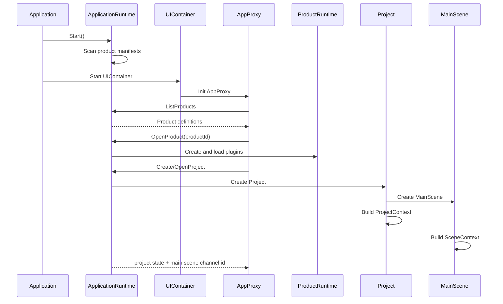

# 01 产品运行与模块边界详细设计

## 1. 模块定位

本模块定义三维线条切割 CAM 产品在 iCAX 运行体系中的生命周期、模块边界和依赖方向。

目标是保证产品扩展只发生在产品插件和产品页面内，不污染通用 framework。

## 2. 参与对象

```text
Application.exe
  -> CApplication
    -> CApplicationRuntime
      -> ProductRuntime(icax.laser-3d-cam)
        -> ProductContext
        -> ProductData
        -> ProjectCatalog
          -> Project
            -> ProjectContext
              -> ProjectSetting
              -> MainScene
                -> SceneContext
                -> Repository
                -> ResourcePool
                -> PDOHub
                -> FacadeChannel
                -> Universe
                -> SceneScheduler
      -> FrontendBridge
        -> UIContainer
          -> AppProxy
          -> ProductProxy
          -> ProjectProxy
          -> SceneProxy
```

## 3. 职责边界

ApplicationRuntime：

- 扫描产品 manifest。
- 根据 magic 判断项目文件所属产品。
- 创建 ProductRuntime。
- 创建和关闭 ProductRuntime。
- 暴露 Application 级 Facade channel。

ProductRuntime：

- 持有 ProductContext。
- 加载产品插件。
- 注册产品级 ComponentMeta、Behaviour、Service、Facade。
- 持有 ProductData，例如最近打开项目列表、产品级用户参数。

Project：

- 持有 ProjectContext。
- 管理 ProjectSetting、主 Scene 和子 Scene。
- 不直接拥有 Repository、ResourcePool、PDOHub、FacadeChannel 或 Universe。

Scene：

- 持有 SceneContext。
- 拥有独立 Repository、ResourcePool、PDOHub、FacadeChannel 和 Universe。
- 拥有自己的 tick 调度。
- 一个 Scene 的数据状态与其他 Scene 隔离。

Laser3DCAM 插件：

- 注册产品组件和资源契约。
- 注册 `LaserCam` 命令目标。
- 注册产品级 service、behaviour 和 command target。
- 实现 CAM 业务流程。

前端页面：

- 展示工作台。
- 通过 AppProxy、ProductProxy、SceneProxy 发送命令。
- 从 PDO 读取渲染和仿真高频数据。
- 不直接持有项目主数据。

## 4. 启动流程



## 5. 依赖方向

允许：

- 产品插件依赖 framework。
- 产品插件依赖通用 render、physics、input 插件契约。
- 产品页面依赖 iCAX-UI SDK。
- ProductRuntime 创建 Project，Project 创建 MainScene。

不允许：

- framework 依赖 Laser3DCAM。
- 通用插件写入 Laser3DCAM 的业务字段。
- 前端绕过 SceneProxy 直接修改后端数据。
- 产品插件保存私有项目状态而不进入 Database/Resources。

## 6. 线程模型

- 后端 Scene 在自己的场景线程中运行。
- 前端运行在 UI 线程或 WebView/CEF 对应线程。
- 前端与后端通过 Facades 异步通信。
- 高频数据通过 PDO 交换。
- ProductRuntime 可以有产品级 channel，但项目数据命令必须进入对应 Scene 的 scene channel。

## 7. 失败处理

- 产品插件加载失败：ProductRuntime 创建失败，并返回产品不可用状态。
- 项目创建失败：ApplicationRuntime 返回失败，不创建半初始化 Project 或 Scene。
- Scene 关闭：先停止 tick，再停止 behaviour，再释放 PDO 和资源。
- 命令执行失败：命令返回结构化失败信息，不修改不完整数据。

## 8. 验收点

- 前端可以列出 `icax.laser-3d-cam`。
- 选择产品后能创建 ProductRuntime。
- 创建项目后能得到 main scene channel id。
- Scene 拥有独立 Repository、Resources、PDOHub、FacadeChannel。
- 产品命令只在 scene channel 中处理项目数据。
