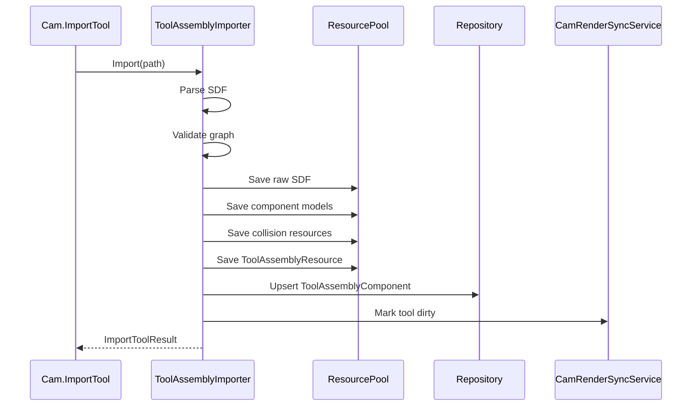

# 04 SDF 解析与刀具导入详细设计

## 1. 模块定位

SDF 解析与刀具导入模块负责把外部 SDF/SDFormat 切割头描述文件转换为 iCAX 内部 `ToolAssembly` 数据，并把所有依赖资源内嵌到项目。

## 2. 模块边界

负责：

- 解析 SDF model/link/joint/pose。
- 解析 visual/collision。
- 解析 iCAX 扩展字段。
- 收集 STEP/STP、STL 子部件资源。
- 校验机械结构。
- 生成 ToolAssemblyResource。
- 写入 ToolAssemblyComponent。

不负责：

- 运动规划。
- 逆解。
- 碰撞求解。
- 前端显示细节。

## 3. SDF 映射

```text
SDF model      -> ToolAssembly
SDF link       -> ToolComponent
SDF joint      -> Joint
SDF pose       -> Transform
SDF visual     -> ModelResourceID
SDF collision  -> CollisionResourceID
iCAX tcp       -> TCP
iCAX beamAxis  -> BeamAxis
iCAX params    -> ToolParameters
```

## 4. iCAX 扩展字段

建议扩展字段：

```xml
<icax:tool>
  <icax:tcp name="main" link="nozzle">
    <icax:pose>0 0 0 0 0 0</icax:pose>
    <icax:beam_axis>0 0 1</icax:beam_axis>
  </icax:tcp>
  <icax:parameters>
    <icax:nozzle_length unit="mm">120</icax:nozzle_length>
    <icax:nozzle_radius unit="mm">8</icax:nozzle_radius>
    <icax:focus_offset unit="mm">0</icax:focus_offset>
    <icax:safe_distance unit="mm">5</icax:safe_distance>
    <icax:max_swing_angle unit="deg">45</icax:max_swing_angle>
  </icax:parameters>
</icax:tool>
```

## 5. 解析流程

```text
1. 读取 SDF 文件
2. XML 解析
3. 定位 model
4. 解析 link
5. 解析 joint
6. 解析 visual/collision URI
7. 解析 iCAX 扩展字段
8. 收集外部资源
9. 校验装配树
10. 生成 ToolAssembly
11. 写入 ResourcePool
12. 写入 Database
13. 触发渲染同步
```

## 6. 校验规则

必须通过：

- 只有一个根 link。
- link ID 唯一。
- joint ID 唯一。
- joint parent 和 child 都存在。
- 装配树无环。
- joint type 属于 Fixed/Revolute/Prismatic。
- revolute/prismatic 必须有有效轴。
- revolute/prismatic 必须有 min/max。
- 至少存在一个 TCP。
- TCP 所属 link 存在。
- TCP Z 轴与 BeamAxis 约定一致。
- visual/collision 引用资源能读取。

## 7. 资源内嵌

导入后必须内嵌：

- SDF 原始文件。
- STEP/STP 子部件模型。
- STL 子部件模型。
- collision mesh。
- 包围盒描述。

保存：

```text
ToolDescriptionResource
ToolComponentModelResource[]
CollisionGeometryResource[]
ToolAssemblyResource
```

## 8. 错误返回

错误结构：

```text
ImportToolResult
  Success
  ToolID
  ErrorCode
  Message
  Detail[]
```

典型错误：

- `SdfFileNotFound`
- `SdfXmlInvalid`
- `NoModel`
- `MissingLink`
- `MissingJointTarget`
- `JointGraphHasCycle`
- `MissingTCP`
- `InvalidBeamAxis`
- `ExternalResourceNotFound`

## 9. 时序



## 10. 测试点

- 合法 SDF 可以生成 ToolAssembly。
- 缺 TCP 导入失败。
- joint parent 不存在导入失败。
- 装配树有环导入失败。
- STEP/STL 子部件资源被内嵌。
- 保存重开后不依赖原始外部文件。
