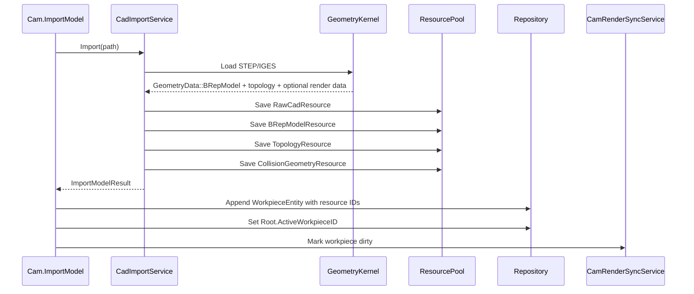

# 05 CAD 模型导入与资源内嵌详细设计

## 1. 模块定位

CAD 模型导入模块负责导入目标工件几何，生成项目内可复原资源，并为识别、拾取、显示和碰撞提供数据来源。

目标工件模型只支持：

- STEP/STP。
- IGS/IGES。

STL 不作为目标工件导入格式。

## 2. 模块边界

负责：

- 读取 STEP/STP、IGS/IGES 文件。
- 判断或确认单位。
- 内嵌原始 CAD 资源。
- 生成中立 BRep 资源。
- 生成可拾取拓扑索引资源。
- 将导入几何转换到项目世界坐标。
- 可选生成或标记 render 插件使用的显示数据。
- 生成碰撞资源。
- 返回资源 ID 和版本。

不负责：

- 刀路生成。
- 特征识别算法本身。
- 运动规划。
- 后处理输出坐标转换。
- 直接写入 Repository 或创建 Workpiece Entity。

## 3. 数据结构

```text
RawCadResource
  ResourceID
  FileType(STEP/IGES)
  OriginalPath
  ContentHash
  BinaryContent
  Unit
  Metadata
```

```text
BRepModelResource
  ResourceID
  GeometryData::BRepModel
  SourceModelVersion
  Unit
  Metadata
```

```text
TopologyResource
  ResourceID
  Faces[]
  Loops[]
  Edges[]
  SourceBRepVersion
```

```text
WorkpieceEntity
  CLaserWorkpieceComponent

CLaserWorkpieceComponent
  Name
  SourcePath
  ModelResourceID
  BRepResourceID
  TopologyResourceID
  DisplayResourceID
  TopologyVersion
```

```text
CollisionGeometryResource
  ResourceID
  GeometryKind(Mesh/Box)
  MeshData
  BoxData
  SourceVersion
```

## 4. 导入流程

```text
1. 校验文件扩展名
2. 读取文件二进制
3. 识别 CAD 类型
4. 调用几何内核导入
5. 解析单位
6. 读取源模型坐标和单位
7. 将几何转换到项目世界坐标
8. 内嵌 RawCadResource
9. 生成 BRepModelResource
10. 生成 TopologyResource
11. 可选生成或标记 render 显示数据
12. 生成 CollisionGeometryResource
13. 返回资源 ID 和版本
14. `Cam.ImportModel` 追加 Workpiece Entity，并把它设为 `Root.ActiveWorkpieceID`
15. 后续渲染同步服务根据 Workpiece 和可选 DisplayResourceID 更新显示
```

## 5. 单位策略

- 文件明确单位：按文件单位转换到毫米。
- 文件未明确单位：命令返回 `NeedUnitConfirmation`，由前端要求用户确认。
- 用户确认后，保存单位到 RawCadResource.Metadata 或 BRepModelResource.Metadata。
- 不允许静默猜测单位。

## 6. 几何内核边界

产品允许底层使用 OCC、CGAL 或其他几何库，但核心数据契约不暴露具体内核对象。

当前落地实现使用 Open CASCADE Technology 8.0.0-p1 作为 STEP/IGES 导入内核。OCCT 只存在于 `ICadImportService` 的实现内部，导入完成后必须转换为 `GeometryData::BRepModel`、`TopologyResource` 和资源元数据。

运行时可以缓存：

```text
RuntimeBRepHandle
RuntimeTopoIndex
RuntimeMeshingCache
```

这些对象不得持久化。

## 7. 显示网格

显示网格用于前端渲染，不作为 CAM 权威几何，也不作为 Laser3DCAM 私有资源类型。

生成要求：

- 可降采样。
- 可分块。
- 可按需更新。
- 可以通过 PDO 传给前端。
- 具体数据结构复用 render 插件的 RenderData/PDO 契约；CAM 侧只保存可选显示对象 ID。

## 8. 碰撞资源

MVP 可以从 CAD 模型生成简化碰撞 mesh。

规则：

- 碰撞 mesh 可以比显示 mesh 更粗。
- 安全检查不能用显示 mesh 代替碰撞资源。
- 碰撞资源应带 SourceVersion。

## 9. 时序



## 10. 失败处理

- 文件不存在：失败。
- 文件类型不支持：失败。
- 单位未知：返回需要确认，不写入项目。
- 几何内核导入失败：失败。
- mesh 生成失败：模型可导入但显示状态标记失败。
- 碰撞资源生成失败：模型可导入但安全检查不可执行。

## 11. 测试点

- STEP 导入后生成 RawCadResource、BRepModelResource、TopologyResource。
- IGES 导入后生成 RawCadResource、BRepModelResource、TopologyResource。
- STL 作为目标工件导入失败。
- 原始文件删除后项目仍可打开并恢复模型资源。
- WorkpieceComponent 不保存内核指针。
- 连续导入两个 STEP/IGES 文件后，应存在两个 Workpiece Entity，第二个为当前激活工件，第一个不被删除。
