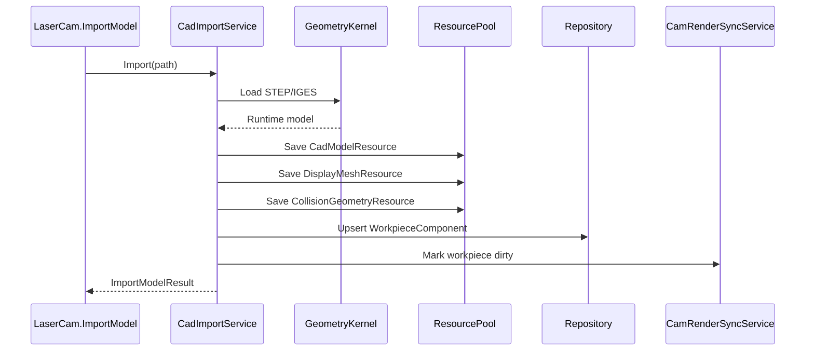

# 05 CAD 模型导入与资源内嵌详细设计

## 1. 模块定位

CAD 模型导入模块负责导入目标工件几何，生成项目内可复原资源，并为识别、拾取、显示和碰撞提供数据来源。

目标工件模型只支持：

- STEP/STP。
- IGS/IGES。

STL 不作为目标工件导入格式。

## 2. 模块边界

负责：

- 读取 STEP/STP、IGS/IGES 文件。
- 判断或确认单位。
- 内嵌原始 CAD 资源。
- 建立 `ModelCS -> ProjectCS` 变换。
- 生成显示资源。
- 生成碰撞资源。
- 写入 WorkpieceComponent。

不负责：

- 刀路生成。
- 特征识别算法本身。
- 运动规划。
- 真实机床坐标系。

## 3. 数据结构

```text
CadModelResource
  ResourceID
  FileType(STEP/IGES)
  OriginalPath
  ContentHash
  BinaryContent
  Unit
  Metadata
```

```text
CLaserCamWorkpieceComponent
  WorkpieceID
  Name
  SourcePath
  CadModelResourceID
  DisplayMeshResourceID
  CollisionGeometryResourceID
  ModelToProjectTransform
  Version
```

```text
DisplayMeshResource
  ResourceID
  VertexBuffer
  IndexBuffer
  NormalBuffer
  Color
  SourceVersion
```

```text
CollisionGeometryResource
  ResourceID
  GeometryKind(Mesh/Box)
  MeshData
  BoxData
  SourceVersion
```

## 4. 导入流程

```text
1. 校验文件扩展名
2. 读取文件二进制
3. 识别 CAD 类型
4. 调用几何内核导入
5. 解析单位
6. 建立 ModelCS
7. 建立 ModelCS -> ProjectCS
8. 内嵌 CadModelResource
9. 生成 DisplayMeshResource
10. 生成 CollisionGeometryResource
11. 写入 WorkpieceComponent
12. 通知渲染同步
```

## 5. 单位策略

- 文件明确单位：按文件单位转换到毫米。
- 文件未明确单位：命令返回 `NeedUnitConfirmation`，由前端要求用户确认。
- 用户确认后，保存单位到 CadModelResource.Metadata。
- 不允许静默猜测单位。

## 6. 几何内核边界

产品允许底层使用 OCC、CGAL 或其他几何库，但核心数据契约不暴露具体内核对象。

运行时可以缓存：

```text
RuntimeBRepHandle
RuntimeTopoIndex
RuntimeMeshingCache
```

这些对象不得持久化。

## 7. 显示网格

显示网格用于前端渲染，不作为 CAM 权威几何。

生成要求：

- 可降采样。
- 可分块。
- 可按需更新。
- 可以通过 PDO 传给前端。

## 8. 碰撞资源

MVP 可以从 CAD 模型生成简化碰撞 mesh。

规则：

- 碰撞 mesh 可以比显示 mesh 更粗。
- 安全检查不能用显示 mesh 代替碰撞资源。
- 碰撞资源应带 SourceVersion。

## 9. 时序



## 10. 失败处理

- 文件不存在：失败。
- 文件类型不支持：失败。
- 单位未知：返回需要确认，不写入项目。
- 几何内核导入失败：失败。
- mesh 生成失败：模型可导入但显示状态标记失败。
- 碰撞资源生成失败：模型可导入但安全检查不可执行。

## 11. 测试点

- STEP 导入后生成 CadModelResource。
- IGES 导入后生成 CadModelResource。
- STL 作为目标工件导入失败。
- 原始文件删除后项目仍可打开并恢复模型资源。
- WorkpieceComponent 不保存内核指针。
