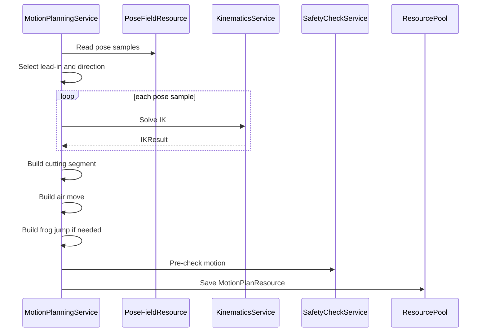

# 10 逆解与运动规划详细设计

## 1. 模块定位

逆解与运动规划模块把刀路曲线和五轴姿态场转换为切割头机械结构可执行的关节运动序列。

它解决三个核心问题：

- 世界坐标下的目标切割姿态如何映射为关节值。
- 多个逆解如何选择。
- 切割段、空移段和蛙跳段如何组织成连续运动。

## 2. 模块边界

KinematicsService：

- 正解。
- 逆解。
- 多解评分。
- 奇异点判断。

MotionPlanningService：

- 下刀点选择。
- 刀路方向选择。
- 生成切割段。
- 生成空移段。
- 生成蛙跳段。
- 生成 MotionPlanResource。

SafetyCheckService：

- 对结果做最终安全检查。
- 不在本模块中修改运动规划。

## 3. 输入和输出

输入：

- ToolAssembly。
- PathCurveResource。
- PoseFieldResource。
- OrderPlan。
- 上一运动状态。
- 碰撞和安全距离信息。

输出：

- MotionPlanResource。
- IKCheckResult。
- SingularityCheckResult。
- JointLimitCheckResult。
- ContinuityCheckResult。

## 4. 逆解接口

```text
IKRequest
  ToolAssemblyID
  TargetPoseInWorldCS
  PreviousJointValues
  PreferredJointValues
```

```text
IKSolution
  Success
  JointValues[]
  PoseError
  DistanceToJointLimits
  SingularityScore
  DeltaFromPrevious
  ErrorCode
```

```text
IKResult
  Solutions[]
  BestSolution
  FailureReason
```

## 5. 多解评分

评分目标：

```text
score =
  jointLimitWeight * JointLimitPenalty
  + singularityWeight * SingularityPenalty
  + deltaWeight * JointDelta
  + postureWeight * TargetPostureDelta
  + preferredWeight * PreferredDelta
```

选择规则：

- 不满足关节限位的解直接淘汰。
- 世界坐标目标姿态误差超出允许范围的解直接淘汰。
- 接近奇异点的解加重惩罚。
- 与上一状态变化越小越优先。
- 多个评分相同，优先选择远离限位的解。

## 6. 奇异点判断

MVP 可使用工程化指标：

- 关节轴接近平行导致自由度退化。
- 小目标姿态变化引起大关节变化。
- 雅可比条件数超过阈值。
- 求解器返回奇异或接近奇异标记。

结果：

```text
SingularityRisk
  SampleID
  SegmentIndex
  SegmentU
  Severity
  Reason
```

## 7. 下刀点选择

适用对象：

- 闭合刀路。
- 可以反向加工的刀路。

候选来源：

- 曲线起点。
- 识别特征推荐点。
- 用户手动指定点。
- 曲线按参数均匀或自适应生成的候选点。

评分：

```text
cost =
  airMoveDistance
  + postureDelta
  + jointDelta
  + singularityPenalty
  + collisionRiskPenalty
  + liftPenalty
```

目标：

- 尽量减少抬刀。
- 尽量减少空移。
- 到位后可以直接开始切割。

## 8. 切割段生成

```text
Toolpath + PoseField + IK
  -> CuttingMotionSegment
```

每个采样点：

- SegmentIndex。
- SegmentU。
- 世界坐标目标姿态。
- 关节值。
- IK 状态。
- 奇异点状态。
- 切割状态。

## 9. 空移段生成

空移从上一条刀路结束状态移动到下一条刀路下刀状态。

要求：

- 空移过程中允许世界坐标位置移动和切割头姿态同步调整。
- 到达下刀点时姿态必须满足下一条刀路起切要求。
- 空移段参与逆解、限位、连续性和碰撞检查。

生成方式：

```text
1. 当前结束目标姿态
2. 下一下刀目标姿态
3. 构造空间过渡路径
4. 姿态插值
5. 每个采样点求逆解
6. 检查连续性
```

## 10. 蛙跳段生成

普通空移存在碰撞或安全距离不足时，尝试蛙跳。

蛙跳分三段：

```text
LiftUp
HorizontalMove
DropDown
```

参数：

- 安全高度。
- 抬起方向。
- 下降方向。
- 姿态插值策略。

规则：

- 蛙跳不是显示效果，是真实运动规划的一部分。
- 蛙跳每个采样点都要求逆解。
- 蛙跳必须参与完整安全检查。

## 11. MotionPlanResource

```text
MotionPlanResource
  Version
  LeadInSelection
  CuttingDirection
  CuttingSamples[]
  AirMoveSegments[]
  FrogJumpSegments[]
  IKCheckResult
  SingularityCheckResult
  JointLimitCheckResult
  ContinuityCheckResult
  CollisionCheckResult
```

MotionPlanResource 只保存运动规划结果本体，不保存自己的 ResourceID，也不反向保存 ToolpathID。与刀路、程序块或工程状态的关联由 Database 组件保存 ResourceID 来表达。

## 12. 时序



## 13. 失败处理

- 任一关键采样点无逆解：运动规划失败。
- 关节超限无法规避：运动规划失败。
- 奇异点无法规避：运动规划可以输出失败结果供 UI 显示。
- 普通空移碰撞但蛙跳可行：使用蛙跳。
- 普通空移和蛙跳都不可行：规划失败。

## 14. 测试点

- 单条刀路能生成切割段。
- 闭合刀路能选择下刀点。
- 可反向刀路能选择方向。
- 多逆解时选择关节变化更小的解。
- 空移到位后可直接开始切割。
- 普通空移碰撞时能尝试蛙跳。
