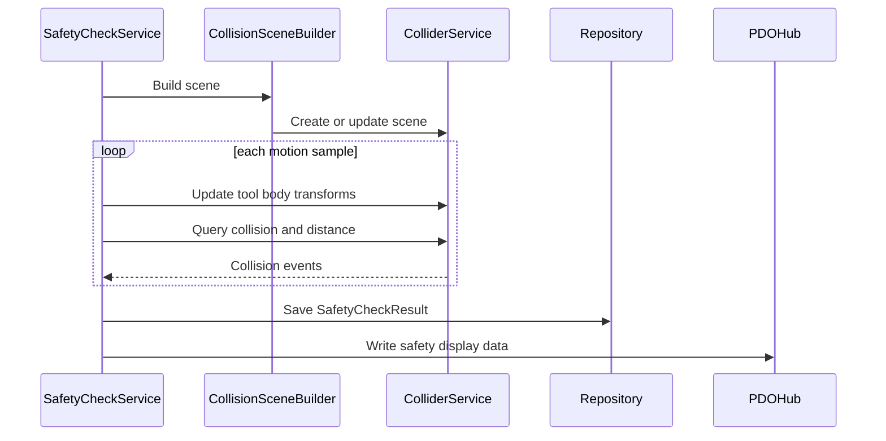

# 11 碰撞检测与安全检查详细设计

## 1. 模块定位

碰撞检测与安全检查模块负责判断运动规划是否可执行、是否安全。

安全检查包括：

- 逆解检查。
- 奇异点检查。
- 关节限位检查。
- 运动连续性检查。
- 完整碰撞检查。

## 2. 碰撞范围

必须覆盖：

- 切割头碰撞包络与工件模型。
- 切割头自身非相邻运动部件之间的自碰撞。
- 切割头碰撞包络与项目静态障碍物。
- 切割段。
- 空移段。
- 蛙跳段。

## 3. 多场景设计

每个项目拥有独立碰撞场景。

```text
ProjectRuntime
  -> ProjectContext
    -> CollisionSceneID
    -> ColliderService
```

JoltColliderService 可以内部管理多个 scene，但 scene 的生命周期必须由 ProjectRuntime 控制。

## 4. 数据结构

```text
CollisionScene
  SceneID
  WorkpieceBody
  ToolBodies[]
  StaticObstacleBodies[]
  IgnorePairs[]
```

```text
CollisionBody
  BodyID
  OwnerKind(Workpiece/ToolComponent/Obstacle)
  OwnerID
  GeometryResourceID
  Transform
```

```text
CollisionEvent
  SampleOrPosition
  MotionSampleIndex
  MotionKind
  ObjectA
  ObjectB
  ResultType(ClearanceTooSmall/Intersected)
  ContactPoint
  PenetrationDepth
  MinDistance
```

## 5. ColliderData

碰撞数据类型：

- Mesh。
- Box。

不使用胶囊。

CAD/BRep 不直接进入碰撞服务，必须先转成 ColliderData。

## 6. 安全距离

安全距离来自 ToolParameters.SafeDistance。

判断：

- `distance < safeDistance`：安全距离不足。
- `intersected == true`：实际相交。

安全距离不足和实际相交必须区分显示。

## 7. 自碰撞规则

默认忽略：

- 父子直接相邻组件。
- 固定连接且设计上接触的组件。

必须检测：

- 非相邻运动部件。
- 可能因关节运动互相接近的组件。

忽略对应该从 ToolAssembly 或项目配置中明确生成，不能靠碰撞服务猜测。

## 8. 安全检查流程

```text
1. 读取 MotionPlanResource
2. 构建或更新 CollisionScene
3. 遍历 cutting/airMove/frogJump samples
4. 检查 IK 状态
5. 检查奇异点
6. 检查关节限位
7. 检查相邻样本连续性
8. 更新切割头碰撞体位姿
9. 执行碰撞和距离查询
10. 汇总 SafetyCheckResult
11. 写入 Repository
12. 同步 PDO 显示数据
```

## 9. 连续性检查

检查对象：

- 世界坐标位置跳变。
- 世界坐标姿态跳变。
- 单个关节值跳变。
- 旋转关节跨越周期导致的跳变。

结果：

```text
MotionDiscontinuity
  FromSample
  ToSample
  Reason
  Delta
```

## 10. 时序



## 11. 失败处理

- 工件碰撞资源不存在：安全检查不可执行。
- 切割头碰撞包络不存在：安全检查不可执行。
- Jolt scene 创建失败：安全检查失败。
- 单个采样点检查失败：记录事件，继续检查后续采样点。

## 12. 测试点

- 切割头与工件实际相交能被检测。
- 安全距离不足和相交能区分。
- 自碰撞能被检测。
- 空移段碰撞能被检测。
- 蛙跳段碰撞能被检测。
- 点击碰撞事件能定位到对应运动采样点。
