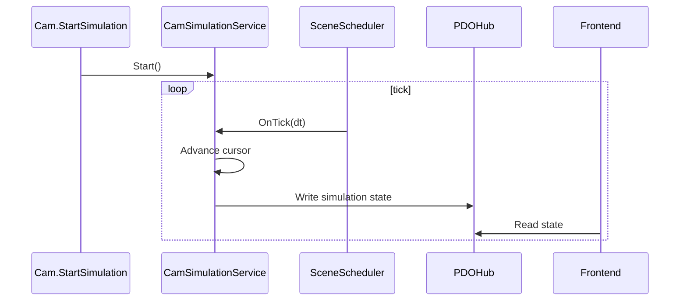

# 12 CAM 机械仿真详细设计

## 1. 模块定位

CAM 机械仿真模块负责按运动规划驱动切割头机械模型运动，并输出仿真状态给前端显示。

MVP 不模拟真实机床加减速和材料去除，但必须基于切割头机械模型和 MotionPlanResource 播放。

## 2. 输入和输出

输入：

- MotionPlanResource。
- ToolAssembly。
- SafetyCheckResult。
- 用户仿真控制命令。

输出：

- SimulationState。
- 切割头关节状态 PDO。
- 已切割刀路状态 PDO。
- 碰撞状态 PDO。

## 3. 状态机

```text
Stopped
Playing
Paused
Completed
```

命令：

- Start。
- Pause。
- Resume。
- Stop。
- Reset。

## 4. SimulationState

```text
SimulationState
  IsPlaying
  CurrentToolpathID
  CurrentSegmentID
  CurrentMotionKind
  CurrentSegmentIndex
  CurrentSegmentU
  CurrentPositionInWorldCS
  CurrentOrientationInWorldCS
  CurrentJointValues[]
  CurrentCollisionState
  CompletedToolpathIDs[]
```

播放位置是运行时状态，不要求持久化。

## 5. 播放流程

```text
1. StartSimulation
2. 读取 MotionPlanResource
3. 初始化播放游标
4. 每个 Project tick 推进时间
5. 根据时间插值 MotionSample
6. 更新 ToolAssembly 关节值
7. 更新 SimulationState
8. 写入 PDO
9. 当前刀路结束后加入 CompletedToolpathIDs
10. 所有段结束后进入 Completed
```

## 6. 插值

MVP 使用固定速度或固定步长。

插值对象：

- 世界坐标位置。
- 世界坐标姿态。
- 关节值。

若 MotionPlan 已有足够密集采样，可先采用采样点步进。

## 7. 切割状态

MotionKind：

- Cutting。
- AirMove。
- FrogJump。

显示规则：

- Cutting：当前刀路高亮。
- AirMove：显示空移线，不改变已切割状态。
- FrogJump：显示蛙跳线，不改变已切割状态。
- Toolpath 完成：刀路变红。

## 8. 碰撞状态

仿真不重新计算完整安全检查，默认读取 SafetyCheckResult。

播放到对应采样点附近时：

- 显示安全距离不足。
- 显示实际碰撞。
- 高亮相关对象。

如后续需要实时碰撞，可在 SimulationService 中调用 ColliderService 增量检查。

## 9. PDO 输出

```text
SimulationToolStatePDO
  ToolAssemblyID
  JointValues[]
  ComponentPose[]
  ToolPoseInWorldCS
  MotionKind
```

```text
CutStatePDO
  CompletedToolpathIDs[]
  CurrentToolpathID
```

```text
SimulationCollisionPDO
  ActiveEvents[]
```

## 10. 时序



## 11. 测试点

- Start 后状态进入 Playing。
- Pause 后 tick 不推进播放游标。
- Resume 后继续播放。
- Stop 后回到 Stopped。
- Reset 清空已切割状态。
- 播放时切割头关节值按 MotionPlan 更新。
