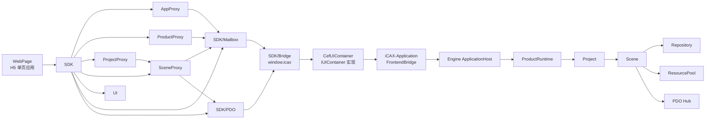
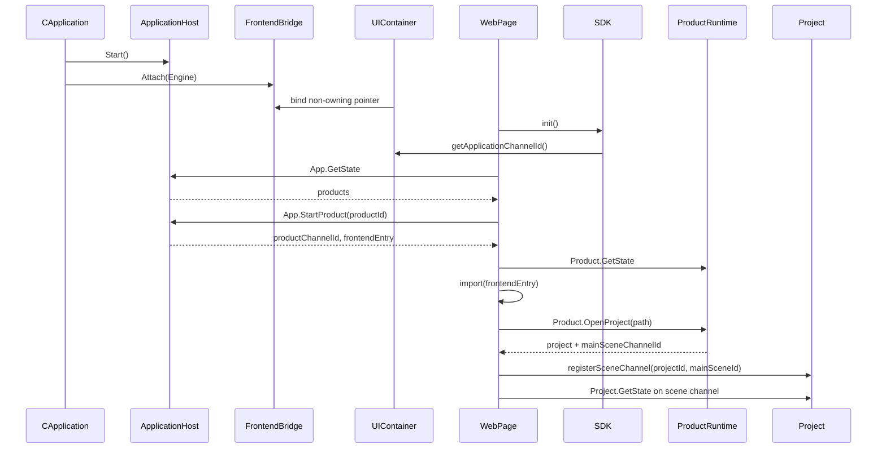

# iCAX-UI 设计文档

## 1. 设计目标

iCAX-UI 不是一个独立网站，而是 iCAX 桌面应用的 H5 前端层。它由 `UIContainer` 和 `WebPage` 组成：

```text
UIContainer + WebPage
```

- `UIContainer` 是 C++ 侧 H5 adapter。它连接 UI 宿主和 `iCAX-Application` 的 `FrontendBridge`，但不拥有 Engine。
- `WebPage` 是 H5 单页应用，负责界面呈现、用户交互、命令发起、订阅后端事件和读取 PDO 高频数据。

iCAX-UI 的核心原则：

- 公共框架和具体产品分离。
- 前端不直接访问 C++ 对象，只通过 host bridge 访问 Engine 能力。
- 普通交互走 mailbox，返回值以 Promise 形式表达。
- 高频数据走 PDO，mailbox 只传递控制命令和状态通知。
- 产品 UI 是插件式 ESM 模块，由 manifest 指向入口。
- Engine 生命周期属于 `iCAX-Application`，H5/CEF 是当前默认前端实现；WPF/QT 可以作为同一 `UIContainer` 契约下的替代实现。

## 2. 目录设计

应用容器：

```text
src/iCAX-Application/
  Application/
```

公共前端框架：

```text
src/iCAX-UI/
  UIContainer/
  CefUIContainer/
  AppProxy/
  ProductProxy/
  ProjectProxy/
  SceneProxy/
  UI/
  SDK/
    AppShell/
    Bridge/
    Mailbox/
    PDO/
```

具体产品：

```text
src/apps/<product-id>/
  product.manifest.json
  backend/
  webpage/
  protocol/
```

`src/iCAX-UI` 只放通用 H5 能力，不放平切、五轴、焊接等产品代码。

## 3. 模块关系



`AppShell` 是唯一 HTML 入口。产品页面不是新的 HTML 页面，而是通过 `ProductProxy` 模块中的 loader 按 manifest 动态 import 的 ESM 模块。

## 4. 应用容器

`iCAX-Application/Application` 是桌面应用的更高层容器：

```text
CApplication
  ApplicationHost
  FrontendBridge
  UIContainerFactory
```

它负责：

- 配置并启动 Engine。
- 将 `FrontendBridge` attach 到 `ApplicationHost`。
- 向 UI container 暴露稳定的前端桥。
- 在关闭时先停止 UI，再停止 Engine。

`UIContainer`、`CefUIContainer`、`WpfUIContainer` 和未来 `QtUIContainer` 都不应直接拥有 Engine。

## 5. UIContainer 设计

`UIContainer` 是前端容器公共契约和工厂，不是具体窗口实现。

主要职责：

- 定义 `IFrontendBridge`。
- 定义 `IUIContainer`。
- 提供 `CUIContainerFactory`。
- 提供静态注册宏。
- 提供内置 headless 容器用于启动握手验证。

`UIContainer` 不实现任何具体产品逻辑，不启动/停止 `ApplicationHost`，不缓存 post office。

`CefUIContainer` 负责 CEF runtime、浏览器窗口、`window.icax` 注入和 Engine mail 推送。PDO shared memory 到 JS `ArrayBuffer`、文件对话框、窗口标题、拖拽文件属于 `CefUIContainer` 的后续宿主能力。

## 6. AppShell 设计

`AppShell` 是公共 H5 壳。

它负责：

- 初始化 `SDK`。
- 连接 `window.icax`。
- 获取 application mail 入口。
- 查询可用产品列表。
- 选择产品后启动产品 runtime。
- 根据产品 manifest 动态加载产品 `webpage` 模块。
- 打开或追加项目。
- 将产品页面挂载到工作区。

页面结构：

```text
TopBar
ProductRail | Workspace | Inspector
BottomDock
```

`Workspace` 根据状态切换：

- application 状态：显示产品列表和打开项目入口。
- product 状态：显示产品主页、最近项目、产品配置。
- project 状态：显示具体项目工作区，由产品 `webpage` 模块接管主要内容。

## 7. SDK 设计

`SDK` 是产品前端唯一应该依赖的公共 JS 层。

内部组成：

```text
SDK
  -> Bridge
  -> Mailbox
  -> PDO
  -> AppProxy
  -> ProductProxy
  -> ProjectProxy
  -> SceneProxy
  -> UI
```

### 7.1 Bridge

Bridge 屏蔽真实宿主 bridge 和开发期 mock bridge 的差异。

H5 侧只依赖：

```js
window.icax
```

开发期如果没有真实 `window.icax`，可以自动使用 mock bridge 运行 AppShell。

### 7.2 Mailbox

mailbox 用于低频控制消息和业务命令。

JS 调用表现为 Promise：

```js
const result = await project.Commands.invoke("Project", "Save", {
  path: "D:/demo.icax"
});
```

底层会生成 command route，序列化 payload，发送 mail，并等待 Engine 通过 `originId` 返回 response。

### 7.3 PDO

PDO 用于高频数据。

SDK 只负责拿到 PDO 视图和租约，不负责解释具体业务含义。某个 PDO 表达什么数据，由产品协议定义。

产品前端使用方式应接近：

```js
const meshView = await project.PDO.open("LaserCam.SceneMesh");
const frame = meshView.readLatest();
```

实际数据布局由 `src/apps/<product-id>/protocol` 说明。

### 7.4 AppProxy/ProductProxy/ProjectProxy/SceneProxy

前端公共框架显式提供应用、产品、项目、场景四个层级：

```text
AppProxy
  ProductProxy
    ProjectProxy
      SceneProxy
```

Application、Product、Scene 有自己的 mailbox 入口。Project 是项目容器，不拥有 mailbox。前端先和 application 对话，再按需进入 product，打开 project 后默认使用主 Scene 对话。

这四层不拥有 backend 数据，只保存 channel、状态快照、事件订阅入口和 PDO 访问入口。Repository、ResourcePool、ECS 数据仍在 Engine scene 内。

### 7.5 ProductProxy Module Loader

`ProductProxy` 模块内的 `productModuleLoader` 负责产品模块入口解析、动态 import、缓存和挂载分发。

### 7.6 UI

`UI` 负责公共 UI 工具和公共组件，不处理业务状态。

## 8. 产品扩展设计

一个产品通过 `product.manifest.json` 声明自己。

示例：

```json
{
  "schema": "icax.product.manifest",
  "schemaVersion": 1,
  "productId": "icax.laser-3d-cam",
  "productName": "Laser 3D CAM",
  "productVersion": "0.1.0",
  "projectFile": {
    "magic": "ICAX_LASER_3D_CAM",
    "formatVersion": 1,
    "quickSaveLogMagic": "ICAX_LASER_3D_CAM_QSAVE",
    "quickSaveLogVersion": 1,
    "fileExtensions": [".icax"]
  },
  "backend": {
    "modules": {
      "components": [],
      "behaviours": [],
      "services": [],
      "commands": []
    }
  },
  "webpage": {
    "entry": "apps/laser-3d-cam/webpage/entry.mjs"
  }
}
```

产品 `webpage` 模块导出约定：

```js
export async function mountProduct(context) {
}

export async function mountProject(context) {
}
```

`context` 由 AppShell 创建，包含 runtime、DOM 挂载点、host 能力和产品 manifest 信息。

## 9. 启动流程



## 10. 消息流

普通命令：

```text
WebPage
  -> SDK CommandClient
  -> window.icax.postMail
  -> CefUIContainer
  -> UIContainer
  -> FrontendBridge
  -> MailChannelRegistry
  -> ApplicationHost/ProductRuntime/Project
  -> CommandHandler
  -> response mail
  -> FrontendBridge
  -> UIContainer
  -> SDK Promise resolve/reject
```

事件通知：

```text
backend observer/event
  -> backend post office Send(originId = 0)
  -> FrontendBridge
  -> UIContainer
  -> window.icax event callback
  -> Mailbox subscribe/subscribeAll
  -> UI update
```

高频数据：

```text
backend behaviour/service
  -> write PDO shared memory
  -> notify version
  -> frontend read latest PDO frame
  -> render
```

## 11. 与 backend 的边界

iCAX-UI 不关心 Repository 内部结构，不直接修改 component。

iCAX-UI 只能：

- 发送 command。
- 接收 command response。
- 订阅 event。
- 读取 PDO。
- 调用 host 能力。

数据修改、校验、事务、撤销还原、快速保存都属于 backend/database/project 的职责。

## 12. 实现状态与集成边界

框架内已落地：

- `src/iCAX-Application/Application`
- `src/iCAX-UI/UIContainer`
- `src/iCAX-UI/CefUIContainer`
- `src/iCAX-UI/SDK/AppShell`
- `src/iCAX-UI/AppProxy`
- `src/iCAX-UI/ProductProxy`
- `src/iCAX-UI/ProjectProxy`
- `src/iCAX-UI/SceneProxy`
- `src/iCAX-UI/SDK/Bridge`
- `src/iCAX-UI/SDK/Mailbox`
- `src/iCAX-UI/SDK/PDO`
- `src/iCAX-UI/UI`
- `src/iCAX-UI/SDK`
- `src/apps/laser-3d-cam/product.manifest.json`
- `src/apps/laser-3d-cam/webpage/entry.mjs`
- `src/tests/iCAX-UI/SDKTest.mjs`

外部集成边界：

- CEF/宿主适配器属于原生宿主集成层，应接入 `UIContainer`，不进入 `ApplicationHost`。
- PDO shared memory 到 JS `ArrayBuffer` 的映射属于 host bridge 能力，应通过 `Bridge` 暴露。
- 产品级 UI 组件属于 `src/apps/<product-id>/webpage`，公共 UI 才进入 `UI`。
- 产品协议定义属于 `src/apps/<product-id>/protocol`，公共框架只提供加载和调用机制。

