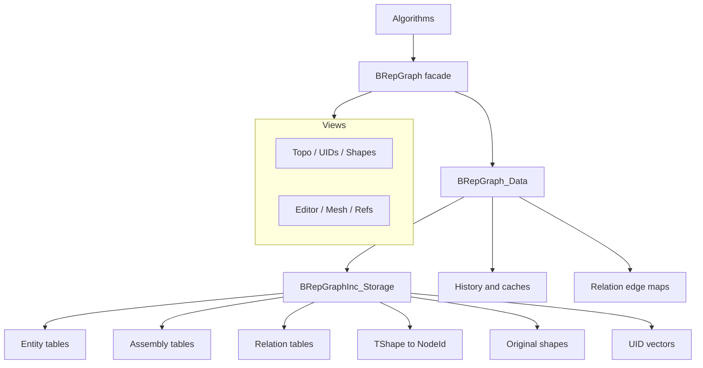
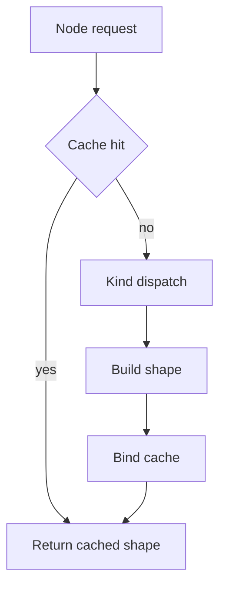
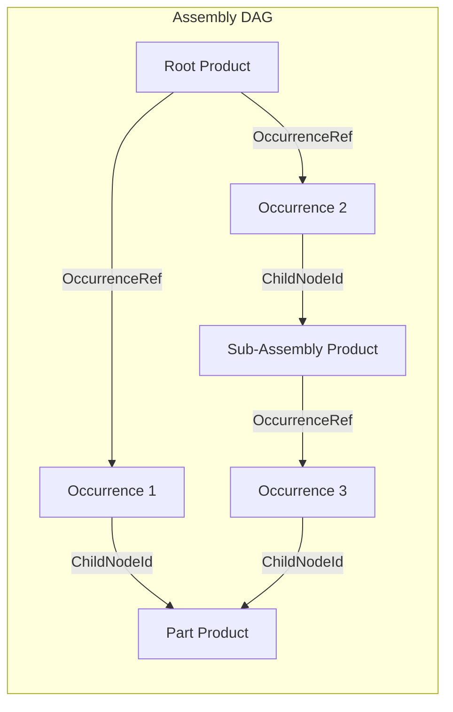

# BRepGraph

BRepGraph is the high-level graph API over the `BRepGraphInc` incidence-table backend for
TopoDS/BRep shapes.

## Why It Exists

BRepGraph provides a stable algorithm-facing API for:

- adjacency and sharing queries,
- controlled topology mutation,
- shape reconstruction,
- assembly structure (products, occurrences, placement),
- history and UID tracking,
- cached analysis helpers.

The goal is to make workflows like sewing, healing, compact, and deduplicate easier to implement and optimize.

## Recent API Changes (April 2026)

- **Mutation API unified**: `BRepGraph::Access()` has been merged into `BRepGraph::Editor()`.
  All `MutEdge(...)`, `MutFace(...)`, `MutVertexRef(...)`, etc. RAII guards now live on
  `EditorView` alongside structural `Add*()` / `Remove*()` / nested `Ops` classes.
  Old callers that wrote `theGraph.Access().MutEdge(id)` should now write
  `theGraph.Editor().MutEdge(id)`.
- **Geometry helpers on `BRepGraph_Tool::CoEdge`**: `Orientation`, `IsReversed`, `EdgeOf`,
  `FaceOf`, `SeamPair`, `IsSeam`. Prefer these over direct `BRepGraphInc::CoEdgeDef` field
  access for encapsulation (single-field reads are also the migration target; perf-critical
  hot loops that read many fields from one struct may keep direct struct access).
- **`BRepGraph_ChildExplorer::Config` struct**: consolidated configuration (mode, target
  kind, avoid kind, emit flag, accumulate-location/orientation, start location/orientation)
  for the downward walker. The new
  `BRepGraph_ChildExplorer(graph, root, Config{...})` constructor is the preferred long-term
  idiom; extend `Config` with new fields
  instead of adding new constructor overloads.
- **Derived topology and geometry state** lives in cache services. Caches are
  graph-local temporary services and compute missing values from the current graph.

## Current Model (April 2026)

The runtime model is incidence-first:

- Source of truth: `BRepGraphInc_Storage`
- Topology defs in BRepGraph are aliases to incidence entities
- Orientation/location context is stored on incidence refs
- No separate runtime Usage storage layer
- `BRepGraphInc` headers are intentionally available for advanced low-level users; callers
  using them directly must maintain relation tables, UID maps, active counters, generation
  counters, and cache invalidation explicitly.

See backend details in `src/ModelingData/TKBRep/BRepGraphInc/README.md`.

## Architecture



## Public Accessors

Queries and mutations go through accessors obtained from a `BRepGraph` instance.

| Accessor | Method | Purpose |
|------|----------|---------|
| **TopoView** | `Topo()` | Const topology definition access, representation access, adjacency queries, and raw Product/Occurrence definition storage |
| **UIDsView** | `UIDs()` | UID allocation for active entries (`Of`), active-only lookup (`NodeIdFrom`/`RefIdFrom`), and validity checking (`Has`) |
| **ShapesView** | `Shapes()` | Cached `Shape()` access (`null` for invalid/removed nodes), fresh `Reconstruct()` (`null` for invalid/removed nodes), `Original()/HasOriginal()` non-throw original lookup (`null` when absent), and FindNode/HasNode reverse lookup for active nodes |
| **CacheRegistry** | `CacheRegistry()` | GUID-keyed registry of typed transient cache services. Supports `Find<T>()`, `Ensure<T>()`, explicit registration, unregister, bulk clear, and `BRepGraph_CacheIterator` for enumerating live cache services. |
| **EditorView** | `Editor()` | All mutation: creation (nested `VertexOps`/`EdgeOps`/`WireOps`/`FaceOps`/... `Add(...)` / `Split(...)`), field-level `Mut*()` RAII guards (`MutEdge`, `MutFace`, `MutShell`, `MutProduct`, `MutVertexRef`, `MutSurface`, ...), structural removal (RemoveNode, RemoveSubgraph, RemoveRef with orphan pruning), SetCoEdgePCurve, ClearFaceMesh, ClearEdgePolygon3D, AppendFlattenedShape, AppendFullShape, rep creation (CreateTriangulationRep, CreatePolygon3DRep, CreatePolygonOnTriRep), ValidateMutationBoundary. EditorView absorbs the former `AccessView`: there is a single entry point for all mutation. |
| **RefsView** | `Refs()` | Reference entry access, RefUID lookup, VersionStamp for refs |
| **MeshView** | `Mesh()` | Mesh cache and persistent mesh representation queries with cache-first, persistent-fallback priority. Use the non-const mesh/editor APIs for mesh-cache writes. |

`TopoView` also exposes grouped node-oriented helpers for discoverable read queries:

- `Topo().Faces()`, `Edges()`, `Vertices()`, `Wires()`
- `Topo().Shells()`, `Solids()`, `CoEdges()`
- `Topo().Compounds()`, `CompSolids()`
- `Topo().Products()`, `Occurrences()`

Keep `Refs()` as the home for APIs returning `RefId` vectors and reference-entry representations.

### Non-View Helpers

Use `BRepGraph_ChildExplorer` and `BRepGraph_ParentExplorer` directly for structural diagnostics and connected-component grouping. `BRepGraph_RelatedIterator` provides single-level semantic traversal from any node, yielding immediate neighbours with a `RelationKind` tag (e.g. `AdjacentFace`, `BoundaryEdge`, `IncidentVertex`). `BRepGraph_LayerIterator` iterates over all registered layers in a `BRepGraph_LayerRegistry`. Lightweight one-off analysis helpers are expected to stay local to the consuming algorithm or test.

### Direct Subsystem Accessors

| Accessor | Purpose |
|----------|---------|
| `LayerRegistry()` | Access the GUID-keyed runtime registry of registered layers |
| `LayerRegistry().RegisterLayer(layer)` | Register a `BRepGraph_Layer` plugin explicitly |
| `LayerRegistry().Find(guid)` / `LayerRegistry().Find<T>()` / `LayerRegistry().Ensure<T>()` | Lookup or create a registered layer by GUID or layer type |
| `LayerRegistry().UnregisterLayer(guid)` | Remove a registered layer by GUID |
| `CacheRegistry()` | Access the GUID-keyed runtime registry of transient cache families |
| `CacheRegistry().RegisterCache(cache)` | Register a `BRepGraph_Cache` family explicitly |
| `CacheRegistry().FindCache(guid)` / `CacheRegistry().Find<T>()` / `CacheRegistry().Ensure<T>()` | Lookup or create a registered cache family by GUID or cache type |
| `CacheRegistry().UnregisterCache(guid)` | Remove a registered cache family by GUID |

`BRepGraph_LayerHistory` is registered as a normal layer. Use
`graph.LayerRegistry().Ensure<BRepGraph_LayerHistory>()` when an operation should create/record
history, and `graph.LayerRegistry().Find<BRepGraph_LayerHistory>()` when history is optional input.

## Main Data Concepts

- **NodeId** (Kind + Index): lightweight typed address into per-kind node vectors
- **UID** (Kind + Counter): generation-aware persistent identity surviving compaction/reorder
- **RefId** (Kind + Index): lightweight typed address into per-kind reference entry vectors
- **RefUID** (Kind + Counter): generation-aware persistent reference identity
- **RepId** (Kind + Index): separate geometry/mesh addressing decoupled from topology nodes
- **Topology entities**: Vertex, Edge, CoEdge, Wire, Face, Shell, Solid, Compound, CompSolid
- **Assembly entities**: Product (part or assembly), Occurrence (placed instance)
- **Reference entries**: VertexRef, WireRef, FaceRef, ShellRef, SolidRef, ChildRef, OccurrenceRef
- **Relation tables**: ordered child refs and incoming parent/use lists for topology and product graph traversal

## Reference Identity (RefId)

Reference entries are the typed edges of the incidence graph. Each ref kind has its own id space, entry table, and UID counter.

### Ref Kinds

7 ref kinds: Shell, Face, Wire, Vertex, Solid, Child, Occurrence. Type-safe wrappers: `BRepGraph_ShellRefId`, `BRepGraph_FaceRefId`, `BRepGraph_WireRefId`, `BRepGraph_VertexRefId`, `BRepGraph_SolidRefId`, `BRepGraph_ChildRefId`, `BRepGraph_OccurrenceRefId`.

### BaseRef and Ref

`BaseRef` is the common header for all reference entries: `RefId` + `OwnGen` + `IsRemoved`. Normal topology refs (e.g. `ShellRef`, `FaceRef`) extend BaseRef with typed parent and child ids plus `Orientation`; `ChildRef` and `OccurrenceRef` additionally carry `LocalLocation`. Parent definition containers are the canonical owner lists for refs.

### RefUID

`BRepGraph_RefUID` (Kind + Counter) provides persistent identity for reference entries. Counter-based and generation-aware, surviving compaction and reorder. Analogous to `BRepGraph_UID` for entities.

### VersionStamp Support

`BRepGraph_VersionStamp` supports the ref domain: `StampOf(refId)` and `IsStale(stamp)` enable cache invalidation for ref-dependent computations.

### Mutation Guards

`BRepGraph_MutGuard<T>` is a unified RAII guard for safe mutation of both topology definitions (BaseDef hierarchy) and reference entries (BaseRef hierarchy).

### RefsView API

`RefsView` (via `Refs()`) provides:

- Ref counts: `NbShellRefs`, `NbFaceRefs`, `NbWireRefs`, etc.
- Ref entry access: `Shell(id)`, `Face(id)`, etc.
- UID operations: `UIDOf(refId)`, `RefIdFrom(uid)`
- Parent-to-ref vectors: `ShellRefIdsOf(solidId)`, `FaceRefIdsOf(shellId)`, etc.

Face outer-wire lookup is available from `BRepGraph_Tool::Face::OuterWire(graph, faceId)`.

## Core Pipelines

### Build


After topology population, `BRepGraph::ShapesView::Add()` can auto-create a single root Product wrapping the top-level topology node. This graph-level policy is controlled by `BRepGraph::ShapesView::Options::CreateAutoProduct` (default true), because it is implemented by the shape facade rather than the backend population pipeline. When disabled (e.g. XCAF builder manages Products itself), the caller is responsible for creating Products.

### Reconstruct



Use cache-enabled reconstruction paths for multi-face/shell/solid rebuilds.

## Assembly Model

Products and Occurrences are first-class node kinds alongside topology.

### Node Kinds

```
Kind::Product    = 10   // Reusable shape definition (part or assembly)
Kind::Occurrence = 11   // Placed instance of a product within a parent product
```

Helpers: `BRepGraph_NodeId::IsTopologyKind()`, `IsAssemblyKind()`, `Products().Definition(id)`, `Occurrences().Definition(id)`.

### Data Model



- **ProductRelations**: ordered `OccurrenceRefIds` owned by the parent product
- **OccurrenceDef**: `ChildNodeId` (referenced Product or topology root)
- **OccurrenceRef**: `ParentProductId`, `ChildOccurrenceId`, `LocalLocation`

### Placement Composition

`BRepGraph_ChildExplorer` and `BRepGraph_ParentExplorer` compose `ChildRef::LocalLocation` and `OccurrenceRef::LocalLocation` along the explicit path. DAG-safe: shared products placed at multiple locations have distinct occurrence refs and distinct traversal paths.

### API Distribution

| View | Methods |
|------|---------|
| **TopoView** | `NbProducts`, `NbOccurrences`, grouped helpers `Products()` / `Occurrences()` |
| **TopoView** | `IsAssembly`, `IsPart`, `NbComponents`, `Component`, `OccurrenceLocation(occId)`, grouped helpers `Products()` / `Occurrences()` |
| **BRepGraph** | `RootProductIds` |
| **EditorView** | `Add(shapeRoot, placement)`, `Add()`, `Append(parent, child, ...)`, `AppendDocumentRoot`, `RemoveOccurrence`, `RemoveShapeRoot`, `MutProduct(i)`, `MutOccurrence(i)` (RAII guards) |
| **Traversal** | Flat definition traversal via `BRepGraph_ProductIterator` / `BRepGraph_OccurrenceIterator` (or explicit `NbProducts()` / `NbOccurrences()` scans when storage-level access is required) |

### Single-Shape Graph

`aGraph.Shapes().Add(aBox)` creates one Product that owns one shape-root
Occurrence whose `ChildNodeId` is the topology root, for example `Solid(0)`.
Traversal therefore sees the same explicit `Product -> Occurrence -> topology`
model used by imported assemblies.

## Traversal

BRepGraph provides a context-preserving traversal system for walking the hierarchy from any root down to entities of a target kind, producing full occurrence paths with composed locations and orientations.

### UsagePath

`BRepGraph_UsagePath` identifies one concrete traversal branch by recording the visited nodes plus the reference entry, when present, for each step. The step model is uniform: assembly occurrences, compound containers, and topology entities are all explicit steps.

### Explorer

`BRepGraph_ChildExplorer` visits each **occurrence** of an entity kind (not definitions). If Edge[5] is reachable through Face[0] and Face[1], it is visited twice with different paths:

```cpp
for (BRepGraph_ChildExplorer anExp(aGraph, BRepGraph_SolidId(0),
                               BRepGraph_NodeId::Kind::Edge);
     anExp.More(); anExp.Next())
{
  BRepGraph_NodeId anEdge = anExp.Current();
  TopLoc_Location  aLoc   = anExp.Location();
}
```

Can also start from a Product to descend through assembly occurrences into topology.

### Traversal Paths

`BRepGraph_ChildExplorer` and `BRepGraph_ParentExplorer` resolve concrete usage paths through the explicit graph:

- `RootProductIds()` plus `Topo().Products()` helpers provide graph-root and assembly-aware product queries.
- `CurrentUsagePath()` records the concrete node/ref steps for a downward traversal branch.
- `Current().Location` and `Current().Orientation` expose transforms composed along the emitted branch.
- Recursive target-kind traversal filters emitted nodes, but it must still walk through intermediate `Product` and `Occurrence` nodes rather than inventing direct topology shortcuts.

### RelatedIterator

`BRepGraph_RelatedIterator` provides single-level semantic traversal from any node, yielding immediate neighbours with a `RelationKind` tag. Unlike ChildExplorer (which descends to a target kind) or ParentExplorer (which ascends), RelatedIterator stays at one level and returns all semantically related nodes:

```cpp
for (BRepGraph_RelatedIterator anIt(aGraph, BRepGraph_NodeId(aFaceId)); anIt.More(); anIt.Next())
{
  BRepGraph_NodeId aNeighbour = anIt.Current();
  BRepGraph_RelatedIterator::RelationKind aRel = anIt.CurrentRelation();
  // e.g. BoundaryEdge, AdjacentFace, OuterWire
}
```

Relation kinds include: `BoundaryEdge`, `AdjacentFace`, `OuterWire`, `ReferencedByFace`, `IncidentVertex`, `WireCoEdge`, `OwningFace`, `IncidentEdge`, `ParentEdge`, `SeamPair`.

### Connected Components

Disconnected topology is grouped on demand by walking from faces to their solid or shell roots with `BRepGraph_ParentExplorer`, or by descending from known roots with `BRepGraph_ChildExplorer`. There is no longer a packaged `SubGraph` container.

## Geometry Access (BRepGraph_Tool)

`BRepGraph_Tool` is the centralized geometry access API for BRepGraph, analogous to `BRep_Tool` for TopoDS. Nested helper classes provide typed, safe access:

| Helper | Key Methods |
|--------|-------------|
| **Vertex** | `Usage`, `Pnt` (definition frame, with ref location, by ref id), `Tolerance`, `NbEdges` |
| **Edge** | `Tolerance`, `Degenerated`, `SameParameter`, `SameRange`, `IsClosed`, `Range`, `StartVertexId`, `EndVertexId`, `HasCurve`, `Curve`, `CurveAdaptor`, `CurveOnSurface`, `FindByVertices`, `FindPCurveCoEdgeId`, `FindCoEdgeId`, `NbFaces`, `IsManifold`, `IsBoundary`, `IsSeamOnFace` (Degenerated, SameParameter, SameRange are derived queries, not stored fields) |
| **CoEdge** | `Orientation`, `IsReversed`, `EdgeOf`, `FaceOf`, `SeamPair`, `IsSeam`, `HasPCurve`, `PCurve`, `PCurveAdaptor`, `UVPoints`, `Range` |
| **Face** | `Usage`, `Tolerance`, `HasSurface`, `OuterWire`, `Surface`, `SurfaceAdaptor`, `NbWires`, `Bounds` |
| **Wire** | `Usage`, `IsClosed`, `NbCoEdges`, `NbDistinctEdges`, `FaceOf`, `IsOuter` |
| **Shell** | `Usage`, `IsClosed`, `NbFaces` |

## Extensibility: Layers vs Cache Registry

`UserAttribute` naming is reserved for the future persistent metadata subsystem.

### Layers (`BRepGraph_Layer`)

Graph-wide metadata plugins with full lifecycle management. Graphs start with zero layers by default;
layers are added explicitly via `LayerRegistry().RegisterLayer()`.

- **Purpose**: persistent domain metadata (colors, materials, names, layer groups)
- **Identity**: `Standard_GUID`, not display name
- **Name**: display-only metadata returned by `BRepGraph_Layer::Name()`
- **Storage**: internal maps keyed by `BRepGraph_NodeId`, `BRepGraph_RefId`, `BRepGraph_RepId`, or `BRepGraph_ItemId`, owned by the layer
- **Lifecycle**: typed virtual callbacks remain the extension points: `OnNodeRemoved(node)` drops data for pure deletions; `OnNodeReplaced(old, replacement)` migrates compatible data; `OnCompact(remapMap)` remaps; `OnNodeModified`/`OnNodesModified` for node mutation tracking; `OnRefRemoved`/`OnRepRemoved` for reference/representation deletion tracking; `OnRefModified`/`OnRefsModified` for reference mutation tracking (subscribed via `SubscribedRefKinds()` bitmask). `OnItemRemoved(item)` and `OnItemModified(item)` are non-virtual dispatch helpers for callers that already hold a `BRepGraph_ItemId`.
- **Survives mutations**: yes
- **Examples**: `BRepGraph_LayerTopoSupplement`, `BRepGraph_LayerLock`, `BRepGraph_LayerDeferred`

`BRepGraph_LayerLock` stores graph-item ownership for definitions, references, and representations.
The public ownership state is a small `IsOwned` flag on the item itself, while the typed owner ID
(`Standard_GUID`) lives in the layer. Mutation entry points reject owned items; owner-specific code must release or resolve its
layer ownership before writing the controlled item.

`BRepGraph_MutGuard` provides transient reentrancy protection via an active guard set.
When a `Mut()` factory returns a guard, the item is registered as actively guarded.
Attempting to acquire a second guard on the same item throws. The guard deregisters
on destruction. This prevents double-mutation independently of the persistent ownership model.

`BRepGraph_LayerDeferred` is the provider-neutral base for postponed loading. Format-specific
layers, such as `BRepGraphODE_LayerDeferred`, register representation records against graph items and let
the lock layer own those items until the provider loads or unregisters the deferred representation.

Typical workflow:

```cpp
BRepGraph aGraph;
aGraph.LayerRegistry().RegisterLayer(new BRepGraph_LayerTopoSupplement());

double aParameter = 0.0;
if (BRepGraphAlgo_Parameters::AddCachedPointOnCurve(aGraph, aVertexId, anEdgeId, aParameter))
{
  // use aParameter
}
```

`BRepGraph_LayerTopoSupplement` is the runtime-only preservation layer for
supplemental `TopoDS` topology that should survive live
`TopoDS -> Graph -> TopoDS` reconstruction without becoming part of persisted
core topology.

Supported supplement owners are currently `Vertex`, `Edge`, `Face`, and
`Solid`. Shell-owned supplement is intentionally unsupported because live
`TopoDS_Shell` reconstruction does not accept non-face children.

### Cache Registry (`BRepGraph_CacheRegistry`)

Graph-local registry for algorithm-computed transient services. Cache families are registered by GUID; concrete cache services own their own typed storage and validate freshness lazily against graph generation counters.

- **Purpose**: ephemeral computed caches (bounding boxes, UV bounds, FClass2d results)
- **Identity**: cache families are described by `BRepGraph_Cache` with stable `Standard_GUID` identity
- **Storage**: owned by each concrete cache service; hot caches may use dense vectors, sparse caches may use maps
- **Granularity**: defined by the service (for example, bbox stores node-local entries while exposing ref-aware read helpers)
- **Freshness**: node entries usually store OwnGen or SubtreeGen; ref entries store OwnGen; layer-derived entries store source layer revision
- **Thread safety**: service-local policy; hot shared services use `shared_mutex` for concurrent reads and exclusive writes
- **Survives mutations**: yes when stale entries can be rejected by generation/revision checks; explicit `ClearAll()` drops representations while keeping services

### When to Use Which

- Data that must persist and migrate across graph mutations -> **Layer**
- Computed values that can be recomputed from entity state -> **Cache Registry** (prefer `CacheRegistry` / `Cache()` in public code)

### Persistence Boundary

- Persist the graph model: topology / assembly defs, refs, reps, UID / RefUID vectors, direct mutation freshness (`OwnGen`), and explicitly persistent layer data.
- Do **not** persist runtime acceleration state: cache registry values, reconstructed shape cache, derived relation tables, lazy UID lookup maps, or deferred-mutation bookkeeping.
- Use `UID` / `RefUID` as persistence anchors and `NodeId` / `RefId` as runtime addresses.
- Keep occurrence-context metadata resolution out of the core storage model; resolve it through explorer usage paths or layer-side resolvers.

## Mutation Tracking and Change Propagation

### Split-Generation Model

Every entity (`BaseDef`) carries two generation counters:

| Counter | Incremented when | Used for |
|---------|-----------------|----------|
| **OwnGen** | Entity's own definition fields change (tolerance, point, flags, edge list, surface, etc.) | VersionStamp persistent identity; PLM staleness detection |
| **SubtreeGen** | Entity's own data OR any descendant's data changes | cache registry freshness; shape cache validation |

`BaseRef` and `BaseRep` carry only `OwnGen` (no subtree).

### Propagation

When an entity is directly mutated via `MutGuard`:
1. `++OwnGen; ++SubtreeGen` on the mutated entity
2. `propagateSubtreeGen()` walks upward via relation tables (Vertex->Edge->Wire->Face->Shell->Solid)
3. Each parent gets `++SubtreeGen` only (NOT OwnGen - parent's own data didn't change)
4. Diamond guard (`LastPropWave`) prevents exponential blowup on shared parents

Propagation is **mutex-free** - no locks, no shape cache clears, no layer dispatch. Cost: ~4 cycles per parent on Apple M1; actual cost depends on hardware and memory state.

### Deferred Mode

`BRepGraph_DeferredScope` wraps batch mutations (sewing, SameParameter enforcement, compact loops):
- During scope: `markModified()` appends to deferred list, no propagation
- At scope exit: BFS upward propagation of SubtreeGen, batch layer dispatch
- Deferred mode batches invalidation only; concurrent `Mut*()` calls still require external synchronization
- See `BRepGraph_DeferredScope` for the RAII guard wrapping `BeginDeferredInvalidation()` / `EndDeferredInvalidation()`

### Shape Cache

Reconstructed shapes are cached in `BRepGraphInc_Storage::myCurrentShapes` as `CachedShape{Shape, StoredSubtreeGen}`. Validated lazily on read - if `StoredSubtreeGen != entity.SubtreeGen`, the shape is stale and reconstructed.

### Persistent Identity (VersionStamp)

`BRepGraph_VersionStamp` = (UID, OwnGen, Generation). `IsStale()` compares `OwnGen` - detects only direct entity changes. Parent stamps are NOT stale when children change, matching PLM-style semantics where direct parent edits and child edits are tracked separately.

### History

Primary mutation entry points are exposed via `Editor()` and scoped RAII guards (`BRepGraph_MutGuard`).

Common operations: SplitEdge, ReplaceEdgeInWire, AddPCurveToEdge, relation-edge add/remove.

History records lineage for downstream attribute transfer and diagnostics. Each layer owns its internal memory strategy independently.

## Memory Model

BRepGraph uses storage-local containers for its incidence tables, relation
tables, UID vectors, and caches:

- `BRepGraphInc_Storage` entity tables, relation tables, and UID vectors
- UID reverse lookup maps

Layers manage their own internal allocators and containers.

Benefits: O(1) allocation (bump-pointer), O(1) destruction (bulk page release) for storage-owned graph data, without coupling layer lifetime to graph-owned allocator state.

## Threading Model

- Const query paths are designed for concurrent read access.
- Shape cache is protected by shared mutex.
- Build supports internal parallel extraction.
- Mutation must be externally serialized.
- `BeginDeferredInvalidation()` / `EndDeferredInvalidation()` reduces invalidation overhead for batch mutation loops.

## Build Options

`graph.Shapes().Add(theShape)` uses default `BRepGraph::ShapesView::Options`.
Use the explicit overload when the caller needs to override graph-level import policy.

`BRepGraph::ShapesView::Options`:

- `CreateAutoProduct` (default true): auto-create a root Product wrapping the top-level topology node. Set to false when a higher-level builder (e.g. XCAF) manages Products itself.

### Incremental Append

`graph.Shapes().Add(shape, options)` appends shapes into the graph. `Options::Flatten` appends faces without container nodes; the default preserves the full hierarchy (Solid/Shell/Compound/CompSolid).

## Debug Validation

`ValidateRelations()` checks relation tables, sparse incoming maps, direct
coedge endpoints, and ref parent/child endpoints against each other.

`Editor().CommitMutation()` validates relations and active entity counts. Called
at the end of Sewing, Compact, Deduplicate, and manual batch edits.

### Validation Pipeline

`BRepGraph_Validate` checks structural graph invariants, not geometric validity.
Use `Mode::Lightweight` only for cheap boundary checks on graphs whose structure
is created or mutated exclusively by internal algorithm code with already-tested
invariants. For CI, integration tests, and production API boundaries, prefer
`Mode::Audit`, which adds cross-reference, relation, UID, and assembly-cycle
checks.

If the caller also needs geometric/topological validity of reconstructed shapes, run `BRepGraph_Validate` first for graph integrity, then run the shape-level validation stack separately.

```cpp
const BRepGraph_Validate::Result aResult =
  BRepGraph_Validate::Perform(aGraph, BRepGraph_Validate::Mode::Audit);
if (!aResult.IsValid())
{
  // inspect aResult.Issues before continuing
}
```

## Practical Guidance

1. Treat BRepGraph as API boundary and BRepGraphInc as implementation backend.
2. Treat view APIs (`Topo()`, `Refs()`, explorers) as the stable read boundary; avoid direct access to `BRepGraph_Data` / `myIncStorage` outside designated backend maintenance code.
3. Keep relation updates consistent with forward ref changes.
4. Prefer incremental updates in mutators over full rebuilds.
5. Use profiling before adding micro-optimizations.

## File Map

| Category | Files |
|----------|-------|
| **Core** | `BRepGraph.hxx/.cxx`, `BRepGraph_Data.hxx`, `BRepGraph_NodeId.hxx`, `BRepGraph_UID.hxx`, `BRepGraph_RefId.hxx`, `BRepGraph_RefUID.hxx`, `BRepGraph_ItemId.hxx`, `BRepGraph_ItemUID.hxx` |
| **Views** | `BRepGraph_TopoView.hxx/.cxx`, `BRepGraph_UIDsView.hxx/.cxx`, `BRepGraph_RefsView.hxx/.cxx`, `BRepGraph_ShapesView.hxx/.cxx`, `BRepGraph_EditorView.hxx/.cxx` (+ `_Mut.cxx`, `_Setters.cxx`), `BRepGraph_MeshView.hxx/.cxx` |
| **Refs** | `BRepGraph_VersionStamp.hxx/.cxx` |
| **Traversal** | `BRepGraph_ChildExplorer.hxx/.cxx`, `BRepGraph_ParentExplorer.hxx/.cxx`, `BRepGraph_RelatedIterator.hxx/.cxx`, `BRepGraph_Iterator.hxx`, `BRepGraph_RefsIterator.hxx`, `BRepGraph_DefsIterator.hxx`, `BRepGraph_ReverseIterator.hxx`, `BRepGraph_UsagePath.hxx/.cxx` |
| **Geometry** | `BRepGraph_Tool.hxx/.cxx` |
| **Mutation** | `BRepGraph_MutGuard.hxx`, `BRepGraph_DeferredScope.hxx` |
| **Layers** | `BRepGraph_Layer.hxx/.cxx`, `BRepGraph_LayerIterator.hxx`, `BRepGraph_LayerRegistry.hxx/.cxx`, `BRepGraph_LayerLock.hxx/.cxx`, `BRepGraph_LayerDeferred.hxx/.cxx`, `BRepGraph_LayerTopoSupplement.hxx/.cxx`, `BRepGraph_LayerParametric.hxx/.cxx` |
| **Cache** | `BRepGraph_Cache.hxx/.cxx`, `BRepGraph_CacheRegistry.hxx/.cxx`, `BRepGraph_CacheIterator.hxx`, `BRepGraph_CacheMesh.hxx/.cxx`, `BRepGraph_CacheDerivedState.hxx/.cxx` |
| **History** | `BRepGraph_LayerHistory.hxx/.cxx` |
| **Copy / Transform** | `BRepGraph_Copy.hxx/.cxx`, `BRepGraph_CopyRemap.hxx/.cxx`, `BRepGraph_Transform.hxx/.cxx` |
| **Supplement** | `BRepGraph_SupplementEditor.hxx/.cxx`, `BRepGraph_SupplementIterator.hxx/.cxx` |
| **Compaction** | `BRepGraph_Compact.hxx/.cxx` |
| **Deduplication** | `BRepGraph_Deduplicate.hxx/.cxx` |
| **Validation** | `BRepGraph_Validate.hxx/.cxx` |
| **Parallel** | `BRepGraph_ParallelPolicy.hxx/.cxx` |

## Documentation Map

- API facade and views: `src/ModelingData/TKBRep/BRepGraph/`
- Backend storage and pipelines: `src/ModelingData/TKBRep/BRepGraphInc/`
