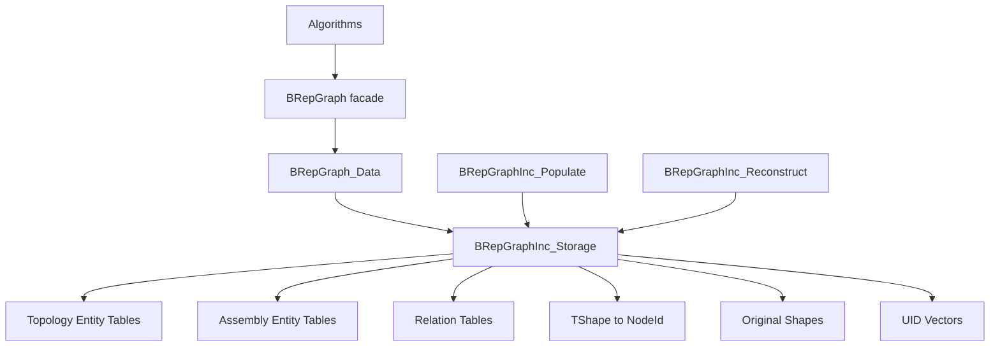
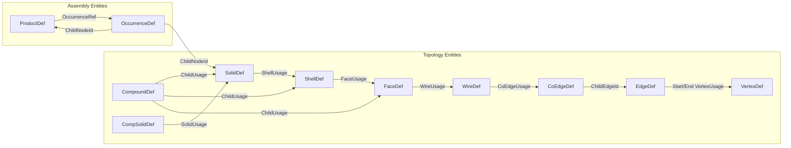
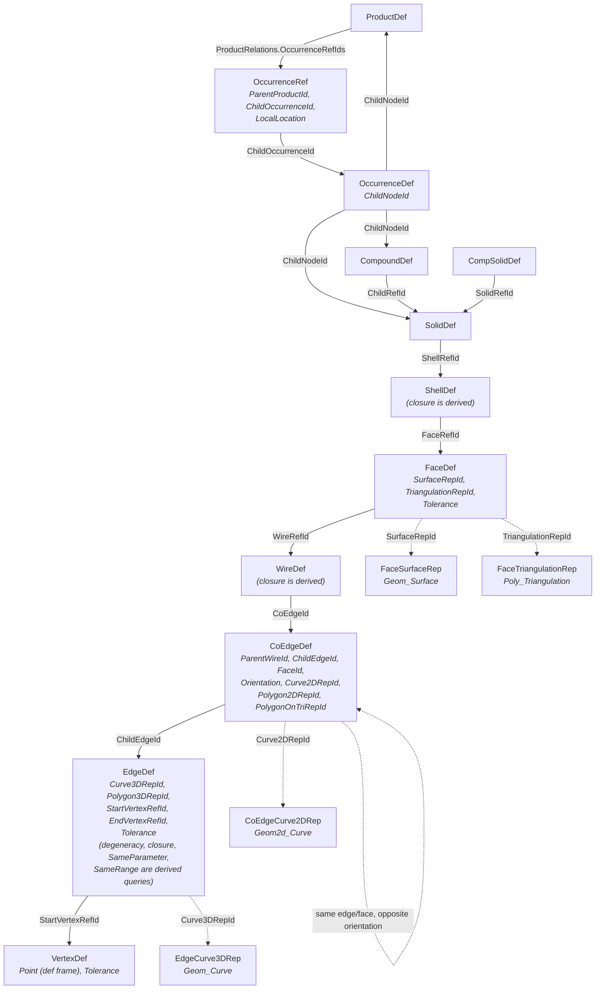
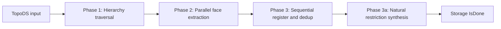
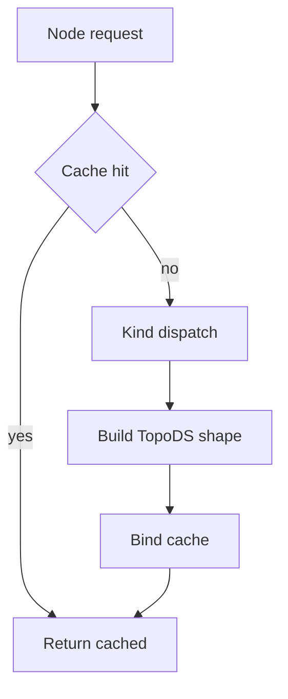

# BRepGraphInc

BRepGraphInc is the incidence-table backend used by BRepGraph. It is also an
intentional low-level API for callers that need direct storage, load, or
reconstruction control.

Use the `BRepGraph` views (`Shapes()`, `Topo()`, `Refs()`, `Editor()`, `Mesh()`)
for ordinary graph workflows. Use `BRepGraphInc` directly when the caller owns
the backend invariants: typed-id bounds, soft-removal flags, relation tables,
UID vectors, generation counters, and cache invalidation.

Direct storage mutation is valid only if the caller also maintains the matching
side effects:

- update relation tables through storage attach/detach helpers, or call the
  storage relation rebuild only from whole-load / whole-rebuild code
- allocate or rebuild UID / RefUID / RepUID vectors and reverse UID indexes
- update active counters and soft-removal bit flags consistently
- invalidate or avoid stale shape caches after topology/representation changes
- run `ValidateRelations()` and, for public boundaries, `BRepGraph_Validate`

The facade does these things automatically; backend users get performance and
control in exchange for maintaining the contract explicitly.

Derived TopoDS semantics that are not core graph state are available through
algorithm runtime services:

- `BRepGraphAlgo_Parameters`
- `BRepGraphAlgo_Regularity`
- `BRepGraph_LayerTopoSupplement`

These services do not make derived data part of backend storage. Core
reconstruction does not replay parameter or regularity cache values.
persisted core incidence model.

## What This Backend Owns

- Topology entity tables (Vertex, Edge, CoEdge, Wire, Face, Shell, Solid, Compound, CompSolid)
- Assembly entity tables (Product, Occurrence)
- Representation entity tables (FaceSurfaceRep, EdgeCurve3DRep, CoEdgeCurve2DRep, FaceTriangulationRep, EdgePolygon3DRep, CoEdgePolygon2DRep, CoEdgePolygonOnTriRep)
- Reference entry tables (ShellRef, FaceRef, WireRef, VertexRef, SolidRef, ChildRef, OccurrenceRef) with BaseRef identity, orientation, and location
- Central relation tables and sparse incoming relation maps
- TShape to NodeId mapping
- Original shape map
- Per-kind UID vectors (11 entity kinds + 7 ref kinds)

## Architecture



## Entity and Ref Model



Notes:

- Intrinsic data lives on entities; context data for shell/face/wire/vertex/solid/child/occurrence usages lives on Ref tables
- CoEdge owns PCurve data for each edge-face binding (Weiler half-edge pattern)
- Product relations: ordered `OccurrenceRefIds`
- OccurrenceRef: `ParentProductId`, `ChildOccurrenceId`, `LocalLocation`
- OccurrenceDef: `ChildNodeId` (topology root for parts, Product for assemblies)

## Entity Hierarchy



## Reference Entry Model

Reference entries are typed incidence edges connecting parent entities to child
definitions. Each ref kind has its own entry table and RefId space, managed by
`RefStore<T>` in Storage.

### BaseRef

Common header for all reference entries:

- `OwnGen`: generation counter for change tracking (incremented on ref mutation)

Removal state is stored in the owning storage bit vectors. Ref parent and child
endpoints live on the ref record itself.

### Ref Types

Concrete ref entry types extend BaseRef with endpoint and context data:

- `ShellRef`, `FaceRef`, `WireRef`, `VertexRef`, `SolidRef`, `ChildRef`, `OccurrenceRef`
- Normal topology refs add typed parent and/or child IDs plus `Orientation`.
- `ChildRef` and `OccurrenceRef` additionally carry `LocalLocation`.

### Relation Tables

Ordered parent-to-child lists are stored in storage-owned relation tables, not
inside definition structs:

- **SolidRelations**: `ShellRefIds[]`
- **ShellRelations**: `FaceRefIds[]`
- **FaceRelations**: `WireRefIds[]`
- **WireRelations**: `CoEdgeIds[]`
- **EdgeRelations**: `CoEdgeIds[]`
- **VertexRelations**: `EdgeIds[]`
- **CompoundRelations**: `ChildRefIds[]`
- **CompSolidRelations**: `SolidRefIds[]`
- **ProductRelations**: `OccurrenceRefIds[]`
- **OccurrenceRelations**: `ParentOccurrenceRefIds[]`

Incoming parent traversal reads derived incoming lists on relation structs or
sparse node-keyed maps (`myNodeToCompounds`, `myNodeToOccurrences`).

### RefStore

`RefStore<T>` in Storage groups per-kind ref entry vector + UID vector + active count. Provides `Get()`, `Change()`, `Append()`, `DecrementActive()` -- same pattern as `DefStore<T>`. Soft-delete state is tracked via `RefStore::RemovedFlags` bit planes in Storage, not on the `BaseRef` struct.

## Indexed Load Preparation Contract

The current backend grows all entity/ref/rep stores through `Append()`. That is correct for
graph construction and editing, but it is the main blocker for single-file indexed loading and
parallel persistence read paths.

For ODE-style indexed load, the backend needs an internal preparation phase before any record
representations are written:

1. determine final counts for every persisted section
2. pre-size outer storage ranges for defs, refs, reps, and UID vectors
3. initialize relation table slots exactly once
4. fill records by typed index
5. run one whole-graph relation rebuild after all canonical forward data is present

### Why relation storage is prepared separately

`DefStore<T>` owns only the outer entity vector and per-kind UID vector.
Definition structs do not own child relation lists. Indexed load prepares the
definition/ref/rep ranges first, then prepares relation arrays and fills the
canonical ordered relation lists from serialized relation sections.

### RefStore and RepStore preparation

`RefStore<T>` currently has no inner vector members, so preparation is simpler:

- pre-size ref records
- pre-size ref UID vectors
- fill parent ids, target ids, location, and orientation by typed index

`RepStore<T>` should also be prepared to final size up front, but representation loading should
be split into two sub-phases:

1. metadata fill:
   `OwnGen`, `IsRemoved`, and rep cross-links such as `PolygonOnTriRep.TriangulationRepId`
2. representation decode:
   geometry and mesh object reconstruction

That split is important for ODE read because geometry and mesh representation decode is the expensive
part and is the best parallelization target.

### Relation load contract

Derived incoming relation lists, sparse maps, and edge caches are maintained at
whole-load granularity. Indexed loaders fill definitions, refs, coedges, and
ordered relation lists first, then perform one final storage relation rebuild.

Editor and builder mutation paths must not call whole relation rebuilds as
repair. They update affected relation entries incrementally with targeted
attach/detach/rebind operations.

## Build Pipeline



| Phase | Mode | What happens |
|-------|------|--------------|
| **Phase 1** | Sequential | Traverse hierarchy. Create container entities (Compound, CompSolid, Solid, Shell). Collect face contexts. |
| **Phase 2** | Parallel | Extract per-face geometry: surface, PCurves, triangulations, vertices, edges. |
| **Phase 3** | Sequential | Register faces, wires, edges, CoEdges with TShape deduplication. Link faces to shells. |
| **Phase 3a** | Sequential | Synthesize wire boundaries for faces with natural restrictions (no explicit wire). Creates vertices, edges, wires, and coedges for surface boundary curves. |

Backend entry point: `BRepGraphInc_Populate::Perform()`.

`BRepGraphInc_Populate::Options` only controls backend extraction passes. Graph-level assembly policy such as root Product creation is owned by `BRepGraph::ShapesView::Options` in the facade layer.

`BRepGraphInc_Populate::Append()` supports incremental addition to an already-populated storage, with TShape dedup against existing entities. Used by `BRepGraph::ShapesView::Add()` for full-hierarchy ingestion; flattened ingestion uses `BRepGraphInc_Populate::AppendFlattened()`.

For normal graph construction, use `BRepGraph::ShapesView::Add()` instead. The facade owns the public lifecycle, view initialization, mutation boundary behavior, and cache coordination on top of this backend pipeline.

### Geometry: Definition-Frame Storage

All geometry is stored in **definition frame** - the TShape-internal location is baked into the geometry, while instance locations are preserved separately in Ref structures.

**Surface**: `S_merged = S0.Transformed(TFace.Location())`
**3D Curve**: `C_merged = C0.Transformed(TEdge.Location())`
**Vertex Point**: `BRep_TVertex::Pnt()` (raw, no Location applied)

Formula: `repLoc = theShapeLoc⁻¹ × theCombinedLoc; if repLoc ≠ Identity: theGeom.Transformed(repLoc)`

### PCurve Extraction

PCurves are extracted directly from `BRep_TEdge::Curves()`, bypassing `BRep_Tool::CurveOnSurface` which can generate phantom computed PCurves via `CurveOnPlane` and has `TopLoc_Location` structural equality issues.

Multi-pass matching in `extractStoredPCurves()`:
- **Pass 1**: exact (Surface, Location) match via `IsCurveOnSurface(S, L)`
- **Pass 2**: surface-handle-only fallback for TopLoc_Location structural equality bug
- **Pass 3**: original (pre-transform) surface handle match
- For seam edges: extracts both PCurves + continuity

### Instance Locations

| Ref Type | What it stores |
|---------------|---------------|
| `ChildRef.LocalLocation` | child shape placement inside a compound |
| `OccurrenceRef.LocalLocation` | product occurrence placement |

Normal topology refs (`ShellRef`, `FaceRef`, `WireRef`, `VertexRef`, `SolidRef`)
and `CoEdgeDef` do not store placement. TopoDS locations from normal topology are
baked into definitions while populating the graph.

### Deduplication

- **TShape dedup**: each unique `TopoDS_TShape*` maps to one graph entity
- **Geometry rep dedup**: surfaces, curves, triangulations deduped by handle pointer in `RepDedup` maps

## Reconstruction Pipeline



Primary API:
- `Node(storage, nodeId)` - independent, local cache
- `Node(storage, nodeId, cache)` - shared cache for vertex/edge reuse
- `FaceWithCache(storage, faceIdx, cache)` - specialized face reconstruction

### Geometry Restoration

All geometry restored with `TopLoc_Location() = Identity` (TShape location already baked):

```cpp
aBB.MakeFace(aNewFace, S_merged, TopLoc_Location(), tol);
aBB.MakeEdge(aNewEdge, C_merged, TopLoc_Location(), tol);
aBB.MakeVertex(aNewVtx, rawPoint, tol);
```

### PCurve Attachment with Location Compensation

Edge temporarily carries composed wire+edge location for correct `BRep_Builder::UpdateEdge` storage key:

```cpp
anEdge.Location(aEdgeInFaceLoc);              // Temporarily apply
aBB.UpdateEdge(anEdge, aPC, aSurf, Identity); // Stores CR with loc⁻¹
anEdge.Location(Identity);                     // Reset after attachment
```

### Special Cases

- **Seam edges**: Two CoEdges with the same edge and face and opposite Orientation. Both PCurves are attached to their CoEdges.
- **Degenerate edges**: `MakeEdge()` + `Degenerated(true)`, no 3D curve.
- **IsClosed**: Set AFTER sub-shapes are added (Add can reset flags).

## Relation Tables

| Map | Purpose |
|-----|---------|
| edge -> wires | Wire membership |
| edge -> faces | Face adjacency from `CoEdgeDef::FaceId` |
| edge -> coedges | CoEdge lookup by parent edge |
| edge face count | Cached O(1) face count per edge |
| vertex -> edges | Vertex incidence |
| wire -> faces | Wire-to-face membership |
| face -> shells | Face-to-shell membership |
| shell -> solids | Shell-to-solid membership |
| solid -> compounds | Compound parents of a solid |
| solid -> compsolids | CompSolid parents of a solid |
| shell -> compounds | Compound parents of a shell |
| face -> compounds | Compound parents of a face |
| compound -> compounds | Compound parents of a compound |
| compsolid -> compounds | Compound parents of a compsolid |
| product -> occurrences | Assembly references |

## Core Invariants

1. **Entity ID**: for each entity vector slot i: `Id.Index == i` and `Id.Kind` matches vector kind
2. **Mapping**: TShape to NodeId must resolve to existing, type-correct entity
3. **Relations**: forward lists, incoming lists, sparse maps, and ref endpoints agree
4. **Removal**: IsRemoved entities must be filtered from normal traversals
5. **Mutation boundary**: entities, relation tables, cache invalidation, and history are coherent after each operation
6. **Assembly**: occurrence cross-references valid; self-referencing rejected; builder-owned root Product creation remains coherent when enabled by build policy

## Memory and Performance

### Typed-Id API and DefStore

All public Storage accessors use strongly-typed ids (`BRepGraph_VertexId`, `BRepGraph_EdgeId`, `BRepGraph_FaceId`, etc.) instead of raw `int` for compile-time safety. Internally, Storage uses two template patterns:

- **`DefStore<T>`**: groups entity vector + per-kind UID vector + active count. Provides `Get()`, `Change()`, `Append()`, `DecrementActive()`.
- **`RepStore<T>`**: groups representation vector + active count. Same accessor pattern, no UID vector.

### Allocator Propagation

Storage containers use the graph's `NCollection_IncAllocator` where the
container type supports allocator propagation:

- **Storage**: entity tables, UID vectors, caches, and transient maps use the storage-owned allocator
- **Relation tables**: outer slots stay stable, inner `NCollection_LinearVector`
  lists grow compactly and are updated incrementally by storage helpers

### Other Performance Notes

- `Append()` allocates UIDs incrementally (O(M) instead of O(N+M))
- Post-passes are optional via `BRepGraphInc_Populate::Options`
- `EdgeRelations` stores only `CoEdgeIds`; edge wire/face adjacency is derived
  from active coedges.

## TopoDS vs GraphInc Comparison (Box)

| Item | Count | GraphInc Storage |
|------|------:|-----------------|
| Solid | 1 | `SolidDef` table |
| Shell | 1 | `ShellDef` table |
| Face | 6 | `FaceDef` table |
| Wire | 6 | `WireDef` table |
| Edge | 12 | `EdgeDef` table |
| CoEdge | 24 | `CoEdgeDef` table |
| Vertex | 8 | `VertexDef` table |
| Product | 1 (auto root) | `ProductDef` table |

Key difference: TopoDS expresses context through shape occurrences. GraphInc keeps canonical entities and stores context on refs.

## File Map

| File | Purpose |
|------|---------|
| `BRepGraphInc_Definition.hxx` | Entity struct definitions |
| `BRepGraphInc_Reference.hxx` | Context reference definitions |
| `BRepGraphInc_Relations.hxx` | Relation structs and list helpers |
| `BRepGraphInc_Storage.hxx/.cxx` | Typed storage and ownership |
| `BRepGraphInc_Populate.hxx/.cxx` | TopoDS -> incidence build and append |
| `BRepGraphInc_Reconstruct.hxx/.cxx` | Incidence -> TopoDS reconstruction |
| `BRepGraphInc_Storage.lxx` | Late-include implementation: `TypedStorePlanes` specializations and template method definitions |
| `BRepGraphInc_BitFlags.hxx` | Bit-plane storage for per-entity boolean flags |
| `BRepGraphInc_BoundaryBuilder.pxx` | Boundary construction helpers (`.pxx` late-include extension) |
| `BRepGraphInc_Instance.hxx` | Instance location handling |
| `BRepGraphInc_Load.hxx` | Indexed load preparation |
| `BRepGraphInc_ParityOrientation.hxx` | Orientation and parity logic |
| `BRepGraphInc_RepId.hxx` | Strongly-typed representation ID types |
| `BRepGraphInc_Representation.hxx` | Geometry representation records |
