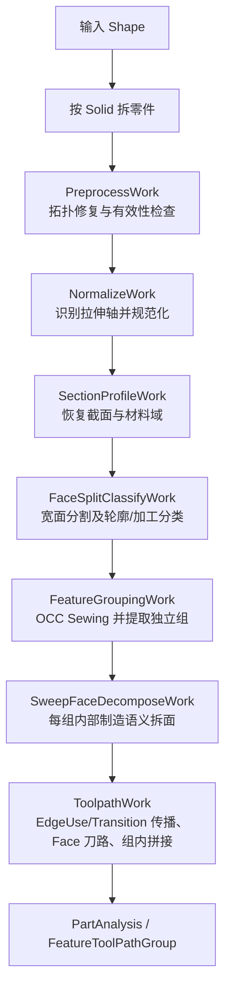

# 拉伸体 BRep 到加工刀路解析方案

> 文档性质：总体方案、详细设计、算法规格、失败策略和验收基线  
> 对应工程：`occ-extrusion-toolpath`  
> 当前实现版本：`0.1.0`  
> 文档状态：持续维护；已实现项以当前源码为事实基线，特征级 EdgeUse/EdgeTransition 方案为下一阶段实现基线  
> 最近设计修订：2026-08-31

## 0. 阅读说明

本文不是概念性介绍，而是当前项目的完整工程方案。文中使用四种状态标记：

- **[已实现]**：已经存在于当前 C++/OCC 代码中，并至少有构造测试或流程测试覆盖。
- **[部分实现]**：主流程已存在，但输入覆盖范围、稳定性或特征级组合仍有限制。
- **[待实现]**：已经给出可落地的算法和接口设计，但当前代码尚未完成。
- **[范围外]**：本文明确不处理；调用者必须拒绝或在上游转换为满足输入契约的形式。

阅读顺序建议：

1. 第 1～4 章了解目标、数据和总流程。
2. 第 5～9 章了解算法如何从 BRep 得到 Face 级临时刀路，其中第 5.7 节是最新特征组解析基线。
3. 第 10～14 章了解为何不做 Boolean、现状边界和代码位置。
4. 第 15 章以后是工程详细设计，包括数据契约、预处理规则全集、一般直纹面识别、凹面分解、特征级拼接、容差、复杂度、诊断和验收。

本文中的“刀具方向”是从轨迹入口点指向材料内部和出口点的切割射线方向。具体机床若使用相反的喷嘴轴正方向，应在后处理器中统一反向，而不是改变几何识别层的含义。

## 1. 目标

输入 Open CASCADE 的 BRep 模型，识别管材原始截面、加工面和加工特征，并把每个能够由激光或水刀直线射流加工的 Face 转换为带连续姿态的刀路。

本方案不使用实体布尔减恢复“原料减成成品”的差集。核心思路是：

1. 从现有 BRep 中恢复原料截面和材料域。
2. 将贴合原料轮廓的 Face 分类为轮廓面，其余 Face 分类为加工面。
3. 把加工面整理成制造语义明确的 Face 单元。
4. 保留最终 Sewing/拆分后的原始 `TopoDS_Edge` 身份，在每个 Face 的 EdgeUse 上记录局部入口、出口和侧边语义。
5. 从轮廓边开始，用有方向的 EdgeTransition 在特征组内逐步解析切透、半切透、内坡口和内底面。
6. 对每个已确定加工段的 Face，以加工轨迹和有序关键点分析直线母线族，输出关键点对应母线和被加工边。
7. 依据被加工边的 EdgeTransition 把相邻关键母线之间的区域逻辑划分为 Through/Partial SweepSlice，并生成 Face 级临时刀路。
8. 将同一特征组内可连接、可合并的临时刀路整理为最终刀路链。

因此，这不是用 Face 集合模拟一次 OCC Boolean Cut，而是直接从最终模型的边界拓扑和曲面几何中证明某条刀路是否成立。

## 2. 输入与输出

### 2.1 整模型入口

```cpp
std::vector<PartAnalysis> AnalyzeAssembly(const TopoDS_Shape& assembly);
```

如果输入含有多个 `Solid`，先按 `Solid` 拆为零件，再对每个零件独立运行完整 Pipe。没有 `Solid` 时，将整个 Shape 当作一个零件分析。

### 2.2 已知加工特征入口

```cpp
FeatureAnalysis CompileFeatureGroup(
    const TopoDS_Shape& featureGroup,
    const std::vector<TopoDS_Wire>& sectionWires,
    const gp_Ax3& sectionFrame,
    std::size_t featureIndex = 0);
```

这个入口对应上游已经得到一个加工特征组的情况。`featureGroup` 由一组相连的加工 Face 组成；`sectionWires` 描述原始管材的外轮廓和内孔轮廓。

### 2.3 单 Face、已知轨迹入口

```cpp
bool TryBuildToolpath(
    const TopoDS_Face& face,
    const TopoDS_Wire& cuttingTrajectory,
    const std::vector<TopoDS_Wire>& sectionWires,
    const gp_Ax3& sectionFrame,
    Toolpath& outToolpath);
```

接口约定：

- 返回 `true`：`outToolpath` 中已经包含完整的 XYZ、IJK、进给方向、法向和材料深度。
- 返回 `false`：无法证明给定轨迹能够加工完整 Face，`outToolpath` 一定被清空。
- 不向调用者暴露半成品刀路。

当前 `TryBuildToolpath` 是 0.1 版兼容入口。特征组目标实现把“直纹面分析”和“刀路切片生成”拆开。直纹面分析的输入是 Face、已经选定的加工段精确轨迹，以及需要显式求母线的有序关键点：

```cpp
bool AnalyzeRuledFace(
    const TopoDS_Face& face,
    const TopoDS_Wire& machiningTrajectory,
    const std::vector<TrajectoryKeyPoint>& keyPoints,
    RulingAnalysis& outAnalysis);
```

`machiningTrajectory` 可以由多个原始 EdgeUse 组成；`keyPoints` 至少包含轨迹首尾和这些 EdgeUse 之间的拓扑顶点。成功时 `outAnalysis.KeyRulings` 与输入关键点一一对应，同时给出被加工边和完整 `RulingMap`。此阶段不判断 Through/Partial。

语义分析完成后，按母线族参数区间生成逻辑切片刀路：

```cpp
bool GenerateToolPathSlice(
    const TopoDS_Face& face,
    const RulingAnalysis& ruling,
    double firstRulingParameter,
    double lastRulingParameter,
    CutMode mode,
    Toolpath& outToolpath);
```

两个接口都遵循 `bool + out`：返回 `false` 时对应输出对象必须清空。

## 3. 核心概念

### 3.1 材料域

所有截面 Wire 被投影到截面坐标系。点相对这些闭合轮廓被分类为：

- `OnBoundary`：位于原料表皮。
- `InMaterial`：位于实体材料中。
- `InVoid`：位于管孔或原料外部。

多个闭环使用奇偶规则组合，因此可以表达一条外轮廓和多个内孔。

### 3.2 制造语义 Face

制造语义 Face 是边界分段和曲面分段已经显式化的 Face。一个“真实制造边界段”不等于一个 OCC Edge：它在数据结构上应是一个有序 `TopoDS_Wire`，可以包含一个或多个连续、同语义的 coedge。这样 Sewing 为 T 形连接点切出的多个共线 Edge 仍属于同一个边界段；反过来，隐藏在一条复合 B-spline Edge 中的直线、圆弧等不同语义区间则必须拆开。

例如跑道孔侧壁若被上游建成一张 C1 复合拉伸面，本方案在直线与半圆的 C2 断点处分割，得到四张 Face：直线、半圆、直线、半圆。每张子 Face 一般具有两条 Rail 和两条母线侧边。

本文所说的“三边 Face”或“四边 Face”，指外 Wire 经 `BoundarySegmentBuilder` 归并后的**逻辑边界段数**，不是 `TopExp_Explorer` 遍历到的原始 Edge 数量。Sewing 在 T 点处把一条长边切成多个共享 Edge 后，这些 Edge 仍可组成同一条逻辑段。

### 3.3 Edge、EdgeUse 与 EdgeTransition

三者不能混用：

- `EdgeId / TopoDS_Edge`：最终 Sewing 和拆分后保留下来的原始拓扑身份，只回答“是不是同一条边”。
- `EdgeUse`：某个 Edge 在某张 Face、某个 Wire occurrence 和方向下的一次使用，即 coedge。它回答“这条边对当前 Face 是入口、出口还是侧边”。
- `EdgeTransition`：沿某个共享 Edge 从源 Face 指向目标 Face 的有向关系。它回答“源 Face 加工到此处以后，目标侧是坡口、半切透底还是同一加工面的连续延伸”。

因此，同一个原始 Edge 可以同时满足：

```text
(E, FaceA) = ExitEdge
(E, FaceB) = EntryEdge
(E, FaceC) = SideEdge

(E, FaceA -> FaceB) = Bevel
(E, FaceA -> FaceC) = HalfCutBottom
```

这不是冲突。错误做法是给原始 `TopoDS_Edge` 写一个全局且唯一的“坡口边/半切透底边/入口边”枚举。正确的键分别是：

```text
EdgeUseKey       = (EdgeId, FaceId, WireOccurrenceId, Orientation)
EdgeTransitionKey = (EdgeId, SourceEdgeUseId, TargetEdgeUseId)
```

### 3.4 可扫掠单元

一个 Face 能成为可扫掠单元，需要存在一条边界轨迹 `C(t)` 和一族直线母线：

```text
L(t, s) = C(t) + s · D(t),  0 <= s <= depth(t)
```

并满足：

1. `C(t)` 位于 Face 的真实边界上。
2. `D(t)` 是该曲面的合法直线母线方向，可以随 `t` 连续变化。
3. 轨迹进给方向不能与 `D(t)` 平行，否则只沿一根母线移动，扫掠面积为零。
4. 每根母线从入口点出发，能在 Face 的其他边界上找到对应出口点。
5. 母线内部点位于该 trimmed Face 内。
6. 母线内部点不能落入截面孔洞或材料外部。
7. 整条轨迹的所有采样位置都通过以上验证。

可扫掠不等于刀姿恒定，也不要求 Face 是平面。梯形平面、半圆柱面和满足条件的 NURBS 直纹面都可以成为一个单元。

## 4. 总体流程



默认 Pipe 仍包含七个 Work。`ToolpathWork` 内部分为“最终拓扑索引与种子选择、加工段驱动的直纹面分析、被加工边 Transition 与逻辑 SweepSlice、切片刀路生成、特征刀路装配”五个子阶段，不为数据流拆出额外顶层 Work。每个 Work 的中间数据都保存在 `AnalysisJob` 中，可以单独检查或替换。

## 5. 七阶段详细步骤

### 5.1 PreprocessWork：基础拓扑修复

对输入 Shape 执行：

1. 使用 `ShapeFix_Shape` 修复 Wire 排序、小拓扑间隙、缺失或错误的 PCurve、Face/Wire 方向等常见 STEP 问题。
2. 使用 `BRepLib::SameParameter` 统一 Edge 的三维曲线参数和 Face 上 PCurve 参数。
3. 使用 `BRepCheck_Analyzer` 做严格有效性检查。

如果修复后仍不是有效 BRep，则本零件停止分析。后续所有拆面、相交和点分类都依赖可靠的 Face trimming，不能带病继续。

### 5.2 NormalizeWork：识别并规范化拉伸轴

候选轴来源包括：

- 直线 Edge 的方向，按 Edge 长度投票。
- 圆柱面和圆锥面的轴线，按 Face 面积投票。
- 线性拉伸面的拉伸方向，给予较高权重。
- 平面法向，作为辅助候选。

对每个候选方向继续统计：

- 有多少面积的 Face 沿该方向不变。
- 是否存在法向与候选轴平行的端面。
- 带内外 Wire 的完整端面给予更高权重。

得分最高的方向被选为拉伸轴；前两名过于接近时产生 `axis.ambiguous` 诊断。

随后执行：

1. 将识别轴旋转到规范坐标系的 `+Y`。
2. 将当前实现计算出的顶点平均中心移动到原点。
3. 按 `InputLengthScale` 统一缩放，毫米为 `1.0`，英寸输入可用 `25.4`。
4. 保存 `SourceToNormalized` 和 `NormalizedToSource`，便于结果映射回原坐标系。

注意：当前代码使用所有顶点的平均位置作为中心，不是包围盒中心。如果必须严格使用 BOX 中心，可以只替换 `BuildSourceFrame` 的原点计算，不影响后续算法。

### 5.3 SectionProfileWork：恢复管材截面

1. 收集沿拉伸轴不变的 Face：轴向平面、同轴圆柱面、同轴圆锥面和同方向线性拉伸面。
2. 从这些 Face 的横向边恢复截面曲线，并投影到 XoZ 截面平面。
3. 对投影曲线按端点连接关系闭环，恢复 outer/inner `sectionWires`。
4. 如果轴向 Face 的投影不能闭环，尝试从最可信的完整端面恢复 Wire。
5. 两种方式都失败时产生 `section.not-closed`，不退回到布尔截面。
6. 收集所有截面 Edge 端点，形成后续宽面分割所需的 `SectionBreakPoints`。

### 5.4 FaceSplitClassifyWork：宽面分割与 Face 分类

这一阶段解决“截面轮廓已经分段，但轴向宽 Face 没有同步分段”的问题。

对每个 Face：

1. 找出落在该 Face 横向 Rail 内部、但还不是 Face 顶点的截面分段点。
2. 从该点沿拉伸轴生成分割 Edge。
3. 使用 `BRepFeat_SplitShape` 将宽 Face 物化为多个 `FacePatch`。
4. 判断每个 FacePatch 是否贴合原料轮廓：
   - 它是端面或沿拉伸轴不变的原料候选面；并且
   - 所有边界采样点投影后都位于截面边界。
5. 满足条件的标记为 `Contour`，其余标记为 `Machining`。

这一步等价于从最终 BRep 的 Face 集合中识别“原料仍保留的表皮”，而不是执行实体布尔减。

### 5.5 FeatureGroupingWork：OCC Sewing 与加工特征分组

只把 `Machining` FacePatch 加入一次 `BRepBuilderAPI_Sewing`：

1. Sewing 使用统一距离容差，开启 Face 缝合、退化分析、自由边切分和 SameParameter，关闭非流形模式与局部容差扩张。
2. `Perform()` 后通过 `Modified(sourceFace)` 把每个输入 Face 映射到实际输出 Face；`SourceFaceId`、角色和已有拆分标记随映射保留。
3. 直接遍历 `SewedShape()`：一个独立 `Face`、`Shell` 或 `Solid` 就是一个 `FeatureGroupJob`；若返回 `Compound`，递归提取其中的独立组件。
4. 不再对几何位置做第二次距离邻接，也不要求输入面事先 `IsSame`。几何重合且处于 Sewing 容差内的边由 OCC 统一成真正共享的 `TopoDS_Edge`。
5. 若来源历史或结果组件无法映射，保留原 Face 为单独组并给出诊断，不能静默丢面。

T 形连接是重要特例。上下 Face 分段位置错开时，Sewing 会在横向长边上增加拓扑分点，使连接双方共享 Edge；这可能增加某张 Face 的原始 coedge 数量，但不会自行把一张合法矩形 Face 变成多张 Face。后续语义边界构造必须把共线、同角色的这些 coedge 重新组成一个 `TopoDS_Wire` 段。

### 5.6 SweepFaceDecomposeWork：组内制造语义拆面

该 Work 在每个已经 Sewing 的 `FeatureGroupJob` 内部运行，目标是让最终 `make_wire` 语义段数对应真实制造边数，并保持组内共享拓扑。

当前实体拆面处理分两步：

1. 合并同域碎 Edge。
   - 只合并几何上同域的微小 Edge 碎片。
   - 不合并相邻 Face。
   - 不把任意 C1 B-spline 再拼成一条 Edge。
2. 在边界、PCurve 和曲面的 C2 连续性断点处分割。
   - 跑道的直线与半圆通常是 G1/C1，但曲率不连续，因此能在 C2 级别暴露分界。
   - 曲面也在对应母线位置被真正分成多个 Face。

每个特征组必须作为一个整体执行清理和拆分。这样相邻 Face 的替换 Edge 来自同一个 OCC 修改上下文，仍然是共享拓扑对象；不能逐 Face 单独运行修改器。处理完成后更新该组的 `FacePatchIds` 和 `Shape`，并保留每个子 Face 的 `SourceFaceId`、稠密 ID 与 `MaterializedSplit`。

当前 C2 实体拆分已经落地；把一个或多个同语义 coedge 归并成 `TopoDS_Wire` 段、并以“每个输出 Face 不超过四个语义段”为强制后置条件的通用 `BoundarySegmentBuilder` 仍需继续补全。

### 5.7 ToolpathWork：特征组 Edge 状态求解与刀路装配

0.1 版源码中的“排除内部共享边，再逐条 Edge 尝试第一条成功轨迹”仅保留为单 Face 兼容算法。它不能正确表达 K 坡、半切透底面，也不能表达“多个上游被加工边共同组成下一张 Face 的一条完整逻辑边”。生产目标算法必须按本节实现。

#### 5.7.1 建立一次拓扑索引

对一个 `FeatureGroupJob::Shape` 一次性建立：

```cpp
struct LogicalBoundarySegment
{
    SegmentId Id;
    FaceId OwnerFace;
    TopoDS_Wire Wire;                 // 使用 OwnerFace 自己的 Wire 顺序和方向
    std::vector<EdgeUseId> EdgeUses;  // 一条逻辑段可含多个原始 Edge
    bool Closed = false;
};

using ExitBoundary =
    std::variant<LogicalBoundarySegment, TopoDS_Vertex>; // Strip/Periodic 或 Fan

struct TrajectoryKeyPoint
{
    KeyPointKind Kind;                 // Start / End / EdgeBoundary / Pinch / Seam
    double TrajectoryParameter;
    gp_Pnt Position;
    std::optional<VertexId> Vertex;    // 真实拓扑顶点才有值
    std::optional<EdgeUseId> Previous;
    std::optional<EdgeUseId> Next;
};

struct MachiningSegment
{
    SegmentId Segment;
    TopoDS_Wire Trajectory;            // 原始精确曲线，不离散重建
    std::vector<EdgeUseId> EdgeUses;
    std::vector<TrajectoryKeyPoint> KeyPoints; // 沿轨迹严格有序
    bool Closed = false;
};

struct EdgeUse
{
    EdgeUseId Id;
    EdgeId CanonicalEdge;             // 对应最终拓扑中的 TopoDS_Edge
    FaceId Face;
    SegmentId Segment;
    int WireOccurrence = 0;           // seam 等情况允许同一 Edge 在同一 Face 多次出现
    TopAbs_Orientation Orientation;
    FaceLocalEdgeRole Role = FaceLocalEdgeRole::Unknown;
};

struct EdgeTransition
{
    EdgeId Edge;
    EdgeUseId Source;
    std::optional<EdgeUseId> Target;
    TransitionKind Kind;               // Bevel / HalfCutBottom / Continuation
};
```

需要同时维护：

- `EdgeId -> [EdgeUseId...]`：找到一条原始 Edge 在哪些 Face 中被怎样使用。
- `FaceId -> [LogicalBoundarySegment...]`：只使用该 Face 自己的外 Wire 构造逻辑段。
- `EdgeUseId -> incoming/outgoing EdgeTransition`：保存有方向的加工语义。
- `SegmentId -> MachiningSegment`：保存精确轨迹及其起终点、raw EdgeUse 分界顶点等关键点。

这里禁止丢弃原始 Edge 后再按空间投影重建边。Sewing 和组内拆分已经给出了最终拓扑身份；逻辑段只是这些原始 EdgeUse 的有序分组。

#### 5.7.2 Face 局部解析

一次 Face 解析任务不是单独 Face，也不是任意 raw Edge，而是：

```text
(当前 Face, 当前 Face 的完整 MachiningSegment)
```

`MachiningSegment` 已经包含加工段的精确复合轨迹、按轨迹顺序排列的 EdgeUse，以及需要显式输出母线的关键点。它由轮廓种子或完整 incoming Transition 覆盖选定；直纹面分析不会脱离加工边对整张 Face 盲目枚举最终刀路。

调用：

```cpp
bool AnalyzeRuledFace(
    const TopoDS_Face& face,
    const TopoDS_Wire& machiningTrajectory,
    const std::vector<TrajectoryKeyPoint>& keyPoints,
    RulingAnalysis& out);
```

解析器完成以下几何工作：

1. 验证给定加工轨迹确实位于当前 Face 边界，并且进给方向横切候选母线族。
2. 识别零到两条 `SideRail`。典型侧边是直线母线段；它可以由一个或多个几何共线的 NURBS/B-spline EdgeUse 组成。
3. 从其他边界中找到与加工轨迹对应的完整 `MachinedBoundary`；三角形允许退化为一个顶点，周期面允许闭合 Rail 且没有普通侧边。
4. 建立从加工轨迹到被加工边的连续 `RulingMap`，证明一族直线母线完整覆盖当前 trimmed Face。
5. 对每个输入关键点输出一根 `KeyRuling`，严格保持 `KeyRulings.size() == keyPoints.size()` 和相同顺序。
6. 保存母线模型、拓扑类型、拟合误差以及后续可按任意轨迹参数补算母线的求值器。

关键点只是“要求显式输出母线的位置”，此时没有 Through/Partial。关键点包括加工轨迹首尾、组成轨迹的相邻 raw EdgeUse 公共顶点、上游给出的分段点，以及周期/seam/pinched 等几何事件；普通刀路采样点不属于关键点。

如果一项必需关键点找不到唯一合法母线，除允许的 Fan/Pinched 退化外，整个候选返回 `false`。直纹面分析的缓存键必须包含：

```text
(TopologyRevision, FaceId, MachiningSegmentId)
```

同一 Face 换一条加工段重新分析，不能复用仅按 FaceId 建立的结果。

Face 局部角色只写到 EdgeUse：

```text
(FaceId, EdgeUseId) -> MachiningEdge / MachinedEdge / SideEdge / ProfileEdge / FreeEdge
```

同一原始 Edge 在相邻 Face 中可以拥有不同局部角色。后继 Face 必须使用它自己的 `MachiningSegment::Trajectory`、关键点顺序和方向，不能继承前驱 Face 的 Wire 方向。

#### 5.7.3 根据 MachinedBoundary 判定切透、半切透和后继语义

直纹面分析成功并得到 `MachinedBoundary` 后，对其中每个源 EdgeUse 枚举同一 `EdgeId` 的其他目标 EdgeUse，并从材料侧计算源 Face 到目标 Face 的有向凹凸关系：

| 出口情况 | 当前 Face 刀路模式 | 有向 Transition | 目标 Face 含义 |
|---|---|---|---|
| Machined EdgeUse 位于截面轮廓/原料表皮 | `Through` | 无目标 | 已切到原料另一侧，当前传播分支结束 |
| 非轮廓且仅一个 EdgeUse，已证明是合法独立面片/打标面 | `Partial` | 无目标 | 开放式半切透或打标边界 |
| 源到目标为凸关系 | `Through` | `Bevel` | 目标是内坡口候选，待完整入口段就绪后继续解析 |
| 源到目标为凹关系 | `Partial` | `HalfCutBottom` | 目标是内底面候选 |
| 源到目标切向连续 | 继承当前区间 | `Continuation` | 两张 Face 只是同一加工面的拓扑分片 |

凹凸必须以“源 Face 的有向 EdgeUse + 两张 Face 的材料侧法向”为基准计算，不能只比较无方向的两个法向。Face 方向反转测试必须得到同样业务结论。

一条原始 Edge 关联三个或更多 EdgeUse 时，不得仅因入射数量超过二就直接失败。算法对 `(SourceEdgeUse, TargetEdgeUse)` 逐对建立 Transition：同一源 Edge 可以对一个目标是 `Bevel`，对另一个目标是 `HalfCutBottom`。若多个几何上不可区分的目标导致真正歧义，则保留诊断并拒绝把该分支标为已完整解析；不能用一个全局 Edge 枚举覆盖所有目标。

“仅关联一个 Face 且不在轮廓上”也不自动表示模型缺面。若该 Face 本身是合法可扫掠的独立面片，可表达打标/半切透路径，按 `Partial` 处理；只有不满足开放面片上下文时才诊断为缺面或分组错误。

#### 5.7.4 完整逻辑段覆盖与逻辑 SweepSlice

后继是否就绪，由**后继 Face 自己的逻辑段**决定。设目标 Face 的某段为：

```text
TargetSegment = { e1, e2, e3 }
```

三个已解析源 Face 的 MachinedBoundary 分别贡献 `{e1}`、`{e2}`、`{e3}` 是合法情况。只有当目标段内每个目标 EdgeUse 都收到了指向该 Face 的兼容 Transition 后，整段才就绪：

- 全部为 `Bevel` 或允许组合的 `Continuation`：该完整段连同自己的精确轨迹和关键点成为目标 Face 的 `MachiningSegment`，入队解析。
- 全部为 `HalfCutBottom`：该 Face/对应区域标为 `InnerBottom`，不生成刀路。
- 只覆盖一部分：继续等待，不能拿半条段提前解析。
- 同一逻辑段不同区域收到互不兼容的语义：利用 `RulingMap` 在加工轨迹上补充对应 `KeyRuling`，然后在相邻关键母线之间建立逻辑 `SweepSlice`。每个 Slice 独立决定 `Through` 或 `Partial`，不因加工语义不同而实体拆 OCC Face。

这个覆盖判断基于 `EdgeId/EdgeUseId` 集合，不需要重新拟合参数区间，也不需要把若干边几何投影后再猜它们是否拼成目标段。

若加工轨迹本身是一个 raw Edge，而被加工边的不同 EdgeUse 具有不同模式，对应分界点只作为该加工 Edge 上的参数点保存：

```text
原 Face 和原 Edge 不变
  -> SweepSlice [t0, t1] Through
  -> SweepSlice [t1, t2] Partial
```

只有为了修复几何不可扫掠、凹域或母线多区间才在 `SweepFaceDecomposeWork` 中实体拆 Face。若下游最终强制要求独立 `TopoDS_Face`，应收集全部分割母线后整组一次性物化，并使旧的 EdgeUse、Segment、Ruling 和 Transition 缓存全部失效后重建；不得边拆边继续使用旧缓存。

#### 5.7.5 从轮廓种子运行到固定点

处理队列中的元素是 `(FaceId, CompleteMachiningSegmentId)`，不是单独 Face，也不是单独 Edge：

```cpp
BuildCanonicalEdgeAndEdgeUseIndex(featureGroup);
BuildLogicalBoundarySegmentsForEveryFace();

for (每张 Face 的每条完整 OnProfile 逻辑段)
    Enqueue(Face, profileSegment);

while (!queue.empty())
{
    auto [face, machiningSegmentId] = queue.pop();
    if (HasProcessed(face, machiningSegmentId))
        continue;

    const MachiningSegment& segment =
        GetMachiningSegment(face, machiningSegmentId);

    RulingAnalysis ruling;
    if (!AnalyzeRuledFace(
            GetFace(face), segment.Trajectory,
            segment.KeyPoints, ruling))
    {
        DiagnoseFaceCandidateFailure(face, machiningSegmentId);
        continue;
    }

    SaveFaceLocalEdgeRoles(ruling);
    auto transitions = CreateDirectionalTransitions(ruling);
    AddKeyRulingsForSemanticBoundaries(ruling, transitions);
    auto slices = BuildLogicalSweepSlices(ruling, transitions);
    GenerateProvisionalToolpaths(slices); // 纯 InnerBottom 不产生刀路
    RefreshTargetSegmentCoverageAndEnqueue(transitions);
}

ClassifyUnresolvedFaces();
ConnectAndMergeProvisionalToolpaths();
```

这里“处理结束”只表示队列达到固定点：没有新的完整目标段可被激活。它不表示从轮廓出发只生成一条刀路，也不表示遇到一个坡口/底面就终止整个特征。一个 K 坡可以从多个种子和多个分支得到多张 Face 的临时刀路；最终由组内装配阶段决定哪些连接、哪些保持为独立链。

#### 5.7.6 Face 与特征级输出不变量

- 每个已解析且不是纯 `InnerBottom` 的可扫掠 Face，至少产生一个逻辑 SweepSlice；相邻同 CutMode Slice 可合并为一条 Face 级临时 Toolpath，混合语义保持多条区间路径。
- 纯内底面只记录 EdgeUse/Transition 和 `InnerBottom` 状态，不产生刀路。
- `CutMode` 不由曲面几何单独决定，而由 MachinedBoundary 上的 Transition 语义决定：`Through`、`Partial`，或分区后的两者组合。
- Through/Partial 分区只产生参数区间和 EdgeUseInterval，不创建新的 `TopoDS_Edge/Vertex/Face`，因此不会破坏前序拓扑缓存。
- 一个特征组最终输出 `std::vector<ToolpathChain>`；允许一条开链、一条闭链、多条互不连接的链，以及分叉处拆开的多条链。
- 路径只有在几何端点、拓扑顺序、进给方向、IJK、`CutMode` 和工艺参数都兼容时才允许合并。

这个策略仍不要求 Face 一定有普通侧边。无侧边圆柱面可直接用两条 Rail 和直线母线律验证；周期面以闭合 Rail 处理。

## 6. 已知加工轨迹和关键点的直纹面分析

### 6.1 输入契约

正式直纹面分析不是“只给 Face 判断它是不是直纹面”，而是验证一条指定加工段能否通过直线母线族完整扫过该 Face：

```cpp
bool AnalyzeRuledFace(
    const TopoDS_Face& face,
    const TopoDS_Wire& machiningTrajectory,
    const std::vector<TrajectoryKeyPoint>& keyPoints,
    RulingAnalysis& outAnalysis);
```

前置条件：

1. 调用开始先清空 `outAnalysis`。
2. Face 和加工轨迹不能为 Null；Face 只有一个 trimming Wire，含内 Wire 的 Face 超出本文范围。
3. 加工轨迹必须是当前 Face 自己的一条完整逻辑边界段，可以由多个 raw EdgeUse 组成。
4. `keyPoints` 按加工方向严格排序，至少包含轨迹起点、终点和相邻 raw EdgeUse 的公共顶点。
5. 每个关键点必须带精确复合轨迹参数；真实拓扑顶点同时保留 VertexId 和前后 EdgeUseId。
6. 轨迹使用 OCC 原始复合曲线，不能先离散成折线再重采样。

关键点不是普通刀路采样点。它表示“直纹面分析必须在此轨迹位置显式输出一根完整母线”，用于后续逻辑拆解。

### 6.2 识别母线族和被加工边

根据 Face 的底层曲面类型和给定加工轨迹产生候选方向律：

| 曲面 | 母线方向律 |
|---|---|
| 圆柱面 | 圆柱轴方向，恒定 |
| 线性拉伸面 | 拉伸方向，恒定 |
| 圆锥面 | 当前轨迹点指向锥顶 |
| 平面 | 由加工轨迹两端的边界母线/侧边约束选定；平面自身有无限多母线族 |
| B-spline/Bezier 面 | 当前接受 U 或 V 次数为 1 的参数方向；一般直纹 NURBS 使用后续方向场识别器 |

对加工轨迹采样点 `P(t)`：

1. 计算候选直线母线方向 `D(t)`。
2. 检查轨迹切向与 `D(t)` 不平行；圆柱轴向轨迹会在这里失败。
3. 沿母线找到 Face 其他边界上的唯一对应点 `Q(t)`。
4. 确认所有 `Q(t)` 连续落在同一完整被加工逻辑段上，或在 Fan 中合法退化为顶点。
5. 验证 `P(t)->Q(t)` 位于底层 Surface，内部属于 trimmed Face，并且不穿过截面孔洞或材料外部。
6. 建立连续、保序的 `RulingMap`：

```text
P(t) = MachiningTrajectory(t)
Q(t) = MachinedBoundary(phi(t))
L(t) = segment(P(t), Q(t))
```

被加工边是分析结果，不是该接口的输入。每个候选方向律可尝试必要的正反方向，最终选择满足完整覆盖且误差最小的结果。

### 6.3 对输入关键点逐个输出母线

输出必须保持输入关键点的数量和顺序：

```cpp
struct KeyRuling
{
    std::size_t KeyPointIndex;
    double RulingParameter;

    double MachiningParameter;
    gp_Pnt MachiningPoint;

    double MachinedBoundaryParameter;
    gp_Pnt MachinedPoint;
    std::optional<EdgeUseId> MachinedEdgeUse;

    gp_Dir Direction;
    double Length;
    bool Degenerated = false;
};
```

必须满足：

```text
outAnalysis.KeyRulings.size() == keyPoints.size()
keyPoints[i] <-> outAnalysis.KeyRulings[i]
```

每个关键点 `K_i` 的加工点就是 `P_i`；利用同一 `RulingMap` 求得被加工边上的 `Q_i`，`P_i-Q_i` 为对应母线。除 Fan/Pinched 的合法退化点外，任一必需关键点找不到唯一母线，整个候选返回 `false`。

### 6.4 关键母线与逻辑 SweepSlice

相邻两根关键母线天然围出一个最小逻辑扫掠区间：

```text
K0 ---- K1 ---- K2 ---- K3    加工轨迹
|       |       |       |
L0      L1      L2      L3    关键母线
|       |       |       |
Q0 ---- Q1 ---- Q2 ---- Q3    被加工边

Slice0 = [L0, L1]
Slice1 = [L1, L2]
Slice2 = [L2, L3]
```

直纹面分析只输出几何事件，不给 Slice 标记 Through/Partial。后续语义分析若在被加工边发现新的 EdgeUse 分界顶点，可用 `RulingMap` 反求其加工轨迹参数并调用：

```cpp
bool EvaluateKeyRuling(
    const RulingAnalysis& analysis,
    const TrajectoryKeyPoint& keyPoint,
    KeyRuling& outRuling);

bool EvaluateKeyRulingFromMachinedVertex(
    const RulingAnalysis& analysis,
    const TopoDS_Vertex& machinedVertex,
    KeyRuling& outRuling);
```

第二个函数同时输出该顶点在加工轨迹上的对应参数点。将新母线插入有序事件表，再对相邻同 CutMode 区间进行逻辑合并。这里不创建新 OCC Edge/Vertex/Face；对面 Rail 即使只有一个 raw Edge，也只引用其参数子区间。

### 6.5 输出结构

```cpp
struct RulingAnalysis
{
    FaceId Face;
    SegmentId MachiningSegment;
    ExitBoundary MachinedBoundary;

    std::optional<SegmentId> StartSide;
    std::optional<SegmentId> EndSide;

    RulingMap Correspondence;
    std::vector<KeyRuling> KeyRulings;

    SweepTopology Topology;
    SweepModel Model;
    double MaximumSurfaceError;
};
```

`RulingAnalysis` 不包含 `CutMode`、`Bevel`、`HalfCutBottom` 或 `InnerBottom`。它只回答“给定加工轨迹怎样通过母线扫过 Face”。

### 6.6 伪代码

```cpp
bool AnalyzeRuledFace(face, trajectory, keyPoints, out)
{
    out = {};
    if (!ValidateInput(face, trajectory, keyPoints))
        return false;

    for (const RulingLaw& law :
         RecognizeRulingLaws(face, trajectory))
    {
        RulingAnalysis candidate;
        if (!BuildFullRulingMapAndMachinedBoundary(
                face, trajectory, law, candidate))
            continue;

        if (!EvaluateAllRequiredKeyRulings(
                keyPoints, candidate))
            continue;

        KeepBestCandidate(candidate);
    }

    if (!HasValidCandidate())
        return false;

    out = MoveBestCandidate();
    return true;
}
```

0.1 兼容函数 `TryBuildToolpath(face, trajectory, ...)` 把直纹面分析、普通采样和整段刀路生成封装在一次调用内；目标特征算法使用上述拆分接口，以便在语义阶段复用 `RulingMap` 和关键母线。

## 7. 输出的扫掠拓扑

| 类型 | 含义 | 典型例子 |
|---|---|---|
| `Strip` | 两条非退化 Rail | 矩形或梯形加工面 |
| `FanToPoint` | 出口 Rail 退化为点；`FanFromPoint` 已预留但当前不会主动生成 | 三角形加工面 |
| `DoublePinched` | 两条 Rail 在轨迹首尾都相交，中间深度非零 | 圆柱面上的双尖加工区 |
| `Periodic` | CuttingRail 几何闭合且没有普通首尾侧边 | 完整圆柱的环形轨迹 |

刀姿不要求恒定。例如梯形面可作为一张 Face 输出，`ToolDirection` 沿轨迹连续旋转，不需要仅因为刀姿变化而拆面。

## 8. 典型场景结果

### 8.1 半圆柱面 + 半圆轨迹

- 半圆轨迹横切圆柱的轴向母线族。
- 返回 `true`。
- XYZ 沿半圆变化。
- IJK 始终平行圆柱轴。
- 材料深度等于圆柱面的轴向跨度。

### 8.2 圆柱面 + 轴向线段轨迹

- 轨迹本身平行圆柱母线。
- 进给方向与母线方向叉积接近零。
- 这条轨迹只描述一根切割射线，不能扫过二维 Face。
- 返回 `false`，输出清空。

### 8.3 三角形平面

- 两条侧边在顶点相交。
- 对端 Rail 退化为点。
- 当前返回 `FanToPoint`。若后续为特征级拼接而反转加工方向，可转换为 `FanFromPoint`。

### 8.4 跑道孔侧壁单 Face

- `FeatureGroupingWork` 先用 Sewing 建立该加工特征组。
- C1 复合曲线在四个 C2 语义区间上分段。
- 侧壁物化为四张四边 Face。
- 四张 Face 仍共享新生成的母线 Edge。
- 组的 `FacePatchIds` 和 `Shape` 更新为这四张子 Face，组身份不变。

### 8.5 无侧边的双尖圆柱加工面

- 不要求先找到普通侧边。
- 选择一条横向 Rail 作为轨迹。
- 首尾材料深度为零，中间深度大于零。
- 返回 `DoublePinched`。

## 9. 明确返回 false 的情况

以下任一条件成立时，不输出刀路：

- Face、轨迹或截面数据无效。
- Face 含内 Wire，超出当前输入范围。
- 轨迹不在 Face 边界。
- 曲面类型不在当前支持范围，无法得到可靠母线方向律。
- 轨迹方向与母线方向平行。
- 某个非 pinched 位置找不到出口边界。
- 母线内部离开 trimmed Face。
- 母线穿过管孔或材料外部。
- 母线长度在非退化位置接近零。
- OCC 求值、投影或相交过程中抛出异常。

宁可返回 `false`，也不生成几何上看似连续但不能覆盖整个加工面的刀路。

## 10. 为什么不依赖 Boolean Cut

本方案所需操作主要是局部、低维操作：

- Shape healing。
- Edge/Face 的语义分割。
- 点到截面区域分类。
- 直线与 Face 边界求交。
- trimmed Face 内点检查。
- OCC Sewing 统一加工面的共享拓扑并提取独立 Face/Shell 组件。

它不需要构造一个理想原料实体，再与成品执行全局三维布尔减。这样避免了 Boolean Cut 对微小间隙、共面区域、容差累积和复杂相交网络的敏感性。局部操作仍可能失败，但失败范围局限在一个 Face 或一个候选轨迹，并且能明确返回诊断或 `false`。

## 11. 当前已经落地的能力

- 装配体按 Solid 拆零件。
- ShapeFix、SameParameter 和 BRep 有效性检查。
- 拉伸轴投票、对齐 +Y、原点移动和公英制缩放。
- outer/inner 截面 Wire 恢复及材料/孔洞分类。
- 截面分段点驱动的宽 Face 物化分割。
- 轮廓面与加工面分类。
- 加工 Face 通过 OCC Sewing 建立共享 Edge，并按独立结果组件分组。
- 每个已分组特征内部执行同域碎 Edge 清理和 C2 制造语义拆面。
- 保留组内语义拆面后的共享 Edge，并同步更新组的 FacePatch 列表。
- 单 Face 兼容入口中的逐边候选轨迹试验；这是当前实现，不是最终特征组算法。
- 平面、圆柱、圆锥、线性拉伸面及 degree-1 参数方向 B-spline/Bezier 面。
- `Strip`、`Fan`、`DoublePinched` 和单 Face `Periodic`。
- `bool + out Toolpath` 公共接口。

## 12. 当前边界与下一步

### 12.1 任意凹 Face 凸分解尚未通用化

当前实现能够通过：

- 截面分段点拆宽面；
- C2 连续性断点拆复合面；
- 每根母线内部点验证；

处理已经具有明显语义断点的情况。但尚未实现“任意凹 trimmed Face 自动分解成最少凸可扫掠单元”。没有被前两类规则拆开的凹面，如果任一母线越出 Face，会安全返回 `false`。

后续在 `SweepFaceDecomposeWork` 中增加 UV 域分解：识别凹顶点和母线方向场，再沿合法母线切分 Face，直到每个子 Face 对任一轨迹参数只有一个连续材料区间。含内 Wire 的 Face 不在本文范围内，不由本项目隐式拆孔。

### 12.2 全局 C2 光顺 NURBS 的制造语义恢复

如果上游用一张全局 C2 光顺近似 NURBS 把直线和圆弧彻底模糊，连续性断点不存在。后续需要增加按公差的曲率/直线/圆弧拟合分段器，而不能仅依赖 OCC 曲线类型或 C2 断点。

### 12.3 一般自由直纹面的识别

当前 NURBS 支持限定为 U 或 V 次数为 1，母线方向与参数方向一致。参数方向不沿母线的一般自由直纹面，后续需要实现方向场搜索和全 Face 直线覆盖验证。

### 12.4 特征级刀路拼接

当前能为特征组内每张可扫掠 Face 独立生成刀路，但最新的特征级语义求解尚未落地。待实现内容包括：

- 原始 Edge/EdgeUse/EdgeTransition 三层索引。
- 从轮廓种子开始、以完整目标逻辑段覆盖为就绪条件的固定点求解。
- 基于有向凹凸关系的 `Bevel / HalfCutBottom / Continuation` 判定。
- `Through / Partial` 路径模式和纯内底面抑制。
- 多 Face 刀路排序与拼接。
- 闭合特征的一笔连续加工规划。
- 进刀、退刀和穿孔点。
- 割缝补偿。
- 机床轴限位与姿态可达性。
- 喷嘴/刀头碰撞检查。

## 13. 验证策略

当前自动测试覆盖：

- 矩形管 outer/inner 截面恢复。
- 旋转零件的拉伸轴识别和两倍尺寸缩放。
- 截面断点将宽 Face 拆成两个 FacePatch。
- 跑道侧壁单 Face 拆成四张 Face，并保持为一个共享 Edge 特征组。
- 梯形面输出刀姿连续变化的 `Strip`。
- 三角形面输出点 Rail `Fan`。
- 几何直线但 OCC 类型为 B-spline 的侧边。
- 半圆柱面配半圆轨迹返回 `true`。
- 圆柱面配轴向轨迹返回 `false` 并清空旧输出。
- 无普通侧边的双尖圆柱面输出 `DoublePinched`。

## 14. 代码位置

- 公共 API：`include/etp/Analyzer.hxx`
- 数据结构：`include/etp/Types.hxx`
- Pipe/Work/Job：`include/etp/Pipeline.hxx`
- 基础修复：`src/pipeline/PreprocessWork.cxx`
- 规范化：`src/pipeline/NormalizeWork.cxx`
- 截面恢复：`src/pipeline/SectionProfileWork.cxx`
- 宽面分割与分类：`src/pipeline/FaceSplitClassifyWork.cxx`
- 制造语义拆面：`src/pipeline/SweepFaceDecomposeWork.cxx`
- 特征分组：`src/pipeline/FeatureGroupingWork.cxx`
- 逐边轨迹选择：`src/SweepCompiler.cxx`
- 直纹面和刀路验证：`src/RulingToolpath.cxx`
- 回归测试：`tests/AnalyzerTests.cxx`

下一阶段建议新增并由 `ToolpathWork` 编排：

- 逻辑段及 EdgeUse 索引：`include/etp/FeatureEdgeContext.hxx`、`src/FeatureEdgeContext.cxx` **[待实现]**。
- 有向 Transition 与固定点求解：`include/etp/FeatureTopologySolver.hxx`、`src/FeatureTopologySolver.cxx` **[待实现]**。
- 加工段驱动直纹面分析：在 `RulingToolpath` 中新增 `AnalyzeRuledFace(face, trajectory, keyPoints, out)`，输出 MachinedBoundary、RulingMap 和 KeyRulings **[待实现]**。
- 逻辑语义切片：`include/etp/SweepSlice.hxx`、`src/SweepSlice.cxx`，只建立母线参数区间，不修改 OCC 拓扑 **[待实现]**。
- 切片刀路生成：新增 `GenerateToolPathSlice(face, ruling, t0, t1, mode, out)` **[待实现]**。
- 临时路径连接/合并：`include/etp/FeatureToolpathAssembler.hxx`、`src/FeatureToolpathAssembler.cxx` **[待实现]**。

# 第二部分：工程详细设计

## 15. 需求规格

### 15.1 功能需求

| 编号 | 需求 | 当前状态 |
|---|---|---|
| FR-001 | 读取 STEP、IGES 和 BREP，并保留 OCC 拓扑 | **[已实现]** |
| FR-002 | 装配输入按互不重复的 `Solid` 拆为零件 | **[已实现]** |
| FR-003 | 修复常见导入拓扑错误并拒绝无效 BRep | **[已实现]** |
| FR-004 | 自动识别拉伸轴，也允许未来由上游显式指定 | 自动识别 **[已实现]**；显式零件轴接口 **[待实现]** |
| FR-005 | 把零件变换到统一坐标系和统一长度单位 | **[已实现]** |
| FR-006 | 恢复一条外截面和零到多条内截面 | **[已实现]**，复杂脏图仍需增强 |
| FR-007 | 根据截面分段点拆除轴向宽 Face | **[已实现]** |
| FR-008 | 把轮廓面与加工面分开，不依赖 Boolean Cut | **[已实现]** |
| FR-009 | 让一个 coedge 尽量对应一个制造语义边段 | C2 断点 **[已实现]**；全局光顺拟合分段 **[待实现]** |
| FR-010 | 将相连加工 Face 分成独立特征组 | **[已实现]** |
| FR-011 | 对单 Face 和指定边界轨迹返回 `bool + out Toolpath` | **[已实现]** |
| FR-012 | 支持沿轨迹连续改变 IJK，而不是限定恒定刀姿 | **[已实现]** |
| FR-013 | 支持无普通侧边、单点退化和双端退化 | **[已实现]** |
| FR-014 | 支持一般自由 NURBS 直纹面 | **[待实现]**；当前只支持 degree-1 参数方向 |
| FR-015 | 把任意复杂 trimmed Face 分成母线单区间单元 | **[待实现]** |
| FR-016 | 以 `(EdgeId, FaceId, occurrence)` 建立 EdgeUse，并保留原始 Edge 身份 | **[待实现]** |
| FR-017 | 以有向 EdgeTransition 解析坡口、半切透底和连续分片 | **[待实现]** |
| FR-018 | 多个上游 Machined Edge 集合完整覆盖下一 Face 的一条逻辑 MachiningSegment 后再激活 | **[待实现]** |
| FR-019 | 对 `Face + MachiningTrajectory + OrderedKeyPoints` 返回被加工边、RulingMap 以及与关键点一一对应的 KeyRulings | **[待实现]** |
| FR-020 | Through/Partial 变化只建立逻辑 SweepSlice 和 EdgeUseInterval，不修改 OCC Face/Edge/Vertex | **[待实现]** |
| FR-021 | 将一个特征内多 Face 临时刀路连接、合并为零到多条 ToolpathChain | **[待实现]** |
| FR-022 | 输出源坐标系刀路、割缝补偿、进退刀和碰撞结果 | **[待实现]** |

### 15.2 正确性要求

1. 不允许因为某些采样点成功，就输出一条覆盖不完整 Face 的刀路。
2. 不允许母线穿过截面内孔或原料外部。
3. 不允许把沿母线方向的 Edge 当作横向加工轨迹。
4. 不允许失败时保留上一次调用留下的旧 `Toolpath`。
5. Sewing 分组后进行组内拆面，拆面必须保留组内共享 Edge，且不得改变特征组归属。
6. 所有近似判定必须显式受容差和采样参数控制。
7. 当前不能可靠判断的输入必须产生诊断或返回 `false`。
8. 不允许把 Face 局部角色或源到目标的有向加工语义写成原始 Edge 的全局唯一属性。
9. 后继 Face 只有在自己的一整条逻辑边界段被兼容 Transition 完整覆盖后才能开始解析。
10. 一个原始 Edge 存在三个以上 EdgeUse 时必须逐 Source/Target occurrence 判定，不能按入射数量直接判失败。
11. `AnalyzeRuledFace` 成功时，KeyRulings 数量、顺序和索引必须与输入 keyPoints 完全一致。
12. 语义 SweepSlice 不允许改变 TopologyRevision；任何实体拆分都必须使旧 EdgeUse、Ruling 和 Transition 缓存整体失效。

### 15.3 稳定性要求

- 不使用 `BRepAlgoAPI_Cut/Fuse` 或 `BOPAlgo` 重建原料差集。
- 拆分失败时尽量保留原 Face，并使后续判定安全失败。
- 每个 Work 只依赖前序 Work 已发布的数据。
- OCC 异常不能越过公共 `bool` API。
- 单个不支持的加工 Face 不应阻断同一特征内其他 Face 的分析。

### 15.4 可观测性要求

- 每个 Work 输出名称、耗时、执行前后诊断数量和成功状态。
- `FacePatch` 保存原始 Face ID 和是否发生物化拆分。
- `SweepUnit` 保存来源 Face、入口/出口 Rail、侧边、模型类型、拓扑类型和姿态序列。
- 整零件结果保留正反坐标变换和结构化诊断。

## 16. 系统边界与基本假设

### 16.1 本层负责什么

本层是“几何识别与几何刀路生成层”，负责回答：

- 原料截面是什么？
- 哪些 Face 是原料表皮，哪些是切出来的加工面？
- 某个加工 Face 是否能由一族直线射线覆盖？
- 若能，入口 XYZ、射线 IJK、进给方向和材料深度是什么？

### 16.2 本层不负责什么

当前不负责：

- 机床运动学逆解。
- A/B/C 旋转轴角度选择。
- 轴限位、奇异点和速度规划。
- 喷嘴直径、焦距或水刀锥度模型。
- 割缝补偿。
- 碰撞检测。
- 穿孔、进刀、退刀和工艺参数。
- 多特征全局加工顺序优化。

这些内容应消费本层输出，而不应反向混入 BRep 识别逻辑。

### 16.3 几何假设

1. 原料是沿一个主轴拉伸得到的管材或型材。
2. 原料截面在轴向上保持不变。
3. 激光或水刀在一个瞬时姿态下沿直线射线穿过材料。
4. 可加工 Face 的每个轨迹位置，应对应一个连续材料区间。
5. 输入可以包含平面、解析曲面和 NURBS 表达，但当前并非所有 NURBS 都可识别。

### 16.4 拓扑假设

- 进入语义分析前，Shape 必须是有效 BRep。
- 同一个特征内真正相邻的 Face 在进入 EdgeUse 求解前必须共享最终 OCC Edge；由前序 Sewing/组内拆分保证，不在传播阶段做几何重合猜测。
- 一个制造语义单元必须只有一个外 trimming Wire；含内 Wire 的 Face 不进入本方案后续阶段。
- 常规制造语义单元应为三或四条逻辑边界段；超过四段必须继续分解，无侧边情况必须匹配已知专门拓扑。
- seam 和退化 Edge 是曲面参数化产物，不是普通制造边。

## 17. 坐标系、单位与输出语义

### 17.1 源坐标系

`SourceShape` 保留输入文件坐标。`PreprocessWork` 在源坐标系中执行修复。

### 17.2 规范化坐标系

规范化后：

- 拉伸轴为 `+Y`。
- 截面平面为 XoZ。
- `SectionFrame.Direction()` 为 `+Y`。
- `SectionFrame.XDirection()` 定义截面二维 X。
- `SectionFrame.YDirection()` 定义截面二维第二坐标，对应三维截面中的另一轴。

点的轴向站位为：

```text
station(P) = (P - frame.origin) · frame.axis
```

截面二维坐标为：

```text
x2d = (P - origin) · frame.xDirection
y2d = (P - origin) · frame.yDirection
```

### 17.3 变换顺序

当前变换为：

```text
P_normalized = Scale(InputLengthScale) · Align(SourceFrame -> TargetFrame) · P_source
```

`SourceToNormalized` 和其逆 `NormalizedToSource` 都存入结果。

### 17.4 当前中心定义

当前 `BuildSourceFrame` 使用所有拓扑顶点坐标的算术平均作为原点。它不是：

- BBox 中心；
- 质量中心；
- 截面面积中心；
- 轴向范围中点与截面中心的组合。

如果业务要求 BOX 中心，应把原点改为包围盒中心。这个改变只影响规范化平移，不影响轴方向和拓扑识别。

### 17.5 当前输出坐标

整零件 Pipe 生成的 `ToolPose::Position` 位于规范化坐标系。若后处理需要源坐标：

```cpp
gp_Pnt sourcePoint = pose.Position;
sourcePoint.Transform(part.NormalizedToSource);

gp_Dir sourceDirection = pose.ToolDirection;
sourceDirection.Transform(part.NormalizedToSource);
```

方向变换只应使用旋转部分。当前统一缩放不会改变单位方向，但未来若引入非刚性变换，必须显式分离旋转和缩放。

### 17.6 单位与容差注意事项

当前同一个 `DistanceTolerance` 同时用于规范化前修复和规范化后分析。如果输入单位是英寸并设置 `InputLengthScale = 25.4`，理想实现应区分：

- `InputDistanceTolerance`：源模型单位下的修复容差。
- `NormalizedDistanceTolerance`：统一单位下的识别容差。

当前版本尚未拆成两个参数，这是进入生产前应修正的容差一致性问题。

## 18. Job 数据流与 Work 契约

### 18.1 核心状态

| 字段 | 产生者 | 消费者 | 含义 |
|---|---|---|---|
| `SourceShape` | 调用者 | Preprocess | 原始零件 |
| `WorkingShape` | Preprocess/Normalize | 后续全部 Work | 当前处理 Shape |
| `SourceToNormalized` | Normalize | 输出/后处理 | 源到规范坐标变换 |
| `NormalizedToSource` | Normalize | 输出/后处理 | 规范到源坐标变换 |
| `ExtrusionAxis` | Normalize | Section、Classify | 规范化后固定为 `+Y` |
| `SectionFrame` | Normalize | SectionRegion、Toolpath | 截面坐标系 |
| `AxisParallelFaces` | SectionProfile | 调试/检查 | 轴向不变 Face |
| `SectionWires` | SectionProfile | Classify、Toolpath | 外轮廓和内孔 |
| `SectionBreakPoints` | SectionProfile | FaceSplitClassify | 截面语义端点 |
| `FacePatches` | FaceSplitClassify/Decompose | Grouping、Toolpath | 轮廓/加工子 Face |
| `FeatureGroups` | FeatureGrouping | ToolpathWork | 加工面连通分量 |
| `LogicalSegments` | SweepFaceDecompose/Toolpath | ToolpathWork | 每张 Face 自己的有序逻辑边界段及其原始 EdgeUse |
| `MachiningSegments` | ToolpathWork 拓扑索引/覆盖求解 | 直纹面分析 | 被选加工段的精确轨迹、EdgeUse 顺序和有序关键点 |
| `EdgeUses` | ToolpathWork 拓扑索引 | Face 解析/传播 | 原始 Edge 在具体 Face/Wire occurrence 中的局部身份和角色 |
| `RulingAnalyses` | ToolpathWork Face 几何分析 | 语义切片/刀路生成 | 按 `(Revision, Face, MachiningSegment)` 缓存的被加工边、RulingMap 和 KeyRulings |
| `EdgeTransitions` | ToolpathWork Face 解析 | 覆盖求解/CutMode | SourceEdgeUse 到 TargetEdgeUse 的有向坡口、底面或连续关系 |
| `SweepSlices` | ToolpathWork 语义切片 | 刀路生成 | 不修改 OCC 拓扑的母线参数区间及单一 CutMode |
| `ProvisionalToolpaths` | ToolpathWork Face 编译 | 组内装配 | 尚未连接/合并的 Face 级刀路或区间切片 |
| `ToolpathChains` | ToolpathWork 组内装配 | 输出 | 一个特征组的零到多条开链/闭链 |
| `Diagnostics` | 各 Work | Pipe/输出 | 结构化问题 |
| `Reports` | Pipe | 调用者 | 阶段耗时与状态 |

### 18.2 Work 前置条件和后置条件

| Work | 前置条件 | 成功后置条件 |
|---|---|---|
| Preprocess | `SourceShape` 非 Null | `WorkingShape` 为有效 BRep |
| Normalize | 有效 `WorkingShape` | 轴为 +Y，正反变换存在，轴向范围有效 |
| SectionProfile | 轴与截面 Frame 已知 | 至少一条有效闭合截面 Wire，或产生 Error |
| FaceSplitClassify | 截面有效 | 每个源 Face 至少对应一个 FacePatch |
| FeatureGrouping | 加工 FacePatch 已分类 | 每张加工 Face 属于且只属于一个组 |
| SweepFaceDecompose | FeatureGroup 非空 | 组内制造语义子 Face、稠密 Patch ID、共享 Edge 和组身份保留 |
| Toolpath | 截面和特征组有效 | 每个就绪任务按 Face+加工轨迹+关键点输出 RulingAnalysis；EdgeUse/Transition 可追踪；语义 Slice 不修改 OCC 拓扑；特征输出零到多条刀路链 |

### 18.3 Pipe 失败行为

`Pipe::Run` 顺序执行 Work：

1. 捕获 `Standard_Failure`，生成 `pipe.occ-failure`。
2. 捕获 `std::exception`，生成 `pipe.work-failure`。
3. 当前 Work 出现 Error 后停止后续 Work。
4. Warning 不终止 Pipe。
5. 每个已执行 Work 都产生 `WorkReport`。

## 19. Face 预处理规则全集

“预处理”不是一个单独动作，而是分布在 `PreprocessWork`、`FaceSplitClassifyWork` 和 `SweepFaceDecomposeWork` 的三级处理。

### 19.1 规则矩阵

| 问题 | 识别方式 | 当前处理 | 目标后置条件 | 状态 |
|---|---|---|---|---|
| Wire 顺序错误、小间隙、方向错误 | `ShapeFix_Shape` | 修复 | Face 可正确遍历 | **[已实现]** |
| 3D Curve 与 PCurve 参数不一致 | SameParameter 检查 | `BRepLib::SameParameter` | 同参数指向同一空间点 | **[已实现]** |
| 修复后仍为无效 BRep | `BRepCheck_Analyzer` | 停止零件 | 不让无效 trim 进入算法 | **[已实现]** |
| 一条真实曲线被碎成多个同域 Edge | 同域几何和容差 | `UnifySameDomain`，只统一 Edge | 一个真实段一个 coedge | **[已实现]** |
| 直线/圆弧隐藏在 C1 复合 B-spline 中 | C2 连续性断点 | 连续性拆 Edge 和 Surface | 每个制造 span 独立 Face | **[已实现]** |
| 截面有断点、轴向 Face 却过宽 | 截面端点落在横向 Rail 内部 | 沿轴构造 Edge 并 SplitShape | 宽面同步分段 | **[已实现]** |
| seam Edge | `BRep_Tool::IsClosed(edge, face)` | 标记并从轨迹候选排除 | 不误当制造边 | **[已实现]** |
| 退化 Edge | `BRep_Tool::Degenerated` | 求交和轨迹阶段忽略 | 不生成零长轨迹 | **[已实现]** |
| 微小 Face | 面积与距离容差平方比较 | 组内语义拆面后过滤 | 不进入刀路，组列表同步更新 | **[已实现]** |
| Face 有内 Wire | Wire 数量大于一 | 返回 false | 明确诊断并要求上游拆分；本文不处理 | **[范围外]** |
| 任意凹 trimmed Face | 母线内部离开 Face | 当前在刀路验证时返回 false | 按母线单调性拆分 | **[待实现]** |
| 全局 C2 光顺拟合掩盖制造段 | 曲率/拟合模型变化 | 当前无法拆 | 公差拟合后物化断点 | **[待实现]** |
| 拆分后一个 Face 仍超过四条逻辑边界段 | `BoundarySegmentBuilder` 输出段数 | 当前未强制 | 继续按母线单区间拆分，直到每张 Face 为 3/4 段或合法无侧边类型 | **[待实现]** |
| 同一原始 Edge 出现在三张以上 Face | `EdgeId -> EdgeUse[]` | 当前会把它们连为同组 | 不按数量直接失败；逐 Source/Target EdgeUse 建有向关系，真歧义才诊断 | **[待实现]** |
| 几何重合但拓扑不共享的相邻 Face | 边界几何匹配 | OCC Sewing 统一边界并用 Modified 映射来源 | 输出真正共享 Edge；不同组件不误合并 | **[已实现]** |
| 自交 Wire | BRep 有效性和 UV 交点 | 依赖 ShapeFix/BRepCheck | 明确拆环或拒绝 | **[部分实现]** |

### 19.2 “凸 Face”应如何准确理解

加工需要的并不是传统三维欧氏意义上的凸曲面。真正需要的是相对某一母线族的“单区间性”或“母线单调性”：

```text
对任意轨迹参数 t，Face ∩ ruling(t) 必须恰好是一个连续区间，
允许区间在一个端点退化为点。
```

因此：

- 一个几何上弯曲的半圆柱面可以是合格单元。
- 一个平面凹多边形可能不是合格单元。
- 一个有孔 Face 通常在部分母线上产生两个材料区间，必须拆分。
- “所有凹 Face 变凸 Face”的实现目标应改写为“所有 Face 变成母线单区间 Face”。

在本文当前“不考虑内 Wire”的范围内，实体分解后的目标拓扑是：常规 `Strip` 为四条逻辑段，`Fan` 为三条逻辑段，无普通侧边时必须属于已经证明的 `DoublePinched / Periodic` 等专门类型。普通 Face 若仍超过四条逻辑段，说明它还不是最终可扫掠单元，不能把多出来的段留给 `ToolpathWork` 猜测。

这个定义直接对应激光/水刀的一根直线射线只能穿过一个连续加工厚度的物理要求。

### 19.3 为什么语义拆分必须整组执行

假设 Face A 和 Face B 共享 Edge E。如果分别运行拆分器：

```text
A -> E_A1 + E_A2
B -> E_B1 + E_B2
```

即使 `E_A1` 与 `E_B1` 空间重合，它们也可能拥有不同 `TShape`，不再是拓扑共享边。按 Edge 身份建图时，A 与 B 会断开。

当前实现将所有 `FacePatch` 放入同一个 Compound：

```text
group-wide UnifySameDomain
        -> one shared modification history
group-wide ShapeDivideContinuity
        -> one shared ReShape context
```

再通过历史把结果映射回各源 Face，从而保留共享拓扑。

## 20. 拉伸轴识别详细算法

### 20.1 候选方向归一化

轴没有天然正负。候选方向先按 X、Y、Z 字典序统一符号，使 `D` 和 `-D` 落入同一组。两个候选的绝对点积达到角度阈值时合并。

合并阈值为：

```text
cos(max(5 × AngularToleranceRadians, 1e-3))
```

### 20.2 初始权重

| 来源 | 初始权重 |
|---|---:|
| 直线 Edge | `max(edgeLength, distanceTolerance)` |
| 平面法向 | `sqrt(faceArea)` |
| 圆柱轴 | `faceArea` |
| 圆锥轴 | `faceArea` |
| 线性拉伸面方向 | `2 × faceArea` |

### 20.3 全局评分

对每个候选轴 `D`：

```text
score(D) = seedWeight(D)
         + Σ area(axis-invariant face)
         + Σ capWeight(face)
```

端面权重：

```text
capWeight = area × 6.0    当端面含多个 Wire
capWeight = area × 0.15   当端面只有一个 Wire
```

多 Wire 端面很可能直接包含管材外轮廓和内孔，因此权重更高。

### 20.4 歧义处理

若第二名得分达到第一名的 95%，仍选择第一名，但输出 `axis.ambiguous`。生产接口应增加：

```cpp
std::optional<gp_Dir> ForcedExtrusionAxis;
```

当上游或用户明确轴时跳过投票，以解决正方体、对称型材和过短零件的固有歧义。

### 20.5 当前未使用的配置

`AnalyzerOptions::MaximumAxisCandidates` 已存在，但当前 `RecognizeAxis` 尚未用它截断候选集合。生产化时应在候选合并并按初始权重排序后限流，避免极端脏模型产生过多全 Face 扫描。

## 21. 截面恢复与材料域详细算法

### 21.1 轴向不变 Face

当前支持：

- 平面法向近似垂直拉伸轴。
- 圆柱轴近似平行拉伸轴。
- 圆锥轴近似平行拉伸轴。
- `Geom_SurfaceOfLinearExtrusion` 的拉伸方向近似平行主轴。

### 21.2 从轴向 Face 恢复横截面 Edge

对轴向 Face 的每条 Edge 采样：

1. 计算所有采样点的轴向最小/最大站位。
2. 若站位跨度大于 `5 × DistanceTolerance`，认为它是轴向 Edge，不参与截面。
3. 否则将 Edge 沿轴平移到截面零站位。
4. 丢弃长度不大于距离容差的 Edge。
5. 用 9 个重采样点比较正向和反向距离，去掉不同轴向位置投影出的重复 Edge。

### 21.3 当前闭环方式

当前从每条未使用 Edge 出发，按端点距离贪心寻找下一条 Edge；若当前尾点靠近候选尾点，则反转候选 Edge。回到起点后生成一个 Wire。

这能处理干净模型，但不是完整图论解法。目标实现应改为：

1. 对容差内端点聚类为图节点。
2. Edge 作为无向图边，保留原曲线和方向信息。
3. 删除悬挂支路或产生诊断。
4. 求所有简单闭环或最小环基。
5. 按二维包含关系建立 outer/inner 层级。
6. 面积最大的最外层闭环作为 outer，其内部奇数层为孔、偶数层为材料岛。
7. 若存在多个互不包含的大闭环，按多实体截面或错误输入处理。

这才是用户最初提出的“Edge 相交/连接图 + 最大闭合外轮廓 + 多个内轮廓”的完整版本。

### 21.4 端面回退

轴向 Edge 无法闭环时：

1. 找法向平行轴的平面 Face。
2. 按 `area × 4`（多 Wire）或 `area`（单 Wire）评分。
3. 使用最佳端面的全部 Wire。
4. 输出 `section.cap-fallback`。

### 21.5 材料域分类

每条 Wire 被离散为闭合二维折线。对点 `P`：

1. 求它到所有折线段的最小距离。
2. 距离不大于 `DistanceTolerance` 时返回 `OnBoundary`，并记录 Wire、Edge 和段参数引用。
3. 否则对所有闭环执行 even-odd 点在多边形内测试。
4. 每进入一个闭环翻转一次材料状态。

这种规则不依赖 Wire 顺逆方向，能表达外轮廓、多个孔和嵌套材料岛。它依赖截面 Wire 不自交；自交 Wire 应在预处理阶段拆开或拒绝。

## 22. Face 与 Edge 分类详细规则

### 22.1 轮廓 Face

一个 FacePatch 被标记为 `Contour`，当前必须同时满足：

1. 它是端面，或者沿拉伸轴保持不变；
2. 它所有 Edge 的全部采样点投影后都是 `OnBoundary`。

否则标记为 `Machining`。

这个判定避免仅用底层 Surface 类型分类。例如圆柱面可能是原管圆柱表皮，也可能是加工孔壁；是否贴合截面边界才是关键。

### 22.2 原始 Edge 只做身份，不做全局角色

对最终 FeatureGroup 建立 `TopTools_IndexedDataMapOfShapeListOfShape` 或等价索引。原始 `TopoDS_Edge` 的职责只有：

- 稳定标识最终拓扑中的同一条边；
- 找到所有使用它的 Face/Wire occurrence；
- 作为 EdgeUse 和 EdgeTransition 的公共关联键。

以下字段禁止直接放在全局 EdgeRecord 上：`Entry`、`Exit`、`Side`、`Bevel`、`HalfCutBottom`。前三项是 Face 局部角色，后两项是有方向的 Source/Target 关系。

### 22.3 EdgeUse 的 Face 局部分类

对每个 `(EdgeId, FaceId, WireOccurrence, Orientation)` 先记录不依赖传播的事实：

1. `Degenerate`：`BRep_Tool::Degenerated`。
2. `SurfaceSeam`：`BRep_Tool::IsClosed(edge, face)`；同一 Edge 在同一 Face 可有两个 occurrence。
3. `OnProfile`：该 EdgeUse 的全部采样点投影后都在截面轮廓上。
4. `CrossMaterialSideCandidate`：几何上为直线母线段；一个或两个端点在皮上；内部进入材料且不穿孔。
5. `FreeBoundary`：在当前特征中没有其他 Face EdgeUse 使用同一原始 Edge。
6. 其余保持 `Unknown`，等 Face 解析后再写成 Entry/Exit/Side。

“是否共享”是拓扑事实，不再等价于“内部边，排除”。共享 EdgeUse 恰恰是特征语义在 Face 之间传递的核心。

### 22.4 几何直线而非 OCC 名称直线

侧边不要求底层曲线类型是 `Geom_Line`。Edge 采样点需要满足：

- 全部点到首尾弦线的距离小于距离容差；
- 相邻切向与总体方向的夹角小于角度容差。

因此，几何上共线的 B-spline/NURBS Edge 也可成为侧边。

### 22.5 Face 局部 Machining/Machined/Side 判定

Face 解析器不把单个 raw Edge 当候选，而从该 Face 的完整逻辑段中选 `MachiningSegment`。轮廓种子由完整 `OnProfile` 逻辑段产生；内部 Face 则由完整 incoming Transition 覆盖产生。`MachiningSegment` 同时携带精确轨迹和有序关键点。

给定 MachiningSegment 后：

- 明确母线方向且位于首尾的直线逻辑段为 SideRail 候选；
- 由直纹面分析寻找与加工轨迹通过完整母线族对应的 MachinedBoundary；
- 三角形允许 MachinedBoundary 退化为顶点；
- DoublePinched/Periodic 允许没有普通 SideRail；
- 只有所有必需关键点都得到唯一合法母线且完整 Face 验证通过，才把相应 EdgeUse 提交为 `MachiningEdge / MachinedEdge / SideEdge`，失败候选不得污染状态。

若同一 Face 有多个完整入口候选，分别试验并保存候选结果，最后结合 Transition 覆盖、拟合误差、加工长度、姿态变化和相邻路径可连接性评分，不能依赖 Wire 遍历顺序选择“第一条成功”。

### 22.6 所有段都在表皮时的特殊场景

“开口管型在边上切掉一块”可能出现所有边界段都被分类为 `OnProfile`。此时仍按完整逻辑段工作，不按单个 Edge 工作。

生产版应增加显式特殊规则：

1. 从 `OnSkin` Edge 中枚举两两组合。
2. 两段不相交，且各自几何上为直线或稳定母线段。
3. 两段的全部采样点落在同一候选平面内。
4. 该平面与原料截面边界对应的轴向表皮一致，而不是任意穿过零件的平面。
5. 两段作为 `StartSide/EndSide`，其余完整逻辑段才进入 Entry/Exit 候选。
6. 若存在多个等价侧边对，不猜测，保留多候选评分或输出歧义诊断。

该特殊规则目前是 **[待实现]**。0.1 源码中的逐 Edge 试验只作为兼容回退，不能代表本文目标行为。

## 23. 直纹面识别完整方案

### 23.1 数学定义

若曲面片能够写成：

```text
S(u, v) = A(u) + v · B(u)
```

其中固定 `u`、改变 `v` 得到一条空间直线，则它是直纹面。`A(u)` 可以是直线、圆弧、B-spline 或一般 NURBS；决定直纹性的不是 Rail 是否为 NURBS，而是另一参数方向是否生成直线。

更一般地，只要曲面上存在一族直线：

```text
R(t, s) = P(t) + s · D(t)
```

并在目标 trimmed 区域内覆盖整个 Face，也可以认为该 Face 对当前加工问题是直纹面。

### 23.2 当前结构化识别器

当前实现优先使用 OCC 曲面结构，不通过盲目全域求导猜测：

| OCC Surface | 当前识别方法 | 方向是否变化 | 状态 |
|---|---|---:|---|
| `Geom_Plane` | 由候选轨迹两端相邻直侧边插值 | 可以 | **[已实现]** |
| `Geom_CylindricalSurface` | 圆柱轴 | 否 | **[已实现]** |
| `Geom_ConicalSurface` | 当前点到锥顶 | 是 | **[已实现]** |
| `Geom_SurfaceOfLinearExtrusion` | 拉伸方向 | 否 | **[已实现]** |
| B-spline/Bezier，U degree = 1 | `∂S/∂u` | 可以 | **[已实现]** |
| B-spline/Bezier，V degree = 1 | `∂S/∂v` | 可以 | **[已实现]** |
| 其他曲面 | 无方向律 | — | 返回 `false` |

degree-1 参数方向是结构性的充分条件。即便另一条 Rail 是高次 NURBS，只要沿 U 或 V 是一次的，固定横向参数得到的仍是直线。

### 23.3 为什么不能只看高斯曲率

直纹面沿母线方向的法曲率为零，但仅检查某点高斯曲率 `K <= 0` 不足以证明整个 Face 是直纹面：

- 双曲曲面有渐近方向，但目标积分曲线未必是空间直线。
- 数值噪声会让本来为零的曲率变成小正/小负值。
- 局部存在渐近方向不代表同一方向场能覆盖整个 trimmed Face。
- 即使支撑曲面直纹，trimming 也可能让一根母线多次进出材料域。

所以最终判定必须同时包含“局部方向存在”“积分曲线近似直线”“全域连续”“trimmed Face 单区间覆盖”。

### 23.4 一般 NURBS 直纹面的目标识别器

对一般参数曲面 `S(u,v)`，目标算法分四级执行。

#### 第一级：结构与构造历史

优先检查：

- 解析面类型。
- `Geom_SurfaceOfLinearExtrusion`。
- degree-1 参数方向。
- 若可获得建模历史，检查是否来自 `GeomFill`、两 Rail ruled surface 或线性 sweep。

结构命中时不进行昂贵搜索。

#### 第二级：微分候选方向

在 UV 网格点计算一、二阶导数和第二基本形式：

```text
II(w,w) = L·a² + 2M·a·b + N·b²
w = a·∂/∂u + b·∂/∂v
```

直线母线方向必须满足法曲率近似为零：

```text
|II(w,w)| <= curvatureTolerance
```

求解二次方程得到一个或两个渐近方向候选。平面处 `L≈M≈N≈0`，方向不唯一，需要边界或相邻侧边消歧。

#### 第三级：方向场追踪与空间直线验证

从候选轨迹采样点出发，在 UV 域沿候选方向场积分。得到空间点列 `X_k = S(u_k,v_k)` 后验证：

```text
max distance(X_k, line(X_0, X_n)) <= rulingFitTolerance
max angle(tangent_k, lineDirection) <= rulingAngleTolerance
```

同时检查方向场连续性，禁止在相邻采样位置任意切换两支渐近方向。

#### 第四级：全 Face 覆盖验证

对每个轨迹参数：

- 积分线必须到达另一条 trimming 边界。
- trimming 内部必须形成一个连续区间。
- 相邻母线不能交叉翻转，除非合法退化到同一顶点。
- 入口/出口对应关系必须连续。
- 所有检查点必须位于 Surface 和 Face 容差内。

只有四级全部通过，才把一般 NURBS 标记为 `ApproximateLinearRuling`。

### 23.5 边界驱动的备选识别

另一种更贴近加工问题的办法，是不先证明整张无限支撑面为直纹面，而是从已给定加工轨迹 `C0(t)` 出发，在其他边界段中搜索被加工边 `C1(t)`：

```text
R(t,s) = (1-s)C0(t) + sC1(t)
```

在 `(t,s)` 网格上检查 `R(t,s)` 到底层 Surface 的距离。如果误差、法向和 trimming 都满足容差，则当前 Face 对这对 Rail 可按直纹面加工。

这种方法可识别参数方向不沿母线的 NURBS，但搜索空间更大。建议使用结构化识别器提供初始对应，再用边界驱动方法兜底。

### 23.6 直纹面分析应输出的信息

内部分析结果不应只有 `true/false`。建议内部结构为：

```cpp
struct RulingAnalysis
{
    SweepModel Model;
    RulingLaw Law;
    SegmentId MachiningSegment;
    ExitBoundary MachinedBoundary; // LogicalBoundarySegment 或退化顶点
    std::optional<LogicalBoundarySegment> StartSide;
    std::optional<LogicalBoundarySegment> EndSide;
    RulingMap Correspondence;
    std::vector<KeyRuling> KeyRulings;
    SweepTopology Topology;
    bool Closed;
    double MaximumSurfaceError;
    double MaximumAngularError;
    double MinimumDepth;
    double MaximumDepth;
    double Confidence;
};
```

完整分析必须由 `Face + MachiningTrajectory + KeyPoints` 驱动，而不是脱离加工边只问支撑曲面是否直纹。`KeyRulings` 与输入关键点一一对应，`RulingMap` 允许语义阶段为后来发现的分界位置补算母线。`RulingAnalysis` 只证明几何可扫掠性，不自行决定切透/半切透；`CutMode` 由 MachinedBoundary 对应的 EdgeTransition 汇总结果赋值。

## 24. 母线单区间 Face 分解方案

### 24.1 分解目标

最终每个子 Face 必须满足：

1. 一个主入口 Rail。
2. 一个出口 Rail，允许整体或端点退化为点。
3. 零到两条显式侧边。
4. 对每个入口参数，沿母线与 Face 的交集只有一个连续区间。
5. 不含内 Wire。
6. 不跨越母线方向律不连续位置。

这个目标比“每张 Face 必须四边形”更一般，因为三角形只有三条边，周期面可能没有普通侧边，双尖面两端都退化。

### 24.2 为什么单纯按几何凸性切分不够

平面多边形可以做二维凸分解，但圆柱、圆锥和一般直纹面没有统一的全局平面。真正应使用曲面的 UV 域和母线方向场进行分解。

### 24.3 目标算法

#### 步骤 A：先做确定性语义断点拆分

- Edge 同域碎片合并。
- Edge/PCurve/Surface 的 C2 断点。
- 截面轮廓断点。
- seam 和退化边规范化。

#### 步骤 B：识别候选母线方向

对每个初始 Face 运行第 23 章的结构化直纹面识别。若完全没有母线方向，标记为不支持，不盲目拆分。

这里得到的只是用于几何拆分的临时 `RulingLaw` 候选，不是正式 `RulingAnalysis`：此时尚未给定 MachiningSegment，也不输出被加工边和 KeyRulings。任何实体拆分完成后临时结果立即丢弃；正式分析必须在最终拓扑上由 `Face + MachiningTrajectory + KeyPoints` 重新执行。

#### 步骤 C：把 trimming Wire 映射到母线坐标

构造局部坐标 `(t,r)`：

- `t` 沿候选横向 Rail 或其等价横截方向。
- `r` 沿母线方向。

解析圆柱/圆锥和参数对齐 NURBS 可以直接使用某个 UV 参数。一般方向场则通过数值积分建立局部坐标图。

#### 步骤 D：检测分解事件

事件包括：

- trimming 顶点。
- C2/曲率模型断点。
- 边界切向与母线平行的切点。
- 一根母线与 Face 交点数量发生变化的位置。
- 两条出口候选交换最近顺序的位置。
- 材料深度变为零的退化点。

#### 步骤 E：沿合法母线插入分割 Edge

在事件参数处生成：

- Surface 上的 PCurve。
- 与该 PCurve 对应的三维直线或容差内近似直线。
- 共享于相邻子 Face 的同一个 OCC Edge。

优先使用 `BRepFeat_SplitShape` 或 `ShapeUpgrade_FaceDivide` 的统一上下文，不执行实体 Boolean。

#### 步骤 F：对子 Face 做后验验证

每个子 Face 必须通过：

- BRep 有效性。
- 面积大于最小阈值。
- 一个 trimming 外 Wire。
- 母线交集单区间。
- Rail 对应连续。
- 所有分割边共享关系正确。

不通过的子 Face继续递归拆分；达到深度上限仍失败则产生诊断，不输出刀路。

### 24.4 含内 Wire 的 Face

本文明确不处理含内 Wire 的 Face。检测到多个 trimming Wire 时输出 `face.inner-wire-out-of-scope` 并返回失败，不在本项目内隐式选择切孔方案。若业务以后需要支持，应先在独立上游 Work 中把它拆为若干只有一个外 Wire、满足母线单区间条件的 Face，再重新进入本章流程；该扩展不属于当前验收范围。

### 24.5 拆分停止条件

建议配置：

- 最大递归深度。
- 最小 Face 面积。
- 最小 Edge 长度。
- 最大子 Face 数量。
- 最小参数间隔。

达到限制时应输出 `face.decompose-limit`，不能无限递归。

## 25. 单 Face 刀路数值验证规格

### 25.1 候选生成

一个候选由以下数据组成：

```text
(Face, MachiningTrajectory, OrderedKeyPoints, RulingLaw)
```

MachiningTrajectory 必须来自当前 Face 自己的完整逻辑段；关键点属于这条精确轨迹并按加工方向有序。被加工边和 RulingMapping 是候选验证的输出，不是输入。不能把一个上游 raw Edge 直接当成当前 Face 的完整加工段。

### 25.2 精确轨迹采样

使用 `BRepAdaptor_CompCurve` 保持复合 Wire 的真实曲线，用 `GCPnts_UniformAbscissa` 取得等弧长参数。不能使用折线重采样生成最终 XYZ。

当前先采至少 17 点检查轨迹是否在边界，再按 `ToolpathSamples` 生成正式姿态点。

### 25.3 FeedDirection

对内部点使用前后相邻轨迹点的差分方向；首尾使用单侧邻点。若轨迹退化，则回退为截面轴方向，但退化轨迹通常会在其他检查中失败。

### 25.4 横切母线检查

```text
|Feed × Ruling| > sin(AngularToleranceRadians)
```

若不满足，轨迹沿母线移动，不能覆盖二维面积。圆柱轴向轨迹即在此返回 `false`。

### 25.5 被加工点和被加工边求解

目标特征组接口只给定加工轨迹。对每个候选方向律：

1. 在 MachiningTrajectory 取 `P(t)`。
2. 根据解析 Surface、参数直纹方向或拟合母线方向，沿候选直线寻找 Face 其他边界上的唯一 `Q(t)`。
3. 全部非退化 `Q(t)` 必须连续落在同一 MachinedBoundary，并建立连续、保序的 `phi(t)`；周期 Rail 允许模一个周期。
4. 验证 `P-Q` 整段贴合 Surface、处于 trimmed Face 内并满足材料域。
5. Fan 只允许在合法端点把 MachinedBoundary 退化为顶点。
6. 对输入每个关键点重复精确求值，输出与之同序的 `KeyRuling`。

分析成功后，`RulingMap` 才成为刀路切片阶段的权威对应。后续普通 ToolPose 采样和新增语义关键点都通过它求 `Q(t)`，不重新猜测被加工边。

### 25.6 Pinched 端点

只在轨迹首点或尾点允许没有正长度出口，同时要求该点属于边界端点。此时：

- `MaterialDepth = 0`。
- IJK 使用底层曲面的极限母线方向。
- 中间采样点仍必须有正深度。

### 25.7 trimmed Face 与材料检查

当前对每根非退化母线的 25%、50%、75% 位置检查：

- `BRepClass_FaceClassifier` 返回 `IN` 或 `ON`。
- `SectionRegion` 不返回 `InVoid`。

这是受采样分辨率约束的数值验证，不是符号数学证明。生产版应使用自适应细分：

1. 首先检查端点和中点。
2. 若法向、深度或边界距离变化超过阈值，对区间二分。
3. 在 trimming 事件和曲率极值附近强制加点。
4. 直到误差满足阈值或达到最大深度。

### 25.8 姿态输出

每个 `ToolPose`：

| 字段 | 定义 |
|---|---|
| `Position` | 入口轨迹点 `P` |
| `ToolDirection` | 从入口指向出口的单位母线方向 |
| `FeedDirection` | 入口轨迹切向 |
| `SurfaceNormal` | 母线中点处 Face 法向；不可求时用 `Feed × Ruling` |
| `PathParameter` | `[0,1]` 归一化采样序号参数 |
| `MaterialDepth` | `|Q-P|` |

### 25.9 候选选择

单个轨迹内部，当前以材料采样得分选择方向律和正反方向：

```text
InMaterial 采样点：+1.0
OnBoundary 采样点：+0.25
InVoid：候选直接失败
```

0.1 兼容实现当前使用第一条成功 raw Edge。目标特征级实现必须收集完整 MachiningSegment 候选，并按以下因素评分：

- 最大 Surface 拟合误差越小越好。
- 最小材料深度不能非预期接近零。
- IJK 总变化和二阶变化越平滑越好。
- 与相邻 Face 刀路端点越容易连接越好。
- 优先完整、拓扑可追踪的原始 EdgeUse 逻辑段；禁止用无来源的几何合成轨迹覆盖它。
- 优先加工可达侧和用户指定切入侧。

## 26. 拓扑类型判定

### 26.1 Strip

入口和出口都是非退化曲线，轨迹不闭合。梯形的两条 Rail 长度和方向可以不同，IJK 可以连续变化。

### 26.2 FanToPoint / FanFromPoint

出口所有采样点在容差内收敛为同一点时，出口 Rail 退化为点，形成 `FanToPoint`。反向语义可表示 `FanFromPoint`，但当前 Face 编译器始终以候选 Edge 作为曲线入口，因此只主动生成 `FanToPoint`；`FanFromPoint` 留给后续特征级反向和拼接阶段。

三角形的两个“侧边”可以在顶点相交，因此不能用“移除侧边后必须剩两条不相交连续 Rail”作为硬条件。

### 26.3 DoublePinched

满足：

- 轨迹不闭合。
- 首尾材料深度小于等于距离容差。
- 至少一个内部姿态深度大于距离容差。

它表达两条 Rail 在两个端点相交。普通侧边数量可以为零。

### 26.4 Periodic

入口轨迹首尾点距离小于距离容差时按几何闭合处理。不能只相信临时 `TopoDS_Wire` 的 Closed 标志，因为单 Edge MakeWire 可能继承不符合当前几何语义的标志。

### 26.5 后续可增加的类型

- `MultiStrip`：同一轨迹参数出现多个连续材料区间；通常应先拆 Face。
- `Branching`：Rail 对应关系发生分叉；通常不应作为单刀路。
- `SingularInterior`：母线在轨迹内部而非端点发生退化；一般应拆分。

## 27. 特殊场景决策表

| 场景 | 预期处理 | 当前状态 |
|---|---|---|
| 平面矩形 | 任一横 Rail 可形成恒定 IJK Strip | **[已实现]** |
| 平面梯形 | 相邻直侧边插值方向，IJK 连续变化 | **[已实现]** |
| 平面三角形 | 出口 Rail 退化为点，Fan | **[已实现]** |
| 半圆柱 + 半圆横轨迹 | 圆柱轴为 IJK，返回 true | **[已实现]** |
| 圆柱 + 轴向轨迹 | Feed 平行 ruling，返回 false | **[已实现]** |
| 完整圆柱 + 环形轨迹 | Periodic | **[部分实现]**，单 Face 已接入 |
| 双端相交圆柱区 | DoublePinched | **[已实现]** |
| 跑道侧壁一张 C1 Face | C2 拆成四张 Face | **[已实现]** |
| NURBS Rail + degree-1 sweep | 接受 | **[已实现]** |
| 几何直线、类型为 B-spline 的侧边 | 接受为侧边 | **[已实现]** |
| 一般参数错位 NURBS 直纹面 | 微分/边界驱动识别 | **[待实现]** |
| 所有边都在表皮的边缘切块 | 显式寻找共面不相交侧边对 | **[待实现]**；当前逐边试验 |
| Face 含内 Wire | 超出范围，明确返回 false；只接受上游已拆好的单外 Wire Face | **[范围外]** |
| 非直纹自由曲面 | 返回 false | **[已实现]** |
| K 坡多层 Face | 从轮廓种子解析多张 Face；EdgeUse 记录局部角色，Transition 记录坡口/底面 | **[待实现]** |
| 凹共享出口接内底面 | 当前 Face 为 Partial；目标 EdgeUse 收到 HalfCutBottom；完整底边覆盖后标内底面且不出刀路 | **[待实现]** |
| 凸共享出口接内坡口 | 当前 Face 为 Through；目标 EdgeUse 收到 Bevel；完整入口覆盖后继续解析目标 Face | **[待实现]** |
| 单 Face 开放面片/打标 | 合法 FreeBoundary 作为 Partial，不按“缺面”自动拒绝 | **[待实现]** |
| 多个上游 Exit 共同组成一个目标逻辑段 | 按目标 Face 自己的 EdgeUse 集合等待完整覆盖，再入队 | **[待实现]** |
| 一个 raw Edge 有三个以上 Face occurrence | 逐 Source/Target EdgeUse 判断，可同时产生 Bevel 与 HalfCutBottom | **[待实现]** |
| 多张 Face 构成连续或分叉切口 | 单元分析后连接兼容路径；分叉保持多条链 | **[待实现]** |

## 28. 特征级 Edge 状态求解与刀路装配方案

当前 0.1 `ToolpathWork` 已能独立编译 Face，但本章描述的特征级求解器和装配器为 **[待实现]**。二者必须分层：Edge 状态求解决定“哪些 Face 应加工、入口/出口是什么、切透还是半切透”；刀路装配只处理已经证明成立的临时刀路之间能否连接和合并。

### 28.1 输入与输出

输入：

- 一个已经完成 OCC Sewing 和组内 Sweep 分解的 `FeatureGroupJob::Shape`。
- 每张 Face 的单外 Wire、逻辑边界段、原始 EdgeUse 和来源映射。
- SectionWires/SectionRegion，用于识别轮廓种子和材料侧。
- 可选机床姿态、工艺和路径合并约束。

输出：

```cpp
struct FeatureToolPathGroup
{
    FeatureId Feature;
    std::vector<FaceEdgeJudgement> FaceJudgements;
    std::vector<EdgeTransition> Transitions;
    std::vector<RulingAnalysis> Rulings;
    std::vector<SweepSlice> Slices;
    std::vector<ProvisionalToolpath> FacePaths;
    std::vector<ToolpathChain> Chains;
    std::vector<Diagnostic> Diagnostics;
    bool Complete = false;
};
```

`Complete` 表示所有需要加工的可扫掠区域都已解析，不能因“至少有一条路径成功”就设为真。

### 28.2 FaceEdgeJudgement

每次 Face 候选成功后，原子性提交一次上下文判定：

```cpp
struct FaceEdgeJudgement
{
    FaceId Face;
    SegmentId MachiningSegment;
    ExitBoundary MachinedBoundary;
    std::vector<SegmentId> SideRails;
    std::vector<std::pair<EdgeUseId, FaceLocalEdgeRole>> Roles;
    FaceProcessState State; // Machining / InnerBottom / Unresolved
    RulingAnalysisId Ruling;
    std::vector<SweepSliceId> Slices;
    std::vector<ToolpathSliceId> ProducedPaths;
};
```

若几何验证失败，整份候选不提交；不能先给几个 EdgeUse 写角色，再留下半解析 Face。

### 28.3 EdgeTransition 与路径模式

一个 Transition 必须带源、目标和方向：

```cpp
enum class TransitionKind
{
    Bevel,
    HalfCutBottom,
    Continuation
};

enum class CutMode
{
    Through,
    Partial
};

struct EdgeUseInterval
{
    EdgeUseId EdgeUse;
    double FirstParameter;
    double LastParameter;
};

struct TrimmedLogicalRail
{
    std::vector<EdgeUseInterval> Intervals;
};

struct SweepSlice
{
    FaceId ParentFace;
    RulingAnalysisId Ruling;
    double FirstRulingParameter;
    double LastRulingParameter;
    TrimmedLogicalRail MachiningSpan;
    TrimmedLogicalRail MachinedSpan;
    CutMode Mode;
};
```

`CutMode` 是源 Face 临时路径的属性：出口到轮廓或凸向坡口目标为 `Through`；出口凹向内底面、或合法开放打标边界为 `Partial`。Transition 是跨 Face 的关系，二者不能用一个枚举代替。

若同一 MachinedBoundary 的不同 EdgeUse 得到不同模式，则不能给整条路径强行写一个模式。使用 `RulingMap` 把语义边界转换为关键母线，再把 Face 逻辑划分成具有明确母线参数范围的 `SweepSlice`。这种 Through/Partial 拆解不实体拆 Face；原 `TopoDS_Edge/Vertex/Face` 和全部拓扑缓存保持不变。

### 28.4 完整段覆盖求解

对目标 Face 的每条 `LogicalBoundarySegment` 维护覆盖状态：

```cpp
struct SegmentCoverage
{
    SegmentId TargetSegment;
    std::vector<EdgeUseId> RequiredUses;
    std::unordered_map<EdgeUseId, std::vector<TransitionId>> Incoming;
};
```

覆盖判断逐目标 EdgeUse 进行：

1. `RequiredUses` 全部存在兼容 `Bevel/Continuation` incoming：产生一个 `(TargetFace, TargetSegment)` 就绪任务。
2. 全部存在 `HalfCutBottom` incoming：把目标 Face/区域标为内底面。
3. 未全部覆盖：保持 Waiting；其他上游 Face 以后可以补齐。
4. 某个 EdgeUse 有多个互斥 incoming：保留所有 Source/Target 关系，运行确定性业务规则；仍不能消歧则报 `edge.transition-ambiguous`。
5. 不得把若干空间共线边重新拟合为一条新边；`RequiredUses` 必须来自目标 Face 原有逻辑段。

同一目标 Face 可能因不同完整 MachiningSegment 得到多个合法候选。每个候选分别以自己的轨迹和关键点执行直纹面分析，用稳定 ID、几何误差和后续路径连续性评分选择；未选候选保留诊断/调试信息，但不能重复生成同一加工区域。

### 28.5 临时刀路

直纹面分析已经确定 `RulingMap` 和所有必要关键母线。几何生成函数只处理一个语义一致的逻辑区间：

```cpp
bool GenerateToolPathSlice(
    const TopoDS_Face& face,
    const RulingAnalysis& ruling,
    double firstRulingParameter,
    double lastRulingParameter,
    CutMode mode,
    Toolpath& out);
```

它使用当前 Face 的加工轨迹顺序，沿 RulingMap 在 `[t0,t1]` 内生成：

```text
Position(t)      = MachiningTrajectory(t)
ToolDirection(t) = normalize(MachinedPoint(t) - Position(t))
FeedDirection(t) = tangent(MachiningTrajectory, t)
MaterialDepth(t) = distance(Position(t), MachinedPoint(t))
```

成功后把 `CutMode`、来源 Face、MachiningSegmentId、MachinedBoundary 和母线参数区间写入 `ProvisionalToolpath`。相邻 Slice 只有 CutMode 和其他工艺参数一致时才可在 Face 内先行合并。

### 28.6 连接图

每条 `ProvisionalToolpath` 的首尾作为端口。只有同时满足以下条件才建立连接候选：

- 端点空间距离在容差内，并且拓扑来源/加工顺序允许相邻；
- Feed 方向连续，或转角在允许范围；
- ToolDirection/IJK 跳变不超过工艺阈值；
- `CutMode` 和其他工艺参数兼容；
- 连接不跨越材料孔洞，也不跳过未解析 Face；
- 路径反向后仍保持正确的刀轴和工艺语义。

仅端点空间重合不足以连接两条刀路。

### 28.7 连接、合并与分叉

- **连接**：两条路径保持各自身份，但在同一 `ToolpathChain` 中顺序相邻。
- **合并**：只有曲线几何/切向、姿态律、`CutMode` 和工艺参数都连续时，才可消除中间边界形成一条路径。
- **简单链**：从度为 1 的端口开始稳定遍历。
- **闭环**：以稳定拓扑 ID 选基准点，再按工艺方向或最小姿态变化定向。
- **分叉**：输出多条链，禁止任意挑一条分支伪装成完整单链。
- **多个连通分量**：同一 FeatureToolPathGroup 保留多条独立开链/闭链。

拼接后去掉重复端点 Pose，检查 IJK 连续性；如需重新采样，采样点必须仍位于原 Face/Rail，不得在空间中直接线性插值离开加工面。

### 28.8 为什么局部编译、语义传播和全局装配必须分开

- Face 编译证明局部几何可加工性。
- EdgeTransition 求解解释局部结果在相邻 Face 中的切透、坡口、底面和继续加工含义。
- 全局装配需要看到全组临时路径，才能选择方向、闭环起点、连接关系和是否合并。

把三者揉成一次沿 Edge 的递归，会错误地把“一次传播”当成“一条刀路”，也无法等待多个上游 Edge 集合共同补齐下一 Face 的完整入口段。

## 29. 配置参数与容差体系

### 29.1 当前参数

| 参数 | 默认值 | 当前用途 |
|---|---:|---|
| `DistanceTolerance` | `1.0e-3` | 点/边界、直线拟合、闭环、相交、Face 内点、零深度等 |
| `AngularToleranceRadians` | `1.0e-3` | 方向聚类、轴平行/垂直、直线性、横切母线检查 |
| `SamplingDeflection` | `5.0e-2` | 普通 Edge/区域分类离散精度 |
| `MinimumEdgeSamples` | `9` | Edge 最少采样点 |
| `ToolpathSamples` | `33` | 正式刀路 Pose 数量 |
| `MaximumAxisCandidates` | `24` | 预留的轴候选上限，当前尚未实际使用 |
| `InputLengthScale` | `1.0` | 输入坐标统一缩放 |
| `MaterializeFaceSplits` | `true` | 是否物化几何/可扫掠性拆分；不用于 Through/Partial 逻辑 SweepSlice |

### 29.2 当前派生容差

源码中存在以下派生关系：

| 场景 | 派生值 |
|---|---:|
| 轴候选合并角 | `max(5 × angularTol, 1e-3)` |
| Face 轴向不变检查 | `5 × angularTol` |
| 横向 Edge 轴向跨度 | `5 × distanceTol` |
| Face 内点分类 | `5 × distanceTol` |
| 轨迹在边界检查 | `5 × distanceTol` |
| 线/边相交 | `max(10 × distanceTol, 10 × Precision::Confusion())` |
| 语义拆面最小容差 | `0.1 × distanceTol` |
| 语义拆面最大容差 | `10 × distanceTol` |
| 微小 Face 面积 | `distanceTol²` |

### 29.3 当前问题

一个 `DistanceTolerance` 同时承担了模型修复、几何拟合、点分类、求交和工艺零深度判定，生产模型中容易互相牵制：

- 修复容差过大可能吞掉真实小特征。
- 截面边界容差过小会把表皮点误判为材料内或外。
- 相交容差过大可能选择错误出口 Edge。
- 零深度容差应与最小可加工厚度区分。

### 29.4 建议的生产参数

建议拆分为：

```cpp
struct GeometryTolerance
{
    double InputHealing;
    double NormalizedDistance;
    double BoundaryClassification;
    double SameDomain;
    double SurfaceFit;
    double Intersection;
    double MinimumEdgeLength;
    double MinimumFaceArea;
    double ZeroDepth;
    double Angular;
    double RulingAngular;
};

struct SamplingPolicy
{
    double EdgeDeflection;
    double SurfaceDeflection;
    std::size_t MinimumEdgeSamples;
    std::size_t InitialToolpathSamples;
    std::size_t MaximumToolpathSamples;
    std::size_t MaximumAdaptiveDepth;
};
```

### 29.5 容差来源原则

生产值应由以下因素共同决定：

- STEP/IGES 文件自身单位和顶点/Edge 容差。
- 零件总体尺寸。
- 最小有效特征尺寸。
- 机床定位精度。
- 割缝宽度和工艺允许误差。

建议先把 OCC 子形状容差统计成分位数，再结合业务最小特征给出限制，而不是对所有模型使用同一个绝对值。

## 30. 诊断与失败语义

### 30.1 当前诊断码

| 诊断码 | 级别 | 触发条件 | 后续行为 |
|---|---|---|---|
| `axis.ambiguous` | Warning | 前两名轴得分相差不超过 5% | 使用第一名继续 |
| `section.cap-fallback` | Info | 轴向 Edge 未闭环，改用端面 | 继续 |
| `section.not-closed` | Error | 轴向 Edge 和端面都无法恢复闭环 | Pipe 停止 |
| `face.split-failed` | Warning | 截面断点驱动 SplitShape 抛 OCC 异常 | 保留原 Face |
| `face.split-not-materialized` | Warning | 找到断点但未真正拆出多个 Face | 保留原 Face |
| `face.semantic-split-failed` | Warning | 整组 C2 语义拆分失败 | 保留全部原 Face |
| `feature.null` | Error | 特征组为空 | 当前特征失败 |
| `section.invalid` | Error | 特征编译没有有效截面 | 当前特征失败 |
| `face.not-sweepable` | Warning | 某 Face 没有有效轨迹/母线组合 | 跳过该 Face |
| `feature.no-sweep-unit` | Warning | 特征内没有任何可扫掠 Face | 特征保留但无刀路 |
| `pipe.occ-failure` | Error | Work 抛 `Standard_Failure` | Pipe 停止 |
| `pipe.work-failure` | Error | Work 抛标准异常 | Pipe 停止 |

### 30.2 `bool` API 的失败语义

`TryBuildToolpath`、目标 `AnalyzeRuledFace` 和 `GenerateToolPathSlice` 都有意只用返回值表达成功/失败。内部任何 OCC 或标准异常都转换为 `false`，且各自的 out 参数清空；`AnalyzeRuledFace` 不能返回关键母线数量不完整的半成品。

调试和生产追踪建议增加不破坏简洁接口的重载：

```cpp
bool TryBuildToolpath(
    ...,
    Toolpath& outToolpath,
    ToolpathFailure* outFailure = nullptr) const;
```

其中 `ToolpathFailure` 可包含失败阶段、采样索引、候选 Edge ID、Surface 类型和误差数值。默认传空时仍保持简单接口。

### 30.3 建议新增诊断码

| 建议诊断码 | 含义 |
|---|---|
| `axis.forced-invalid` | 上游指定轴与模型严重不一致 |
| `section.branching-graph` | 投影截面图存在分叉 |
| `section.multiple-outers` | 存在多个互不包含外环 |
| `face.inner-wire-out-of-scope` | Face 含多个 trimming Wire，超出本文范围 |
| `face.decompose-limit` | 凹面/孔分解达到限制 |
| `edge.multi-use` | 同一 raw Edge 有三个以上 Face occurrence；记录事实并逐 EdgeUse 判定，不自动失败 |
| `edge.transition-ambiguous` | 同一 Source/Target EdgeUse 存在互斥语义且无法消歧 |
| `segment.partial-coverage` | 目标逻辑段只被部分 incoming Transition 覆盖，固定点结束时仍未补齐 |
| `feature.unresolved-face` | 非内底 Face 在固定点结束后仍无完整入口段或无合法 Sweep |
| `edge.free-boundary-unclassified` | 非轮廓自由边既不能证明为打标/半切透，也无法证明为缺面 |
| `face.geometric-adjacency-only` | 面几何重合但未共享拓扑 Edge |
| `ruling.unsupported-surface` | 无可识别母线方向律 |
| `ruling.fit-failed` | 候选积分曲线不是直线 |
| `ruling.multiple-intervals` | 一根母线与 Face 有多个区间 |
| `ruling.keypoint-not-on-trajectory` | 输入关键点不在加工轨迹或参数/顺序不一致 |
| `ruling.keypoint-not-unique` | 必需关键点找不到唯一合法母线 |
| `ruling.keypoint-count-mismatch` | 成功结果没有与输入关键点一一对应，属于实现错误 |
| `topology.stale-cache` | 缓存 TopologyRevision 与当前特征组不一致 |
| `trajectory.parallel-ruling` | 轨迹沿母线，扫掠面积为零 |
| `trajectory.crosses-void` | 母线穿过孔或材料外 |
| `trajectory.ambiguous` | 多条轨迹评分接近 |
| `feature.stitch-failed` | 单元刀路无法组成特征级路径 |

## 31. 输出数据规范

### 31.1 PartAnalysis

包含：

- 零件 ID。
- 规范化 Shape。
- 正反变换。
- 长度缩放。
- 截面 Frame。
- 轴向范围。
- SectionWires。
- 轮廓 FacePatch ID。
- 加工特征和诊断。

### 31.2 FeatureAnalysis

包含：

- 特征 ID。
- 特征 Shape。
- 特征内 FacePatch ID。
- FaceEdgeJudgement 数组。
- EdgeUse/EdgeTransition 数组。
- MachiningSegment、RulingAnalysis 和逻辑 SweepSlice 数组。
- SweepUnit 数组。
- Face 级 ProvisionalToolpath 数组。
- ToolpathChain 数组；允许一个特征包含多条开链或闭链。
- 完整性状态和未解析 Face/Segment 列表。
- 特征级诊断。

### 31.3 SweepUnit

包含：

- `Topology`：Strip/Fan/DoublePinched/Periodic。
- `Model`：LinearRuling/AnalyticCylinder/AnalyticCone 等。
- 来源 Face ID 和 Face。
- MachiningSegment/MachinedBoundary；加工段保存精确轨迹、raw EdgeUse 和输入关键点。
- 可选 StartSide/EndSide。
- RulingMap 和与输入关键点一一对应的 KeyRulings。
- Pose 序列。
- 逻辑 SweepSlice 数组；CutMode 只保存在 Slice/ToolpathSlice 上，不写回 raw Edge 或整个 Face。
- 是否闭合。
- 拟合误差和置信度字段。

当前 `FitError = 0`、`Confidence = 1` 主要用于结构化已识别场景，尚未建立一般 NURBS 的真实统计模型。生产版必须填入实际最大误差和评分。

### 31.4 JSON

当前 Schema 标识：

```json
{
  "schema": "etp.analysis.v1",
  "parts": []
}
```

每个 Pose 输出：

```json
{
  "position": [0.0, 0.0, 0.0],
  "toolDirection": [0.0, 1.0, 0.0],
  "feedDirection": [1.0, 0.0, 0.0],
  "surfaceNormal": [0.0, 0.0, 1.0],
  "pathParameter": 0.0,
  "materialDepth": 10.0
}
```

JSON 当前不序列化 OCC Shape 本体，只输出几何采样和拓扑元数据。若需要跨进程追踪 Face，应增加稳定的源文件标签、XDE Label 或自定义 UUID，而不能只依赖进程内 `TShape` 身份。

## 32. 稳定 ID 与可重复性

### 32.1 当前 ID

- 零件：按遍历顺序 `part-N`。
- FacePatch：每个阶段重建的稠密索引。
- 特征：按 BFS 种子顺序 `feature-N`。
- SweepUnit：`feature-N-face-M`。

### 32.2 风险

OCC 子形状遍历顺序在不同导入器版本、修复结果或模型微小变化后可能改变。因此这些 ID 适合单次结果内部引用，不适合作为数据库长期主键。

### 32.3 生产方案

稳定 ID 应由以下信息组合：

- XDE/STEP 实体标签或原始拓扑标签。
- 几何签名：Surface 类型、面积、质心、边界长度谱。
- 拓扑邻接签名。
- 拆分历史中的 SourceFaceId 和子区间参数。

对称 Face 仍可能冲突，最终需要保留显式导入历史。

## 33. 性能与复杂度

设：

- `F`：Face 数量。
- `E`：Edge 数量。
- `U`：EdgeUse 数量；通常与所有 Face 的 coedge 总数同阶。
- `T`：已建立的有向 EdgeTransition 数量。
- `K_axis`：轴候选数量。
- `C_f`：某 Face 的候选 MachiningSegment 数量。
- `K_f`：某加工段的必需关键点及后来补充的语义关键点数量。
- `L_f`：某 Face 的方向律数量。
- `S`：每条刀路采样点数。
- `B_f`：Face 边界 Edge 数量。

### 33.1 主要复杂度

| 阶段 | 近似复杂度 | 主要成本 |
|---|---|---|
| Shape 修复 | 由 OCC 决定，通常与拓扑规模相关 | Wire/PCurve 修复 |
| 轴候选收集 | `O(E + F)` | Curve/Surface 类型读取 |
| 轴评分 | `O(K_axis × F)` | 每候选扫描全部 Face |
| 截面恢复 | `O(E² × sample)` 最坏 | 投影 Edge 去重和贪心连接 |
| 宽面分割 | 与断点数和 OCC SplitShape 相关 | 拓扑重建 |
| C2 语义拆面 | 由 ShapeUpgrade 决定 | Curve/Surface 连续性拆分 |
| 特征分组 | 由 OCC Sewing 决定 | 边界统一、SameParameter、结果组件提取 |
| EdgeUse 索引 | `O(U)` | 原始 Edge 到 Face occurrence 映射 |
| Transition/覆盖固定点 | 通常 `O(U + T)`，歧义候选会增加局部组合 | 有向凹凸、完整逻辑段覆盖与队列激活 |
| 单 Face 直纹分析与刀路 | 约 `O(C_f × L_f × (S + K_f) × B_f × I)` | 被加工边搜索、关键点母线、Surface/trim/材料域验证 |
| 逻辑 SweepSlice | `O(K_f log K_f)` | 关键母线排序去重和相邻区间合并，不做 OCC 拓扑重建 |
| 路径连接候选 | 朴素 `O(P²)`，空间索引后接近 `O(P log P + A)` | `P` 为临时路径数，`A` 为邻近端口候选数 |

`I` 代表一次 `BRepExtrema_DistShapeShape` 的内部代价，是当前刀路阶段最重的操作之一。

### 33.2 为什么当前性能通常可接受

- 不构造全局三维布尔交线网络。
- 大多数解析面只产生一个方向律。
- 语义拆面后每个 Face 边数较少。
- 每张 Face 的逻辑段数在预处理后受限，候选规模很小。
- EdgeUse/Transition 覆盖主要是哈希索引和队列处理，不做全局几何布尔。

### 33.3 优化顺序

建议按以下顺序优化：

1. 实际启用 `MaximumAxisCandidates`。
2. 缓存 Edge 采样、长度、直线性、SectionHit，并让所有 EdgeUse 共享只读几何缓存。
3. 缓存 Face Surface 类型、面积、包围盒、Wire 边界和逻辑段覆盖位图。
4. 先用包围盒/参数域过滤出口边，再调用精确 `BRepExtrema`。
5. 对解析面在 UV 域直接求出口，减少三维通用求交。
6. 对多个轨迹采样点批量处理同一边界。
7. 用端点空间索引生成路径连接候选，避免全对全比较。
8. 最后再考虑并行化。

### 33.4 并行化

可以并行的粒度：

- 不同 Solid 零件。
- 不同 FeatureGroup。
- 同一 Face 的不同轨迹候选，仅在确有性能需求时。

要求每个线程创建自己的 OCC 算法对象，不共享会修改状态的 `ShapeFix`、`BRepExtrema` 或 `ShapeUpgrade` 实例。输入 Shape 可只读共享，但必须确认所用 OCC API 不做隐藏惰性写入。

## 34. 故障隔离与降级策略

### 34.1 零件级失败

以下问题终止当前零件：

- Null Shape。
- 修复后仍无效。
- 无拉伸轴候选。
- 无法建立截面 Frame。
- 无法恢复任何闭合截面。

装配体中的其他 Solid 应继续分析。当前 `AnalyzeAssembly` 逐件调用 Pipe，但返回结果中需要由调用者检查各零件诊断。

### 34.2 Face 拆分失败

- 截面断点拆分失败：保留原 Face，Warning。
- 整组 C2 拆分失败：保留全部原 Face，Warning。
- 后续若原 Face 不能满足单元条件，自然得到 `face.not-sweepable`。

这是“保留几何、拒绝错误刀路”的降级方式。

### 34.3 单 Face 失败

单个候选入口失败，不立即把整个 Face 判死；同一 Face 的其他完整入口候选仍可尝试。所有候选都失败时产生 Warning，特征内其他就绪 Face 继续。这样可以在部分支持的复杂特征中输出已证明单元，同时明确标出不完整部分。

### 34.4 固定点结束后仍未解析的 Face

队列为空只说明没有新的完整入口段可激活。此时逐 Face 分类：

- incoming 全部为 `HalfCutBottom` 且覆盖完整：合法 `InnerBottom`，不要求刀路。
- 只有部分段覆盖：`segment.partial-coverage`，特征不完整。
- 存在完整入口但几何 Sweep 失败：`face.not-sweepable`。
- 无轮廓种子、无 incoming、又不是已证明的独立打标面：`feature.unresolved-face`。
- 合法单 Face 开放面片：可独立生成 `Partial`，不能仅因无邻面而判错。

固定点结束不是“结束一条刀路”的工艺概念；一个特征可以已经产生多条临时路径和多条最终 Chain。

生产模式应增加完整性策略：

```cpp
enum class FeatureCompletenessPolicy
{
    AllowPartial,
    RequireEveryFace,
    RequireClosedFeaturePath
};
```

默认 CAM 生产输出建议使用 `RequireEveryFace` 或更严格模式；调试/识别工具可以使用 `AllowPartial`。

## 35. 测试方案

### 35.1 当前自动测试矩阵

| 编号 | 输入 | 关键断言 | 状态 |
|---|---|---|---|
| T-001 | 矩形管 Solid | outer/inner 两条 SectionWire | 已覆盖 |
| T-002 | 旋转矩形管 | 轴对齐 +Y | 已覆盖 |
| T-003 | 两倍缩放矩形管 | 轴向尺寸变为两倍 | 已覆盖 |
| T-004 | 干净整管 | 无加工特征 | 已覆盖 |
| T-005 | 截面中间断点 + 宽 Face | 拆成两个 FacePatch | 已覆盖 |
| T-006 | 梯形平面 | 一个 Strip，IJK 首尾不同 | 已覆盖 |
| T-007 | 三角形平面 | Fan，存在 Point Rail | 已覆盖 |
| T-008 | B-spline 表达的几何直侧边 | 仍识别为侧边 | 已覆盖 |
| T-009 | C1 跑道侧壁单 Face | 拆成四张四边 Face | 已覆盖 |
| T-010 | 跑道四张子 Face | 仍为一个共享 Edge 特征组 | 已覆盖 |
| T-011 | 半圆柱 + 半圆轨迹 | true，IJK 平行圆柱轴 | 已覆盖 |
| T-012 | 半圆柱 + 轴向轨迹 | false，输出清空 | 已覆盖 |
| T-013 | 双尖圆柱 Face | DoublePinched，首尾零深度 | 已覆盖 |
| T-014 | 默认 Pipe | 七个 Work 顺序和报告 | 已覆盖 |
| T-015 | 两张独立构造但几何邻接的 Face | Sewing 后同组并共享同一 TopoDS_Edge | 已覆盖 |
| T-016 | 上四下三、分割错位的七 Face 网格 | 一个组；组内 Sweep 后仍为七 Face | 已覆盖 |

### 35.2 必须补充的几何测试

| 编号 | 输入 | 预期 |
|---|---|---|
| T-101 | 完整圆柱 + 完整圆轨迹 | Periodic，首尾姿态一致 |
| T-102 | 圆锥截片 + 横向曲线 | IJK 指向锥顶，深度连续 |
| T-103 | degree-1 U NURBS 面 | true |
| T-104 | degree-1 V NURBS 面 | true |
| T-105 | 参数方向不沿母线的一般直纹 NURBS | 目标识别器 true |
| T-106 | 非直纹自由曲面 | false |
| T-107 | 有内 Wire 的 Face | 明确返回 false 和 out-of-scope 诊断，不进入 Sweep/传播 |
| T-108 | 平面 L 形凹 Face | 拆成母线单区间子 Face |
| T-109 | 圆柱凹 trimming | 沿圆柱母线正确拆分 |
| T-110 | 所有 Edge 都 OnSkin 的边缘切块 | 识别共面侧边对 |
| T-111 | 超出简单共面矩形范围、几何重合但不共享 Edge 的两 Face | Sewing 修复或明确诊断 |
| T-112 | 一个 raw Edge 被三张 Face 使用，源到两个目标分别为凸/凹 | 保留三个 EdgeUse；分别得到 Bevel 与 HalfCutBottom，不按数量直接失败 |
| T-113 | 自交截面 Wire | 修复或 section 错误 |
| T-114 | 多个互不包含外环 | 明确多实体/错误策略 |
| T-115 | 微小 Edge 和 sliver Face | 不产生重复/零长刀路 |
| T-116 | 同一 raw Edge 在三张 Face 中分别为 Exit/Entry/Side | 三个 FaceLocalEdgeRole 均正确，raw Edge 无全局角色 |
| T-117 | 三个上游 Exit Edge `{e1},{e2},{e3}` 组成目标段 `{e1,e2,e3}` | 前两条到达时 Waiting，第三条到达后只入队一次 |
| T-118 | 目标逻辑段只有部分 Bevel incoming | 不提前解析，固定点结束报 partial-coverage |
| T-119 | 完整目标段全部 HalfCutBottom | 目标为 InnerBottom，不生成 Toolpath |
| T-120 | 合法单 Face 非轮廓开放面片 | 生成 Partial Toolpath，不报缺面 |
| T-121 | K 坡包含上、中、下及坡口/底面关系 | 每张非底面 Face 得临时路径；Transition 方向和 CutMode 正确 |
| T-122 | 多条临时路径首尾、IJK、CutMode 全兼容 | 连接并按规则合并为一条 Chain |
| T-123 | 路径端点重合但 CutMode/IJK 不兼容 | 保持独立路径，不错误合并 |
| T-124 | 特征路径图存在分叉 | 输出多条 Chain，不任意选择分支 |
| T-125 | 加工段由三条 raw EdgeUse 组成，输入首尾及两个中间顶点 | AnalyzeRuledFace 成功；四个 KeyRuling 与输入关键点同序一一对应 |
| T-126 | 加工轨迹为一个 raw Edge，被加工边三段且 Through/Through/Partial | 用 RulingMap 补算语义母线；得到两个逻辑 SweepSlice；原 Edge/Face IsSame 和 TopologyRevision 不变 |
| T-127 | 某个必需关键点找不到唯一母线 | AnalyzeRuledFace 返回 false，outAnalysis 清空 |
| T-128 | 同一 Face 用两个不同 MachiningSegment 尝试 | 生成两个独立 RulingAnalysis cache key，不按 FaceId 错误复用 |
| T-129 | 下游要求实体化逻辑 Slice | 整组一次 Split；TopologyRevision 增加；旧 EdgeUse/Ruling/Transition 缓存全部失效并重建 |

### 35.3 容差扰动测试

每个核心 fixture 应生成：

- 顶点偏移 `0.1×tol`、`0.9×tol`、`1.1×tol`。
- Edge/PCurve 参数小偏差。
- 曲率断点附近控制点扰动。
- 单位从 mm 改为 inch 再缩放。
- 反向 Face/Wire/Edge orientation。

断言结果应在容差边界外有明确改变，在边界内保持稳定。

### 35.4 文件级回归语料

构造测试之外还需要真实 STEP/IGES 语料库：

- 不同 CAD 软件导出的同一几何。
- AP203/AP214/AP242。
- 解析面保持和全部 NURBS 化两种导出。
- 带 assembly location 的多实例零件。
- 常见坏拓扑：小缝、重复 Edge、缺 PCurve、同面碎片。

每个文件保存预期零件数、截面数、FacePatch 数、Feature 数、可扫掠数和关键 Pose 哈希范围。

## 36. 验收标准

### 36.1 当前 0.1 内核验收

1. 项目可独立配置和编译，只依赖 C++20 与 OCCT。
2. 默认七阶段 Pipe 全部可观察。
3. 已覆盖构造测试全部通过。
4. `TryBuildToolpath` 失败时输出为空。
5. 半圆柱横轨迹成功、轴向轨迹失败。
6. 几何邻接但原本不共享 Edge 的 Face 经 Sewing 后真正共享拓扑并成为一组。
7. T 形错位七 Face 网格 Sweep 后仍保持七 Face。
8. 跑道单 Face 在所属组内拆成四 Face，组身份不变。
9. 不调用实体 Boolean Cut/Fuse。

### 36.2 预处理生产验收

1. 测试语料中 99% 以上有效导入件可完成 healing。
2. 截面图能处理分叉诊断、多个内孔和包含层级。
3. 任意拆面后所有共享边关系保持。
4. 所有进入刀路阶段的 Face 满足单 Wire、母线单区间后置条件。
5. 分解不可收敛时有明确诊断和数量上限。

### 36.3 刀路生产验收

1. 所有输出 Pose 到目标 Face 的距离小于 SurfaceFitTolerance。
2. 每根射线内部自适应检查不离开 Face、不穿孔。
3. 入口/出口 Rail 连续，非许可位置无零深度。
4. IJK 连续性满足机床前置阈值。
5. 特征要求完整时，不允许部分 Face 成功仍输出“完整特征”状态。
6. 源坐标变换后的刀路与原模型一致。
7. 每个 Face 局部 Edge 角色均可追溯到 EdgeUse；原始 Edge 上不存在互相覆盖的全局加工角色。
8. 后继 Face 只能由其完整逻辑 MachiningSegment 激活；多个上游边集合组合覆盖场景不得提前或重复处理。
9. `Bevel / HalfCutBottom / Continuation` 都保留 Source/Target 方向；同一 raw Edge 的多目标关系互不覆盖。
10. 纯 InnerBottom 不出刀路；Through/Partial 与出口 Transition 一致。
11. 分叉和多连通分量输出多条 ToolpathChain，不伪装成单条完整刀路。
12. 每个 AnalyzeRuledFace 成功结果都能按输入索引回溯 KeyPoint→KeyRuling，且被加工边是分析输出。
13. 仅因 CutMode 变化产生的 SweepSlice 不改变任何 OCC 子形状身份或 TopologyRevision。

## 37. 开发实施顺序

### 阶段 A：把当前内核变成可诊断基线

1. 拆分输入/规范化容差。
2. 给 `TryBuildToolpath` 增加可选失败详情。
3. 填充真实 `FitError/Confidence`。
4. 增加显式 `ForcedExtrusionAxis`。
5. 启用 `MaximumAxisCandidates`。

### 阶段 B：完成 Face 标准化

1. 截面恢复改为端点图和闭环层级。
2. 实现全 OnSkin 的共面侧边对规则。
3. 实现单外 Wire 凹 Face 的母线单区间分解；含内 Wire 输入保持范围外失败。
4. 增加 raw Edge 多 EdgeUse、真正 Transition 歧义和几何邻接诊断；多 Face occurrence 本身不判失败。
5. 建立拆分后置条件验证器。

### 阶段 C：扩展直纹面

1. 增加圆锥和 Periodic 的完整测试。
2. 增加一般 NURBS 的微分方向场候选。
3. 增加边界驱动 Rail 对应和 Surface 误差验证。
4. 实现自适应母线和轨迹采样。

### 阶段 D：特征级 CAM 几何

1. 建立最终 raw Edge、EdgeUse、LogicalBoundarySegment 三层索引。
2. 实现有向凹凸判定和 `Bevel / HalfCutBottom / Continuation` EdgeTransition。
3. 实现轮廓种子、完整目标段覆盖、Waiting 队列和固定点结束分类。
4. 实现 `Face + MachiningTrajectory + OrderedKeyPoints -> bool + out RulingAnalysis`，被加工边为输出。
5. 保证每个输入关键点输出同序 KeyRuling，并支持通过 RulingMap 补算后发现的语义关键点。
6. 实现不修改 OCC 拓扑的 SweepSlice/EdgeUseInterval、Through/Partial 和 InnerBottom。
7. 实现按 Slice 生成临时刀路，并以 `(TopologyRevision, FaceId, MachiningSegmentId)` 管理缓存。
8. 完成 K 坡、三 Face 共 raw Edge、多上游拼完整目标边、单 Edge 对面 Rail 逻辑分段及开放打标面测试。

### 阶段 E：特征刀路装配与 CAM 后处理

1. 建立临时刀路端口连接图。
2. 单元方向选择、兼容合并、连续闭环和分叉多链输出。
3. 源坐标输出。
4. 进退刀接口和割缝补偿接口。
5. 向机床运动学/碰撞模块输出稳定数据。

## 38. 关键设计决策记录

### DDR-001：不用实体 Boolean 恢复加工差集

- 决策：通过轮廓贴合分类和现有 BRep 边界识别加工面。
- 原因：避免全局布尔对共面、小缝和容差网络的脆弱性。
- 代价：必须把 Face 分类、语义拆分和材料域验证做完整。

### DDR-002：公共单 Face API 只返回 bool

- 决策：成功输出完整 Toolpath，失败清空。
- 原因：符合调用层需要，避免依赖复杂内部分析类型。
- 代价：调试信息需通过可选失败对象或内部诊断补充。

### DDR-003：刀姿允许沿轨迹变化

- 决策：一张梯形等 Face 不因 IJK 变化而强制拆分。
- 原因：可扫掠性取决于直线母线族，不取决于恒定姿态。

### DDR-004：侧边是辅助信息，不是存在性前提

- 决策：无侧边时直接从曲面母线律验证。
- 原因：圆柱双尖面、周期面等合法场景没有普通首尾侧边。

### DDR-005：语义拆面必须整组执行

- 决策：统一 OCC 修改上下文。
- 原因：保留共享 Edge，保证特征图正确。

### DDR-006：第一版优先结构化直纹面识别

- 决策：优先解析曲面、拉伸面和 degree-1 参数方向。
- 原因：判定明确、性能好、误报低。
- 后续：以微分方向场和边界驱动覆盖一般 NURBS。

### DDR-007：原始 Edge 不承载唯一加工语义

- 决策：raw Edge 只保存拓扑身份；Face 局部角色写在 EdgeUse，有向跨 Face 关系写在 EdgeTransition。
- 原因：同一 Edge 在不同 Face 中可分别是入口、出口和侧边，且从同一源 Face 到不同目标 Face 可分别表示坡口与半切透底。
- 代价：数据结构比全局 Edge enum 多一层 occurrence 和方向，但消除了语义覆盖与三 Face 共享边误判。

### DDR-008：后继按自己的完整逻辑段就绪

- 决策：队列项为 `(FaceId, CompleteMachiningSegmentId)`；多个上游 Machined EdgeUse 可以共同覆盖该段。
- 原因：一张中间 Face 的一条真实边可能在 Sewing 后由多个 raw Edge 组成，并分别来自多个已解析 Face。
- 代价：需要 SegmentCoverage 和固定点队列，不能使用简单 Face BFS。

### DDR-009：保留最终 OCC Edge，不重新几何造边

- 决策：Sewing/拆分后的 Edge 集合作为权威身份；LogicalSegment 只组织它们。
- 原因：拓扑已提供准确对应，重新投影、拟合和区间匹配会引入额外容差歧义并丢失来源。

### DDR-010：Face 临时刀路与特征刀路链分层

- 决策：每张非底面可扫掠 Face 先产生临时路径，再按几何、姿态、CutMode 和工艺兼容性连接/合并。
- 原因：一次 EdgeTransition 传播不等于一条最终刀路；K 坡、闭环、分叉和多分量都需要全组视角。

### DDR-011：直纹面分析由加工段和关键点驱动

- 决策：只对就绪任务 `(Face, MachiningSegment)` 调用 `AnalyzeRuledFace(face, trajectory, keyPoints, out)`；被加工边是输出，不是输入。
- 原因：平面等曲面存在多种母线族，圆柱轴向边与横向边的可加工结论也不同，脱离加工边无法确定制造扫掠。
- 后置条件：每个输入关键点必须得到同序 KeyRuling；关键母线用于后续逻辑拆解，不携带 Through/Partial。

### DDR-012：加工语义变化只做逻辑拆解

- 决策：相邻关键母线之间建立 SweepSlice/EdgeUseInterval，不因 Through/Partial 不同而修改 OCC 拓扑。
- 原因：实体拆对面 Rail 会改变 Edge/Vertex/Face 身份，使 EdgeUse、RulingMap 和 Transition 缓存失效；逻辑参数区间足以生成分段刀路。
- 例外：几何不可扫掠、凹域或母线多区间由前序 Work 实体拆；若下游强制要求独立 Face，全部语义分割一次性物化后整组重建缓存。

## 39. 实现一致性检查清单

每次修改算法后，应逐项确认：

- [ ] `outToolpath` 在所有失败路径上为空。
- [ ] 正式轨迹采样没有退化为折线弦插值。
- [ ] 新增 Face 拆分使用整组共享上下文。
- [ ] `FacePatch::SourceFaceId` 没有丢失。
- [ ] Patch ID 在拆分后重新变为稠密索引。
- [ ] seam、退化 EdgeUse 不会成为普通 Rail；共享 EdgeUse 不被全局排除，而是参与局部角色和 Transition 判定。
- [ ] raw Edge 只保存身份，不保存唯一 Entry/Exit/Side/Bevel/Bottom 角色。
- [ ] EdgeUse key 包含 Face、Wire occurrence 和 Orientation，seam 的两次使用不会混淆。
- [ ] EdgeTransition 同时保存 Source/Target，凹凸判定相对源 Face 且不受 Face 反向影响。
- [ ] 目标 Face 使用自己的 Wire 方向；不会直接复用前驱 Face 的 Rail Wire。
- [ ] 直纹面分析只在完整 MachiningSegment 已确定后运行，被加工边不是输入参数。
- [ ] 输入 keyPoints 按加工轨迹有序，成功输出的 KeyRulings 数量、顺序和索引完全一致。
- [ ] 关键点是逻辑分区事件，不与普通 ToolPose 采样点混用。
- [ ] 被加工边后来发现的语义分界通过 RulingMap 补算关键母线，不重新分析或重建轨迹。
- [ ] Through/Partial 只生成 SweepSlice 和 EdgeUseInterval，不创建新的 OCC Face/Edge/Vertex。
- [ ] 任何实体拓扑修改都会递增 TopologyRevision，并整体废弃旧 EdgeUse、Segment、Ruling 和 Transition 缓存。
- [ ] 目标逻辑段的所有 Required EdgeUse 被覆盖后才入队，部分覆盖保持 Waiting。
- [ ] 多个上游 Edge 集合可以共同补齐一个目标逻辑段，且只激活一次。
- [ ] 一个 raw Edge 有三个以上 Face occurrence 时逐对判断，不按入射数量直接失败。
- [ ] 合法非轮廓自由边可生成 Partial 打标/半切透路径，缺面场景有单独诊断。
- [ ] 纯 InnerBottom 不生成 Toolpath；混合 Through/Partial 不被强制压成一个 CutMode。
- [ ] 路径只有在端点、拓扑、IJK、CutMode 和工艺参数兼容时才合并；分叉输出多链。
- [ ] B-spline 侧边按几何直线性判断。
- [ ] Feed 与 Ruling 平行时返回失败。
- [ ] 母线内部同时检查 trimmed Face 和 SectionRegion。
- [ ] Pinched 零深度只允许在合法端点。
- [ ] 非直纹面不会因采样不足被误接受。
- [ ] 规范化结果能通过逆变换回到源坐标。
- [ ] 新诊断有稳定 code，而不是只写自由文本。
- [ ] 新场景同时有正例、反例和容差边界测试。

## 40. 最终算法摘要

完整目标流程可以压缩为以下主逻辑：

```text
输入装配 BRep
  -> 按 Solid 拆零件
  -> 修复拓扑、PCurve、方向和参数一致性
  -> 识别拉伸轴，变换到 +Y，统一单位
  -> 从轴向 Face 横边建立截面图
  -> 恢复 outer/inner Wire 和材料域
  -> 用截面端点拆轴向宽 Face
  -> 分类原料轮廓 Face 与加工 Face
  -> 对全部加工 Face 执行 OCC Sewing
  -> 从 SewedShape 的独立 Face/Shell 得到加工特征组
  -> 每个组内执行同域 Edge 清理和 C2 语义拆面
  -> 每个组内对单外 Wire 凹域和多区间 Face 沿母线继续分解
  -> 构建每个 Face 自己的 3/4 段或合法无侧边 LogicalBoundarySegment
  -> 保留最终 TopoDS_Edge 身份，建立每个 Face/Wire occurrence 的 EdgeUse
  -> 为完整逻辑段建立精确 MachiningTrajectory、EdgeUse 顺序和有序关键点
  -> 从完整 OnProfile 加工段建立 (Face, MachiningSegment) 种子队列
  -> 对每个就绪任务：
       输入 Face + MachiningTrajectory + OrderedKeyPoints
       识别解析或 NURBS 母线方向律，寻找 MachinedBoundary
       建立 RulingMap，并为每个输入关键点输出同序 KeyRuling
       验证 trimmed Face、材料域、连续性和误差
       根据 Machined EdgeUse 到每个 Target EdgeUse 的有向凹凸关系
         建立 Bevel / HalfCutBottom / Continuation Transition
       对新发现的语义分界用 RulingMap 补算关键母线
       在相邻关键母线之间逻辑建立 SweepSlice，不修改 OCC 拓扑
       由 Transition 给每个 Slice 赋 Through / Partial 并生成临时刀路
  -> 对每个目标 Face 自己的逻辑段检查完整 EdgeUse 覆盖：
       完整 Bevel/Continuation -> 作为新 MachiningSegment 入队
       完整 HalfCutBottom -> 标记 InnerBottom，不生成刀路
       部分覆盖 -> 等待其他上游 Edge；固定点后诊断
  -> 队列达到固定点后分类所有未解析 Face
  -> 对每张非底面可扫掠 Face 保留一条或多段 ProvisionalToolpath
  -> 按端点、拓扑顺序、IJK、CutMode 和工艺参数建立连接图
  -> 兼容者连接/合并；闭环稳定定向；分叉和多分量保留多条 ToolpathChain
  -> 逆变换回源坐标
  -> 交给补偿、进退刀、运动学和碰撞模块
```

当前代码已经完成从输入到“单 Face SweepUnit/Toolpath”的结构化内核。尚未落地但已由本文定型的核心工作是：母线单区间分解强后置条件、`Face + 加工轨迹 + 关键点` 驱动的 RulingAnalysis、关键点同序母线输出、一般 NURBS 直纹面识别、EdgeUse/EdgeTransition 固定点求解、不改 OCC 拓扑的 Through/Partial SweepSlice，以及特征内临时刀路的连接与合并。
